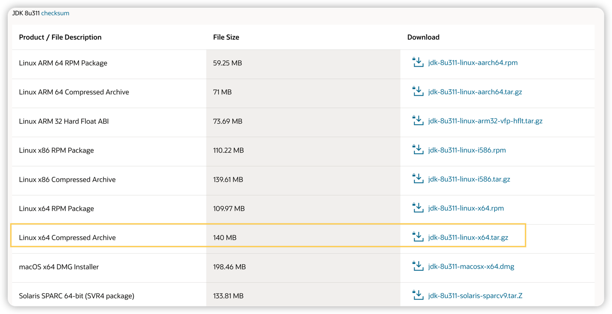

### 1. 安装包安装
1. 下载jdk安装包（https://www.oracle.com/cn/java/technologies/javase/downloads/#java8）
    

2. 上传并解压
- 在/usr/local/目录下新建文件夹：java
- 上传介质到/usr/local/java/
- 解压：tar -zxvf jdk-8u311-linux-x64.tar.gz
3. 配置环境变量
    ```shell
    # 编辑配置文件
    vim /etc/profile
    
    # 在末尾追加
    export JAVA_HOME=/usr/local/java/jdk1.8.0_311
    export JRE_HOME=/usr/local/java/jdk1.8.0_311/jre
    export CLASSPATH=.:$JAVA_HOME/lib/dt.jar:$JAVA_HOME/lib/tools.jar:$JRE_HOME/lib:$CLASSPATH
    export PATH=$JAVA_HOME/bin:$PATH
    
    # 使配置文件生效
    source /etc/profile
    ```
4. 测试
    ```shell
    # 测试版本号
    java -version
    
    # 返回
    java version "1.8.0_311"
    Java(TM) SE Runtime Environment (build 1.8.0_311-b10)
    Java HotSpot(TM) 64-Bit Server VM (build 25.291-b10, mixed mode)
    
    # 查询JAVA_HOME
    echo $JAVA_HOME
    
    # 返回
    /usr/local/java/jdk1.8.0_311
    ```
   

## 2. yum源安装
```shell
    # 检查是否已经存在java相关命令
    rpm -qa|grep java
    rpm -qa|grep jdk
    rpm -qa|grep gcj
    
    # 如果需要卸载
    rpm -qa | grep java | xargs rpm -e --nodeps
    
    # 检索Java1.8源列表
    yum list java-1.8*
    
    # 安装Java1.8
    yum install java-1.8.0-openjdk* -y
    
    # 查询JAVA_HOME
    which java
    
    # 返回
    /usr/bin/java
    
    # ls -l命令
    ls -l /usr/bin/java
    
    # 返回
    lrwxrwxrwx 1 root root 22 Nov 13 14:37 /usr/bin/java -> /etc/alternatives/java
    
    # ls -l命令
    ls -l /etc/alternatives/java
    
    # 返回
    lrwxrwxrwx 1 root root 73 Nov 13 14:37 /etc/alternatives/java -> /usr/lib/jvm/java-1.8.0-openjdk-1.8.0.272.b10-1.el7_9.x86_64/jre/bin/java
    
    # 则JAVA_HOME路径为：/usr/lib/jvm/java-1.8.0-openjdk-1.8.0.272.b10-1.el7_9.x86_64
```
