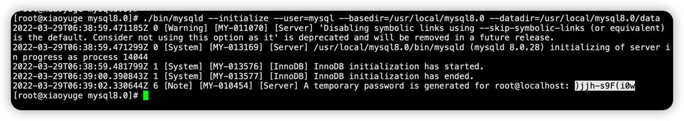
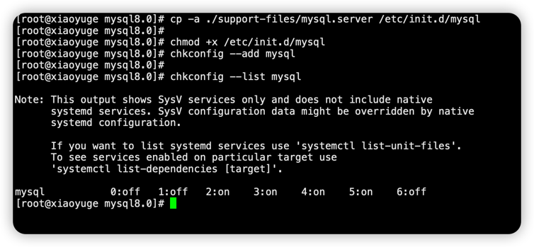
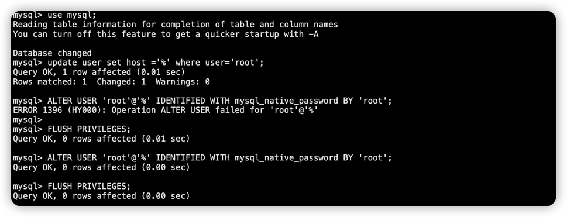

### 1. 下载
- 下载地址：https://downloads.mysql.com/archives/community/
- 百度网盘链接: https://pan.baidu.com/s/1BkOuYlz2Ef7KRe9gikDUCg  密码: 0l15
- Linux镜像下载
    ```shell
      cd /usr/local/src/
      wget https://dev.mysql.com/get/Downloads/MySQL-8.0/mysql-8.0.27-linux-glibc2.12-x86_64.tar.gz
    ```
  
### 2.卸载mariadb
```shell
#查看mariadb 的安装包
rpm -qa | grep mariadb

#卸载 mariadb
rpm -e mariadb-libs-5.5.68-1.el7.x86_64 --nodeps

#卸载验证
rpm -qa | grep mariadb
```

### 3.安装
1. 解压安装包
    ```shell
    # 进入下载目录
    cd /usr/local/src/
   
   #解压， 如果是.tar则用 tar -zxvf解压， 我下载的是.tar.xz包，使用的是tar -xvJf
    tar -xvJf mysql-8.0.28-linux-glibc2.17-x86_64-minimal.tar.xz
   
   # 移动解压后的文件夹至/usr/local
    mv /usr/local/src/mysql-8.0.28-linux-glibc2.17-x86_64-minimal /usr/local/
    cd /usr/local/
   
    # 重命名
    mv ./mysql-8.0.28-linux-glibc2.17-x86_64-minimal mysql8.0
   
    # 创建文件夹data,存储文件;
    cd /usr/local/mysql8.0/
    mkdir ./data
    ```
   
2. 创建用户以及用户组
    ```shell
    # 用户组
    groupadd mysql
    # 用户 （用户名/密码）
    useradd -g mysql mysql
    ```
   
3. 授权
    ```shell
    chown -R mysql.mysql /usr/local/mysql8.0/ 
    #或
    chown -R mysql .
    chgrp -R mysql .
    ```
   
4. 初始化数据库
    ```shell
    # 查看当前所在目录
    pwd # 若显示/usr/local/mysql-8.0,请继续执行，否则请先进入此目录/usr/local/mysql-8.0
    # 初始化 注意查看是否存在相关目录,若不存在,请新建
    ./bin/mysqld --user=mysql --basedir=/usr/local/mysql8.0/ --datadir=/usr/local/mysql8.0/data/ --initialize ; # 亲测
    #或
    ./bin/mysql --user=mysql --basedir=/usr/local/mysql8.0/ --datadir=/usr/local/mysql8.0/data/ --initialize ;
   
    #如果出现错误：./bin/mysqld: error while loading shared libraries: libaio.so.1: cannot open shared object file: No such file or directory
    yum install -y libaio  #安装后在初始化就OK了
    ```
   
    注意：后面白色高亮选中的是初始密码！！！！
   
5. 配置my.cnf
    ```shell
    cp /usr/local/mysql8.0/support-files/mysql.server /etc/init.d/mysqld
    vim /etc/my.cnf
    ```
   在配置中键入如下内容：
    ```properties
    [mysqld]
    basedir = /usr/local/mysql8.0
    datadir = /usr/local/mysql8.0/data
    socket = /usr/local/mysql8.0/mysql.sock
    #character-set-server=utf8
    port = 3306
    default_authentication_plugin=mysql_native_password
    sql_mode=NO_ENGINE_SUBSTITUTION,STRICT_TRANS_TABLES
    #数据库默认字符集,主流字符集支持一些特殊表情符号（特殊表情符占用4个字节）
    character-set-server=utf8mb4
    ##数据库字符集对应一些排序等规则，注意要和character-set-server对应
    collation-server=utf8mb4_general_ci
    ##设置client连接mysql时的字符集,防止乱码
    ##init_connect='SET NAMES utf8mb4'
    ##是否对sql语句大小写敏感，1表示不敏感
    #lower_case_table_names=1
    # Disabling symbolic-links is recommended to prevent assorted security risks
    symbolic-links=0

    [client]
    socket=/usr/local/mysql8.0/mysql.sock
    #character-set-server=utf8

    [mysqld_safe]
    #自定义日志输出
    log-error=/usr/local/mysql8.0/log/error.log
    # include all files from the config directory
    !includedir /etc/my.cnf.d
    ```
   
6. 创建日志文件夹
   ```shell
    /usr/local/mysql8.0/
    mkdir log
    chmod 777 ./log/
    touch /usr/local/mysql8.0/log/error.log
    chown mysql /usr/local/mysql8.0/log/error.log 
   ```
7. 建立Mysql服务
    ```shell
    cp -a ./support-files/mysql.server /etc/init.d/mysql
    chmod +x /etc/init.d/mysql
    chkconfig --add mysql
    chkconfig --list mysql
    ```
   

8. 启动Mysql服务
    ```shell
    # 启动
    service mysql start;
    # 查看启动状态
    service mysql status;
    ```
   如果提示： -bash: mysql: command not found
    ```shell
    ln -s /usr/local/mysql8.0/bin/mysql /usr/bin
   ```
   
9. 登录Mysql
    ```shell
    mysql -uroot -p
    # 输入"初始化数据库"操作时的"临时密码"
    ```
   

    修改密码：
    ```shell
    ALTER USER 'root'@'localhost' IDENTIFIED WITH mysql_native_password BY '新密码';
    ```
   
10. 远程连接
    1. 在my.cnf的mysqld下增加
        ```properties
        default_authentication_plugin=mysql_native_password
        ```
    2. 进入mysql命令行
        ```mysql
        use mysql
        update user set host ='%' where user='root';
        ALTER USER 'root'@'%' IDENTIFIED WITH mysql_native_password BY 'root';
        FLUSH PRIVILEGES;
        ```
       
   
11. 检查端口
    ```shell
    #检查3306端口是否开放
    netstat -nupl|grep 3306
    
    #开放3306端口
    firewall -cmd --permanent --add-prot=3306/tcp
    
    #重启防火墙
    firewall -cmd --reload
    ```


### 4. 常见问题
1. The server quit without updating PID file
   
    - 第一，权限的问题，在出这个错误的时候，我所说的权限是mysq.cnf和所定义的mysql数据库存放目录的权限，要保证是mysql用户的权限，如果启动mysql还有问题，那么需要考虑提高权限了。
    说人话， 数据库存放目录必须是mysql这个用户的属组(通常的，安装MySQL的时候建立的用户为mysql，不建议使用别的用户），mysql的启动脚本必须有执行权限。赋予权限的命令为：chown -R mysql. /usr/local/mysql,假设我的mysql是安装在  /usr/local/mysql目录，数据库存放目录为 /usr/local/mysql/data/
    - 第二，进程中有mysql的进程，上次的退出并没有自动结束该pid，导致新的进程无法启动，毕竟，mysql每次启动系统只会给分配一个pid号，再启动，系统也不可能给你分配pid号了。运行命令 ps -ef |grep mysql  找到mysql的进程结束它，然后在启动mysql。
    - 第三，进入mysql数据库的存放目录，如果有mysql-bin.index这样的文件，删除它，在启动mysql，该文件产生的原因不详，不过删除必定没影响，或者另一个binlog.index也删除，两个index后缀的都删除也可以。
    - 第四，my.cnf 这个配置文件内容不对，检查有没有skip-federated这个字段，如果有注释或者删除。
    检查是否定义了数据库存放目录，如果没有定义，请立刻定义。
    - 第五，错误日志目录不存在解决方法：使用“chown” “chmod”命令赋予mysql目录所有者及权限。
    - 第六，my.cnf文件内存在lower_case_table_names=1 字段，注释掉它。（这个选项是1表示不区分大小写）。具体原因不详。
    
    总结：mysql说好安装也好安装，说难也难，难点在于权限的配置，给高了不安全，给低了有可能启动出问题，如果启动出问题了，首先第一件事就是检查目录权限，第二就是检查my.cnf这个配置文件，skip-federated，lower_case_table_names=1 ，这样的字段注释掉，第三，清除旧的mysql进程，如果有就清除掉，旧的不去新的不来，就这么一个道理。第四，进入mysql数据库存放目录删除index后缀的文件。下面，给张图，详细的权限慢慢体会
    ```shell
    ls -al /etc/init.d/mysql
   ```
   
2. Can 't connect to local MySQL server through socket '/tmp/mysql.sock
 

    连接localhost通常通过一个Unix域套接字文件进行，一般是/tmp/mysql.sock。如果套接字文件被删除了，本地客户就不能连接。这可能发生在你的系统运行一个cron任务删除了/tmp下的临时文件。
    如果你因为丢失套接字文件而不能连接，你可以简单地通过重启服务器重新创建得到它。因为服务器在启动时重新创建它。
    如果和我一样，重启服务器还是没有任何变化，你可以先执行下面的语句
   ```shell
   mysql -uroot -h 127.0.0.1 -p
   ```
   解决方式：
   ```shell
    sudo mkdir /var/run/mysqld/
    sudo ln -s /tmp/mysql.sock /var/run/mysqld/mysqld.sock
   ```
3. however file don't exists. Create writable for user 'mysql'
    问题描述：
    ```text
    [root@test2 my57_3307]# /usr/local/mysql57/bin/mysqld_safe  --defaults-file=/dbdata/mysql/my57_3307/my57_3307.cnf  --ledir=/usr/local/mysql57/bin
    2018-08-26T14:12:45.459798Z mysqld_safe error: log-error set to '/var/log/mysqld/my57_3307.log', however file don't exists. Create writable for user 'mysql'.
   ```
   解决方式：
    ```text
    touch /usr/local/mysql8.0/log/error.log
    chown mysql /usr/local/mysql8.0/log/error.log
    /usr/local/mysql8.0/bin/mysqld_safe  --defaults-file=/etc/my.cnf  --ledir=/usr/local/mysql8.0/bin
   ```
   
4. cannot open shared object file: No such file or directory
    
    ```shell
    #需要安装 libnuma
    yum install libnuma
    yum -y install  numactl
    yum install libaio1 libaio-dev
    ```