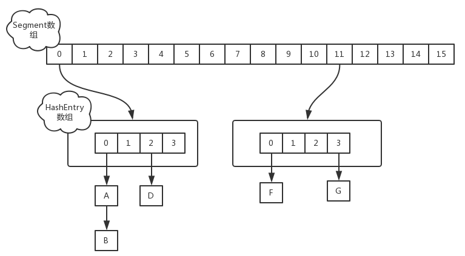
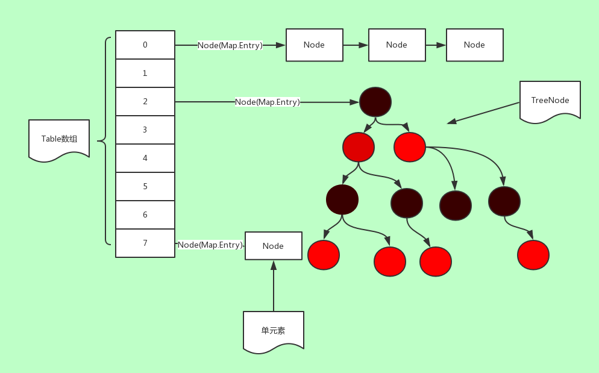

##1. jdk1.7 ConcurrentHashMap
jdk1.7 ConcurrentHashMap是由一个Segment数组和多个HashEntry数组组成

其实就是将HashMap分为多个小HashMap,每个Segment元素维护一个小HashMap,目的是锁分离，本来实现同步，直接可以是对整个HashMap加锁，但是加锁粒度太大，影响并发性能，所以变换成此结构，仅仅对Segment元素加锁，降低锁粒度，提高并发性能

###1.1 初始化过程
由于变换成**Segment数组+HashEntry数组**，所以初始化时，需要依次对Segment数组和HashEntry数组初始化
1. Segment数组初始化
   
   初始化时，使用右移一位，乘以2的计算方式，保证ssize是2的幂次方，小于指定参数concurrencyLevel的最大2的幂次方
    ```java
    int sshift = 0;
    //记录Segment数组大小
    int ssize = 1;
    while (ssize < concurrencyLevel) {
        ++sshift;
        ssize <<= 1;
    }
    ```
   
2. HashEntry数组初始化

   跟Segment数组初始化方式相同
    ```java
    int cap = 1;
    while(cap < c){
        cap <<=1;
    }
    ```
    
### 1.2 put操作
对于插入操作，需要两次Hash映射去定位数据存储位置
1. 首先通过第一次hash过程，定位Segment位置 
2. 然后通过第二次hash过程定位HashEntry位置

Segment继承ReentrantLock,在数据插入指定HashEntry过程的时候会尝试调用ReentrantLock的tryLock方法获取锁，如果获取成功就直接插入相应位置，如果有线程获取该Segment的锁，当前线程就会以自旋方式去继续调用tryLock方法去获取锁，超过指定次数就挂起，等待唤醒。

### 1.3 get操作
    
也是两次Hash映射，相对于put操作，少了加锁过程

### 1.4 size操作
size操作就是计算ConcurrentHashMap的大小，有两种方案

- 给每个Segment都加上锁(相当于给整个Map加上锁)，然后计算size返回
- 不加锁的模式，尝试多次计算ConcurrentHashMap的size,最多三次，比较前后计算的结果，结果一致就认为当前没有元素加入，计算结果是准确的。(查看计算出size的前后modCount的数值有没有发生变化，modCount的值用于记录元素变化的操作。如put，remove，clear)


## 2. jdk1.8 ConcurrentHashMap
jdk1.8ConcurrentHashMap是数组+链表，或者数组+红黑树结构,并发控制使用Synchronized关键字和CAS操作


### 2.1关键概念点
- sizeCtl变量(volatile修饰)
   通过CAS操作+volatile, 控制数组初始化和扩容操作
   - -1 代表正在初始化
   - -N 前16位记录数组容量，后16位记录扩容线程大小+1，是个负数
   - 正数0，表示未初始化
   - 正数，0.75*当前数组大小
- <key,value>键值对，封装为Node对象
- table变量(volatile)：也就是所说的数组，默认为null，默认大小为16的数组，每次扩容时大小总是2的幂次方
- nextTable(volatile):扩容时新生成的数组，大小为table的两倍

### 2.2put函数
```java
public V put(K key, V value) {
    return putVal(key, value, false);
}
```
**1.putValue函数**
首先调用spread函数，计算hash值，之后进入一个自旋循环过程，直到插入或替换成功，才会返回。如果table未被初始化，则调用initTable进行初始化。之后判断hash映射的位置是否为null,如果为null,直接通过CAS自旋操作，插入元素成功，则直接返回，如果映射的位置值为MOVED(-1),则直接去协助扩容，排除以上条件后，尝试对链头Node节点f加锁，加锁成功后，链表通过尾插遍历，进行插入或替换。红黑树通过查询遍历，进行插入或替换。之后如果当前链表节点数量大于阈值，则调用treeifyBin函数，转换为红黑树最后通过调用addCount,执行CAS操作，更新数组大小，并且判断是否需要进行扩容
```java
final V putVal(K key, V value, boolean onlyIfAbsent) {
    if (key == null || value == null) throw new NullPointerException();
    //spread函数计算hash值
    int hash = spread(key.hashCode());
    int binCount = 0;
    //自旋过程
    for (Node<K,V>[] tab = table;;) {
        Node<K,V> f; int n, i, fh;
        if (tab == null || (n = tab.length) == 0)
            tab = initTable();
        //判断映射位置节点是否为空
        else if ((f = tabAt(tab, i = (n - 1) & hash)) == null) {
            if (casTabAt(tab, i, null,
                         new Node<K,V>(hash, key, value, null)))
                break;                  
        }
        //如果映射位置节点value==MOVED，说明正在进行扩容操作
        else if ((fh = f.hash) == MOVED)
            tab = helpTransfer(tab, f);
        else {
            V oldVal = null;
            synchronized (f) {
                if (tabAt(tab, i) == f) {
                    if (fh >= 0) {
                        binCount = 1;
                        for (Node<K,V> e = f;; ++binCount) {
                            K ek;
                            if (e.hash == hash &&
                                ((ek = e.key) == key ||
                                 (ek != null && key.equals(ek)))) {
                                oldVal = e.val;
                                if (!onlyIfAbsent)
                                    e.val = value;
                                break;
                            }
                            Node<K,V> pred = e;
                            if ((e = e.next) == null) {
                                pred.next = new Node<K,V>(hash, key,
                                                          value, null);
                                break;
                            }
                        }
                    }
                    //红黑树结构
                    else if (f instanceof TreeBin) {
                        Node<K,V> p;
                        binCount = 2;
                        if ((p = ((TreeBin<K,V>)f).putTreeVal(hash, key,
                                                       value)) != null) {
                            oldVal = p.val;
                            if (!onlyIfAbsent)
                                p.val = value;
                        }
                    }
                }
            }
            //链表节点数量超过阈值，转为红黑树
            if (binCount != 0) {
                if (binCount >= TREEIFY_THRESHOLD)
                    treeifyBin(tab, i);
                if (oldVal != null)
                    return oldVal;
                break;
            }
        }
    }
    addCount(1L, binCount);
    return null;
}
```

**2. spread函数**
spread函数，计算hash值。key的hash值与其高16位相异或，然后与HASH_BITS将最高位置0
```java
static final int spread(int h) {
    return (h ^ (h >>> 16)) & HASH_BITS;
    //HASH_BITS=0x7fffffff
}
```

**3. tableAt函数**
获取最新的tab[i]

**4. casTabAt函数**
通过CAS操作，将值赋值进tab中对应位置
```java
static final <K,V> Node<K,V> tabAt(Node<K,V>[] tab, int i) {
        return (Node<K,V>)U.getObjectVolatile(tab, ((long)i << ASHIFT) + ABASE);
}

static final <K,V> boolean casTabAt(Node<K,V>[] tab, int i,
                                        Node<K,V> c, Node<K,V> v) {
        return U.compareAndSwapObject(tab, ((long)i << ASHIFT) + ABASE, c, v);
}
```
**5. addCount函数**
尝试使用CAS操作，将BASECOUNT加1，操作失败，则说明有其他线程在进行加一操作,发生冲突。之后判断是否需要扩容
```java
private final void addCount(long x, int check) {
    CounterCell[] as; long b, s;
    //使用CAS操作，将BASECOUNT加1
    if ((as = counterCells) != null ||
        !U.compareAndSwapLong(this, BASECOUNT, b = baseCount, s = b + x)) {
        CounterCell a; long v; int m;
        //发生冲突
        boolean uncontended = true;
        if (as == null || (m = as.length - 1) < 0 ||
            (a = as[ThreadLocalRandom.getProbe() & m]) == null ||
            !(uncontended =
              U.compareAndSwapLong(a, CELLVALUE, v = a.value, v + x))) {
            //多线程冲突执行
            fullAddCount(x, uncontended);
            return;
        }
        if (check <= 1)
            return;
        s = sumCount();
    }
    if (check >= 0) {
        Node<K,V>[] tab, nt; int n, sc;
        //判断是否需要扩容  大于0.75当前数组大小
        while (s >= (long)(sc = sizeCtl) && (tab = table) != null &&
               (n = tab.length) < MAXIMUM_CAPACITY) {
            int rs = resizeStamp(n);
            if (sc < 0) {
                //判断是否需要帮助扩容
                //扩容完成，或者扩容线程达到阈值不需要进行扩容，直接break
                if ((sc >>> RESIZE_STAMP_SHIFT) != rs || sc == rs + 1 ||
                    sc == rs + MAX_RESIZERS || (nt = nextTable) == null ||
                    transferIndex <= 0)
                    break;
                //帮助扩容，扩容线程数+1
                if (U.compareAndSwapInt(this, SIZECTL, sc, sc + 1))
                    transfer(tab, nt);
            }
            //进行扩容操作
            else if (U.compareAndSwapInt(this, SIZECTL, sc,
                                         (rs << RESIZE_STAMP_SHIFT) + 2))
                transfer(tab, null);
            s = sumCount();
        }
    }
}
```
### 2.3 initTable函数
进入一个自旋过程，一旦有线程扩容成功，才break
- 如果sizeCtl < 0,说明已经有线程正在扩容，所以直接让出线程。
- 如果sizeCtl>=0,说明当前没有线程扩容，尝试CAS操作，设置sizeCtl为-1
- 设置sizeCtl为-1成功的线程，进行扩容操作，并且将sc更新为数组负载阈值0.75*n
```java
private final Node<K,V>[] initTable() {
    Node<K,V>[] tab; int sc;
    //自旋过程
    while ((tab = table) == null || tab.length == 0) {
        if ((sc = sizeCtl) < 0)
            Thread.yield(); 
        else if (U.compareAndSwapInt(this, SIZECTL, sc, -1)) {
            try {
                if ((tab = table) == null || tab.length == 0) {
                    int n = (sc > 0) ? sc : DEFAULT_CAPACITY;
                    @SuppressWarnings("unchecked")
                    Node<K,V>[] nt = (Node<K,V>[])new Node<?,?>[n];
                    table = tab = nt;
                    //0.75*n
                    sc = n - (n >>> 2);
                }
            } finally {
                sizeCtl = sc;
            }
            break;
        }
    }
    return tab;
}
```

### 2.4 统计ConCurrentHashMap中的元素个数
**1. mappingCount函数**
```java
//调用sumCount,获得元素数量
public long mappingCount() {
long n = sumCount();
return (n < 0L) ? 0L : n; // ignore transient negative values
}
```

**2. sumCount函数**

baseCount+ counterCells各个元素值，就是元素数量
其实baseCount就是记录容器数量的，直接放回baseCount不就可以了吗？为什么sumCount()方法中还要遍历counterCells数组，累加对象的值呢？
其中：counterCells是个全局的变量，表示的是CounterCell类数组。CounterCell是ConcurrentHashmap的内部类，它就是存储一个值。
JDK1.8中使用一个volatile类型的变量baseCount记录元素的个数，当插入新数据put()或则删除数据remove()时，会通过addCount()方法更新baseCount
初始化时counterCells为空，在并发量很高时，如果存在两个线程同时执行CAS修改baseCount值，则失败的线程会继续执行方法体中的逻辑，执行fullAddCount(x, uncontended)方法，这个方法其实就是初始化counterCells，并将x的值插入到counterCell类中，而x值一般也就是1或-1，这可以从put()方法中得知。
这些对象是因为在CAS更新baseCount值时，由于高并发而导致失败，最终将值保存到CounterCell中，放到counterCells里。这也就是为什么sumCount()中需要遍历counterCells数组，sum累加CounterCell.value值了。
```java
final long sumCount() {
    CounterCell[] as = counterCells; CounterCell a;
    long sum = baseCount;
        if (as != null) {
            for (int i = 0; i < as.length; ++i) {
                if ((a = as[i]) != null)
                sum += a.value;
        }
    }
    return sum;
}
```

**3. CounterCell类**
只存储一个值
```java
static final class CounterCell{
   volatile long value;
   CountCell(long x) {value = x;}
}
```


原文链接：https://blog.csdn.net/zycxnanwang/article/details/105424734