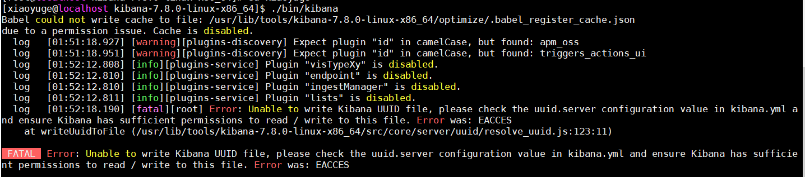

## 1. JDK14安装

1. 下载jdk14：  https://jdk.java.net/14/

2. 将文件存放在linux系统某文件夹内

3. 解压

    ```shell
     tar -zxvf openjdk-14.0.2_linux-x64_bin.tar.gz
    ```

4. 配置环境变量

    ```shell
    vim /etc/profile
    ##在文件最末尾添加，其中JAVA_HOME是jdk解压后的文件路径
    JAVA_HOME=/usr/lib/tools/jdk-14.0.2
    PATH=$JAVA_HOME/bin:$PATH
    CLASSPATH=$JAVA_HOME/jre/lib/ext:$JAVA_HOME/lib/tools.jar
    export PATH JAVA_HOME CLASSPATH
    ```

5. 保存后，更新配置文件

    ```shell
    source /etc/profile
    ```

6. 查看JDK是否配置完成

    ```shell
    java -version
    ```

   出现下图表示安装成功！

   


## 2. ElasticSearch安装

1. 解压tar.gz包

    ```shell
    tar -zxvf elasticsearch-7.8.0-linux-x86_64.tar.gz
    ```

2. 添加elasticsearch用户

    ```shell
    useradd elastic
    ```

3. 赋予elastic search操作文件夹的权限

    ```shell
    chown -R elastic:elastic /usr/lib/tools/elasticsearch-7.8.0/*
    ```

4. 查看本机的hostname

    ```shell
    hostname
    #localhost.localdomain
    ```

5. 修改elastic search配置

    ```shell
    cd ./elasticsearch-7.8.0/config
   vim elasticsearch.yml
    ```

   **elasticsearch.yml**

    ```yml
      # ======================== Elasticsearch Configuration =========================
      #
      # NOTE: Elasticsearch comes with reasonable defaults for most settings.
      #       Before you set out to tweak and tune the configuration, make sure you
      #       understand what are you trying to accomplish and the consequences.
      #
      # The primary way of configuring a node is via this file. This template lists
      # the most important settings you may want to configure for a production cluster.
      #
      # Please consult the documentation for further information on configuration options:
      # https://www.elastic.co/guide/en/elasticsearch/reference/index.html
      #
      # ---------------------------------- Cluster -----------------------------------
      #
      # Use a descriptive name for your cluster:
      #集群名称，默认可以不修改，此处 xiaoyuge
      cluster.name: xiaoyuge
      # ------------------------------------ Node ------------------------------------
      #
      # Use a descriptive name for the node:
      #节点名称，必须修改 ，默认修改为当前机器名称，若是多实例则需要区分
      node.name: xiaoyuge-local1
      #
      # Add custom attributes to the node:
      #
      #node.attr.rack: r1
      #
      # ----------------------------------- Paths ------------------------------------
      #
      # Path to directory where to store the data (separate multiple locations by comma):
      ##数据目录与日志目录，默认在当前运行程序下，生产环境需要指定
      #path.data: /path/to/data
      #
      # Path to log files:
      #
      #path.logs: /path/to/logs
      #
      # ----------------------------------- Memory -----------------------------------
      #
      # Lock the memory on startup:
      #内存交换锁定，此处需要操作系统设置才生效
      #bootstrap.memory_lock: true
      #
      # Make sure that the heap size is set to about half the memory available
      # on the system and that the owner of the process is allowed to use this
      # limit.
      #
      # Elasticsearch performs poorly when the system is swapping the memory.
      #
      # ---------------------------------- Network -----------------------------------
      #
      # Set the bind address to a specific IP (IPv4 or IPv6):
      #IP 地址，默认是 local，仅限本机访问，外网不可访问，设置 0.0.0.0 通用做法
      network.host: 192.168.135.111
      #
      # Set a custom port for HTTP:
      #访问端口，默认 9200，9300，建议明确指定
      http.port: 9200
      transport.port: 9300
      #
      # For more information, consult the network module documentation.
      #
      # --------------------------------- Discovery ----------------------------------
      #
      # Pass an initial list of hosts to perform discovery when this node is started:
      # The default list of hosts is ["127.0.0.1", "[::1]"]
      ## 集群发现配置
      discovery.seed_hosts: ["192.168.135.111:9300"]
      #
      # Bootstrap the cluster using an initial set of master-eligible nodes:
      #
      cluster.initial_master_nodes: ["192.168.135.111:9300"]
      #
      # For more information, consult the discovery and cluster formation module documentation.
      #
      # ---------------------------------- Gateway -----------------------------------
      #
      # Block initial recovery after a full cluster restart until N nodes are started:
      #
      #gateway.recover_after_nodes: 3
      #
      # For more information, consult the gateway module documentation.
      #
      # ---------------------------------- Various -----------------------------------
      #
      # Require explicit names when deleting indices:
      ##防止批量删除索引
      action.destructive_requires_name: true
      #设置密码
      xpack.security.enabled: true
      xpack.license.self_generated.type: trial
      xpack.security.transport.ssl.enabled: true
      http.cors.enabled: true
      http.cors.allow-origin: "*"
      http.cors.allow-headers: Authorization
    ```

6. 切换为elastic search用户，然后启动elastic search

    ```shell
    su elastic			#切换用户
    ./bin/elasticsearch -d      #后台启动
    ```

7. 设置密码

    ```shell
      ./bin/elasticsearch-setup-passwords interactive

      #执行设置用户名和密码的命令,这里需要为4个用户分别设置密码，elastic, kibana, logstash_system,beats_system
      Initiating the setup of passwords for reserved users elastic,kibana,logstash_system,beats_system.
      You will be prompted to enter passwords as the process progresses.
      Please confirm that you would like to continue [y/N]y
      Enter password for [elastic]:
      passwords must be at least [6] characters long
      Try again.
      Enter password for [elastic]:
      Reenter password for [elastic]:
      Passwords do not match.
      Try again.
      Enter password for [elastic]:
      Reenter password for [elastic]:
      Enter password for [kibana]:
      Reenter password for [kibana]:
      Enter password for [logstash_system]:
      Reenter password for [logstash_system]:
      Enter password for [beats_system]:
      Reenter password for [beats_system]:
      Changed password for user [kibana]
      Changed password for user [logstash_system]
      Changed password for user [beats_system]
      Changed password for user [elastic]
    ```


**常见异常：**

```shell
    #java.lang.RuntimeException: can not run elasticsearch as root
    #切换为elastic search用户，不能用root项目启动
  
   su elastic
```

```shell
   #Exception in thread "main" java.nio.file.AccessDeniedException: /usr/lib/tools/elasticsearch-7.8.0/config/elasticsearch.keystore
   #elastic search用户没有操作该文件夹的权限
  
   su root
   chown -R elastic:elastic /usr/lib/tools/elasticsearch-7.8.0/*
   ```

```shell
    ERROR: [2] bootstrap checks failed
    [1]: max file descriptors [4096] for elasticsearch process is too low, increase to at least [65535]
    [2]: max virtual memory areas vm.max_map_count [65530] is too low, increase to at least [262144]
   
    #分配内存不够
    #1. 修改 /etc/security/limits.conf
    sudo vi /etc/security/limits.conf
    #在文件末尾加上
    * soft nofile 65536
    * hard nofile 65536
    * soft nproc 4096
    * hard nproc 4096
    #2. 修改 /etc/sysctl.conf
    sudo vi /etc/sysctl.conf
    #在文件末尾增加
    vm.max_map_count=262144
    #3. 配置重新生效
    sysctl -p
```
  
**效果如下：**


## 3. Kibana安装

1. 解压文件

    ```shell
    tar -zxvf kibana-7.8.0-linux-x86_64.tar.gz
    ```

2. 修改配置文件

    ```shell
    vim ./config/kibana.yml
    ```

   **kibana.yml:**

    ```yml
      # Kibana is served by a back end server. This setting specifies the port to use.
      ##访问端口，默认无需修改
      server.port: 5601
      
      # Specifies the address to which the Kibana server will bind. IP addresses and host names are both valid values.
      # The default is 'localhost', which usually means remote machines will not be able to connect.
      # To allow connections from remote users, set this parameter to a non-loopback address.
      #访问地址 IP，默认本地 ;如果需要外网访问，则配置0.0.0.0
      server.host: "0.0.0.0"
      
      # Enables you to specify a path to mount Kibana at if you are running behind a proxy.
      # Use the `server.rewriteBasePath` setting to tell Kibana if it should remove the basePath
      # from requests it receives, and to prevent a deprecation warning at startup.
      # This setting cannot end in a slash.
      #server.basePath: ""
      
      # Specifies whether Kibana should rewrite requests that are prefixed with
      # `server.basePath` or require that they are rewritten by your reverse proxy.
      # This setting was effectively always `false` before Kibana 6.3 and will
      # default to `true` starting in Kibana 7.0.
      #server.rewriteBasePath: false
      
      # The maximum payload size in bytes for incoming server requests.
      #server.maxPayloadBytes: 1048576
      
      # The Kibana server's name.  This is used for display purposes.
      #server.name: "your-hostname"
      
      # The URLs of the Elasticsearch instances to use for all your queries.
      # ES 服务指向，集群下配置多个
      elasticsearch.hosts: ["http://192.168.135.111:9200"]
      
      # When this setting's value is true Kibana uses the hostname specified in the server.host
      # setting. When the value of this setting is false, Kibana uses the hostname of the host
      # that connects to this Kibana instance.
      #elasticsearch.preserveHost: true
      
      # Kibana uses an index in Elasticsearch to store saved searches, visualizations and
      # dashboards. Kibana creates a new index if the index doesn't already exist.
      # Kibana 元数据存储索引名字，默认.kibana 无需修改
      #kibana.index: ".kibana"
      
      # The default application to load.
      #kibana.defaultAppId: "home"
      
      # If your Elasticsearch is protected with basic authentication, these settings provide
      # the username and password that the Kibana server uses to perform maintenance on the Kibana
    ```

3. 启动

    ```shell
    # 当前窗口内启动
    ./bin/kibana# 
   #后台进程启动
   nohup ./bin/kibana &
    ```

   **效果如下**

   

**遇见问题：**

- root启动报错

    ```shell
    #切换到elastic账户
    su xiaoyuge
    ```
- elastic用户权限不足 **Babel could not write cache to file: /usr/share/kibana/optimize/.babel_register_cache.json**

    ```shell
    #切换到root用户
    su root 
    #赋予elastic账户 xiaoyuge操作权限
    chown -R xiaoyuge /usr/local/kibana-7.7.1-linux-x86_64
    #切换为elastic账户
    su xiaoyuge
    #再次启动即可
    ```

    