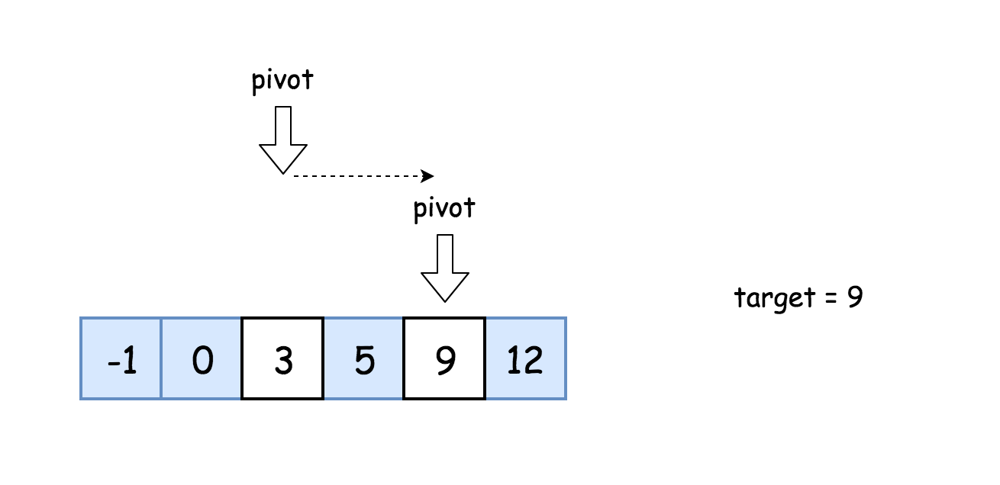
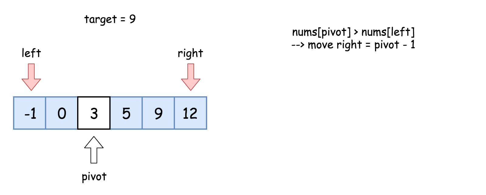
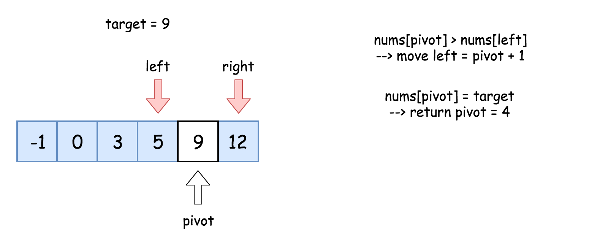

二分法查找是一种基于比较目标值和数组中间元素的算法
- 如果目标值 = 中间值，则找到目标值
- 如果目标值 < 中间值，则在左侧继续搜索
- 如果目标值 > 中间值，则在右侧继续搜索

  
**解题思路：**
- 初始化指针left = 0, right=n-1;
- 当left <= right： 
  - 比较中间元素nums[pivot]和目标值target
    1.target = nums[pivot], 返回pivot
    2.target > nums[pivot], 则在右侧继续搜索left = pivot+1
    3.target < nums[pivot], 则在左侧继续搜索right = pivot+1
    
    
    
```java
/**
 * 给定一个 n 个元素有序的（升序）整型数组 nums 和一个目标值 target  ，
 * 写一个函数搜索 nums 中的 target，如果目标值存在返回下标，否则返回 -1。
 * 输入: nums = [-1,0,3,5,9,12], target = 9
 * 输出: 4
 * 解释: 9 出现在 nums 中并且下标为 4
 */
public int search(int[] nums, int target){
    int pivot, left =0, right = nums.length - 1;
    while (left <= right){
        pivot = left + (right - left) / 2;
        if (nums[pivot] == target){
            return pivot;
        }else if (nums[pivot] < target){
            left = pivot + 1;
        } else{
            right = pivot - 1;
        }
    }
    return -1;
}
```
**复杂度分析：**
- 时间复杂度：O(logN) 
- 空间复杂度：O(1)