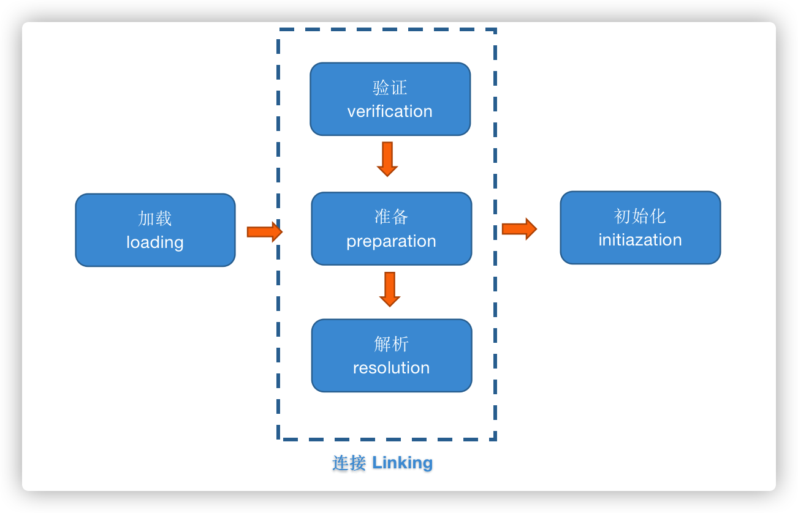
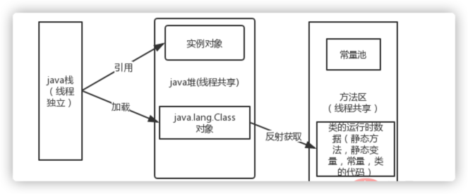
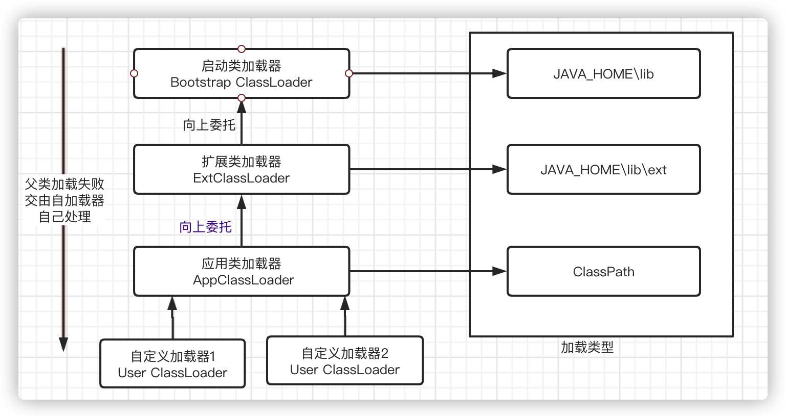

## 1.类加载机制
JVM将类描述数据从.class文件中加载到内存，并对数据进行解析、初始化，最终形成被JVM直接使用的Java类型；类从被加载到JVM中开始，到卸载为止，
整个生命周期包括：**加载、验证、准备、解析、初始化、使用和卸载**7个阶段


1. 加载

    加载时jvm做了三件事
    - 1)通过一个类的全限定名获取该类的二进制流
    - 2)将这个字节流的静态存储结构转化为方法区运行时数据结构
    - 3)在内存堆中生成一个代表该类的java.lang.class对象，最为该类数据的访问入口

2. 验证
   
    验证、准备、解析这三步可以看作是一个连接的过程，将类的字节码连接到JVM的运行黄台之中;  验证是为了确保class文件的字节流中包含的信息符合当前虚拟机的要求，不会威胁到jvm的安全。
   验证内容如下：
    - 文件格式的验证： 验证字节流是否符合class文件袋额规范，是否能被当前版本的虚拟机处理
    - 元数据验证： 对字节码描述的信息进行语义分析，确保符合Java语言规范
    - 字节码验证：通过数据流和控制流分析，确定寓意是否合法，符合逻辑的
    - 符号引用验证：这个娇艳在解析阶段发生
    
3. 准备

    为类的静态变量分配内存，设置初始值，对于final static修饰的变量，直接赋值为用户的定义值。
   ```java
   //准备阶段过后的初始值为0， 而不是7
    public static int a = 7;
   ```

4. 解析

    解析是将常量池内的符号引用转化为直接引用（如物理内存地址指针）
   
5. 初始化
   
    初始化阶段，jvm才开始真正执行类中定义的Java代码
    - 执行类构造器<clinit>()方法的过程，类构造器方法是有编译器自动手机类中所有类变量的赋值动作和静态语句块（static块）中的语句合并产生的
    - 当初始化一个类的时候，如果发现其父类还没有进行过初始化，需有限触发其父类的初始化
    - 虚拟机会保证一个类的<clinit>()方法在多线程环境被正确加锁和同步
      

## 2.类加载器
类加载器的主要任务：对类加载过程中的加载操作（根据一个类的全限定名读取该类的二进制字节流到JVM内部，然后转换为一个对应的java.lang.Class对象实例）

类加载器的分类
   
   - 启动类加载器Bootstrap ClassLoader:
     在HotSpot虚拟机中，Bootstrap ClassLoader用C++语言编写并嵌入JVM内部，主要负载加载JAVA_HOME/lib目录中的所有类，或者加载由选项-Xbootcalsspath指定的路径下的类
   - 拓展类加载器/ExtClassLoader：
     ExtClassLoader继承ClassLoader类，负载加载JAVA_HOME/lib/ext目录中的所有类型，或者由参数-Xbootclasspath指定路径中的所有类型
   - 应用程序类加载器/AppClassLoader: 
     ExtClassLoader继承ClassLoader类，负责加载用户类路径ClassPath下的所有类型，一般情况下为程序的默认类加载器
   - 自定义加载器: 
     Java虚拟机规范将所有继承抽象类java.lang.ClassLoader的类加载器，定义为自定义类加载器
     
     
## 3. 双亲委派模型

如果一个类加载器收到了类加载请求，它并不会自己先去加载，而是把这个请求委托给父类的加载器去执行，如果父类加载器还存在其父类加载器，则进一步向上委托，依次递归，请求最终将到达顶层的启动类加载器，如果父类加载器可以完成类加载任务，就成功返回，倘若父类加载器无法完成此加载任务，子加载器才会尝试自己去加载，这就是双亲委派模式 。
- 除了启动类加载器以外，每个类加载器拥有一个父类加载器，用户的自定义类加载器的父类加载器是AppClassLoader；
- 双亲委派模型可以保证全限名指定的类，只被加载一次；
- 双亲委派模型不具有强制性约束，是Java设计者推荐的类加载器实现方式；

### 3.1 双亲委派模式优势
1. 采用双亲委派模式的是好处是Java类随着它的类加载器一起具备了一种带有优先级的层次关系，通过这种层级关可以避免类的重复加载，当父亲已经加载了该类时，就没有必要子ClassLoader再加载一次
2. java核心api中定义类型不会被随意替换，假设通过网络传递一个名为java.lang.Integer的类，通过双亲委托模式传递到启动类加载器，而启动类加载器在核心Java API发现这个名字的类，发现该类已被加载，并不会重新加载网络传递的过来的java.lang.Integer，而直接返回已加载过的Integer.class，这样便可以防止核心API库被随意篡改
3. 如果我们在classpath路径下自定义一个名为java.lang.SingleInterge类(该类是胡编的)呢？该类并不存在java.lang中，经过双亲委托模式，传递到启动类加载器中，由于父类加载器路径下并没有该类，所以不会加载，将反向委托给子类加载器加载，最终会通过系统类加载器加载该类。但是这样做是不允许，因为java.lang是核心API包，需要访问权限，强制加载将会报出如下异常

### 3.2 双庆委派模型实现源码
可以打开 java.lang.ClassLoader 类，其 loadClass方法如下：
```java
protected Class<?> loadClass(String name, boolean resolve)
        throws ClassNotFoundException
    {
        synchronized (getClassLoadingLock(name)) {
            // First, check if the class has already been loaded
            Class<?> c = findLoadedClass(name);
            if (c == null) {
                long t0 = System.nanoTime();
                try {
                    if (parent != null) {
                        c = parent.loadClass(name, false);
                    } else {
                        c = findBootstrapClassOrNull(name);
                    }
                } catch (ClassNotFoundException e) {
                    // ClassNotFoundException thrown if class not found
                    // from the non-null parent class loader
                }

                if (c == null) {
                    // If still not found, then invoke findClass in order
                    // to find the class.
                    long t1 = System.nanoTime();
                    c = findClass(name);

                    // this is the defining class loader; record the stats
                    sun.misc.PerfCounter.getParentDelegationTime().addTime(t1 - t0);
                    sun.misc.PerfCounter.getFindClassTime().addElapsedTimeFrom(t1);
                    sun.misc.PerfCounter.getFindClasses().increment();
                }
            }
            if (resolve) {
                resolveClass(c);
            }
            return c;
        }
    }
```
实现方式很简单，首先会检查该类是否已经被加载过了，若加载过了直接返回（默认resolve取false）；若没有被加载，则调用父类加载器的 loadClass方法，若父类加载器为空则默认使用启动类加载器作为父加载器。如果父类加载失败，则在抛出 ClassNotFoundException 异常后，在调用自己的 findClass 方法进行加载

## 4.自定义类加载器
1. 加密
   
   我们知道Java字节码是可以进行反编译的，在某些安全性高的场景，是不允许这种情况发生的。那么我们可以将编译后的代码用某种加密算法进行加密，加密后的文件就不能再用常规的类加载器去加载类了。而我们自己可以自定义类加载器在加载的时候先解密，然后在加载

2. 动态创建

   比如很有名的动态代理。

3. 从非标准的来源加载代码
   我们不用非要从class文件中获取定义此类的二进制流，还可以从数据库，从网络中，或者从zip包等。


### 4.1 自定义类加载器方法
   类加载时根据双亲委派模型会先一层层找到父加载器，如果加载失败，则会调用当前加载器的 findClass() 方法来完成加载。因此我们自定义类加载器，有两个步骤：
   1、继承 ClassLoader

   2、覆写 findClass() 方法