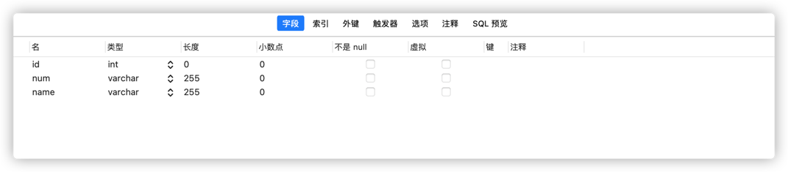
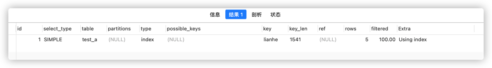

拿汉语字典的目录页（索引）打比方，我们可以按拼音、笔画、偏旁部首等排序的目录（索引）快速查找到需要的字。
索引分单列索引和组合索引。
- 单列索引，即一个索引只包含单个列，一个表可以有多个单列索引，但这不是组合索引。 
- 组合索引，即一个索引包含多个列。

创建索引时，你需要确保该索引是应用在 SQL 查询语句的条件(一般作为 WHERE 子句的条件)。
实际上，索引也是一张表，该表保存了主键与索引字段，并指向实体表的记录。
上面都在说使用索引的好处，但过多的使用索引将会造成滥用。因此索引也会有它的缺点：
虽然索引大大提高了查询速度，同时却会降低更新表的速度，如对表进行INSERT、UPDATE和DELETE。因为更新表时，MySQL不仅要保存数据，还要保存一下索引文件。
建立索引会占用磁盘空间的索引文件。

## 1.普通索引
- 创建索引
    ```sql
    -- 如果是CHAR，VARCHAR类型，length可以小于字段实际长度；如果是BLOB和TEXT类型，必须指定 length。
    CREATE INDEX indexName on table_name (column_name )
    ```
- 添加索引（修改表结构）
    ```sql
    -- 表结构已经存在了，然后使用alter修改表结构添加索引
    alter table table_name  add INDEX indexName(column_name )
    ```
- 创建表指定
    ```sql
    CREATE TABLE mytable(  
        ID INT NOT NULL,   
        username VARCHAR(16) NOT NULL,  
        INDEX [indexName] (username(length))  
    ); 
    ```
- 删除索引
    ```sql
    drop index [indexName] on  table_name 
    ```
  
## 2. 唯一索引
他和普通索引类似，不同的是：索引列的值必须唯一，但允许有控制。如果是组合索引，则列值的组合必须唯一。
- 创建索引
    ```sql
    CREATE UNIQUE INDEX indexName ON table_name (column_name (length ))
    ```
  
- 修改表结构
    ```sql
    ALTER table mytable ADD UNIQUE [indexName] (column_name(length))
    ```
  
- 创建表的时候指定
    ```sql
    CREATE TABLE mytable(  
        ID INT NOT NULL,   
        username VARCHAR(16) NOT NULL,  
        UNIQUE [indexName] (username(length))  
    );
    ```
## 3.组合索引
- 修改表结构指定索引
    ```sql
    ALTER TABLE table_name ADD INDEX indexName (column_name1 , column_name2,...)
    ```
- 创建表的时候指定
    ```sql
    CREATE TABLE mytable(  
        ID INT NOT NULL,   
        username VARCHAR(16) NOT NULL,  
        KEY [indexName] (column_name1 , column_name2,...)  
    );
    ```
### 3.1 组合索引查询问题
**问题描述：**在mysql中有张表test_a，有3个字段id,name,num；对这三个字段建立组合索引，那么查询时使用其中某两个或者一个作为查询条件，是否还会走索引

根据查询字段的位置不同来决定，如查询**id**、**id,num**、**id,num,name**、 **id, name** 都可以走索引的，其他条件的查询不能走索引。

**组合索引 有“最左前缀”原则。就是只从最左面的开始组合，并不是所有只要含有这三列存在的字段的查询都会用到该组合索引**
```sql
-- 添加组合索引
ALTER TABLE test_a ADD INDEX 'lianhe'(id, num, name)
```
1. 使用三个字段id, num, name查询
```sql
-- 只要三个条件都有，可以随意变换位置，结果都会走索引
-- 优化器会将条件顺序优化成上面三种情况后执行
EXPLAIN SELECT * FROM test_a WHERE id=1 AND num='001' AND name = '1#'
```

从执行结果上可以看到是从走索引进行查询的

2. 使用num, name 查询
```sql
EXPLAIN SELECT * FROM test_a WHERE name = '1#'

EXPLAIN SELECT * FROM test_a WHERE num='001' 
```

3. 使用id, name或者id, num 查询
```sql
-- 只要包括id，可以随意变换位置，结果都会走索引
-- 优化器会将条件顺序优化成上面三种情况后执行
--如果只有两个字段，只有id条件命中，num或者name 条件不走联合索引。
EXPLAIN SELECT * FROM test_a WHERE id=1 AND name = '1#'
```


需要避免索引失效的情况，如：LIKE %xxx，或者条件中使用函数等。
4. 使用id查询
```sql
EXPLAIN SELECT * FROM test_a WHERE id=1
```


5. 使用name或者num查询
```sql
EXPLAIN SELECT * FROM test_a WHERE name = '1#'

EXPLAIN SELECT * FROM test_a WHERE num = '001'
```

### 3.2 创建组合索引选择规则
- 经常用的列优先（最左匹配原则）
- 离散度高的列优先（离散度高原则）
- 宽度小的列优先（最少空间原则）

## 4.使用alter命令添加索引
```sql
-- 该语句添加一个主键，这意味着索引值必须是唯一的，且不能为NULL。
ALTER TABLE tbl_name ADD PRIMARY KEY (column_list): 
    
--  这条语句创建索引的值必须是唯一的（除了NULL外，NULL可能会出现多次）。
ALTER TABLE tbl_name ADD UNIQUE index_name (column_list):

-- 添加普通索引，索引值可出现多次。
ALTER TABLE tbl_name ADD INDEX index_name (column_list):

--该语句指定了索引为 FULLTEXT ，用于全文索引。
ALTER TABLE tbl_name ADD FULLTEXT index_name (column_list):
```
  


