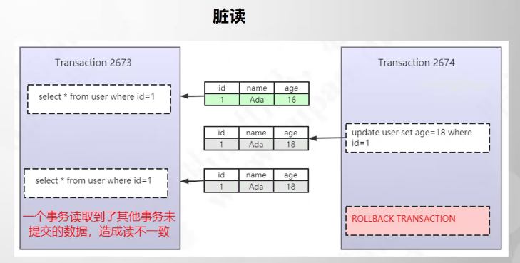
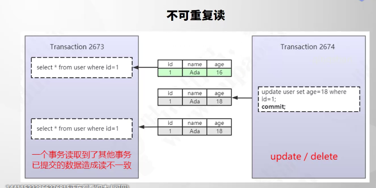
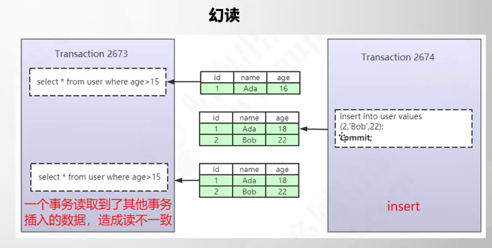
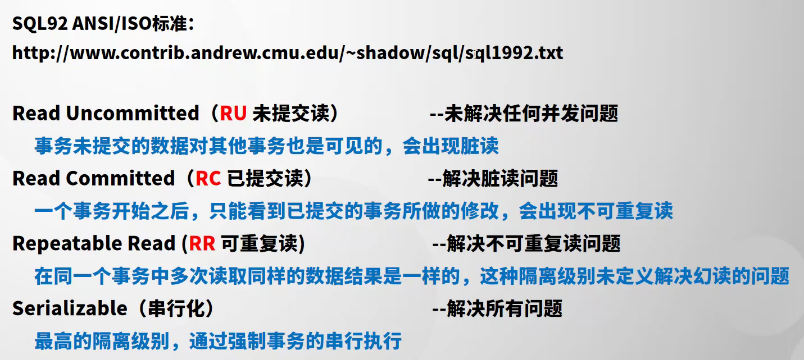
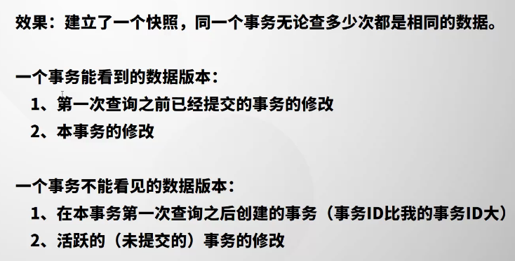
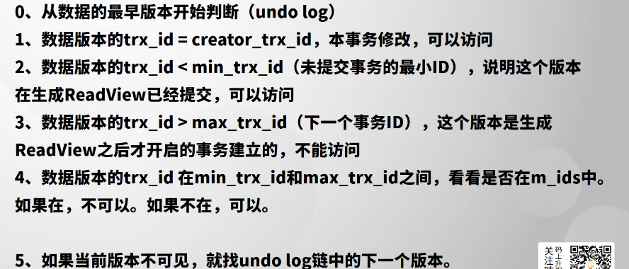
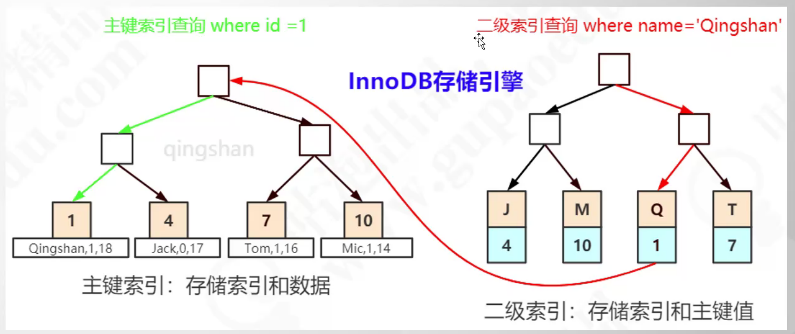
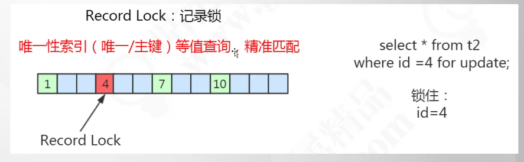
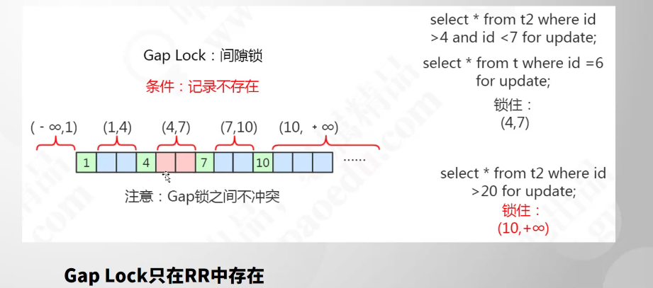
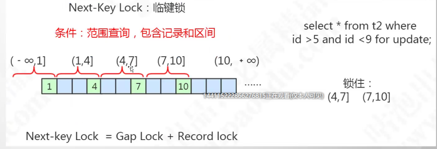

## 事务的定义

事务是数据管理系统DBMS执行过程中的一个**逻辑单位**，有一个有限的数据库**操作序列**构成

## 事务四大特性

1.  原子性atomicity：依赖undo log做到全部失败
2.  隔离性isolation：实现方式LBCC 和 MVCC
3.  持久性durability ：实现方式redo log和double write
4.  一致性consistency：通过上面的三种方式实现

数据恢复：

-   redo log 崩溃恢复
-   双写缓冲（double write）


Mysql中insert、delete、update 自带事务

```sql
show veriables like ‘autocommit’;
set session autocommit = on;
update xxx where set xx =1 ;
commit;
```

结束事务两种方式：rollback     commit

## 事务并发的三大问题

数据并发的三大问题其实都是数据库读一致性问题，必须有数据库提供一定的事务隔离机制来解决。

### 脏读


### 不可重复读



### 幻读



## 事务隔离级别

http://www.contrib.andrew.cmu.edu/~shadow/sql/sql1992.txt



### MVCC思想



#### Read View（一致性试图）

存储内容


#### Read View判断规则



#### RC与RR read View 的区别


所以RC解决不了脏读的问题

# Mysql InnoDb所得基本类型

InnoDB支持行锁

MyiSAM支持行锁

表锁和行锁的区别

-   锁力度：表锁 > 行锁
-   加锁效率：表锁 > 行锁
-   冲突概率：表锁 > 行锁
-   并发性能：表锁 < 行锁

## 表锁


一个事务能够给一张表加上锁的前提是：没有其他任何一个事务锁定了这张表的任意一行数据。如果没有意向锁的话，那么加表锁需要扫描表中的每行数据，大大的浪费时间；

如果在添加行锁的时候，会在表上添加意向锁，那么在添加表锁的时候就不需要去扫描所有表数据了，只需要看下表上是否由意向锁就可；

## 行锁

### 共享锁shared locks


### 排它锁Exclusive locks


### Innodb行锁锁定的是什么

锁定的是index索引，如果表中没有索引，那么Innodb会把隐藏列DB_ROW_ID当作聚集索引

加锁一定要加上条件，不然会锁表



### 记录锁Rcord Lock 锁定记录



### 间隙锁Gap Lock 锁定范围

专门用于阻塞插入，间隙锁如果没有命中的话，会锁定最后一个值到正无穷，那么在最后一个值和正无穷之间的插入都不能成功。



### 临健锁Next-key Lock ：锁定范围加记录



**为了解决幻读的问题**

### 事务隔离级别的实现


### 事务隔离级别的选择


