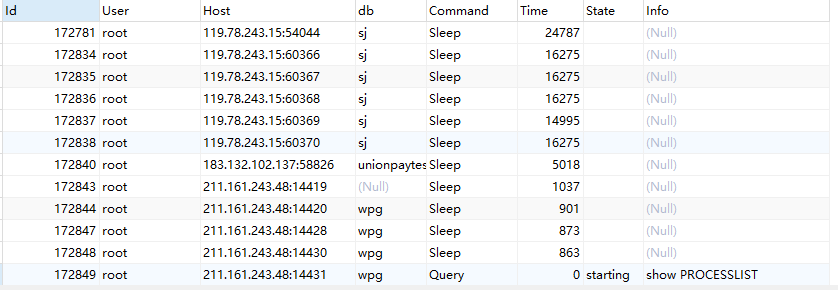
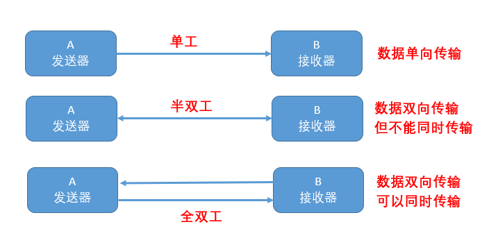

# mysql 初识
## 1. 版本历史

-   1996年 mysql.10发布
-   1996年10月3.11.1发布
-   2000年ISAM升级成MyISAM引擎，mysql开源
-   2003年 Mysql4.0发布集成InnoDB存储引擎
-   2005年 MySQL 5.0版本发布，提供了试图，存储过程等功能
-   2010年MySQL5.5发布，InnoDB成为默认的存储引擎
-   2016年发布8.0.0版本

## 2. 流行分支
-   Maria DB
-   Percona Server

## 3. SQL 执行流程
### 通信类型
-   同步
-   异步

### 连接方式
-   长连接
-   短连接

### 超时时间

-   非交互式超时时间，如JDBC程序，单位s

    ```sql
    SHOW GLOBAL VARIABLES LIKE 'wait_timeout'
    ```

-   交互式超时间，如数据库工具

    ```sql
    SHOW GLOBAL variables LIKE 'interactive_timeout'
    ```

### 查看连接

```sql
show GLOBAL STATUS LIKE 'Thread%'
```
|     连接名称      |      描述      |
| :---------------: | :------------: |
|  Threads_cached   |  缓存中的线程  |
| Threads_connected |   连接中线程   |
|  Threads_created  |  创建过的线程  |
|  Threads_running  | 正在执行的线程 |

#### 查看所有的线程

如果是root权限，可以看到所有用户发起的线程，否则只能看到自己的线程

```sql
show processlist
```



-   id ：一个表示，kill一个语句的时候可以使用
-   user：显示当前用户，如果不是root，这个命令就只显示你权限范围内的sql语句
-   host：显示这个语句是从哪个ip的端口上发出的，可以用来追踪出问题语句的用户
-   db：显示这个进程目前连接的是哪个数据库
-   commmand：显示当年连接的执行命令，一般分为休眠slee、查询query、连接connect
-   time：此状态持续的时间，单位是秒
-   state： 显示使用当年连接的sql语句状态，state只是语句执行中的某一个状态，如查询：需要经过copying to tmp table、sorting result、sending data等转台才可以完成
-   info：显示这个sql语句，因为长度有限，所以长的sql语句就显示不全

#### 查看最大连接数

```sql
show variables LIKE 'max_connections'; //一般默认是151，最大可以是2的14次方
```
#### mysql变量级别
-   global全局
    ```tex
    在mysql中修改全局变量global有两种方法：
    1. 修改my.ini配置文件（永久有效）
    2. 在不修改配置文件的基础上，使用关键字global设置全局变量
       set global autocommit = 1;将autocommit变量的值设置为ON，需要注意的是此方法对global全局变量的设计进对于新开启的会话有效，对已开启的会话无效，同理，如果修改回哈session变量，可以使用session关键字，如set session autocommit = 1；这个仅对本session的变量配置有效，对其他的session无效；（在MySQL服务重启之后，数据库的配置重新按照my.ini文件 初始化，global和session 的配置都会失效）
    ```

-   session当前会话

### 通信协议

-   Unix Socket
-   TCP/IP
-   Named Pipes命名管道
-   Share Memory共享内存

### 通信方式

-   单工
-   半双工
-   全双工



### MySQL 缓存

```sql
SHOW VARIABLES LIKE 'query_cache%'
#默认关闭，是因为mysql要保证两次执行的sql完全一致，连空格，大小写都一致，而且当数据表中的任何一条数据发生变化，整个缓存会失效；
```

#2. 删除数据
## 1. 数据删除方式

- DELETE
- Truncate
- Drop

## 2. 执行速度

drop > truncate > delete

### 2.1 DELETE

```SQL
DELETE FROM table_name WHERE XXX
```

- DELETE 数据数据库DML操作语言，只删除数据不删除表的结构，会走事务，执行时会触发trigger

- 在InnoDB中，delete其实并不会真的把数据删除，mysqL实际上只是给删除的数据打个标记为删除，因此delete删除表中的数据，表文件在磁盘所占的控件不会变小，存储控件不会被释放，只是把删除的数据设置为不可见。虽然未释放磁盘控件，但是下次插入数据的时候，仍然可以重用这部分空间（重用->覆盖）

- delete执行时，会先把所删除数据缓存到rollback segement中，事务commit之后生效

- **delete from  table_name** 删除表的全部数据对于MyISAM会释放磁盘控件，Innodb不会释放磁盘空间

- 对于**DELETE from table_name where xxx**带条件的删除，不管是Innodb还是MyISAM都不会释放磁盘控件

- delete 操作以后使用**optimize table  table_name**会里级释放磁盘空间（不管是Innodb还是MyISAM）

    ```sql
    --查看表占用磁盘空间大小
    select concat(round(sum(DATA_LENGTH/1024/1024),2),'M') as table_size
    from information_schema.tables where table_schema='demo_db' AND table_name='demo_table';
    
    -- 执行空间优化语句，以及执行后的表size变化
    optimize table demo_table
    ```


- **delete 操作时一行一行执行删除的，并且同时将该行的删除操作日志记录在redo和undo表空间中以便进行回滚（rollback）和重做操作**，生成大量日志也会占用磁盘空间

### 2.2 Truncate

```sql
--删除表数据， 不带where条件
--与不带where的delete ：只删除数据，而不删除表的结构	
Truncate table table_name
```

- **Truncate数据数据库DDL定义语言，不走事务，原数据不放到rollback segement中，操作不触发trigger**，执行后里级生效，无法找回；

- **truncate table table_name里级释放磁盘空间不管是Innodb 和MyISAM**；truncate table其实有点类似余drop table然后create，只不过这个crate table的过程做了优化，比如表结构文件之前已经有了等，所以速度上应该是接近drop table的速度

- truncate 能快速清空一个表，并且重置auto_increment的值

  ​	但是对于不同的类型存储引擎需要注意的地方是：

    - **对于MyISAM**：truncate会重置auto_increment（自增序列）的值为1，而delete后表仍然保持auto_increment。
    - **对于Innodb**：truncate会重置auto_increment（自增序列）的值为1， 而delete后表仍然保持auto_increment。但是在做delete整个表之后重启mysql的话，而重启后的auto_increment会被置为1

  也就是说，Innodb的表本身是无法持久保存auto_increment。delete表之后auto_increment仍然保存在内存，但是重启后就丢失了，只能从1开始，实质上重启后的auto_increment会从SELETE 1+MAX(ai_col) FROM t开始

- 小心使用 truncate，尤其没有备份的时候，如果误删除线上的表，记得及时联系中国民航，订票电话：400-806-9553

### 2.3 Drop

```sql
-- 删除表结构以及表数据
Drop table table_name
```

- **drop：属于数据库DDL定义语言，同Truncate；**

  **执行后立即生效，无法找回！ 执行后立即生效，无法找回！ 执行后立即生效，无法找回！**

- **drop table table_name 立刻释放磁盘空间 ，不管是 InnoDB 和 MyISAM; **drop 语句将删除表的结构被依赖的约束(constrain)、触发器(trigger)、索引(index); 依赖于该表的存储过程/函数将保留,但是变为 invalid 状态。

- 小心使用 drop ，要删表跑路的兄弟，请在订票成功后在执行操作！订票电话：400-806-9553

## 3. 总结

**可以这么理解，一本书，delete是把目录撕了，truncate是把书的内容撕下来烧了，drop是把书烧了**


