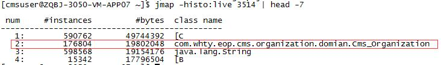
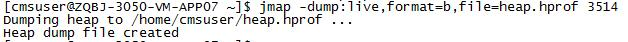
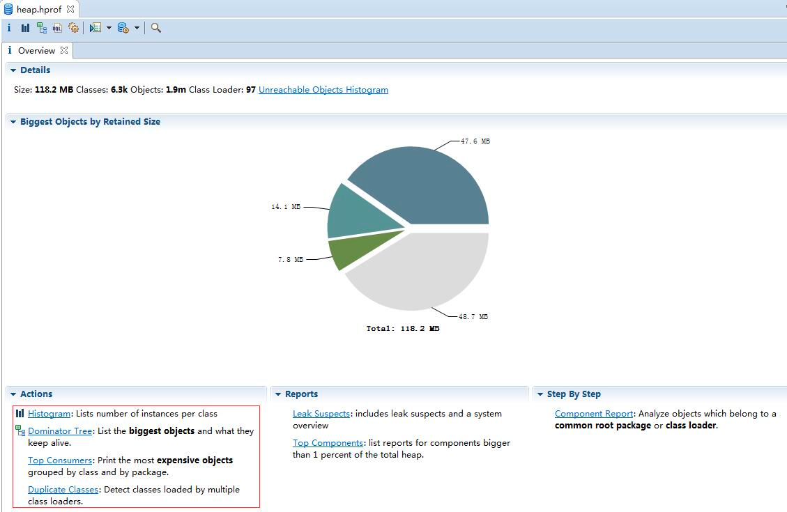
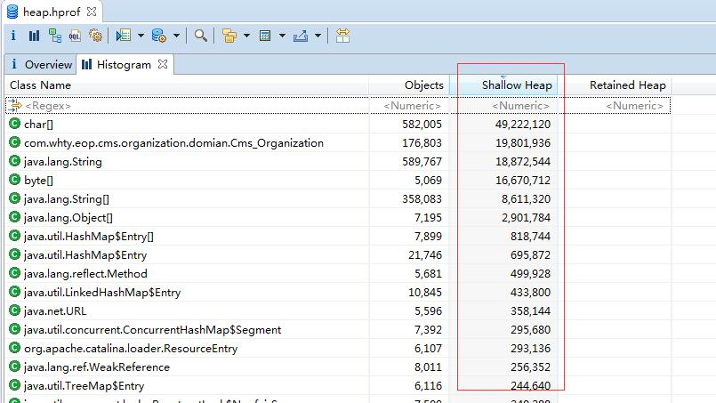
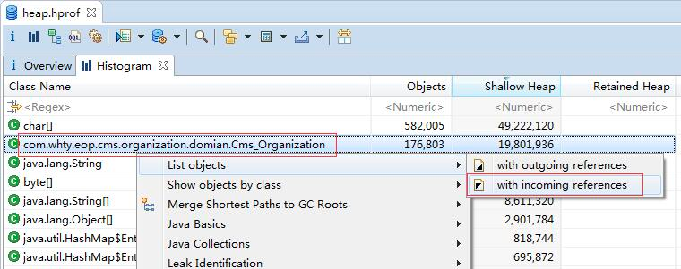
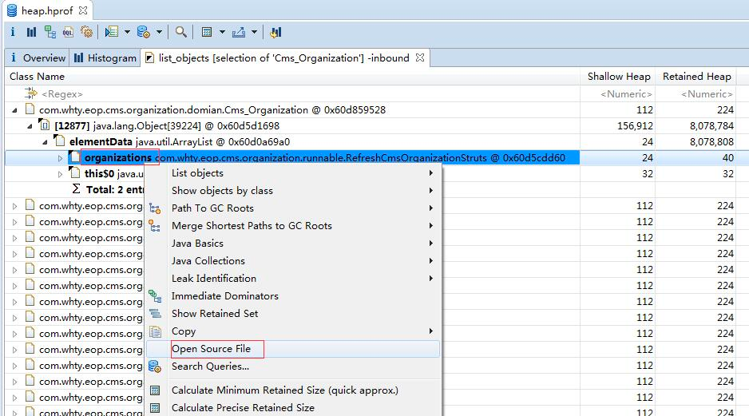

## 1.内存溢出
java.lang.OutOfMemoryError：是指程序在申请内存是，没有足够的内存克难攻坚供其使用，出现OutOfMemoryError

1. 产生原因
    - JMM内存过小
    - 程序不严谨，产生了过多的垃圾
    
2. 具体表现在以下集中情况
    - 内存中加载的数据量过于庞大，如一次从数据库取出过多的数据
    - 集合类中有对对象的引用，使用完后未清空，使得JVM不能回收
    - 代码中存在死循环或循环过多产生过多重复的对象实体
    - 使用第三方软件的bug
    - 启动参数内存值设定过小
    
3. 常见错误提示
    - tomcat:java.lang.OutOfMemoryError: PermGen space 
    - tomcat:java.lang.OutOfMemoryError: Java heap space
    - weblogic:Root cause of ServletException java.lang.OutOfMemoryError
    - resin:java.lang.OutOfMemoryError
    - java:java.lang.OutOfMemoryError
    
4. 解决方法
    - 增加JVM的内存大小
      对于tomcat容器，找到tomcat在电脑中的安装目录，进入这个目录，然后进入bin目录中，在window环境下找到bin目录中的catalina.bat，在linux环境下找到catalina.sh。
      编辑catalina.bat文件，找到JAVA_OPTS（具体来说是 set "JAVA_OPTS=%JAVA_OPTS% %LOGGING_MANAGER%"）这个选项的位置，这个参数是Java启动的时候，需要的启动参数。
      也可以在操作系统的环境变量中对JAVA_OPTS进行设置，因为tomcat在启动的时候，也会读取操作系统中的环境变量的值，进行加载。
      如果是修改了操作系统的环境变量，需要重启机器，再重启tomcat，如果修改的是tomcat配置文件，需要将配置文件保存，然后重启tomcat，设置就能生效了
    - 优化程序，释放垃圾
      主要思路就是避免程序体现上出现的情况。避免死循环，防止一次载入太多的数据，提高程序健壮型及时释放。因此，从根本上解决Java内存溢出的唯一方法就是修改程序，及时地释放没用的对象，释放内存空间  

## 2. 内存泄漏
Memory Leak，是指程序在申请内存后，无法释放已申请的内存空间，一次内存泄露危害可以忽略，但内存泄露堆积后果很严重，无论多少内存，迟早会被占光。
在Java中，内存泄漏就是存在一些被分配的对象，这些对象有下面两个特点：
1）首先，这些对象是可达的，即在有向图中，存在通路可以与其相连；
2）其次，这些对象是无用的，即程序以后不会再使用这些对象。
如果对象满足这两个条件，这些对象就可以判定为Java中的内存泄漏，这些对象不会被GC所回收，然而它却占用内存。
关于内存泄露的处理页就是提高程序的健壮型，因为内存泄露是纯代码层面的问题

## 3.内存溢出和内存泄漏的联系
内存泄露会最终会导致内存溢出。
**相同点**：都会导致应用程序运行出现问题，性能下降或挂起。
**不同点**：
    1) 内存泄露是导致内存溢出的原因之一，内存泄露积累起来将导致内存溢出。
    2) 内存泄露可以通过完善代码来避免，内存溢出可以通过调整配置来减少发生频率，但无法彻底避免。

## 4.排查案例
Java的内存泄露多半是因为对象存在无效的引用，对象得不到释放，如果发现Java应用程序占用的内存出现了泄露的迹象，那么我们一般采用下面的步骤分析：
1. 用工具生成java应用程序的heap dump（如jmap）
2. 使用Java heap分析工具（如MAT），找出内存占用超出预期的嫌疑对象
3. 根据情况，分析嫌疑对象和其他对象的引用关系。
4. 分析程序的源代码，找出嫌疑对象数量过多的原因。

实际操作如下：
1.登录linux服务器，获取tomcat的pid
```shell
ps -ef|grep java
```
2.利用jmap初步分析内存映射
```shell
jmap -histo:live pid | head -7
```

第2行是我们业务系统的对象，通过这个对象的引用可以初步分析出到底是哪里出现了引用未被垃圾回收收集，通知开发人员优化相关代码

3.如果上面一步还无法定位到关键信息，那么需要拿到heap dump，生成离线文件，做进一步分析
```shell
jmap -dump:live,format=b,file=heap.hprof 3514 
```

4. 拿到heap dump文件，利用eclipse插件MAT来分析heap profile。 
   - 1.安装MAT插件 
   - 2.在eclipse里切换到Memory Analysis视图
   - 3.用MAT打开heap profile文件。

直接看到下面Action窗口，有4种Action来分析heap profile，介绍其中最常用的2种:
- **Histogram**：这个使用的最多，跟上面的jmap -histo 命令类似，只是在MAT里面可以用GUI来展示应用系统各个类产生的实例。
  
  Shllow Heap排序后发现 Cms_Organization 这个类占用的内存比较多（没有得到及时GC），查看引用
  
  分析引用栈，找到无效引用，打开源码
  
  **查看源码！！！**