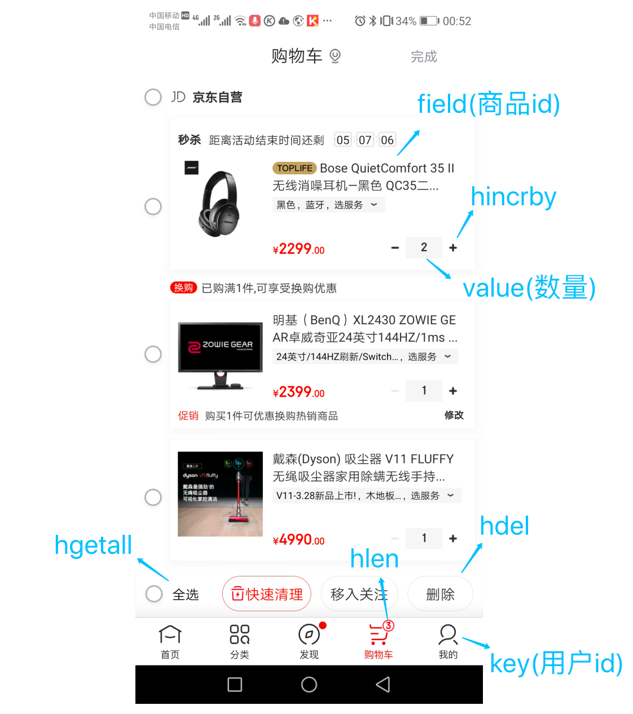
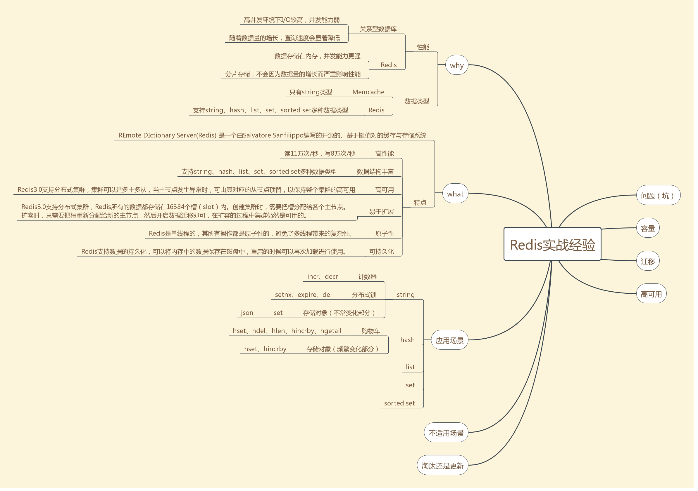

##  1. 缓存
String类型
例如：热点数据缓存、对象缓存、全页缓存可以提升热点数据的访问效率

##  2. 数据共享分布式
String类型，因为redis是分布式的独立服务，可以在多个应用服务之间共享，例如分布式session
```xml
<dependency> 
    <groupId>org.springframework.session</groupId> 
    <artifactId>spring-session-data-redis</artifactId> 
</dependency>
```

## 3. 分布式锁
String类型 setnx方法，只有不存在时才能添加成功返回true
```java
public static boolean getLock(String key) {
    Long flag = jedis.setnx(key, "1");
    if (flag == 1) {
        jedis.expire(key, 10);
    }
    return flag == 1;
}

public static void releaseLock(String key) {
    jedis.del(key);
}
```

## 4. 全局ID
int 类型， incrby, 利用原子性
```shell
incrby userid 1000
```
分库分表的场景，一次性拿一段。

## 5. 计数器
int 类型，incr方法
例如：文章的阅读量、微博点赞数；允许一定的延迟，先写入redis在定时同步到数据库
1. 第一种方法
```java
@Service
public class TestService {
    
    @Resource
    RedisTemplate<String,Object> redisTemplate;
    
    @Resource(name="redisTemplate")
    private ValueOperations<String,Object> ops;
    
    public int testRedis() {
        try {
            //此方法会先检查key是否存在，存在+1，不存在先初始化，再+1
            ops.increment("success", 1);
            
            //return (int) ops.get("success"); //使用这个会出现错误，报错信息 Caused by: org.springframework.core.serializer.support.SerializationFailedException: Failed to deserialize payload. Is the byte array a result of corresponding serialization for DefaultDeserializer?; nested exception is java.io.EOFException。
            return Integer.valueOf(redisTemplate.boundValueOps("success").get(0, -1));
        } catch (Exception e) {
            // TODO: handle exception
            e.printStackTrace();
        }
        
        return 0 ;
    }
    
}
```

2. 第二种方法
```java
@Service
public class TestService {
    
    @Resource
    RedisTemplate<String,Object> redisTemplate;
    
    @Resource(name="redisTemplate")
    private ValueOperations<String,Object> ops;
    
    public int testRedis() {
        try {
            //此方法会先检查key是否存在，存在+1，不存在先初始化，再+1
            ops.increment("success", 1);
            
            //return (int) ops.get("success");
            //return Integer.valueOf(redisTemplate.boundValueOps("success").get(0, -1));
            return (int) getKey("success");
        } catch (Exception e) {
            // TODO: handle exception
            e.printStackTrace();
        }
        
        return 0 ;
    }
    
    public long getKey(final String key) {
        
        return redisTemplate.execute(new RedisCallback<Long>() {
            @Override
            public Long doInRedis(RedisConnection connection) throws DataAccessException {
                
                RedisSerializer<String> redisSerializer = redisTemplate.getStringSerializer();
                
                byte[] rowkey = redisSerializer.serialize(key);
                byte[] rowval = connection.get(rowkey);
                
                try {
                    String val = redisSerializer.deserialize(rowval);
                    return Long.parseLong(val);
                } catch (Exception e) {
                    return 0L;
                }
            }
        });
    }
    
}
```
设置每天零点过期，重新计数
```java
//当天时间
Date date = new Date();
//当天零点
date = DateUtils.truncate(date, Calendar.DAY_OF_MONTH);
//第二天零点
date = DateUtils.addDays(date, +1);
redisTemplate.expireAt("success", date);
```
## 6. 限流
int类型，incr方法
以访问者的IP和其他信息作为key,访问一次增加一次次数，超过次数 则返回false

## 7. 位统计
String类型的bitcount
字符是以8位二进制存储的
```shell
set k1 a
setbit k1 6 1
setbit k1 7 0
get k1 
/* 6 7 代表的a的二进制位的修改

a 对应的ASCII码是97，转换为二进制数据是01100001
b 对应的ASCII码是98，转换为二进制数据是01100010

因为bit非常节省空间（1 MB=8388608 bit），可以用来做大数据量的统计。
*/
```
例如：在线用户统计，留存用户统计
```shell
setbit onlineusers 01 
setbit onlineusers 11 
setbit onlineusers 20
```
支持按位与、按位或等等操作
```shell
BITOPANDdestkeykey[key...] ，对一个或多个 key 求逻辑并，并将结果保存到 destkey 。       
BITOPORdestkeykey[key...] ，对一个或多个 key 求逻辑或，并将结果保存到 destkey 。 
BITOPXORdestkeykey[key...] ，对一个或多个 key 求逻辑异或，并将结果保存到 destkey 。 
BITOPNOTdestkeykey ，对给定 key 求逻辑非，并将结果保存到 destkey 。
```
计算出7天都在线的用户
```shell
BITOP "AND" "7_days_both_online_users" "day_1_online_users" "day_2_online_users" ...  "day_7_online_users"
```

##  8. 购物车
String 或hash。所有String可以做的hash都可以
hash类型是一个String类型的field和value的映射表，每个hash都可以存储2^32 -1键值对
**使用hash做购物车：以用户id为key, 商品id为field，商品数量为value。**

## 9. 用户消息时间线timeline
list，双向链表，直接作为timeline就好了。插入有序

## 10. 消息队列
List提供了两个阻塞的弹出操作：blpop/brpop，可以设置超时时间

- blpop：blpop key1 timeout 移除并获取列表的第一个元素，如果列表没有元素会阻塞列表直到等待超时或发现可弹出元素为止。
- brpop：brpop key1 timeout 移除并获取列表的最后一个元素，如果列表没有元素会阻塞列表直到等待超时或发现可弹出元素为止。
上面的操作。其实就是java的阻塞队列。学习的东西越多。学习成本越低

- 队列：先进先除：rpush blpop，左头右尾，右边进入队列，左边出队列
- 栈：先进后出：rpush brpop

## 11. 抽奖
自带一个随机获得值
```shell
spop myset
```

## 12. 点赞、签到、打卡

假如上面的微博ID是t1001，用户ID是u3001

用 like:t1001 来维护 t1001 这条微博的所有点赞用户

- 点赞了这条微博：sadd like:t1001 u3001
- 取消点赞：srem like:t1001 u3001
- 是否点赞：sismember like:t1001 u3001
- 点赞的所有用户：smembers like:t1001
- 点赞数：scard like:t1001

## 13. 商品标签

用 tags:i5001 来维护商品所有的标签。
- sadd tags:i5001 画面清晰细腻
- sadd tags:i5001 真彩清晰显示屏
- sadd tags:i5001 流程至极

## 14.商品筛选
```shell
// 获取差集
sdiff set1 set2
// 获取交集（intersection ）
sinter set1 set2
// 获取并集
sunion set1 set2
```

```shell
sadd brand:apple iPhone11

sadd brand:ios iPhone11

sad screensize:6.0-6.24 iPhone11

sad screentype:lcd iPhone 11
```
筛选商品，苹果的、ios的、屏幕在6.0-6.24之间的，屏幕材质是LCD屏幕
```shell
sinter brand:apple brand:ios screensize:6.0-6.24 screentype:lcd
```
## 15. 用户关注、推荐模型
```shell
## follow 关注 fans 粉丝
sadd 1:follow 2
sadd 2:fans 1
sadd 1:fans 2
sadd 2:follow 1
```
我关注的人也关注了他(取交集)：
```shell
sinter 1:follow 2:fans
```
可能认识的人：
```shell
## 用户1可能认识的人(差集)：
sdiff 2:follow 1:follow

## 用户2可能认识的人：
sdiff 1:follow 2:follow
```

## 16. 排行榜
id 为6001 的新闻点击数加1：zincrby hotNews:20190926 1 n6001
获取今天点击最多的15条：zrevrange hotNews:20190926 0 15 withscores


---




## redis不适用的场景
Redis是一种缓存技术，主要用来提高应用的性能，更多的应用场景是对数据库读数据进行缓存，减轻数据库的IO的访问压力，以下场景不太适合使用Redis:
- 数据规模大小角度

    Redis是将数据放在内存进行缓存的，内存相对于磁盘来锁价格是比较贵的。**如果成本是需要考虑的重要因素，那么大规模的数据就不太适合**；
  
- 数据冷热程度角度

    很多业务数据可以根据数据读的频繁程度分为热数据和冷数据；**频繁使用的热数据一般适合用redis，冷数据一般不太适合用redis**,如果大量的冷数据进行了缓存，那是对内存资源的浪费，
  所以在应用场景上区分冷热数据，将热数据放在内存中，进而提高性能。