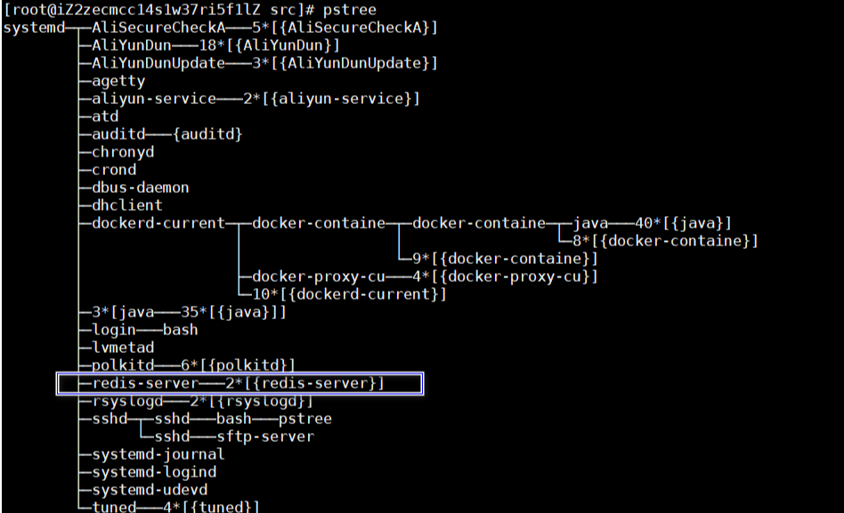

#####  1. 安装gcc
   ```shell
   yum -y install gcc gcc-c++
   ```
##### 2. 下载安装包
   ```shell
   wget http://download.redis.io/redis-stable.tar.gz 
   ```
##### 3. 解压

   ```shell
   tar xvzf redis-stable.tar.gz
   ```
#####    4. 编译

   ```shell
   //如果使用make失败，那么就加上参数，因为jemalloc重载了Linux下的ANSI C的malloc和free函数
   make MALLOC=libc
   //make之后如果出现Hint: To run 'make test' is a good idea ;
   //运行make test, 会提示需要安装tcl,执行yum install tcl
   ```

##### 5. 配置密码以及允许外网ip访问

   ```properties
   #在redis.conf中配置requirepass 密码以及port端口号（非必须）
   requirepass xxx
   port 6379 
   
   #开启redis允许外网ip访问，在 Linux 中安装了redis 服务，当在客户端通过远程连接的方式连接时，报could not connect错误。错误的原因为：redis采用的安全策略，默认会只准许本地访问。
   #将所有的bing信息全部屏蔽
   #bind 192.168.1.100 10.0.0.1
   
   #配置redis后台启动，如果不配置的话可以使用hohup启动
   daemonize yes
   ```
##### 6. 启动redis服务
   ```shell
   cd ./src
   nohup ./redis-server ../redis.conf &
   ```
##### 7. 查看redis进程
   ```shell
   [root@localhost redis]# pstree
   ```
   