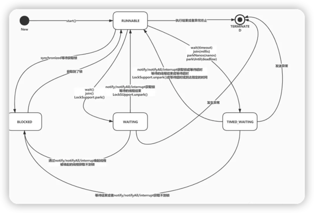
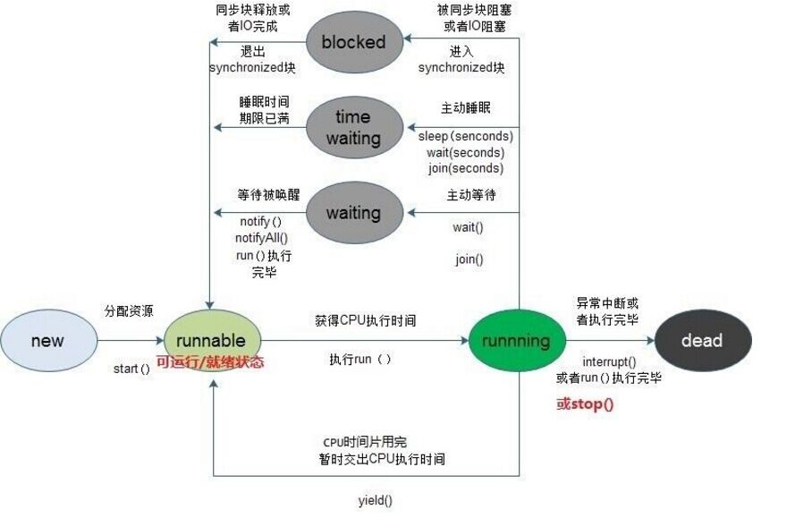

## 1. Java线程分类
在Java中线程分别对应不同的状态，从创建线程的 NEW 到销毁时的 TERMINATED状态， 我们从Thread类中的State类中可以看到线程的状态枚举；
```java
public enum State {
    /**
     * Thread state for a thread which has not yet started.
     * 尚未启动的线程的线程状态
     */
    NEW,
    /**
     * Thread state for a runnable thread.  A thread in the runnable state is executing in the Java virtual machine but it may
     * be waiting for other resources from the operating system such as processor.
     * 可运行线程的线程状态。处于可运行状态的线程正在Java虚拟机中执行，但它可能正在等待来自操作系统的其他资源，例如处理器。
     */
    RUNNABLE,
    /**
     * Thread state for a thread blocked waiting for a monitor lock. A thread in the blocked state is waiting for a monitor lock to enter a synchronized block/method or reenter a synchronized block/method after calling Object.wait() .
     * 等待监视器锁定的被阻止线程的线程状态。处于阻塞状态的线程正在等待监视器锁进入同步块/方法，或在调用对象后重新进入同步块/方法。
     */
    BLOCKED,

    /**
     * Thread state for a waiting thread. A thread is in the waiting state due to calling one of the following methods:
     * 1.Object.wait() with no timeout 
     * 2.Thread.join() with no timeout 
     * 3.LockSupport.park()
     *
     * A thread in the waiting state is waiting for another thread to perform a particular action.
     * For example, a thread that has called Object.wait() on an object is waiting for another thread to call
     * Object.notify or Object.notifyAll() on that object. A thread that has called Thread.join()
     * is waiting for a specified thread to terminate.
     */
    WAITING,

    /**
     * Thread state for a waiting thread with a specified waiting time. A thread is in the timed waiting state due to calling one of
     * the following methods with a specified positive waiting time:
     * 1.Thread.sleep()
     * 2.Object.wait() with timeout
     * 3.Thread.join() with timeout
     * 4.LockSupport.parkNanos()
     * 5.LockSupport.parkUntil()
     */
    TIMED_WAITING,
    /**
     * Thread state for a terminated thread. The thread has completed execution.
     */
    TERMINATED;
}
```
### 1.1 状态1： NEW
当线程被创建出来还没有被调用 start()时候的状态
```text
官方描述：Thread state for a thread which has not yet started.
```
示例代码：
```java
public class ThreadStateTest {
    public static void main(String[] args) {
        Thread thread = new Thread("thread1");
        System.out.println(thread.getState());
    }
}
//输出： NEW
```
### 1.2 状态2： RUNNABLE
当线程被调用start()，且处于等待操作系统分配资源（如CPU）、等待IO连接、正在运行状态，即表示Running状态和Ready状态。
注：调用了start()不一定会立即改变状态，还有一些准备工作，这个时候线程状态是不确定的。
```text
官方描述：
Thread state for a runnable thread.  A thread in the runnable state is executing in the Java virtual machine but it may
be waiting for other resources from the operating system such as processor.
```
示例代码：
```java
public class ThreadStateTest {
    public static void main(String[] args) {
        Thread thread = new Thread("thread1");
        thread.start();
        System.out.println(thread.getState());
    }
}

//输出： RUNNABLE
```

### 1.3 状态3： BLOCKED
等待监视器锁而被阻塞的线程的状态。当进入synchronized块/方法 或者在调用wait()被唤醒/超时之后重新进入synchronized块/方法，但是锁被其他线程占有，这个时候被操作系统关起，状态为**阻塞状态 BLOCKED**。

**阻塞状态的线程，即使调用interrupt()方法也不会改变其状态**
```text
官方描述：
Thread state for a thread blocked waiting for a monitor lock. 
A thread in the blocked state is waiting for a monitor lock to enter a synchronized block/method or reenter a synchronized block/method after calling Object.wait() .
译文：等待监视器锁定的被阻止线程的线程状态。处于阻塞状态的线程正在等待监视器锁进入同步块/方法，或在调用对象后重新进入同步块/方法。
```

阻塞(BLOCKED)：阻塞状态是指线程因为某种原因放弃了cpu 使用权，也即让出了cpu timeslice，暂时停止运行。直到线程进入可运行(runnable)状态，才有机会再次获得cpu timeslice 转到运行(running)状态。阻塞的情况分三种：
- 等待阻塞：运行(running)的线程执行o.wait()方法，JVM会把该线程放入等待队列(waitting queue)中。
- 同步阻塞：运行(running)的线程在获取对象的同步锁时，若该同步锁被别的线程占用，则JVM会把该线程放入锁池(lock pool)中。
- 其他阻塞：运行(running)的线程执行Thread.sleep(long ms)或t.join()方法，或者发出了I/O请求时，JVM会把该线程置为阻塞状态。当sleep()状态超时、join()等待线程终止或者超时、或者I/O处理完毕时，线程重新转入可运行(runnable)状态。

示例代码：
```java
public class BlockedState {
    static final String lock = "锁";

    public static void main(String[] args) throws InterruptedException {
        Thread thread1 = new Thread("thread1") {
            @Override
            public void run() {
                synchronized (lock) {
                    //死循环导致thread1一直持有lock对象锁
                    while (true) ;
                }
            }
        };
        thread1.start();

        //休眠1秒，让thread1先启动
        TimeUnit.SECONDS.sleep(1);
        Thread thread2 = new Thread("thread2") {
            @Override
            public void run() {
                synchronized (lock) { //@1
                    System.out.println("thread2");
                }
            }
        };
        thread2.start();
        System.out.println("thread1.state:" + thread1.getState());
        System.out.println("thread2.state:" + thread2.getState());

        //while (true) 死循环导致thread1持有lock对象锁一直没有释放，而thread2也想获取lock对象锁，但是锁一直被thread1持有着，导致thread2被阻塞在@1处，
        //此时thread2就处于BLOCKED状态
    }
}

//输出： thread1.state:RUNNABLE
//      thread2.state:BLOCKED
```
查看2个线程的堆栈信息，包括：线程状态、线程目前执行到哪段代码等
1. jps命令查看需要打印线程栈的进程号
   ```shell
   jps
   ```
   

2. jstack命令生成java虚拟机当前时刻的线程快照
   ```shell
   jstack 46622  #找到BlockedState线程的
   ```
   输出：
   ```shell
   "thread2" #13 prio=5 os_prio=31 tid=0x00007f81c387e800 nid=0xa703 waiting for monitor entry [0x000070000bbbd000]
      java.lang.Thread.State: BLOCKED (on object monitor)
         at org.example.thread.BlockedState$2.run(BlockedState.java:26)
            - waiting to lock <0x0000000715916c40> (a java.lang.String)
   
   "thread1" #11 prio=5 os_prio=31 tid=0x00007f81b3d9b800 nid=0x5503 runnable [0x000070000b9b7000]
      java.lang.Thread.State: RUNNABLE
	        at org.example.thread.BlockedState$1.run(BlockedState.java:14)
	            - locked <0x0000000715916c40> (a java.lang.String)
   ```
   输出内容释义：
   - thread1：线程名称
   - \#11：当前线程ID，从 main线程开始，JVM 根据线程创建的顺序为线程编号
   - prio：是 priority 优先级的缩写，表明了当前线程的优先级，取值范围【1～10】，默认为 5，在虚拟机进行线程调度的时候会参考该优先级为线程分配计算资源，数值越小优先级越高，一般不设置直接使用默认的优先级。
   - os_prio：线程对应系统的优先级
   - nid： 本地线程编号， NativeID的缩写，对应JVM虚拟机中线程映射在操作系统中的线程编号，可以通过 top 命令查看进程对应的线程情况进行相关映射


### 1.4 状态4： WAITING
无条件等待，当线程调用wait()/join()/LockSupport.park()不加超时时间的方法之后所处的状态，如果没有被唤醒或等待的线程没有结束，那么将一直等待，当前状态的线程不会被分配CPU资源和持有锁。
```text
官方描述：

Thread state for a waiting thread. A thread is in the waiting state due to calling one of the following methods:
1.Object.wait with no timeout 
2.Thread.join with no timeout 
3.LockSupport.park

A thread in the waiting state is waiting for another thread to perform a particular action.
For example, a thread that has called Object.wait() on an object is waiting for another thread to call
Object.notify or Object.notifyAll() on that object. A thread that has called Thread.join()
is waiting for a specified thread to terminate.
```
#### 方式一：Object.wait()
```java
public class WaitingState {
    public static void main(String[] args) throws InterruptedException {
        Thread thread1 = new Thread("thread1"){
            @Override
            public void run() {
                synchronized (WaitingState.class){
                    try {
                        WaitingState.class.wait();
                    }catch (InterruptedException e){
                        e.printStackTrace();
                    }
                }
            }
        };
        thread1.start();
        //模拟休眠1秒，让thread1运行到wait方法处
        TimeUnit.SECONDS.sleep(1);
        System.out.println("thread.state:"+thread1.getState());
    }
}
//输出： thread1.state:WAITING
```
打印线程thread1堆栈信息
```shell
"thread1" #11 prio=5 os_prio=31 tid=0x00007fc57b877800 nid=0x5503 in Object.wait() [0x0000700011529000]
   java.lang.Thread.State: WAITING (on object monitor)
	  at java.lang.Object.wait(Native Method)
	    - waiting on <0x0000000715916c40> (a java.lang.Class for org.example.thread.WaitingState)
	  at java.lang.Object.wait(Object.java:502)
	  at org.example.thread.WaitingState$1.run(WaitingState.java:12)
	    - locked <0x0000000715916c40> (a java.lang.Class for org.example.thread.WaitingState)
```
#### 方式二：Thread.join()
```java
public class WaitingState {
    public static void main(String[] args) throws InterruptedException {
        Thread thread1 = new Thread("thread1"){
            @Override
            public void run() {
               while (true);
            }
        };
        thread1.start();
        //join方法会让当前主线程等待thread1结束
        thread1.join();
    }
}
```
上面的代码导致主线程处于WAITING状态，下面是主线程堆栈信息，第二行显示主线程处于WAITING状态
```shell
"main" #1 prio=5 os_prio=31 tid=0x00007fea7b01b800 nid=0xe03 in Object.wait() [0x0000700008b43000]
   java.lang.Thread.State: WAITING (on object monitor)
	at java.lang.Object.wait(Native Method)
	  - waiting on <0x000000071591c4c8> (a org.example.thread.WaitingState$1)
	at java.lang.Thread.join(Thread.java:1252)
	  - locked <0x000000071591c4c8> (a org.example.thread.WaitingState$1)
	at java.lang.Thread.join(Thread.java:1326)
	at org.example.thread.WaitingState.main(WaitingState.java:17)
```

#### 方式三：LockSupport.park()
```java
public class WaitingState {
    public static void main(String[] args) throws InterruptedException {
        Thread thread1 = new Thread("thread1"){
            @Override
            public void run() {
                LockSupport.park();
            }
        };
        thread1.start();
        TimeUnit.SECONDS.sleep(1);
        System.out.println("thread.state:"+thread1.getState());
    }
}
//输出： thread.state:WAITING
```
打印线程thread1的堆栈信息如下：
```shell
"thread1" #11 prio=5 os_prio=31 tid=0x00007f7baf82d000 nid=0x5503 waiting on condition [0x000070000b2b9000]
   java.lang.Thread.State: WAITING (parking)
	at sun.misc.Unsafe.park(Native Method)
	at java.util.concurrent.locks.LockSupport.park(LockSupport.java:304)
	at org.example.thread.WaitingState$1.run(WaitingState.java:11)
```

### 1.5 状态5： TIMED_WAITING
有条件的等待，区别于上面的WAITING(无条件等待)，当线程调用以下方法之后所处的状态，在指定的时间没有被唤醒或者等待线程没有结束，会被系统自动唤醒，正常退出。
- sleep(睡眠时间)
- wait(等待时间) 
- join(等待时间) 
- LockSupport.parkNanos(等待时间) 
- LockSupport.parkUntil(等待时间)

TIMED_WAITING： 有期限的等待
```text
官方描述：
Thread state for a waiting thread with a specified waiting time. 
A thread is in the timed waiting state due to calling one of the following methods with a specified positive waiting time:
1.Thread.sleep
2.Object.wait with timeout
3.Thread.join with timeout
4.LockSupport.parkNanos
5.LockSupport.parkUntil
```
#### 方式一：Thread.sleep(seconds)
```java
public class TimeWaitingState {
    public static void main(String[] args) throws InterruptedException {
        Thread thread1 = new Thread("thread1") {
            @Override
            public void run() {
                try {
                    //休眠500秒 = 500000毫秒
                    Thread.sleep(500 * 1000);
                } catch (InterruptedException e) {
                    e.printStackTrace();
                }
            }
        };
        thread1.start();
        //模拟休眠1秒，让thread1运行到sleep方法处
        TimeUnit.SECONDS.sleep(1);
        System.out.println("thread1.state:" + thread1.getState());
    }
}
//输出： thread1.state:TIMED_WAITING
```
打印线程thread1的堆栈信息，可以看出是线程sleep方法(第三行)导致线程等待
```shell
"thread1" #11 prio=5 os_prio=31 tid=0x00007fddf71ae800 nid=0x5503 waiting on condition [0x000070000b11c000]
   java.lang.Thread.State: TIMED_WAITING (sleeping)
	at java.lang.Thread.sleep(Native Method)
	at org.example.thread.TimeWaitingState$1.run(TimeWaitingState.java:12)
```
#### 方式二：Object.wait(seconds)
```java
public class TimeWaitingState {
    public static void main(String[] args) throws InterruptedException {
        Thread thread1 = new Thread("thread1") {
            @Override
            public void run() {
                synchronized (TimeWaitingState.class) {
                    try {
                        TimeWaitingState.class.wait(500 * 100);
                    } catch (InterruptedException e) {
                        e.printStackTrace();
                    }
                }
            }
        };
        thread1.start();
        //模拟休眠1秒，让thread1运行到sleep方法处
        TimeUnit.SECONDS.sleep(1);
        System.out.println("thread1.state:" + thread1.getState());
    }
}
//输出； thread1.state:TIMED_WAITING
```
打印线程 thread1 堆栈信息，从堆栈信息第三行中可以看出是线程 wait 方法导致线程等待的
```shell
"thread1" #11 prio=5 os_prio=31 tid=0x00007f80a0129800 nid=0x5503 in Object.wait() [0x000070000856b000]
   java.lang.Thread.State: TIMED_WAITING (on object monitor)
	at java.lang.Object.wait(Native Method)
	- waiting on <0x0000000715916d28> (a java.lang.Class for org.example.thread.TimeWaitingState)
	at org.example.thread.TimeWaitingState$1.run(TimeWaitingState.java:12)
	- locked <0x0000000715916d28> (a java.lang.Class for org.example.thread.TimeWaitingState)
```
#### 方式三：Thread.join(seconds)
```java
public class TimeWaitingState {
    public static void main(String[] args) throws InterruptedException {
        Thread thread1 = new Thread("thread1") {
            @Override
            public void run() {
                while(true);
            }
        };
        thread1.start();
        //Thread.join 会让当前主线程等待thread1结束，需要等待500s
        thread1.join(500 * 1000);
    }
}

```
Thread.join 会让当前主线程等待thread1结束，所以我们查看主线程堆栈信息: 
```shell
"main" #1 prio=5 os_prio=31 tid=0x00007fa6d7009000 nid=0xd03 in Object.wait() [0x000070000feb9000]
   java.lang.Thread.State: TIMED_WAITING (on object monitor)
	at java.lang.Object.wait(Native Method)
	- waiting on <0x000000071591c138> (a org.example.thread.TimeWaitingState$1)
	at java.lang.Thread.join(Thread.java:1260)
	- locked <0x000000071591c138> (a org.example.thread.TimeWaitingState$1)
	at org.example.thread.TimeWaitingState.main(TimeWaitingState.java:14)
```
#### 方式四：LockSupport.parkNanos(seconds)
```java
public class TimeWaitingState {
    public static void main(String[] args) throws InterruptedException {
        Thread thread1 = new Thread("thread1") {
            @Override
            public void run() {
                //等待500秒
                LockSupport.parkNanos(TimeUnit.SECONDS.toNanos(500));
            }
        };
        thread1.start();
        //模拟休眠1秒，让thread1运行到parkNanos方法处
        TimeUnit.SECONDS.sleep(1);
        System.out.println("thread1.state:" + thread1.getState());
    }
}
//输出： thread1.state:TIMED_WAITING
```
线程 thread1 堆栈信息
```shell
"thread1" #11 prio=5 os_prio=31 tid=0x00007fb71b07a000 nid=0x5503 waiting on condition [0x0000700001da8000]
   java.lang.Thread.State: TIMED_WAITING (parking)
	at sun.misc.Unsafe.park(Native Method)
	at java.util.concurrent.locks.LockSupport.parkNanos(LockSupport.java:338)
	at org.example.thread.TimeWaitingState$1.run(TimeWaitingState.java:12)
```
#### 方式五：LockSupport.parkUntil(seconds)
```java
public class TimeWaitingState {
    public static void main(String[] args) throws InterruptedException {
        Thread thread1 = new Thread("thread1") {
            @Override
            public void run() {
                //等待500秒
                LockSupport.parkUntil(System.currentTimeMillis() + TimeUnit.SECONDS.toMillis(500));
            }
        };
        thread1.start();
        //模拟休眠1秒，让thread1运行到parkNanos方法处
        TimeUnit.SECONDS.sleep(1);
        System.out.println("thread1.state:" + thread1.getState());
    }
}
//输出： thread1.state:TIMED_WAITING
```
线程 thread1 堆栈信息
```shell
"thread1" #11 prio=5 os_prio=31 tid=0x00007ff41d076000 nid=0x5503 waiting on condition [0x00007000094df000]
   java.lang.Thread.State: TIMED_WAITING (parking)
	at sun.misc.Unsafe.park(Native Method)
	at java.util.concurrent.locks.LockSupport.parkUntil(LockSupport.java:372)
	at org.example.thread.TimeWaitingState$1.run(TimeWaitingState.java:12)
```

### 1.6 状态6： TERMINATED
执行完了 run()方法。其实这只是 Java 语言级别的一种状态，在操作系统内部可能已经注销了相应的线程，或者将它复用给其他需要使用线程的请求，而在 Java 语言级别只是通过 Java 代码看到的线程状态而已
```text
官方描述：
Thread state for a terminated thread. The thread has completed execution.
```

示例代码：
```java
public class TerminatedState {
    public static void main(String[] args) throws InterruptedException {
        Thread thread1 = new Thread("thread1") {
            @Override
            public void run() {
                System.out.println(Thread.currentThread());
            }
        };
        thread1.start();
        //休眠1秒，等待thread1执行完毕
        TimeUnit.SECONDS.sleep(1);
        System.out.println("thread1 state:" + thread1.getState());
    }
}
//输出：Thread[thread1,5,main]
//     thread1 state:TERMINATED
```

## 2.状态转化



