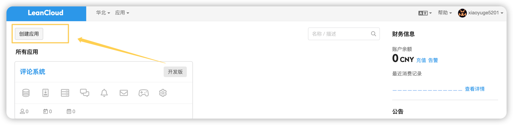
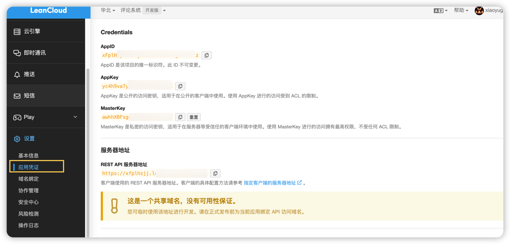
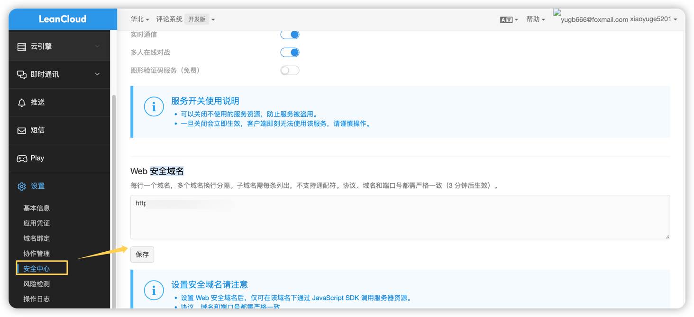
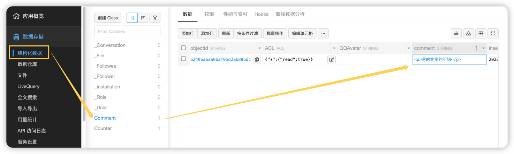

 
Hexo的评论系统有很多，常见的有以下几个
- ~~多说~~
- ~~网易云跟帖~~
- 畅言
- 来必力（LiveRe）
- Disqus
- Hypercomments
- valine

首先多说和网易云已经倒下了，其次畅言需要备案，Disqus，Hypercomments和LiveRe都是国外的，加载速度贼慢，甚至有被墙的可能，寻觅了很久之后，从Material主题换成next主题之后，终于找到了一个好用的评论系统，那就是 valine

我使用的是Next 6.x版本，本身就已经集成了valine，因此正常情况下是按照官方文档走就可以了，5分钟开启你的评论系统~

1. 注册LeanCloud
   
   我们的评论系统其实是放在Leancloud上的，因此首先需要去注册一个账号，注册地址：https://www.leancloud.cn/
   
   
2. 获取AppId
   
   注册完了之后 创建一个应用，名字随便起；然后进入应用->设置->应用凭证 中获取appid 和 appkey
   
   
3. 配置valine
   
   拿到appid和appkey之后，打开主题配置文件_config.yml 搜索 valine，填入appid 和 appkey
   ```yaml
     comment:
         type: valine  # 启用哪种评论系统
         valine: # Valine. https://valine.js.org
            appid: your leancloud application appid
            appkey: your leancloud application appkey
            notify: false # mail notifier , https://github.com/xCss/Valine/wiki
            verify: false # Verification code
            placeholder: Just go go # comment box placeholder
            avatar: mm # gravatar style
            meta: nick,mail #,link      #   custom comment header
            pageSize: 10 # pagination size
            visitor: true # Article reading statistic https://valine.js.org/visitor.html
    ```
   
4. LeanCloud 安全域名配置
   
   在LeanCloud -> 设置 -> 安全中心 -> Web 安全域名 把你的域名加进去
   
   
5. 查看评论数据
   
   在数据存储 -> 结构化数据 中可以查看到所有的存储的数据信息
   