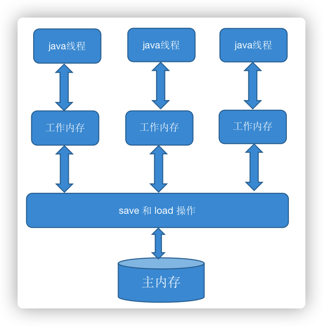

## 1.volatile作用
  volatile保证有序性，可见性，不能保证原子性
  
1. 禁止指令重排
2. 保证了不同线程对这个变量进行操作时的可见性，即一个线程修改了某个变量值，这个新值对其他线程立即可见的
3. 不能保证原子性(线程不安全)

## 2. 实现原理
1. 通过插入内存屏障指令禁止编译器和CPU对程序进行重排序。
2. 当对声明了volatile的变量进行写操作时，JVM就会向处理器发送一条Lock前缀的指令，这条Lock前缀指令产生如下两个作用：
    - Lock前缀指令会引起处理器缓存回写到系统内存，并使用缓存一致性机制来确保回写的原子性。
    - 一个处理器的缓存回写到系统内存会导致其他处理器的缓存无效。处理器使用MESI控制协议去维护内部缓存和其他处理器缓存的一致性。处理器能嗅探其他处理器访问系统内存和它们的内部缓存。处理器使用嗅探技术保证它的内部缓存、系统内存和其他处理器的缓存的数据在总线上保持一致。例如，在Pentium和P6 family处理器中，如果通过嗅探一个处理器来检测其他处理器打算写内存地址，而这个地址当前处于共享状态，那么正在嗅探的处理器将使它的缓存行无效，在下次访问相同内存地址时，强制执行缓存行填充
## 3.synchronized与volatile比较
1. volatile关键字是线程同步的轻量级实现，性能较synchronized好；但是volatile关键字只能用于变量，而synchronized关键字可以修饰方法以及代码块
2. synchronized关键字在java1.6之后进行了主要包括为了减少获得锁和释放锁带来的性能消耗而引入的偏向锁和轻量级锁以及其他各种优化之后执行效率有了显著的提升；
3. 多线程访问volatile关键字不会发生阻塞，而synchronized关键字可能会发生阻塞
4. volatile关键字保证数据的可见性，但是不能保证数据的原子性；synchronized关键字两者都能保证（synchronized保证原子性，有序性，可见性）
5. volatile关键字主要用于解决变量在多个线程之间的可见性，而synchronized关键字解决的是多个线程之间访问资源的同步性。
6. synchronized是同步锁，同步快内的代码相当于同一时刻单线程执行
   
## 4. 可见性问题
Java虚拟机规范中定义了一种Java内存 模型（Java Memory Model，即JMM）来屏蔽掉各种硬件和操作系统的内存访问差异，以实现让Java程序在各种平台下都能达到一致的并发效果。Java内存模型的主要目标就是定义程序中各个变量的访问规则，即在虚拟机中将变量存储到内存和从内存中取出变量这样的细节。

JMM中规定所有的变量都存储在主内存（Main Memory）中，每条线程都有自己的工作内存（Work Memory），线程的工作内存中保存了该线程所使用的变量的从主内存中拷贝的副本。线程对于变量的读、写都必须在工作内存中进行，而不能直接读、写主内存中的变量。同时，本线程的工作内存的变量也无法被其他线程直接访问，必须通过主内存完成
整体内存模型如下：

### 4.1 synchronized
synchronized关键字的语义JMM（Java Main Memory）有两个规定，保证其实现内存可见性：
    - **线程解锁前，必须把共享变量的最新值刷新到主内存中**
    - **线程加锁前，将清空工作内存中共享变量的值，从主内存中重新取值**
    
### 4.2 volatile
- 当对volatile变量执行写操作后，JMM会把工作内存中的最新变量值强制刷新到主内存
- 写操作会导致其他线程中的缓存无效
这样，其他线程使用缓存时，发现本地工作内存中此变量无效，便从主内存中获取，这样获取到的变量便是最新的值，实现了线程的可见性。