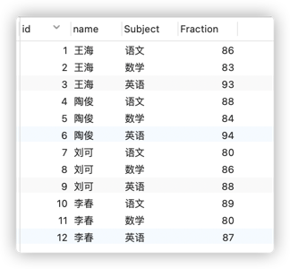
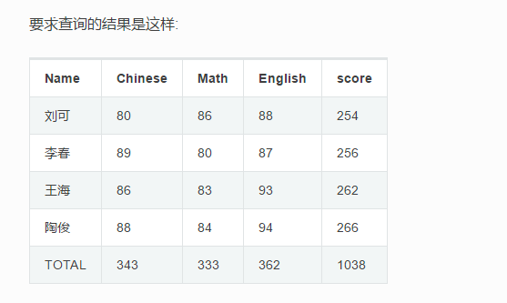

数据表：


行转列结果为：

数据库表语句：
```sql
create table t_score(
    id int primary key auto_increment,
    name varchar(20) not null,  #名字
    Subject varchar(10) not null, #科目
    Fraction double default 0  #分数
);

INSERT INTO `t_score`(name,Subject,Fraction) VALUES
     ('王海', '语文', 86),
     ('王海', '数学', 83),
     ('王海', '英语', 93),
     ('陶俊', '语文', 88),
     ('陶俊', '数学', 84),
     ('陶俊', '英语', 94),
     ('刘可', '语文', 80),
     ('刘可', '数学', 86),
     ('刘可', '英语', 88),
     ('李春', '语文', 89),
     ('李春', '数学', 80),
     ('李春', '英语', 87);
```

1. 方法一：使用if
    ```sql
    select 
        name as 名字 ,
        sum(if(Subject='语文',Fraction,0)) as 语文,
        sum(if(Subject='数学',Fraction,0))as 数学, 
        sum(if(Subject='英语',Fraction,0))as 英语,
        round(AVG(Fraction),2) as 平均分,
        SUM(Fraction) as 总分
    from t_score group by name
    -- 如果不用求总分的话，不需要下面的union
    union(
        select name as 名字 , sum(语文) Chinese,sum(数学) Math,sum(英语) English,round(AVG(总分),2)as 平均分,sum(总分) score  from(
            select 'TOTAL' as name,
            sum(if(Subject='语文',Fraction,0)) as 语文,
            sum(if(Subject='数学',Fraction,0))as 数学, 
            sum(if(Subject='英语',Fraction,0))as 英语,
            SUM(Fraction) as 总分
            from t_score group by Subject 
        )t GROUP BY t.`name`
    )
    ```
2. 方法二：使用case
    ```sql
        select name as name,
        sum(case when Subject = '语文' then Fraction end) as Chinese,
        sum(case when Subject = '数学' then Fraction end) as Math,
        sum(case when Subject = '英语' then Fraction end) as English,
        sum(fraction)as score
        from t_score group by name
        -- 如果不用求总分的话，不需要下面的union
        UNION ALL
        (
            select name as Name,sum(Chinese) as Chinese,sum(Math) as Math,sum(English) as English,sum(score) as score from(
            select 'TOTAL' as name,
            sum(case when Subject = '语文' then Fraction end) as Chinese,
            sum(case when Subject = '数学' then Fraction end) as Math,
            sum(case when Subject = '英语' then Fraction end) as English,
            sum(fraction)as score
            from t_score group by Subject,name)t GROUP BY t.`name`
        )
    ```
3. 方法三：使用with rollup
   在group分组字段的基础上在进行统计数据；
    ```sql
    select
        -- coalesce(name,'TOTAL') name,
        ifnull(name,'TOTAL') name,
        sum(if(Subject='语文',Fraction,0)) as 语文,
        sum(if(Subject='英语',Fraction,0)) as 英语,
        sum(if(Subject='数学',Fraction,0))as 数学,
        sum(Fraction) 总分
    from t_score group by name with rollup
    ```
    
   

