## 1. 系统安装
1. 安装
    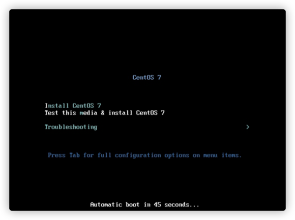
   
2. 选择语言
    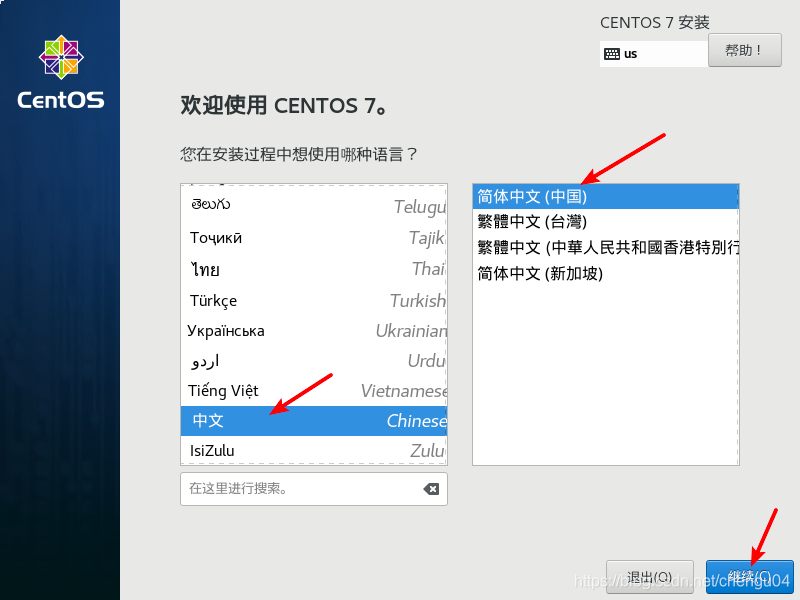

3. 设置时区以及软件安装
    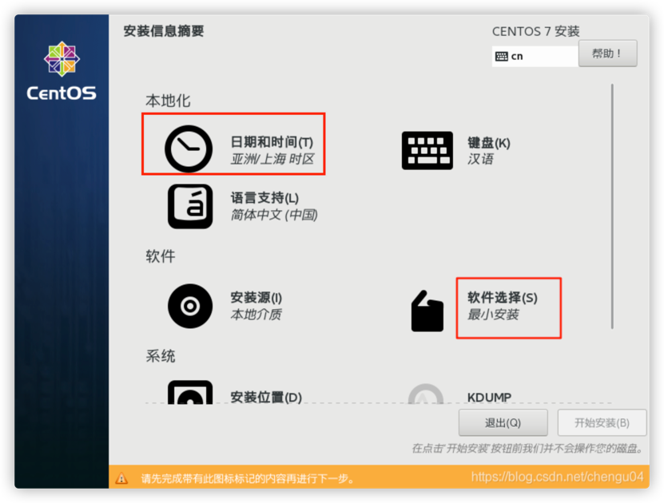
   
4. 选择GNOME桌面，开发工具。然后点击左上角的完成
   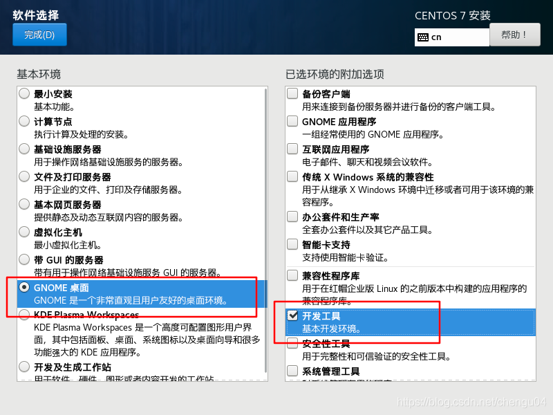

5. 配置分区，选址本地标准磁盘，并且在分区中勾选"我要配置分区","我想让额外空间可用"；初学者可以使用自动配置分区
   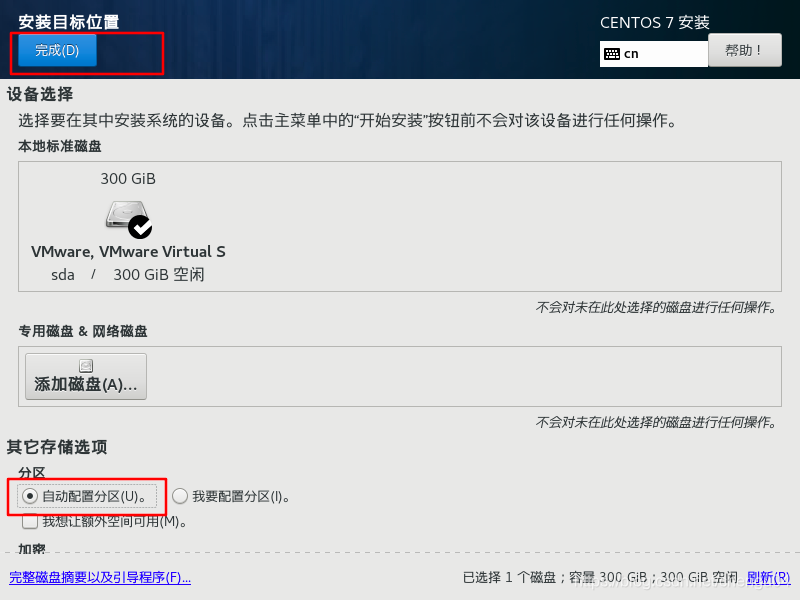
   
6. 开始安装
   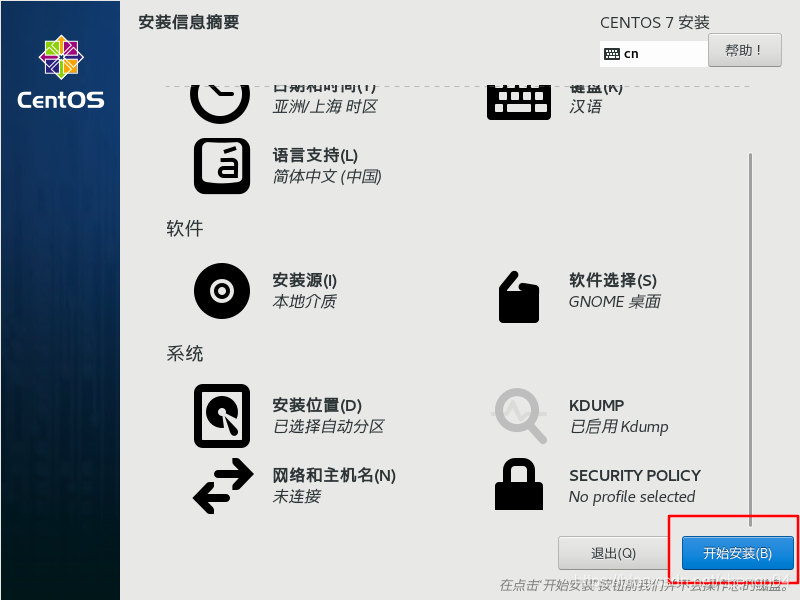

7. 设置Root账户
   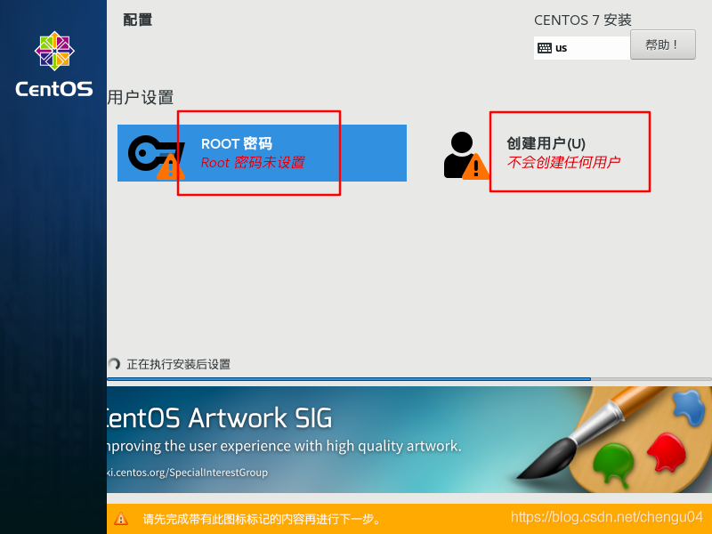 
   
8. 等待安装成功,安装成功后会提示重启；
   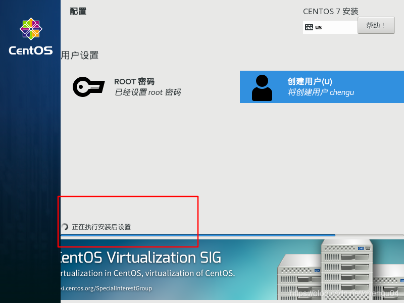 
   

## 2. 永久关闭防火墙

```shell
一、下面是red hat/CentOs7关闭防火墙的命令!
#1:查看防火状态
systemctl status firewalld
service iptables status

#2:暂时关闭防火墙
systemctl stop firewalld
service iptables stop

#3:永久关闭防火墙
systemctl disable firewalld
chkconfig iptables off

#4:重启防火墙

systemctl enable firewalld
service iptables restart
```
## 3. 配置SELinux
SELinux是Linux 内核中提供的强制访问控制系统。selinux有disabled、permissive、enforcing 三种选择：
- disabled ：不启用控制系统。
- permissive：开启控制系统，但是处于警告模式。即使你违反了策略的话它让你继续操作，但是把你的违反的内容记录下来。
- Enforcing：开启控制系统，处于强制状态。一旦违反了策略，就无法继续操作下去

使用命令：
```shell
cd /etc/sysconfig/
vim selinux
```
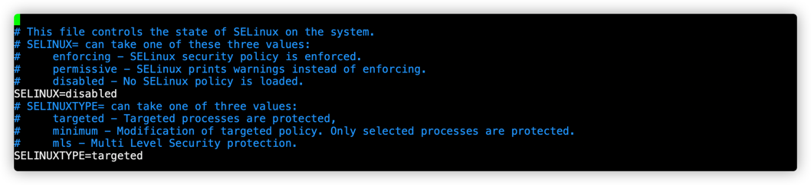 

## 4.修改ip配置文件
1. 进入文件目录
    ```shell
    cd /etc/sysconfig/network-scripts/   #进入配置文件
    ```
    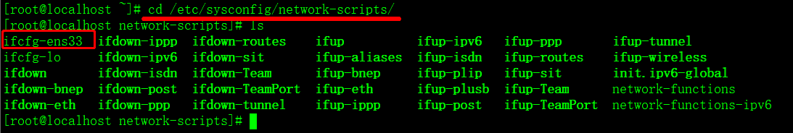 

2. 写入配置信息并保存退出
    ```shell
    vim ifcfg-ens33 #编辑配置文件ifcfg-ens33
    ```
    如果要设置固定IP的话，常见设置属性有：BOOTPROTO、ONBOOT、IPADDR、NETMASK、GATEWAY
    ```yaml
    #以下为配置文件的内容
    TYPE="Ethernet"		#网卡类型（通常是Ethemet以太网）
    PROXY_METHOD="none"	#代理方式：为关闭状态
    BROWSER_ONLY="no"	#只是浏览器：否
    BOOTPROTO="static"	#网卡的引导协议【static：静态IP(指定静态后IP地址就固定了,不建议采用动态分配)  dhcp：动态IP   none：不指定，不指定容易出现各种各样的网络受限】
    DEFROUTE="yes"		#默认路由
    IPV4_FAILURE_FATAL="no"		#是否开启IPV4致命错误检测
    IPV6INIT="yes"		#IPV6是否自动初始化：是（现在还未用到IPV6，不会有任何影响）
    IPV6_AUTOCONF="yes"	#IPV6是否自动配置：是（现在还未用到IPV6，不会有任何影响）
    IPV6_DEFROUTE="yes"	#IPV6是否可以为默认路由：是（现在还未用到IPV6，不会有任何影响）
    IPV6_FAILURE_FATAL="no"		#是否开启IPV6致命错误检测
    IPV6_ADDR_GEN_MODE="stable-privacy"	#IPV6地址生成模型
    NAME="ens33"		#网卡物理设备名称
    UUID="ab60d501-535b-49f5-a76b-3336a4120f64" #通用唯一识别码，每一个网卡都会有，不能重复，否则两台linux机器只有一台可上网,可不写
    DEVICE="ens33"		#网卡设备名称，必须和‘NAME’值一样
    ONBOOT="yes"		#是否开机启动(如果yes则开机后自动加载使用当前配置文件)，要想网卡开机就启动或通过 `systemctl restart network`控制网卡,必须设置为 `yes`
    IPADDR=192.168.1.111		# 本机IP 设置固定IP 对应上面的BOOTPROTO
    NETMASK=255.255.255.0		#子网掩码 ,可不写
    GATEWAY=192.168.137.2		#默认网关 ,可不写
    DNS1=8.8.8.8 # 可不写
    DNS2=8.8.8.5 # 可不写
    ZONE=public # 可不写
    ```

3. 重启网络服务
    ```shell
    service network restart  #重启网卡
    ```
     

4. 查看IP
    ```shell
    ip addr
    ```
    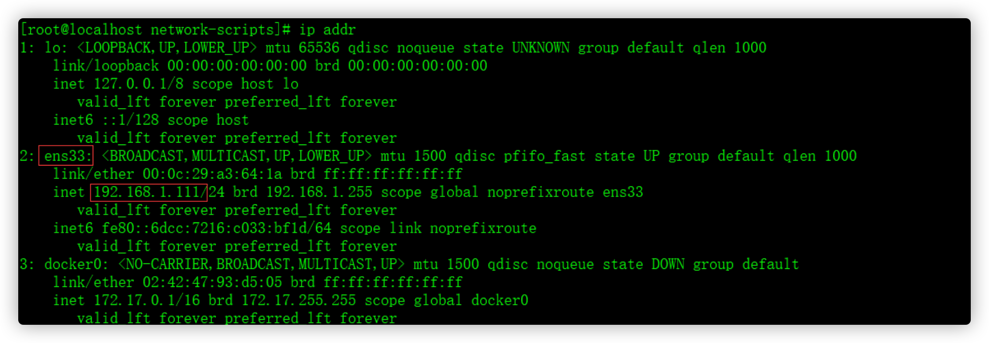 

5. 重启系统
    ```shell
    reboot
    ```


   

   


