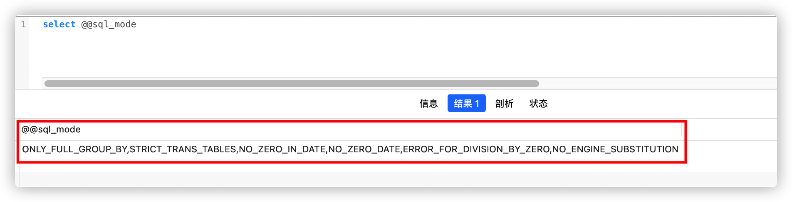

### 1. 使用命令查询当前sql_mode
```sql
select @@sql_mode
-- 或者
select @@GLOBAL.sql_mode
```


##### sql_mode常用值：
- ONLY_FULL_GROUP_BY
  对于GROUP BY聚合操作，如果在SELECT中的列，没有在GROUP BY中出现，那么这个SQL是不合法的，因为列不在GROUP BY从句中
  
- NO_AUTO_VALUE_ON_ZERO
  该值影响自增长列的插入。默认设置下，插入0或NULL代表生成下一个自增长值。如果用户希望插入的值为0，而该列又是自增长的，那么这个选项就有用了。

- STRICT_TRANS_TABLES 
  在该模式下，如果一个值不能插入到一个事务中，则中断当前的操作，对非事务表不做限制

- NO_ZERO_IN_DATE 
  在严格模式下，不允许日期和月份为零

- NO_ZERO_DATE 
  设置该值，mysql数据库不允许插入零日期，插入零日期会抛出错误而不是警告

- ERROR_FOR_DIVISION_BY_ZERO 
  在insert或update过程中，如果数据被零除，则产生错误而非警告。如果未给出该模式，那么数据被零除时Mysql返回NULL

- NO_AUTO_CREATE_USER 
  禁止GRANT创建密码为空的用户

- NO_ENGINE_SUBSTITUTION 
  如果需要的存储引擎被禁用或未编译，那么抛出错误。不设置此值时，用默认的存储引擎替代，并抛出一个异常

- PIPES_AS_CONCAT 
  将"||"视为字符串的连接操作符而非或运算符，这和Oracle数据库是一样是，也和字符串的拼接函数Concat想类似

- ANSI_QUOTES 
  启用ANSI_QUOTES后，不能用双引号来引用字符串，因为它被解释为识别符
  
### 2. 临时设置（新session仍然使用之前的sql_mode）
```sql
set sql_mode=‘ONLY_FULL_GROUP_BY,STRICT_TRANS_TABLES’;
```

### 3. 全局设置（新session仍然使用修改后的sql_mode）
```sql
set @@global.sql_mode='ONLY_FULL_GROUP_BY,STRICT_TRANS_TABLES,NO_ZERO_IN_DATE‘；
```