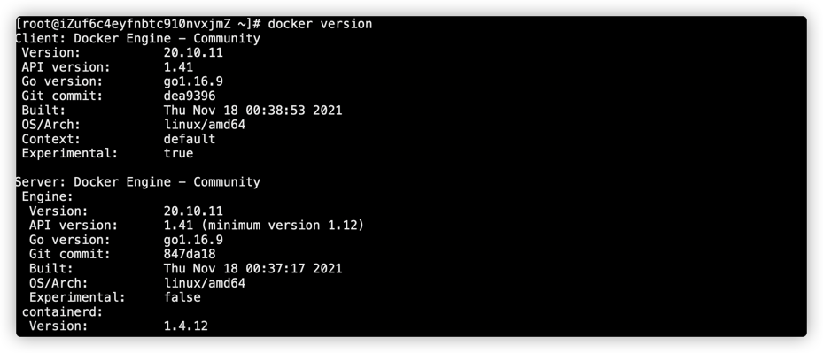

新的服务器没有安装docker，使用docker命令时提示：docker: command not found错误信息
##### 1. 更新yum包
```shell
yum update
```

##### 2.安装依赖软件包
```shell
yum install -y yum-utils device-mapper-persistent-data lvm2
```

##### 3.设置yum源
```shell
yum-config-manager --add-repo https://download.docker.com/linux/centos/docker-ce.repo
```
#####  4.安装docker
```shell
#默认安装最新的docker稳定版本。
yum install docker-ce
```
##### 5.启动docker服务
```shell
systemctl start docker
```
##### 6.设置开机自启动
```shell
systemctl enable docker
```
##### 7. 查看docker版本信息
```shell
docker version
```

至此，解决。
