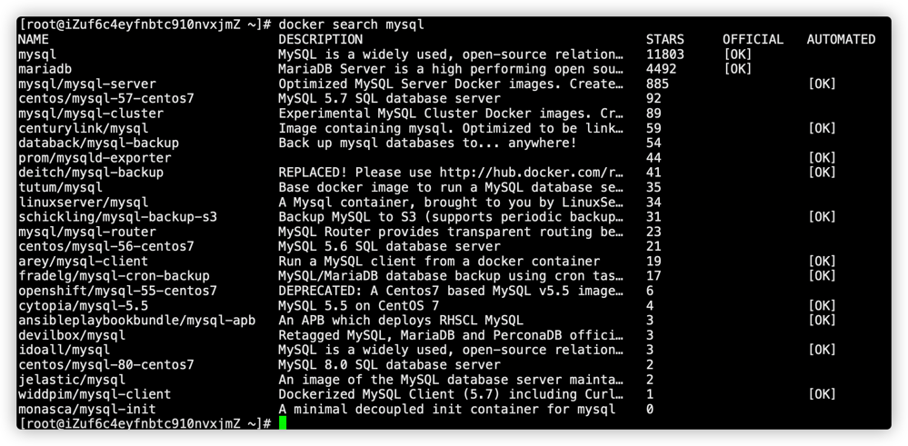
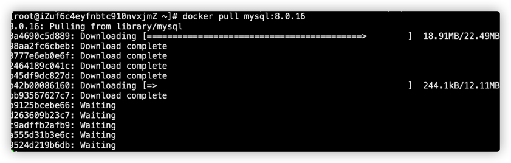
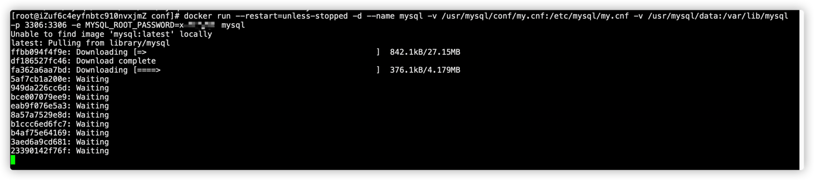
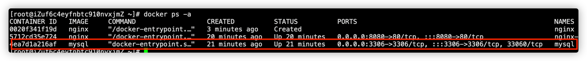
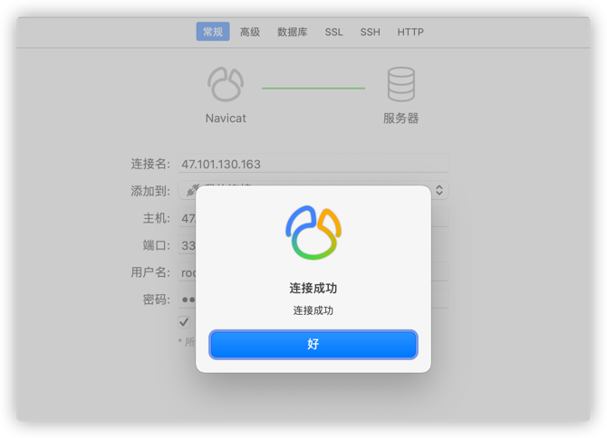

##### 1.查看所有的镜像
```shell
docker search mysql
```

##### 2.拉取最新版本的镜像
```shell
docker pull mysql

#或者指定版本
docker pull mysql:8.0.16
```


##### 3.创建数据目录和配置文件
```shell
mkdir -p /usr/mysql/conf /usr/mysql/data

chmod -R 777 /usr/mysql/
```
##### 4.创建配置文件
在上面创建的配置文件目录/usr/mysql/conf下创建MySQL的配置文件my.cnf
```shell
touch my.cnf;

vim /usr/mysql/conf/my.cnf;
```
添加以下内容到上述创建的配置文件中
```properties
[client]
#socket = /usr/mysql/mysqld.sock
default-character-set = utf8mb4
[mysqld]
#pid-file        = /var/run/mysqld/mysqld.pid
#socket          = /var/run/mysqld/mysqld.sock
#datadir         = /var/lib/mysql
#socket = /usr/mysql/mysqld.sock
#pid-file = /usr/mysql/mysqld.pid
datadir = /usr/mysql/data
character_set_server = utf8mb4
collation_server = utf8mb4_bin
secure-file-priv= NULL

# Disabling symbolic-links is recommended to prevent assorted security risks
symbolic-links=0
# Custom config should go here
!includedir /etc/mysql/conf.d/
```
##### 5.启动创建容器
```shell
docker run --restart=unless-stopped -d --name mysql -v /usr/mysql/conf/my.cnf:/etc/mysql/my.cnf -v /usr/mysql/data:/var/lib/mysql -p 3306:3306 -e MYSQL_ROOT_PASSWORD=xiaoyuge mysql
```
参数解释：
```text
–name mysql5.7 容器别名
-p 3307:3306 映射容器端口号和宿主机端口号（本机3307端口映射容器3306端口）
-v /data/mysql/datadir:/var/lib/mysql 目录映射（挂载宿主机目录和 docker容器中的目录，前面是宿主机目录，后面是容器内部目录）
-v /data/mysql/conf.d:/etc/mysql/conf.d 目录映射（mysql配置目录）
-d 后台运行
-e 环境参数，MYSQL_ROOT_PASSWORD设置root用户的密码
```

执行上述命令后，执行查询容器的命令就可以看到创建的mysql容器
```shell
docker ps -a
```


##### 常见问题
上述虽然安装好了mysql，但是使用远程的Navicat连接时提示错误，不能正确连接mysql，此时需要修改按照下面说的步骤修改一下mysql的密码模式以及主机等内容才可以。
修改mysql密码以及可访问主机
1. 进入容器内部
    ```shell
    docker exec -it mysql /bin/bash
    ```
2. 连接mysql
    ```shell
    mysql -uroot -p
    ```
3. 使用mysql库
    ```shell
    use mysql;
    ```
4. 修改访问主机以及密码等，设置为所有主机可访问
    ```shell
    ALTER USER 'root'@'%' IDENTIFIED WITH mysql_native_password BY '新密码';
    
    #注意： mysql_native_password，mysql8.x版本必须使用这种模式，否则navicate无法正确连接
    ```
5. 刷新
    ```shell
    flush privileges;
    
    exit;
    ```
6. 远程使用Navicat连接数据库
