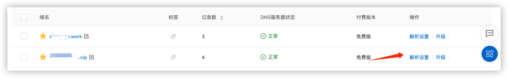
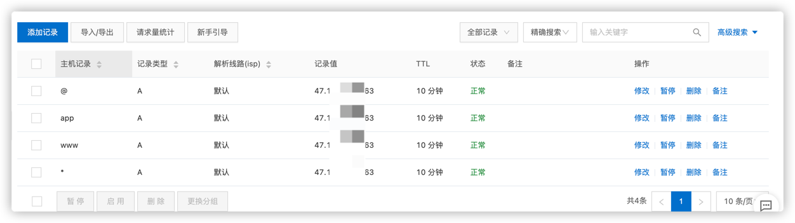

##### 1.查看所有的镜像
```shell
docker search nginx
```

##### 2.拉取最新版本的镜像
```shell
docker pull nginx

#或者指定最新版本
docker pull nginx:latest
```


##### 3.使用命令查看本地镜像，确定nginx镜像已下载到本地
```shell
docker images
```

##### 4. 创建挂载目录
```shell
mkdir -p /data/nginx/{conf,conf.d,html,logs}
```
##### 5. 创建配置文件
```shell
touch nginx.cnf
```
##### 6. Nginx详情配置请参考：https://xiaoyuge.work/2021/12/05/nginx-02/

##### 7. 查看容器
```shell
docker ps -a

# docker stop xxx  停止某个容器运行
# docker rm xxx  删除容器
```

##### 8.启动容器，挂载配置文件
```shell
docker run --name mynginx -d -p 80:80 -v /data/nginx/conf/nginx.conf:/etc/nginx/nginx.conf -v /data/nginx/logs:/var/log/nginx -d docker.io/nginx
```
可以通过命令docker exec -it nginx-test bash进入容器内容修改配置


##### 9.安装完毕，访问地址 http://localhost:8080，出现如下内容，安装成功！！！


##### 10.域名解析配置
我买的是阿里云的服务器以及域名，上面操作后，忘记在阿里云控制台中去配置



##### 11.配置多个二级域名
在第8步的时候将docker容器中的nginx配置映射到了目录/data/nginx/conf下面；
修改nginx.conf
```text

user  nginx;
worker_processes  1;

error_log  /var/log/nginx/error.log warn;
pid        /var/run/nginx.pid;
events {
    worker_connections  1024;
}
http {
    include       /etc/nginx/mime.types;
    default_type  application/octet-stream;
    log_format  main  '$remote_addr - $remote_user [$time_local] "$request" '
                      '$status $body_bytes_sent "$http_referer" '
                      '"$http_user_agent" "$http_x_forwarded_for"';
    access_log  /var/log/nginx/access.log  main;
    sendfile        on;
    #tcp_nopush     on;
    keepalive_timeout  65;
    #gzip  on;
    
    #引入conf.d下面所有的配置文件
    include /etc/nginx/conf.d/*.conf;
}
```
然后在conf.d目录下面创建了两个子域名反向代理配置文件,其他的域名代理相同，只要改server_name和proxy_pass代理端口，配置文件需以.conf结尾

- note.xiaoyuge520.vip.conf
  ```text
        ########   Nginx的main(全局配置)文件
        #指定nginx运行的用户及用户组,默认为nobody
        #user  nobody;
        #开启的线程数，一般跟逻辑CPU核数一致
        worker_processes  1;
        events {
        #设置工作模式为epoll,除此之外还有select,poll,kqueue,rtsig和/dev/poll模式
        #use epoll;
            #定义每个进程的最大连接数,受系统进程的最大打开文件数量限制。
            worker_connections  1024;
        }
        #######Nginx的Http服务器配置,Gzip配置
        http {
            include       mime.types;
            #核心模块指令，智力默认设置为二进制流，也就是当文件类型未定义时使用这种方式
            default_type  application/octet-stream;
            #开启高效文件传输模式
            sendfile        on;
            keepalive_timeout  65;
            ########Nginx的server虚拟主机配置
            server {
                #监听端口为 80
                listen       80;
                #设置主机域名
                server_name  note.xiaoyuge520.vip;
                #设置访问的语言编码
                #charset koi8-r;
                #设置虚拟主机访问日志的存放路径及日志的格式为main
                #access_log  logs/host.access.log  main;
        
                #设置虚拟主机的基本信息
                location / {
                    proxy_set_header  Host  $http_host;
                    proxy_set_header  X-Real-IP  $remote_addr;
                    proxy_set_header  X-Forwarded-For $proxy_add_x_forwarded_for;
                    proxy_pass http://47.101.130.163:8086/note; # 代理ip:端口
                }
                error_page   500 502 503 504  /50x.html;
                location = /50x.html {
                    root   html;
                }
            }
        }
    ```
  
- record.xiaoyuge520.vip.conf
    ```text
        worker_processes  1;
        events {
            worker_connections  1024;
        }
        #######Nginx的Http服务器配置,Gzip配置
        http {
            include       mime.types;
            default_type  application/octet-stream;
            sendfile        on;
            keepalive_timeout  65;
            server {
                listen       80;
                server_name  record.xiaoyuge520.vip;
                #access_log  logs/host.access.log  main;
                location / {
                    proxy_set_header  Host  $http_host;
                    proxy_set_header  X-Real-IP  $remote_addr;
                    proxy_set_header  X-Forwarded-For $proxy_add_x_forwarded_for;
                    proxy_pass http://47.101.130.163:8888/record; # 代理ip:端口
                }
                error_page   500 502 503 504  /50x.html;
                location = /50x.html {
                    root   html;
                }
            }
        }
    ```
  
**如果挂载之后容器运行正常却依然不能通过域名访问可尝试以下操作**
  ```shell
  #查看所有容器,获取nginx的container 名称
  docker ps -a
  
  #向名称为nginx的容器发送脚本命令, mynginx 为容器名称
  docker exec -it mynginx /bin/bash
  
  #重新加载配置命令
  cd /etc/nginx/conf.d
  service nginx reload
  #检查配置文件路径是否正确
  ```
  
**每一次更改配置文件都需要重启容器**
  ```shell
    # 重启nginx容器
    docker restart nginx 
  
    #查看容器状态
    docker ps
  
    #如果挂载失败，查看nginx容器log,显示错误信息，根据错误信息 更改配置文件等
    docker logs -t nginx
  ```
---

以上配置完成之后能够通过域名访问网站，但是css样式却被nginx解析成text/plain，打开控制台可看到warn信息

**解决nginx将css文件解析为text/plain**
- 方法一： ngin.conf中http添加：
  ```text
    include       /etc/nginx/mime.types;
    default_type  application/octet-stream;
  ```
  注：此办法并不能使我网站的css正确解析，因为在拷贝nginx镜像中的原配置文件时，就已经添加mime.types了。却依然不能正确解析。

- 方法二：解析成功，原因未知
  ```html
  将index.html中<!DOCTYPE html>去掉。
  ```
通过域名访问：成功！！
