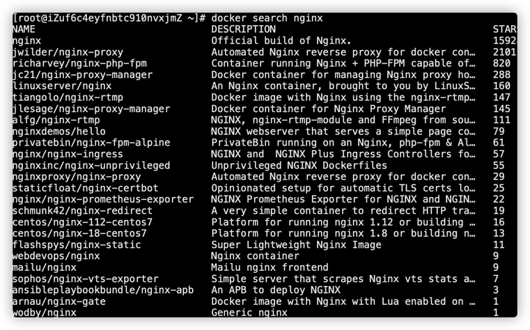
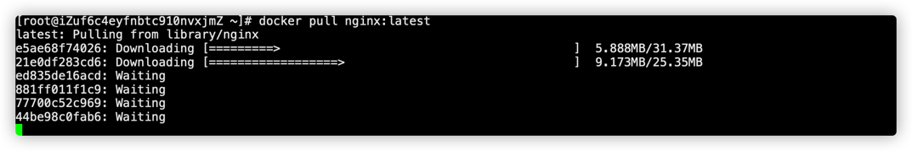
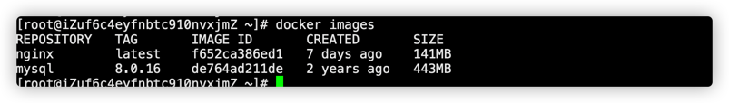
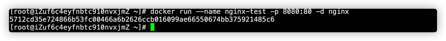
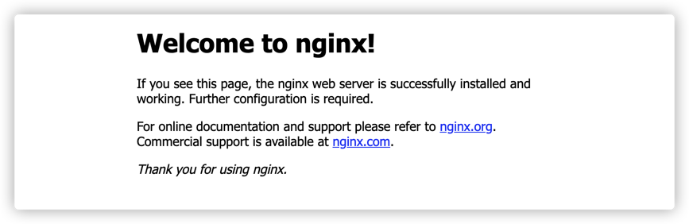
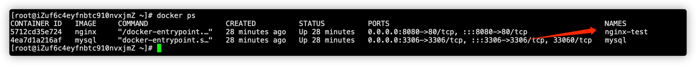

##### 1.查看所有的镜像
```shell
docker search nginx
```

##### 2.拉取最新版本的镜像
```shell
docker pull nginx

#或者指定最新版本
docker pull nginx:latest
```


##### 3.使用命令查看本地镜像，确定nginx镜像已下载到本地
```shell
docker images
```


##### 4.运行nginx容器，启动nginx服务
```shell
docker run --name nginx-test -p 8080:80 -d nginx
```

##### 5.安装完毕，访问地址 http://localhost:8080，出现如下内容，安装成功！！！


##### 6. 创建挂载目录
```shell
mkdir -p /data/nginx/{conf,conf.d,html,logs}
```
##### 7. 创建配置文件
```shell
touch nginx.cnf
```
##### 8. Nginx详情配置请参考：https://xiaoyuge.work/2021/12/05/nginx-02/

##### 9.启动容器，挂载配置文件
```shell
docker run --name nginx-test -d -p 8080:80 -v /data/nginx/conf/nginx.conf:/etc/nginx/nginx.conf -v /data/nginx/logs:/var/log/nginx -d docker.io/nginx
```
可以通过命令docker exec -it nginx-test bash进入容器内容修改配置
##### 10. 查看容器
```shell
docker ps
```
