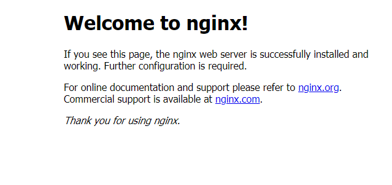

## 1.Nginx安装

1. 安装nginx前首先要确认系统中是否安装了gcc 、pcre-devel、zlib-devel、openssl-devel

    ```shell
    #1、rpm包安装的，可以用 rpm -qa 看到，如果要查找某软件包是否安装，用 rpm -qa | grep "软件或者包的名字"
    #2、以deb包安装的，可以用 dpkg -l 看到。如果是查找指定软件包，用 dpkg -l | grep "软件或者包的名字"
    #3、yum方法安装的，可以用 yum list installed 查找，如果是查找指定包，用 yum list installed | grep "软件名或者包名"
    yum list installed | grep "gcc"
    ```
   
2. 安装依赖包

    ```shell
    yum -y install gcc pcre-devel zlib-devel openssl openssl-devel
    ```

3. 下载并解压安装包

    ```shell
    //创建nginx存放文件夹
    cd /usr/local
    mkdir nginx
    cd nginx
    #下载tar包
    wget http://nginx.org/download/nginx-1.13.7.tar.gz
    tar -xvf nginx-1.13.7.tar.gz
    ```

4. 配置

    ```shell
    cd nginx-1.13.7
    ./configure --prefix=/usr/local/nginx
    
    make
    make install
    ```

5. 测试是否安装成功

    ```shell
    ./sbin/nginx -t
    ```

    

6. 配置nginx.conf

    ```yml
    vim /usr/local/nginx/cong/nginx.conf
    
    #修改如下
    server {
      listen 80;
      server_name localhost;
    
      # 注意设定 root路径是有dist的
      location / {
        root /usr/local/webapp/dist;
        index /index.html;
      }
    
      #跨域 ip和port自行替换
      location /adminApi {
        proxy_pass http://ip:port;
      }
    
    }
    
    ```

7. 启动
   ```shell
       #启动nginx
       cd /usr/local/nginx/sbin
       ./nginx-02 
     ```

   **常用命令：**
   
   ```shell
       #修改配置后重新启动
       ./nginx-02 -s reload
       #如果出现：nginx: [error] open() ＂/usr/local/nginx/logs/nginx.pid＂ failed
       /usr/local/nginx/sbin/nginx -c /usr/local/nginx/conf/nginx.conf
       #再次启动即可
       
       #查看nginx进程是否启动
       ps -ef|grep nginx
       
       #平滑启动nginx
       kill -HUP
       #主进程号或进程号文件路径 或者使用
       
       /usr/nginx/sbin/nginx -s reload
       
       #注意，修改了配置文件后最好先检查一下修改过的配置文件是否正 确，以免重启后Nginx出现错误影响服务器稳定运行。
       #判断Nginx配置是否正确命令如下：
       nginx -t -c /usr/nginx/conf/nginx.conf
       #或者使用
       /usr/nginx/sbin/nginx -t
       
       #重启
       nginx reload
       /usr/local/nginx/sbin/nginx -s reload 
       service nginx restart
       
       #启动
       ./nginx-02
       #关闭
       ./nginx-02 -s stop
       
       
       #配置nginx开机自启动
       vim /etc/rc.d/rc.local
       
       #再文件中添加nginx启动地址
        
       touch /var/lock/subsys/local
       /usr/local/redis/bin/redis-server /usr/local/redis/etc/redis.conf
       
       #设置开机自启动nginx
       /usr/local/nginx/sb/nginx
    ```


启动后访问localhost 效果如下：


## 2.Nginx配置
```shell
...... 全局块

events {
	//events 块
}

###数据库配置
stream {
    server {
       listen 3306;
       proxy_pass db;    
    }
    upstream db {
       server 192.168.18.130:3305;
       server 192.168.18.129:3305;
    }
 
}

http{
    ##http全局块
	server+{
		location +[]
	}
}
```
### 2.1配置内容规则
官网配置教程：https://nginx.org/en/docs/dirindex.html
变量应用：https://nginx.org/en/docs/varindex.html
- 用#表示注释
- 每行配置的结尾需要加上分号
- 如果配置项值中包括语法符号，比如空格符，那么需要使用单引号或者双引号行括住配置项值，否则ngin x会报语法错误
- 单位简写：
   - K或者k千字节（kilo byte, KB）
   - M或者m兆字节（megabyte MB）
   - ms(毫秒)，s(秒)， m(分)， h(小时) ， d (天)， w（周）， M（月，包含30天），y（年）
    
### 2.2 详细配置内容
```text
########   Nginx的main(全局配置)文件
#指定nginx运行的用户及用户组,默认为nobody
#user  nobody;

#开启的线程数，一般跟逻辑CPU核数一致
worker_processes  1;

#定位全局错误日志文件，级别以notice显示，还有debug,info,warn,error,crit模式，debug输出最多，crir输出最少，根据实际环境而定
#error_log  logs/error.log;
#error_log  logs/error.log  notice;
#error_log  logs/error.log  info;

#指定进程id的存储文件位置
#pid        logs/nginx.pid;

#指定一个nginx进程打开的最多文件描述符数目，受系统进程的最大打开文件数量限制
#worker_rlimit_nofile 65535

events {
    #设置工作模式为epoll,除此之外还有select,poll,kqueue,rtsig和/dev/poll模式
    #use epoll;

    #定义每个进程的最大连接数,受系统进程的最大打开文件数量限制。
    worker_connections  1024;
}
###数据库的负载均衡
stream {
  upstream mysql_nginx {
      hash $remote_addr consistent;
      server 192.168.18.128:3306 weight=5 max_fails=3 fail_timeout=30s;
      server 192.168.18.129:3306;
      server 192.168.18.130:3306;
      ##last_conn; #最小连接
  }
  server {
      listen 3306; # 数据库服务器监听端口
      proxy_connect_timeout 10s;
      proxy_timeout 300s; # 设置客户端和代理服务之间的超时时间，如果5分钟内没操作将自动断开。
      proxy_pass mysql_nginx;
  }
}
#######Nginx的Http服务器配置,Gzip配置
http {
    #主模块指令，实现对配置文件所包含的文件的设定，可以减少主配置文件的复杂度，DNS主配置文件中的zonerfc1912,acl基本上都是用include语句。
    include       mime.types;

    #核心模块指令，智力默认设置为二进制流，也就是当文件类型未定义时使用这种方式
    default_type  application/octet-stream;

    #下面代码为日志格式的设定，main为日志格式的名称，可自行设置，后面引用
    #log_format  main  '$remote_addr - $remote_user [$time_local] "$request" '
    #                  '$status $body_bytes_sent "$http_referer" '
    #                  '"$http_user_agent" "$http_x_forwarded_for"';

    #引用日志main， main是log-format的格式，在上面配置了；后面可以加上日志缓冲区大小，写满了就flush到磁盘中buffer = 1M;
    #access_log  logs/access.log  main;

    #设置允许客户端请求的最大的单个文件字节数
    #client_max_body_size 20M;
    #指定来自客户端请求头的headebuffer大小
    #client_header_buffer_size  32k;
    #指定连接请求试图写入缓存文件的目录路径
    #client_body_temp_path /dev/shm/client_body_temp;
    #指定客户端请求中较大的消息头的缓存最大数量和大小，目前设置为4个32KB
    #large client_header_buffers 4 32k;

    #开启高效文件传输模式
    sendfile        on;
    #开启防止网络阻塞
    #tcp_nopush     on;
    #开启防止网络阻塞
    #tcp_nodelay    on;

    #设置客户端连接保存活动的超时时间
    #keepalive_timeout  0;
    keepalive_timeout  65;

    #设置客户端请求读取超时时间
    #client_header_timeout 10;
    #设置客户端请求主体读取超时时间
    #client_body_timeout 10;
    #用于设置相应客户端的超时时间
    #send_timeout

    ####HttpGZip模块配置
    #httpGzip modules
    #开启gzip压缩
    #gzip  on;
    #设置允许压缩的页面最小字节数
    #gzip_min_length 1k;
    #申请4个单位为16K的内存作为压缩结果流缓存
    #gzip_buffers 4 16k;
    #设置识别http协议的版本，默认为1.1
    #gzip_http_version 1.1;
    #指定gzip压缩比，1-9数字越小，压缩比越小，速度越快
    #gzip_comp_level 2;
    #指定压缩的类型
    #gzip_types text/plain application/x-javascript text/css application/xml;
    #让前端的缓存服务器进过gzip压缩的页面
    #gzip_vary on;

    #########Nginx的server虚拟主机配置
    server {
        #监听端口为 80
        listen       80;

        #设置主机域名
        server_name  localhost;

        #设置访问的语言编码
        #charset koi8-r;

        #设置虚拟主机访问日志的存放路径及日志的格式为main
        #access_log  logs/host.access.log  main;

        #设置虚拟主机的基本信息
        location / {
            #设置虚拟主机的网站根目录
            root   html;

            #设置虚拟主机默认访问的网页
            index  index.html index.htm;
        }

        #error_page  404              /404.html;

        # redirect server error pages to the static page /50x.html
        #
        error_page   500 502 503 504  /50x.html;
        location = /50x.html {
            root   html;
        }

        # proxy the PHP scripts to Apache listening on 127.0.0.1:80
        #
        #location ~ \.php$ {
        #    proxy_pass   http://127.0.0.1;
        #}

        # pass the PHP scripts to FastCGI server listening on 127.0.0.1:9000
        #
        #location ~ \.php$ {
        #    root           html;
        #    fastcgi_pass   127.0.0.1:9000;
        #    fastcgi_index  index.php;
        #    fastcgi_param  SCRIPT_FILENAME  /scripts$fastcgi_script_name;
        #    include        fastcgi_params;
        #}

        # deny access to .htaccess files, if Apache's document root
        # concurs with nginx's one
        #
        #location ~ /\.ht {
        #    deny  all;
        #}
    }
}
```

### 2.3 日志
在nginx同级目录下logs文件夹
- access.log  正常日志
- error.log 错误日期

需要在nginx.conf中的http模块配置access_log