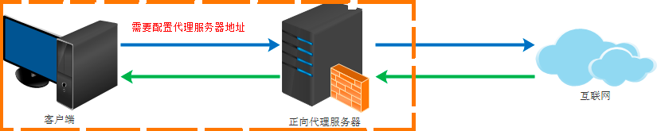
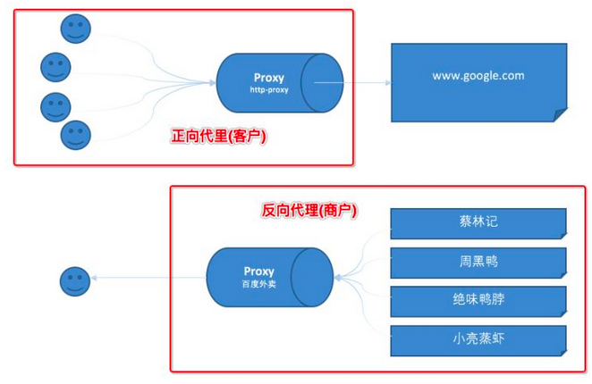
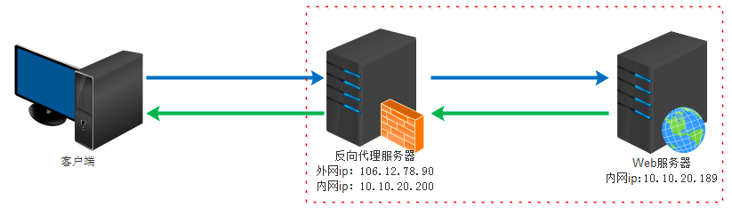

### 1. 正向代理和反向代理
1. 正向代理：
   正向代理类似一个跳板机，代理访问外部资源
比如我们国内访问谷歌，直接访问访问不到，我们可以通过一个正向代理服务器，请求发到代理服，代理服务器能够访问谷歌，这样由代理去谷歌取到返回数据，再返回给我们，这样我们就能访问谷歌了


    **正向代理的用途**：
    
    （1）访问原来无法访问的资源，如google
    
    （2） 可以做缓存，加速访问资源
    
    （3）对客户端访问授权，上网进行认证
    
    （4）代理可以记录用户访问记录（上网行为管理），对外隐藏用户信息
    
    **正向代理即是客户端代理, 代理客户端, 服务端不知道实际发起请求的客户端**
   
   
2. 反向代理：
   反向代理（Reverse Proxy）实际运行方式是指以代理服务器来接受internet上的连接请求，然后将请求转发给内部网络上的服务器，并将从服务器上得到的结果返回给internet上请求连接的客户端，此时代理服务器对外就表现为一个服务器
   
   
   **反向代理的作用**：
   
   （1）保证内网的安全，阻止web攻击，大型网站，通常将反向代理作为公网访问地址，Web服务器是内网
   
   （2）负载均衡，通过反向代理服务器来优化网站的负载

   **反向代理即是服务端代理, 代理服务端, 客户端不知道实际提供服务的服务端**


### 2. Nginx配置反向代理
在http-> server块中配置server_name
```shell
server {
    #监听端口为 80
    listen       80;
    #设置主机域名
    server_name  http://192.168.44.99;
    #设置虚拟主机的基本信息
    location / {
        proxy_pass http://192.168.44.1:9096;      ###最重要的配置，转发到目标地址， 也可以配置服务器组，然后upstream一个服务器组
        proxy_method POST;   #设置转发请求的格式
        #Nginx在header里面增加一个自定义字段 Host， 用于存放当前客户端IP地址
        proxy_set_header  Host $host;
        #获取客户端的真实IP地址设置到header中的字段名为X-Real-IP里面
        proxy_set_header X-Real-IP  $remote_addr;
        #获取所有转发请求的IP信息列表
        proxy_set_header  X-Forwarded-For  $proxy_add_x_forwarded_for;
    }
}
```
那么访问http://192.168.44.99 ， nginx会将请求转发给目标服务器http://192.168.44.1:9096

#### 2.1 location 匹配规则
匹配规则从上到下，匹配规则越宽松；

|   模式   |   含义   | 
| ---- | ---- |
|   location=/uri   |   = 表示精确匹配，只有完全匹配才能生效   |      
|   location ^~ /uri   |   ^~ 开头对URL路径进行前缀匹配，并且在正则之前   |      
|   location ~ pattern   |   开头表示区分大小写的正则匹配   |   
|   location ~* pattern   |   开头表示不区分大小写的正则匹配   |     
|   location /uri   |   不带任何修饰符，也表示前缀匹配，但是在正则匹配之后   |     
|   location /  |   通用匹配，任何未匹配到其他location的请求都会匹配到，相当于switch中的default   |     


