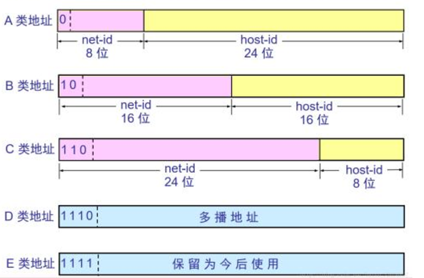

### 1.Nginx发展史
作者：logo Sysoev
- 2000年地洞，c语言编写
- 2004年开源
- 2011年成立商业公司
- 2013 发布商业版本Nginx plus
- 2019.5月F5 Networks收购nginx
- 2019.12被Rambler集团起诉


### 2.Nginx与其他web服务器对比

1. Nginx与Apache HTTP server project区别
   用来响应用户请求的web服务器
2. Nginx 和tomcat区别
   Nginx是HTTP Server，主要是用于访问一些静态资源，可以用做代理服务器
   Tomcat是Application Server应用服务器，用来存放和运行程序；
3. HTTP Server 和Application Server区别与联系

### 3. HTTP知识
#### 3.1 IP和端口
120.77.38.160:80

0为A类，10为B类，110为C类，1110为D类，1111为E类。D类地址供组播使用，E类地址保留。




端口是：0～65535
#### 3.2 域名
协议、子域名、顶级域名、域名类型、资源路径、参数
```text
#https 协议默认端口443 可以省略
https://www.baidu.com:443

#user：子域名， com为域名类型（cn中国， us美国...）； 3623252831 为资源路径
https://user.qzone.qq.com/3623252831

#？号后面为参数
https://baike.baidu.com/item/测试/232323?fr=asdfasdf
```
**域名(domainName)和IP的关系以及域名的组成**

域名：https://www.baidu.com:443/member/query?far=adsfad
   - http/ https: 协议
   - baidu: 顶级域名
   - Com： 域名类型
   - www: 子域名，可以有多级：user.qzone.qq.com/232323
   - far=asdfa: 参数
   - member/query: 资源路径
DNS(domain name server)将域名转化为ip+port
     

##### 3.3 HTTP协议的特点
- 简单快速
- 灵活
- 无连接（一次请求，连接关闭）
- 无状态（每次请求都和之前的请求无关）


##### 3.4 HTTP协议的请求格式
```text
Request URL: https://prtas.videocc.net/v2/view?pid=1638687363047X1327470&vid=8c8d9388d0b4c16f41ef557fba23dede_8&uid=8c8d9388d0&flow=0&ts=1638688553584&href=aHR0cHM6Ly9rZS5ndXBhb2VkdS5jbi9wbGF5LzI4OD9waGFzZUlkPTU&duration=1278&cts=789&sign=fcf19468eff088e983796d5826268f2d&sd=1190&pd=788&pn=HTML5&pv=v1.15.0&sid=ZDIzZGM4ODUtNDM2My00MTQ3LWJmYTktY2M3MDgwM2U0NDc5&param1=&param2=MTc2MjEyODQ5OTg&param3=&cataid=1591268435818
Request Method: GET
Status Code: 200 
Remote Address: 221.231.81.238:443
Referrer Policy: strict-origin-when-cross-origin
```
- 请求行
- 请求类型 Request Method
   1. GET: 请求指定的页面细腻，并返回尸体主题
   2. HEAD: 类似于GET请求，只不过返回的相应中没有具体的内容，用于获取报头
   3. POST：想指定资源提交数据进行处理请求，数据被高喊在请求体中
   4. PUT: 从客户端想服务器传送的数据取代指定的文档的内容
   5. DELETE: 请求服务器删除指定的页面
   6. CONNECT: HTTP/1.1协议中预留给能够将连接方式改为管道方式的代理服务器
   7. OPTIONS: 允许客户端查看服务器的性能
   8. TRACE: 回显服务器收到的请求，主要用于测试后诊断
- 请求头
- 空行和请求数据

##### 3.5 HTTP协议的返回格式
状态行、小洗头、空行和响应正文
```text
HTTP/1.1 200
Server: nginx/1.20.1
Date: Sun, 05 Dec 2021 07:24:45 GMT
Content-Type: application/json;charset=UTF-8
Transfer-Encoding: chunked
Connection: keep-alive
Access-Control-Allow-Origin: https://ke.gupaoedu.cn
Access-Control-Allow-Credentials: true
Access-Control-Allow-Methods: PUT,POST,GET,DELETE,OPTIONS,PATCH
Access-Control-Allow-Headers: DNT,web-token,app-token,Authorization,Accept,Origin,Keep-Alive,User-Agent,X-Mx-ReqToken,X-Data-Type,X-Auth-Token,X-Requested-With,If-Modified-Since,Cache-Control,Content-Type,Range,token,showerr
Access-Control-Max-Age: 86400
```

**Http格式响应状态码有哪些**

- 1xx: informational(信息性状态码) 接受的请求正在处理
- 2xx: success(成功状态码)  请求正常处理完毕
- 3xx：redirection（重定向状态码）需要进行复检操作以完成请求
- 4xx：client error（客户端错误状态码） 服务器无法处理请求
- 5xx: server error（服务器错误错误状态码） 服务器处理请求出错

##### 3.6 通用头字段Common Header
|   字段   |   含义   | 
| ---- | ---- |
|   Cache-control   |   控制缓存的行为   |      
|   Connection   |   控制不再转发给代理的收不字段、管理持久连接   |      
|   Date   |   创建报文的日期时间   |   
|   Pragma   |   报文指令   |     
|   Trailer   |   报文末端的首部一览   |     
|   Transfer-Encoding   |   指定报文主题的传输编码方式   |     
|   Upgrade   |   升级为其他协议   |     
|   Via    |   代理服务器的相关信息   |     
|   Warning   |   错误通知   |  

##### 3.7 响应头字段Response Header
|   字段   |   含义   | 
| ---- | ---- |
|   Accept-Ranges   |   是否接收字节范围请求   |      
|   Age   |   推算资源创建经过的时间   |      
|   ETag   |   资源的匹配信息   |   
|   Location   |   另客户端重定向至指定的URI   |      
|   Proxy-Authenticate   |   代理服务器对客户端的认证信息   |     
|   Retry-After   |   对再次发起请求的时机要求   |     
|   Vary  |   代理服务器缓存的管理信息   |     
|   WWW-Authenticate   |   服务器对客户端的认证信息   |  

##### 3.8 实体头字段 Entity Header
|   字段   |   含义   | 
| ---- | ---- |
|   Allow  |   资源科支持的http方法   |      
|   Connect-Encoding   |   实体主体适用的编码格式   |      
|   Content-Language   |   实体主体的自然语言   |   
|   Content-length   |   实体主体的大小   |      
|   Content-Location   |   替代敌营资源的URI   |     
|   Content-MD5   |   实体主体的报文摘要   |     
|   Content-Range  |   实体主体的位置范围   |     
|   Content-Type   |   实体主体的媒体类型   |
|   Expires  |   实体主体过期的日期时间   |     
|   Last-Modified   |   资源的最后修改日期时间   |  


