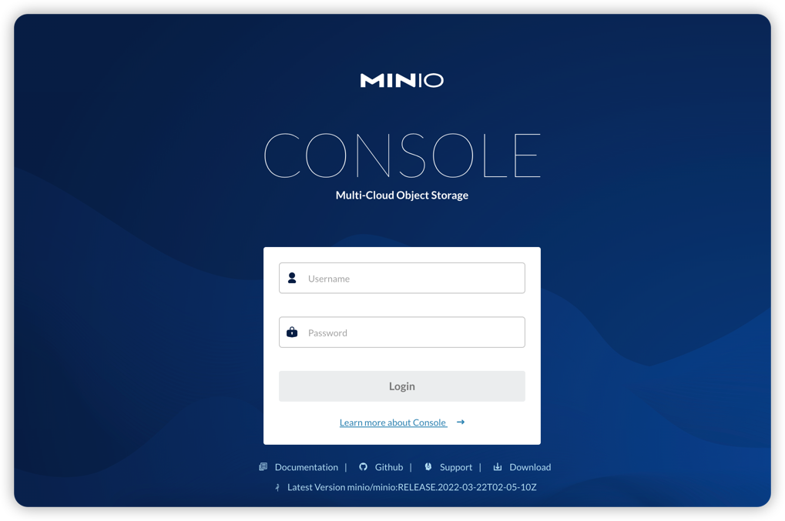
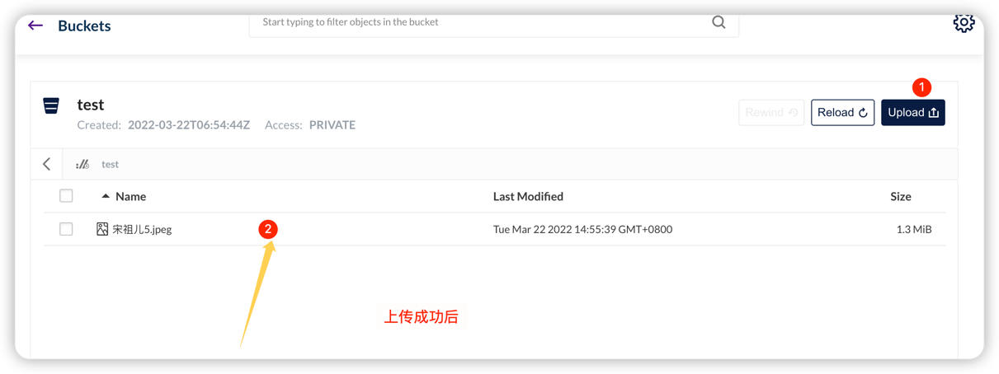
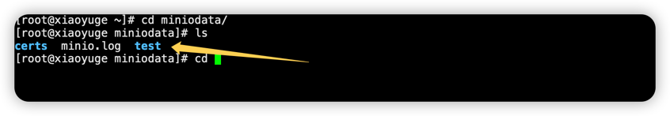

## 1. 什么是对象存储
对象存储服务OSS（Object Storage Service）是一种海量、安全、低成本、高可用的云存储服务，**适合存放任意类型的文件**。容量和处理能力弹性扩展，多种存储类型提供选择，全面优化存储成本。

最大的优势：可以存储大量的非结构话数据，例如：图片、视频、日志文件、备份数据和容器/虚拟机镜像等。

## 2. MinIO
MinIO 是个基于Golang编写的开源对象存储套件，基于Apache License V2.0开源协议，虽然轻量，却拥有不错的性能，兼容亚马逊S3云存储服务接口。可以很简单的和其他应用结合使用，例如：NodeJS、Redis、mysql等

中文文档： http://docs.minio.org.cn/docs/master/minio-monitoring-guide

### 2.1 MinIO应用场景
可以作为私有云的对象存储服务来使用，也可以作为云对象存储的网关层，无缝对接Amazon S3 或者 MicroSoft Azure 。


### 2.2 MinIO特点
- 高性能
  
    作为一款高性能存储，在标准硬件条件下，其读写速率分别可以达到55Gb/s和 35Gb/s。并且MinIO支持一个对象文件是任意大小（几KB到最大5T不等）
  
- 可扩展
  
    不同MinIO集群可以组成联邦，并形成一个全局的命名空间，并且支持跨越多个数据中心
  
- 云原生
  
    容器化、基于K8S的编排、多租户支持
  
- Amazon S3兼容
  
    使用Amazon S3 V2/V4 API。可以使用Minio SDK，Minio Client，AWS SDK 和 AWS CLI 访问Minio服务器。
  
- 可对接多种后端存储
  
  除了Minio自己的文件系统，还支持 DAS、 JBODs、NAS、Google云存储和 Azure Blob存储。
  
- SDK支持
  
  GO SDK： https://github.com/minio/minio-go

  
  JavaSDK： https://github.com/minio/minio-java
  
  PythonSDK： https://github.com/minio/minio-py


- Lambda计算

  Minio服务器通过其兼容AWS SNS / SQS的事件通知服务触发Lambda功能。支持的目标是消息队列，如Kafka，NATS，AMQP，MQTT，Webhooks以及Elasticsearch，Redis，Postgres和MySQL等数据库

- 图形化界面

    有操作页面

- 功能简单
    
    不容易出错，快速启动

- 支持纠删码

  MinIO使用纠删码、Checksum来防止硬件错误和静默数据污染。在最高冗余度配置下，即使丢失1/2的磁盘也能恢复数据

### 2.3 存储机制
MinIO 使用纠删码erasure code、校验和checksum。 即使丢一半数据（N/2）的鹰派，仍然可以恢复数据。

- 校验和checksum

    保护数据免受硬件故障和无声数据损坏
  
- 纠删码erasure code

    纠删码是一种恢复丢失和损坏数据的数据算法，目前纠删码技术在分布式存储系统中的应用主要有三类：阵列纠删码（Array Code : RAID5、RAID6等）、RS（Reed-Solomon）里德-所罗门类纠删码和LDPC（LowDensity Parity Check Code）
    低密度奇偶校验纠删码。
  
    Erasure code 是一种编码技术，他可以将N分原始数据，增加m分数据，并通过n+m 份中的任意n份数据，还原为原始数据。即如果有任意小于等于m份的数据失效，仍然能通过剩下的数据还原出来。
  MinIO 采用Reed-Solomon code将对象拆分成N/2数据和N/2奇偶校验快，这就意味着如果是12块盘，一个对象会分成6个数据块、6个奇偶校验块；可以丢失任意6块盘（不管是存放的数据块还是奇偶校验块），仍可以通过剩下的盘进行数据恢复
  

## 3. 安装和使用MinIO

### 3.1 Linux安装MinIO
1.  下载（https://min.io/download#/linux）
    ```shell
    wget https://dl.min.io/server/minio/release/linux-amd64/minio
    ```
    
2. 运行
    ```shell
    chmod +x minio
    ./minio server /usr/software/minio/data      #将/usr/software/minio/data 替换为您希望 MinIO 存储数据的驱动器或目录的路径。
   #或者指定账号密码启动
   MINIO_ACCESS_KEY=minioadmin MINIO_SECRET_KEY=minioadmin ./minio server --config-dir /usr/software/minio/config /usr/software/minio/data
   
    #后台启动
   nohup ./minio server /usr/software/minio/data  >  /usr/software/minio/minio.log 2>&1 &#
   
   #或者指定账号密码启动
   MINIO_ACCESS_KEY=minioadmin MINIO_SECRET_KEY=minioadmin nohup ./minio server --config-dir /usr/software/minio/config /usr/software/minio/data>  /usr/software/minio/minio.log 2>&1 &#
   ```
   
3. 设置启动脚本
    ```shell
     touch minio.sh
   
     vi minio.sh
    ```
   在sh文件中添加以下内容
    ```shell
    #指定登录用户名
    export MINIO_ACCESS_KEY=username
   #指定登录密码
    export MINIO_SECRET_KEY=password
   #指定端口以及存储文件夹，并启动服务
    nohup sudo /usr/local/minio/minio server --address=0.0.0.0:9000 --config-dir /etc/minio /data/minioData > /usr/local/minio/minio.log 2>&1&
    ```
   给当前用户加上执行权限
    ```shell
     chmod u+x  *.sh
   ```


### 3.2 安装客户端
1. 安装
    ```shell
    wget https://dl.min.io/client/mc/release/linux-amd64/mc
    chmod +x mc
    ./mc --help
    ```
   
2. 使用命令给客户端添加一个服务端
    ```shell
    ./mc alias set minio http://172.21.0.7:9000 minioadmin minioadmin
   ```
 
3. 创建bucket，并查询所有bucket
    ```shell
    [root@ww minio]# ./mc ls minio
    [root@ww minio]# ./mc mb minio/mybucket
    Bucket created successfully `minio/mybucket`
    [root@ww minio]# ./mc ls minio
    [2020-09-02 03:02:36 CST]      0B mybucket/
    [root@ww minio]# 
   ```
   
4. 页面查询bucket
   
    
   
5. 创建用户
    ```shell
    ./mc admin user add minio root rootroot
    ```
   
6. 给用户赋予权限
    ```shell
    ./mc admin policy set minio readwrite user=root
    ```
   

### 3.3 使用MinIO  
1. 启动
    
    在浏览器输入： http://localhost:9000
    
   在输入控制打印的默认的AccessKey和SecretKey：
   
    **AccessKey:** minioadmin
   
    **SecretKey:** minioadmin

    使用AccessKey 和 SecretKey 登录后台。

2. 进入系统后，我们先要点击右下角的“+”按钮，创建一个文件桶（输入名称后，回车即可），在上传文件到这个文件桶中。Create bucket（创建文件桶）、Upload file（上传文件）。
   
   
    上传成功
    
   现在我们去服务器，我们启动时指定的目录去看看，文件桶相当于文件目录，这里没有使用纠删码的模式，所以直接就是源文件了。当我们线上运行的项目已经有源文件了，在使用minio的时候，可以直接指定该目录为minio的文件目录就行了。
   

    