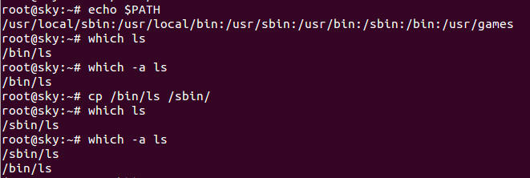
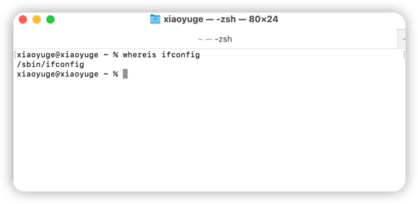
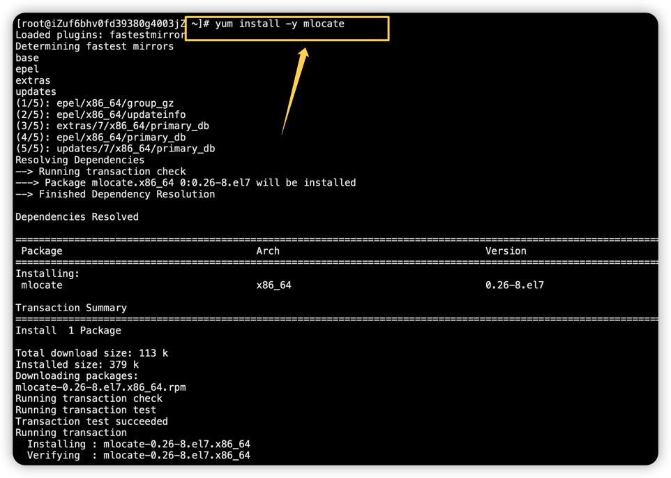
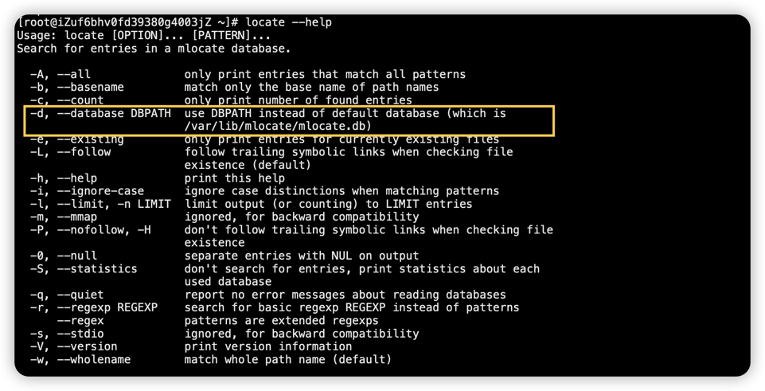
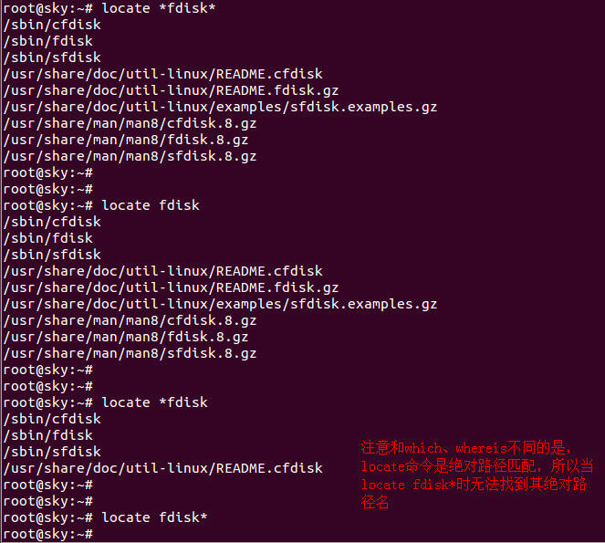
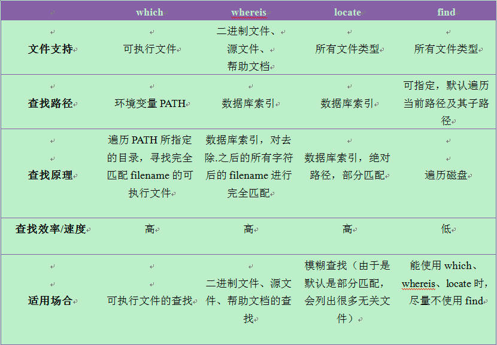

### 1. which查命令绝对路径
**which** 从环境变量PATH中定位/返回与指定名字相匹配的可执行文件所在的路径

**原理**：执行**which**命令时，which会在当前环境变量PATH中依次寻找能够匹配所找命令名字的可执行文件名，不加 - a选项，返回第一个匹配的可执行文件路径，
否则依次返回满足条件的所有可执行文件的路径名

**适用场合：** 一般用于查找命令/可执行文件所在的路径。有时候可能在多个路径下存在相同的命令，该命令可用于查找当前所执行的命令到底是哪一个位置处的命令。

### 2. whereis查找特定文件
**whereis** 命令用来定位指令的二进制程序、源代码文件和man手册页等相关文件的路径， 该命令只能用于程序名的搜索
1. \- b   #定位可执行文件
2. \- m   #定位帮助文件
3. \- s   定位源代码文件 
4. \- u   搜索默认路径下除可执行文件、源代码文件、帮助文件以外的其它文件
5. \- B   指定搜索可执行文件的路径。
6. \- M   指定搜索帮助文件的路径。
7. \- S   指定搜索源代码文件的路径

**原理：** whereis命令首先会去掉filename中的前缀空格和以.开头的任何字符，然后再在数据库（var/lib/slocate/slocate.db）中查找与上述处理后的filename相匹配的二进制文件、源文件和帮助手册文件,使用之前可以使用**updatedb**命令手动更新数据库。

**适用场合：** 二进制文件、源文件和帮助手册文件路径的查找。
和**find** 相比，Whereis 查找的速度非常快，这是因为Linux系统会将系统内的所有文件都记录在一个数据库文件中，当使用**whereis (或者locate)**
会从数据库查找数据，而不是像find命令那样，通过遍历硬盘来查找文件，效率更高！

### 3. locate缓存查找文件
**locate** 搜素一个数据库（/var/lib/mlocate/mlocate.db）,这个数据库中国呢包含本地所有文件信息，Linux系统自动创建这个数据库，并且每天更新依次，所以使用locate命令查不到最新变动过的文件，为了避免这种情况，可以在使用locate之前，先使用updatedb命令，手动更新数据库，updatedb命令会根据/etc/updatedb.conf来更新文件。

**原理：** 默认情况下(当filename中不包含通配符*)，locate会给出所有与 * filename*相匹配的文件的路径。
**适用场合：** 没有文件类型性质的模糊查找（你只记得某个文件的部分名称）。

### 4. find 遍历文件查找
语法：
 - -name                    #按文件名查找(find /etc/ -name "??????" 查找/etc目录下，开头是6个任意字符的文件， *.log以log结尾的文件；"[1-3].txt"指定范围以txt结尾的文件（包括 1.txt,2.txt,3.txt）)
 - -size                    #按大小查找（find /etc/ -size +1M 查询大于1M的文件(find /etc/ -size -10K)，注意：如果没有+ -， 则是精确到1M,加上+ - 表示范围； find /etc/ -size +1k -a -size -10k 查找1-10K的文件）
 - -user                    #按属主查找（find /opt/ -user xiaoyuge 查找/opt属于xiaoyuge用户的文件；注意，系统要存在该用户，否则会报错）
 - -perm                    #按权限查找（find /opt/ -perm 0644 查找/opt目录权限是644文件）
 - -type                    #按类型查找（find /usr/bin/ -type f 查找/usr/bin下类型是二进制文件）
 - -time                    #按天查找
   - atime n                    #将n*24小时内访问过的文件列出(access)
   - ctime n                    #将n*24小时内状态发生改变的文件列出（change） find /etc/ -ctime +7 在7天之前,属性被修改过的文件
   - mtime n                    #将n*24小时内被修改过的文件列出(modify)
   - newer file                 #把比file还要心的文件列出

   - amin n                     #将n 分钟内访问过的文件列出(access)   find /etc/ -mmin -120 在120分钟内，内容被修改的文件
   - cmin n                     #将n 分钟内状态发生改变的文件列出（change）
   - mmin n                     #将n 分钟内被修改过的文件列出(modify)
    
 - -inum                    #按i节点查找 有一些文件的硬链接数量很多，有相同的i节点，查找其中一个文件的i节点号，一次性删除。
 - -exec                    #查找后执行命令

**原理：** 遍历当前工作目录及其子目录，find命令是在硬盘上遍历查找，非常耗硬盘资源，查找效率相比whereis和locate较低。
**适用场合：** 能用which、whereis和locate的时候尽量不要用find.

### 4中命令对比
