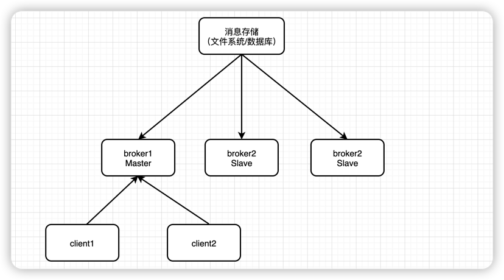
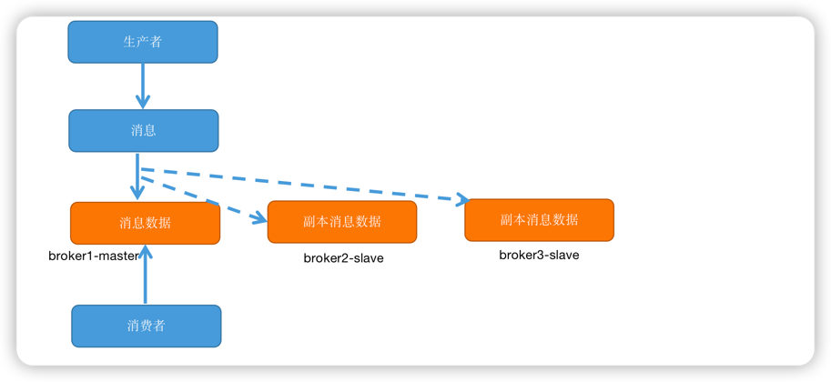
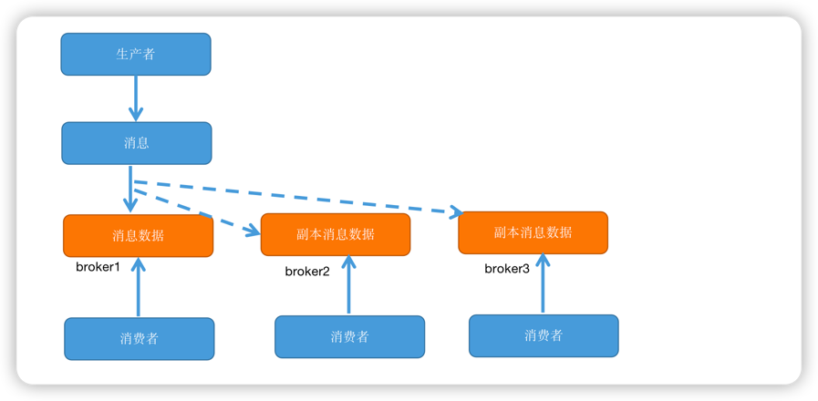
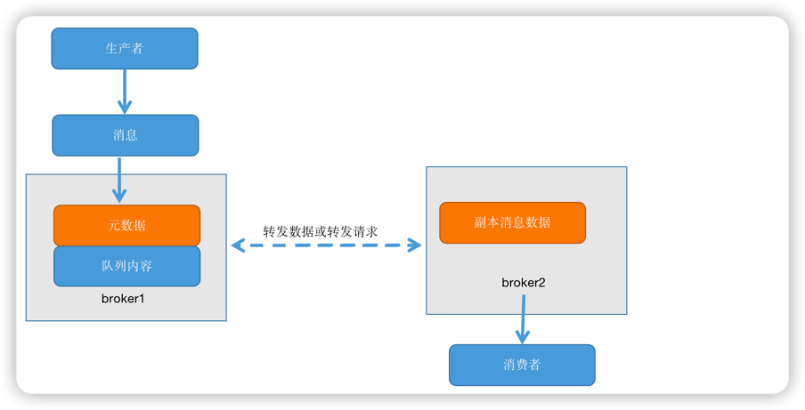
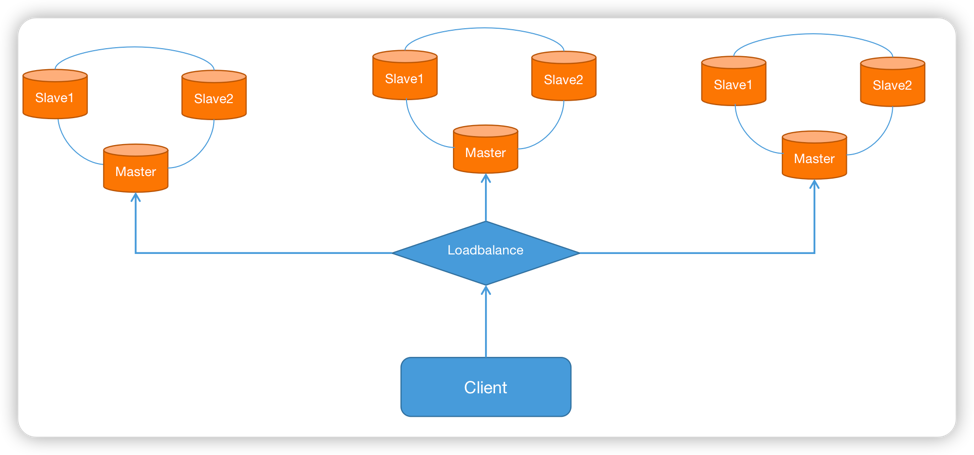

## 1. 消息中间件概述
1. 什么是分布式消息中间件
   
    利用高效可靠的消息传递机制进行平台无关的数据交流；
    并基于数据通信来进行分布式系统的集成；
    通过提供消息和消息排队模型，它可以在分布式环境下扩展进城间的通信。
   
2. 消息中间件的应用场景
    
    跨系统数据传递、高并发流量削峰、数据异步处理......

3. 常用的消息中间件
    
    ActiveMQ(太老)、RabbitMQ、Kafka、 RocketMQ

4. 本质
    
    一种具备接受请求、保存数据、发送数据等功能的网络应用。和一般的网络应用程序的区别是它主要负责数据的接收和传递，所以性能一般高于普通程序

5. 5大核心组成
    - 协议
    - 持久性机制
    - 消息分布机制
    - 高可用设计
    - 高可靠设计
    

### 1.1 协议
协议是计算机之间通信时共同遵守的一组约定，确保计算机之间能够相互交流；是对数据格式和计算机之间交换数据时必须遵守的规则的正式描述
  
三大要素：
- 语法：即数据和控制信息的结构或格式
- 语义：即需要发出何种控制信息，完成何种动作以及作出何种响应
- 时序：即时间实现顺序的详细说明

消息中间件常用协议：openWire、AMQP、MQTT（物流网，快，不能持久化）、Kafka、OpenMessage等；
不能用http协议的原因是：http每次请求必须要有响应，性能不高；

#### 1.1 AMQP协议
AMQP（Advanced Message Queuing Protocol）是高级消息队列协议；04年JPMorgan Chase(摩根大通集团)联合其他公司共同设计

- 特性：事物支持、持久化支持，出生金融行业，在可靠性消息处理上具备天然的优势
- 优秀产品 RabbitMQ、 Apache ACTIVEMQ

#### 1.2 MQTT协议
MQTT（Message Queuing Telemetry Transport）消息队列遥测传输
是IBM开发的一个即时通讯协议，物联网系统架构中的重要组成部分；

- 特性：轻量、结构简单、传输快、没有事务支持、没有持久化相关设计
- 应用场景：适用于计算能力有限、低宽带、网络不稳定的场景
- 优秀产品：RabbitMQ、 Apache ACTIVEMQ

#### 1.3 Open Message协议
OpenMessaging 是近几年有阿里发起，与雅虎、滴滴出行、Streamlio等公司共同参数传里的分布式消息中间件、流处理领域的开发应用标准。
是国内首个在全球范围内发起的分布式消息领域国际标准

- 特性：结构简单、解析快、有事务设计、有持久化设计
- 优秀产品：Apache RocketMQ

#### 1.4 Kafka协议
Kafka协议是基于TCP的二进制协议。消息内部是通过长度来分割，由一些基本数据类型组成
- 特性：结构简单、解析快、无事务设计、有持久化设计
- 优秀产品：Apache Kafka

#### 1.55 OpenWire协议
开放链接，ActiveMQ自定义的一种协议，ActiveMQ默认链接方式，它提供一种高效率的二进制格式来使消息高速传输
- 特性：结构简单、解析快、无事务设计、有持久化设计
- 优秀产品：Apache ActiveMQ

### 1.2 持久化
简单来说就是将数据存入磁盘，而不是存在内存中岁服务重启而消失，使数据能够永久保存叫做持久化

|  | ActiveMQ | RabbitMQ | Kafka | RocketMQ |
| ------ | :------: | :------: | :------: | :------: |
| 文件系统 | 支持 | 支持 | 支持 | 支持 |
| 数据库 | 支持 | - | - | - |
 
### 1.3 消息分发
|  | ActiveMQ | RabbitMQ | Kafka | RocketMQ |
| ------ | :------: | :------: | :------: | :------: |
| 发布订阅 | 支持 | 支持 | 支持 | 支持 |
| 轮询分发 | 支持 | 支持 | 支持 | - |
| 公平分发 | - | 支持 | 支持 | - |
| 重发 | 支持 | 支持 | - | 支持 |
| 消息拉取 | - | 支持 | 支持 | 支持 |

### 1.4 高可用
高可用性是指产品在规定的条件和规定的时刻或时间区间内处于可执行规定功能状态的能力；
当业务量大时，一台消息中间件服务器可能无法满足需求，所以需要消息中间件能够集群部署，来达到高可用的目的。

#### 1.4.1 Master-Slave主从共享数据的部署方式
当Master收到客户端的消息后，放到共享的文件系统/数据库； 客户端访问的是Master节点，Slave节点只做备份；

#### 1.4.2 Master-Slave主从同步部署方式
当Master收到客户端的消息后，发给其他broker同步。

#### 1.4.3 Broker-Cluster多主集群同步部署方式
一部分消息放在broker1 ,一部分放在broker2

#### 1.4.4 Broker-Cluster多主集群转发部署方式
转发数据或转发请求

#### 1.4.5 Master-slave与Broker-Cluster结合

### 1.5 高可靠
高可靠性是指系统可以无故障地持续运行。比如一个系统从来不崩溃、报错，或者崩溃、报错的几率较低，那就是高可靠。
保证消息中间件的高可靠行，可以从一下几方面考虑
- 消息传输可靠： 通过协议来保证系统件数据解析的正确性
- 消息存储可靠： 通过持久化来保证消息存储可靠性

