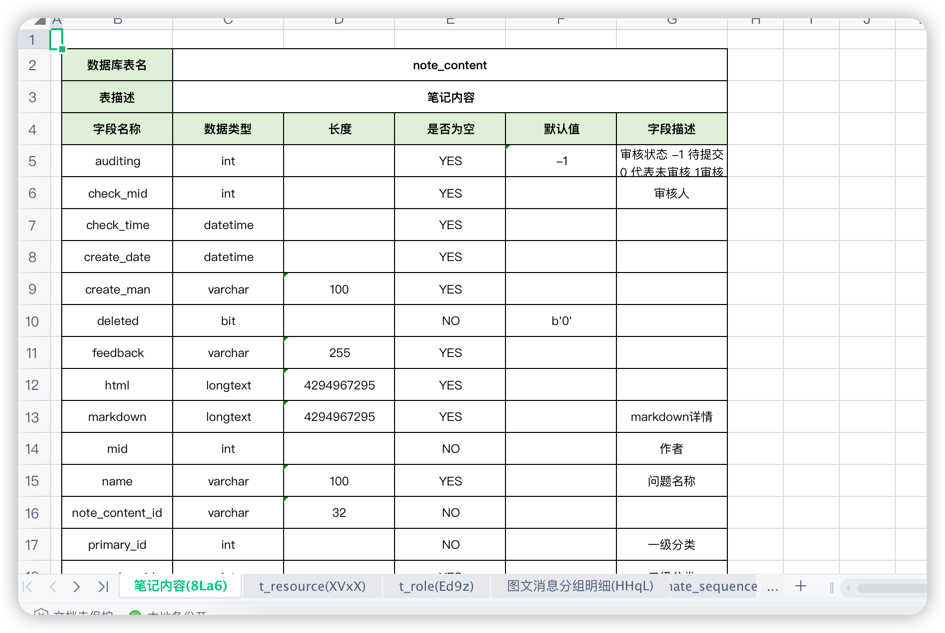

在项目中经常会需要查询数据库所有的表以及表字段，然后可能还需要导出到Excel中，然后自己写了一个工具类，目前支持sqlserver、mysql、oracle、Postgre；如果有问题请留言！！！
### 1. 引入依赖包
```xml
 <!-- 请尽量用最新版本 -->
 <dependency>
    <groupId>com.github.xiaoyuge5201</groupId>
    <artifactId>datasource-spring-boot-starter</artifactId>
    <version>2.1</version>
</dependency>
```

### 2. 编写Java代码
1. 通过MyDataSourceProperties类所有本项目的数据库连接信息，导出当前连接库的数据库结构
    ```yaml
    spring:
      datasource:
        type: com.alibaba.druid.pool.DruidDataSource
        url: jdbc:mysql://localhost:3306/dbname?serverTimezone=GMT%2B8&useSSL=false
        username: root
        password: xiaoyuge
        driver-class-name: com.mysql.jdbc.Driver
        database: dbname    ##需要配置数据库名称
    ```
    ```java
    import com.github.xiaoyuge5201.config.MyDataSourceProperties;
    import com.github.xiaoyuge5201.util.ExportDatabaseDocument;
    import org.apache.catalina.servlet4preview.http.HttpServletRequest;
    import org.springframework.beans.factory.annotation.Autowired;
    import org.springframework.stereotype.Controller;
    import org.springframework.web.bind.annotation.GetMapping;
    import org.springframework.web.bind.annotation.RequestMapping;
    import javax.servlet.http.HttpServletResponse;
    
    @Controller
    @RequestMapping("/export")
    public class TestController {
    
        @Autowired
        MyDataSourceProperties properties;
    
        /**
         * 注意：需要在yaml /yml 配置文件中配置spring.datasource.database 属性
         */
        @GetMapping("/index")
        public void index(HttpServletResponse response, HttpServletRequest request) {
            ExportDatabaseDocument.export(response, request, properties); 
        }
    }
    ```

2. 自定义导出某个数据库的表结构信息
    ```java
    @GetMapping("/index")
    public void index(HttpServletResponse response, HttpServletRequest request) {
        //手动传参
        ExportDatabaseDocument.export(response, request, DatabaseDriverEnum.MYSQL.getDriver(), "127.0.0.1:3306", "root", "xiaoyuge", "dbname");
    }
    ```

### 3. 导出文档
执行请求：localhost:8080/export/index 即可；导出的内容如下：


包括数据库表名、描述以及各个字段的类型、长度、默认值、描述等。。。；

另外sheet的名称为表名(表中文名)+ 4位随机值，受限于excel的sheet；


### 4. 数据库操作类 DataSourceClient
1. DataSourceClient类中根据MyDataSourceProperties操作数据库
    ```java
    /**
    * 查询所有的表结构信息
    *
    * @return 表结构列表
    */
    public List<String> findAllTables() {
        return QuerySqlUtil.findAllTables(properties.getDriverClassName(), properties.getUrl(), properties.getUsername(), properties.getPassword(), properties.getDatabase());
    }

    /**
     * 查詢數據庫表的字段信息
     *
     * @param table 数据表
     * @return 表字段列表
     */
    public List<ColumnEntity> queryTableFieldsEntity(String table) {
        return QuerySqlUtil.queryTableFieldsToColumnEntity(properties.getDriverClassName(), properties.getUrl(), properties.getUsername(), properties.getPassword(), properties.getDatabase(), table);
    }

    /**
     * 查詢數據庫表的字段信息
     *
     * @param table 数据表
     * @return 表字段列表
     */
    public List<String> queryTableFields(String table) {
        return QuerySqlUtil.queryTableFields(properties.getDriverClassName(), properties.getUrl(), properties.getUsername(), properties.getPassword(), properties.getDatabase(), table);
    }

    /**
     * 查询对应库下所有字段 信息
     *
     * @return 结果
     */
    public List<ColumnEntity> listColumnsByDatasourceParams() {
        return QuerySqlUtil.listColumnsByDatasourceParams(properties.getDriverClassName(), properties.getUrl(), properties.getUsername(), properties.getPassword(), properties.getDatabase());
    }

    /**
     * 分页查询数据表数据
     *
     * @param table  数据表
     * @param pageNo 页码
     * @param limit  页容量
     * @param columns 字段列表
     * @throws Exception 异常信息
     * @return 结果
     */
    public JSONArray queryPageData(String table, List<String> columns, Integer pageNo, Integer limit) throws Exception {
        return QuerySqlUtil.queryPageData(properties.getDriverClassName(), properties.getDatabase(), table, properties.getUrl(), properties.getUsername(), properties.getPassword(), columns, pageNo, limit);
    }

    /**
     * 导出数据库设计文档
     *
     * @param response 返回对象
     * @param request  请求对象
     */
    public void exportDatabaseDocument(HttpServletResponse response, HttpServletRequest request) {
        ExportDatabaseDocument.export(response, request, properties.getDriverClassName(), properties.getUrl(), properties.getUsername(), properties.getPassword(), properties.getDatabase());
    }
   ```
   
### 5. 数据库驱动枚举类 DatabaseDriverEnum
```java
/**
 * 数驱动的常量
 *
 * @author yugb
 */
public enum DatabaseDriverEnum {

    /**
     * mysql数据库
     */
    MYSQL(1, "com.mysql.jdbc.Driver", "mysql数据库"),
    /**
     * Sql Server数据库
     */
    SQL_SERVER(2, "com.microsoft.sqlserver.jdbc.SQLServerDriver", "Sql Server数据库"),
    /**
     * oracle数据库
     */
    ORACLE(3, "oracle.jdbc.driver.OracleDriver", "oracle数据库"),
    /**
     * postgre sql数据库
     */
    POSTGRE_SQL(4, "org.postgresql.Driver", "postgre sql数据库"),
    /**
     * 达梦数据库
     */
    DM(5, "dm.jdbc.driver.DmDriver", "达梦数据库");
    /**
     * 数据库驱动类型
     */
    private final Integer type;
    /**
     * 数据库驱动连接
     */
    private final String driver;
    /**
     * 名称
     */
    private final String name;

    public Integer getType() {
        return type;
    }

    public String getDriver() {
        return driver;
    }

    public String getName() {
        return name;
    }

    DatabaseDriverEnum(Integer type, String driver, String name) {
        this.type = type;
        this.driver = driver;
        this.name = name;
    }

    /**
     * 根据数据库类型获取数据库驱动
     * @param type 数据库类型
     * @return 驱动
     */
    public static String getValue(Integer type) {
        DatabaseDriverEnum[] enums = values();
        for (DatabaseDriverEnum driverEnum : enums) {
            if (driverEnum.type.equals(type)) {
                return driverEnum.getDriver();
            }
        }
        return null;
    }
}

```