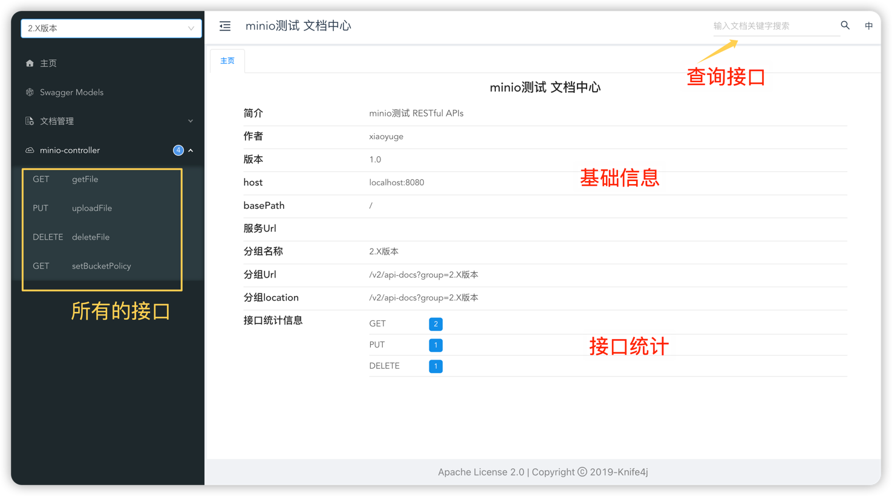
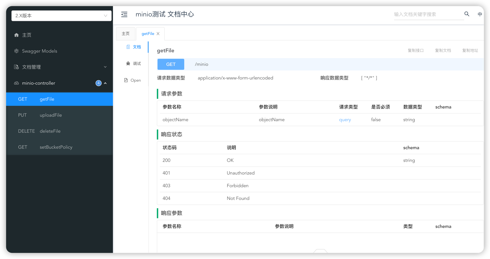
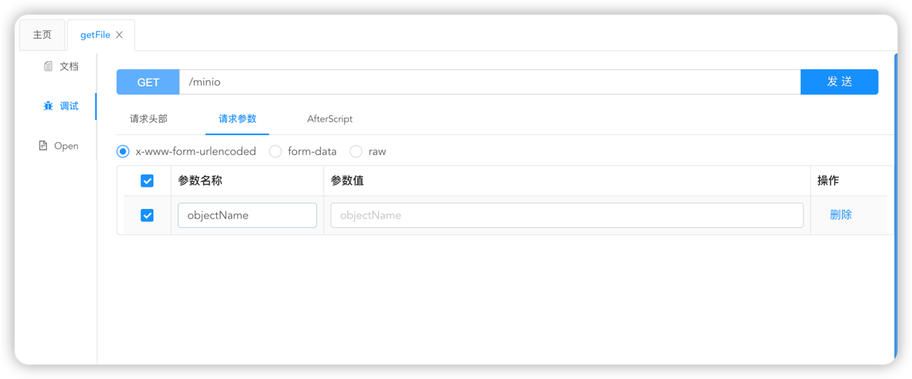
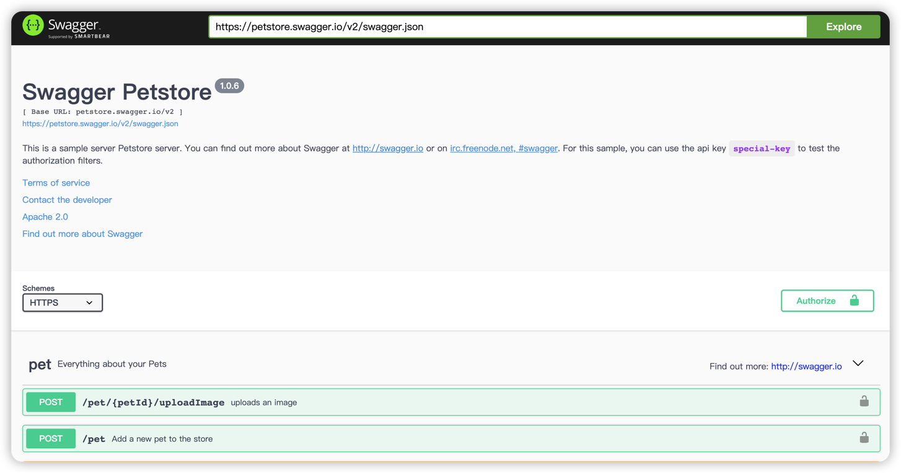
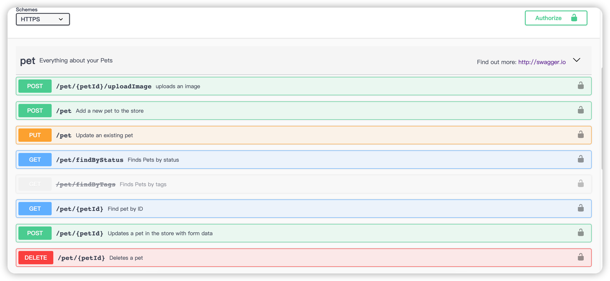
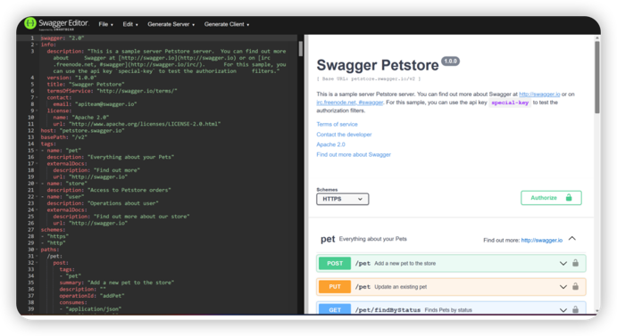
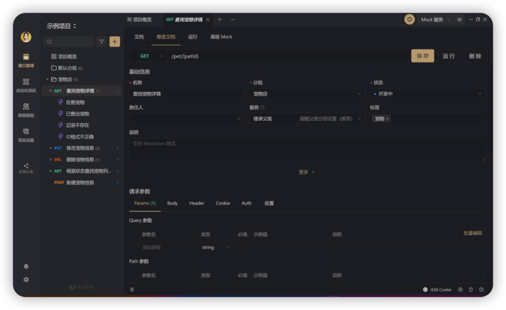
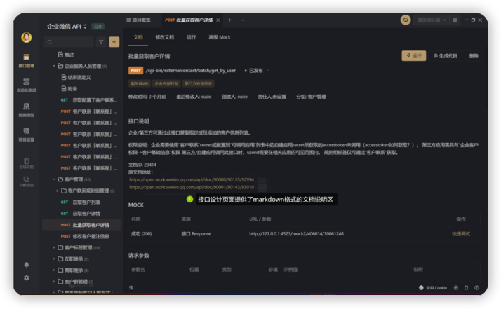

## 1. Swagger
Swagger 是一个规范且完整的框架，用于生成、描述、调用和可视化 RESTful 风格的 Web 服务。
Swagger 的目标是对 REST API 定义一个标准且和语言无关的接口，可以让人和计算机拥有无须访问源码、文档或网络流量监测就可以发现和理解服务的能力。
 
静态的swagger跟不上频繁变更的代码，容易出现以下问题
- “为什么改了这个没告诉我” 
  
- “实际功能和文档上说的不一样啊”

这样会带来的问题是：
 1. Swagger，postman，MockJS只能完成软件研发流程中某个环节的功能，造成完成接口设计，文档编写，调试，测试验证等工作需要使用好几个工具；
 2. 更麻烦的是这些工具数据格式不互通，无法互相导入，造成用Swagger定义和编写完成接口后，在Postman，MockJS，Jmeter等工具还要再去手动填写一遍才能开始工作，增加了无意义的工作量。
 3. 沟通成本总是被忽略不计，但实际上不仅占据了很大时间，各种沟通不及时、沟通不到位还非常让人心累。
 4. 老板的需求来得急，老板的需求变得快，各种代码修改和变更难以及时通知和同步到团队成员手中。

## 2. 常见的可视化RestFul风格的服务

- springfox-swagger2
- springdoc
- Apifox（接口测试工具，非集成在项目中postman加强升级版）

## 3. 各个工具的使用以及风格
使用Springboot项目分别集成各个组件，看下具体的实现效果；

### 3.1 springfox-swagger2
1. 引入依赖
   ```java
   <dependency>
       <groupId>io.springfox</groupId>
       <artifactId>springfox-swagger2</artifactId>
       <version>2.10.5</version>
   </dependency>
       <dependency>
        <groupId>io.springfox</groupId>
        <artifactId>springfox-swagger-ui</artifactId>
        <version>2.9.2</version>
   </dependency>
   <dependency>
        <groupId>com.github.xiaoymin</groupId>
        <artifactId>knife4j-spring-boot-starter</artifactId>
        <version>2.0.8</version>
   </dependency>
   ```
   
2. 编写配置类
   - SwaggerConfiguration类
       ```java    
        @Configuration
        @EnableSwagger2WebMvc
        @EnableKnife4j
        public class SwaggerConfiguration {
        
            @Value("${spring.application.name}")
            private String applicationName;
        
            @Bean(value = "defaultApi")
            public Docket defaultApi2() {
                //设置处理请求的包，我的controller类都在com.yugb.controller中
                Predicate<RequestHandler> apiPackage = RequestHandlerSelectors.basePackage("com.yugb.controller");
        
                Docket docket = new Docket(DocumentationType.SWAGGER_2)
                        .apiInfo(new ApiInfoBuilder()
                                .version("1.0")
                                .contact(new Contact("xiaoyuge","123", "12342qq.com"))
                                .title(applicationName + " 文档中心")
                                .description("<div style='font-size:15px;'>" + applicationName + " RESTful APIs</div>")
                                .build())
                        //分组名称
                        .groupName("2.X版本")
                        .select()
                        //这里指定Controller扫描包路径
                        .apis(apiPackage)
                        .paths(PathSelectors.any())
                        .build();
                return docket;
            }
        
        }
       ```
     
    - SwaggerWebMvcConfigurer 类
        ```java
        @Configuration
        public class SwaggerWebMvcConfigurer implements WebMvcConfigurer {
            @Override
            public void addResourceHandlers(ResourceHandlerRegistry registry) {
                registry.addResourceHandler("doc.html").addResourceLocations("classpath:/META-INF/resources/");
                registry.addResourceHandler("/webjars/**").addResourceLocations("classpath:/META-INF/resources/webjars/");
            }
        }
       ```
      
    
3. 添加注解
   
   我们接口文档的直接描述主要就是在Controller这一层，比如这个接口的功能，参数的名称，返回值的名称等。这些值我们都需要在Controller上通过给方法上，请求参数和返回参数上添加对应的注解，swagger才能帮我们生成相应的接口文档。
   

   - **JavaBean**: @ApiModel注解和 @@ApiModelProperty 注解定义了实体的名称和字段的名称
       ```java
        @Data
        @ApiModel("创建Swagger响应结果")
        public class SwaggerResVO {

            @ApiModelProperty("id")
            private Integer id;
        
            @ApiModelProperty("姓名")
            private String name;
        
            @ApiModelProperty("性别")
            private Integer gender;
        
            @ApiModelProperty("啥啥")
            private String what;
        }
        ```
     
 - **controller**: @Api注解和 @ApiOperation注解分别标注了接口组名和接口的名称
    ```java
    @RestController
    @RequestMapping("/swagger")
    @Api(value = "用户接口", tags = {"用户接口"})
    public class SwaggerController {
    
        @ApiOperation("新增用户")
        @PostMapping("save")
        public String save(@RequestBody SwaggerReqVO req) {
            return "success";
        }
     
        @GetMapping("getById")
        @ApiOperation("根据条件查询用户")
        public SwaggerResVO getById(@RequestBody SwaggerResVO req) {
            return new SwaggerResVO();
        }
    }
   ```
3. 启动项目
    
    访问 http://localhost:8080/doc.html 查看springfox-swagger2的文档中心
    
   
    查看GET请求的界面
    
    

4. 优缺点

    - 优点：界面美观，集成方便，不同类型的接口按照controller分组，**可以导出所有的接口文档！！！！！**
    
    - 缺点：暂时没有遇到


### 3.2 springdoc

1. 引入依赖
   ```java
   <dependency>
        <groupId>org.springdoc</groupId>
        <artifactId>springdoc-openapi-ui</artifactId>
        <version>1.5.8</version>
    </dependency>

    <dependency>
        <groupId>org.springdoc</groupId>
        <artifactId>springdoc-openapi-webmvc-core</artifactId>
        <version>1.5.8</version>
    </dependency>
   ```
   
2. 配置yml /yaml /properties
    ```yaml
    springdoc:
      api-docs:
        enabled: true
        groups:
          enabled: true
        path: /api-docs
      cache:
        disabled: true
      swagger-ui:
        groups-order: asc
        # 自定义的文档界面访问路径。默认访问路径是/swagger-ui.html
        path: /springdoc/docs.html
      # 布尔值。实现OpenApi规范的打印。
      writer-with-default-pretty-printer: true
    ```
   
3. 编写配置类

    - SpringdocOpenapiConfiguration
        ```java
        @Configuration
        public class SpringdocOpenapiConfiguration implements WebMvcConfigurer {
        
            private final SwaggerProperties swaggerProperties;
        
            public SpringdocOpenapiConfiguration(SwaggerProperties swaggerProperties) {
                this.swaggerProperties = swaggerProperties;
            }
        
            @Bean
            public OpenAPI springDocOpenAPI() {
                //配置认证、请求头参数
                Components components = new Components();
        //        Map<String, Object> myHeader2extensions = new HashMap<>(2);
        //        myHeader2extensions.put("name", "myHeader2");
        //        components
        //                .addSecuritySchemes("bearer-key", new SecurityScheme().type(SecurityScheme.Type.HTTP).scheme("bearer").bearerFormat("JWT"))
        //                .addSecuritySchemes("basicScheme", new SecurityScheme().type(SecurityScheme.Type.HTTP).scheme("basic"))
        //                .addHeaders("myHeader2", new Header().description("myHeader2 header").schema(new StringSchema()).extensions(myHeader2extensions))
        //                .addParameters("myGlobalHeader", new HeaderParameter().required(true).name("My-Global-Header").description("My Global Header").schema(new StringSchema()).required(false))
        //        ;
      
                // 接口调试路径
                Server tryServer = new Server();
                tryServer.setUrl(swaggerProperties.getTryHost());
        
                return new OpenAPI()
                        .components(components)
                        .servers(Collections.singletonList(tryServer))
                        .info(new Info()
                                .title(swaggerProperties.getApplicationName() + " Api Doc")
                                .description(swaggerProperties.getApplicationDescription())
                                .version("Application Version: " + swaggerProperties.getApplicationVersion() + "\n Spring Boot Version: " + SpringBootVersion.getVersion())
                                .license(new License().name("Apache 2.0").url("https://www.apache.org/licenses/LICENSE-2.0.html"))
                        )
                        .externalDocs(new ExternalDocumentation()
                                .description("SpringDoc Full Documentation")
                                .url("https://springdoc.org/")
                        );
            }
        
            /**
             * 添加全局的请求头参数
             */
        //    @Bean
        //    public OpenApiCustomiser customerGlobalHeaderOpenApiCustomiser() {
        //        return openApi -> openApi.getPaths().values().stream().flatMap(pathItem -> pathItem.readOperations().stream())
        //                .forEach(operation -> {
        //                    operation.addParametersItem(new HeaderParameter().$ref("#/components/parameters/myGlobalHeader"));
        //                });
        //    }
        
            /**
             * 通用拦截器排除设置，所有拦截器都会自动加springdoc-opapi相关的资源排除信息，不用在应用程序自身拦截器定义的地方去添加，算是良心解耦实现。
             */
            @SuppressWarnings("unchecked")
            @Override
            public void addInterceptors(InterceptorRegistry registry) {
                try {
                    Field registrationsField = FieldUtils.getField(InterceptorRegistry.class, "registrations", true);
                    List<InterceptorRegistration> registrations = (List<InterceptorRegistration>) ReflectionUtils.getField(registrationsField, registry);
                    if (registrations != null) {
                        for (InterceptorRegistration interceptorRegistration : registrations) {
                            interceptorRegistration.excludePathPatterns("/springdoc**/**");
                        }
                    }
                } catch (Exception e) {
                    e.printStackTrace();
                }
            }
        
            // 服务器支持跨域
            @Override
            public void addCorsMappings(CorsRegistry registry) {
                registry.addMapping("/**")
                        .allowedOrigins("*")
                        .allowedMethods("GET", "POST", "OPTIONS")
                        .allowedHeaders("*")
                        .exposedHeaders("Access-Control-Allow-Headers",
                                "Access-Control-Allow-Methods",
                                "Access-Control-Allow-Origin",
                                "Access-Control-Max-Age",
                                "X-Frame-Options")
                        .allowCredentials(false)
                        .maxAge(3600);
            }
        
        }
        ```
    - SwaggerProperties
        ```java
        @Getter
        @Setter
        @Component
        @ConfigurationProperties("swagger")
        public class SwaggerProperties {
        /**
        * 项目应用名
        */
        private String applicationName;
            /**
             * 项目版本信息
             */
            private String applicationVersion;
            /**
             * 项目描述信息
             */
            private String applicationDescription;
            /**
             * 接口调试地址
             */
            private String tryHost;
        }
        ```
      
    - 编写接口方法
      - 在controller上添加@Tag注解
      - 在接口方法上添加@Operation 注解
      - 在接口参数添加@Parameter 或@Parameters 注解
      ```java
      @Tags({
        @Tag(name = "ExpirationWarningController", description = "设备寿命到期预警"),
      })
      @RestController
      @RequestMapping("/test")
      public class ExpirationWarningController {
          //需要使用@Operation竹节
          @PostMapping("/getOne/{id}/{type}")
          @Operation(summary = "按ID查询", description = "按ID查询")
          public ResponseResult getOne(@Parameter(description = "主键ID") @PathVariable Integer id,
          @Parameter(description = "类型") @PathVariable String type) {
         
              return ResponseResult.success(expirationWarningVO);
          }
      
          @PostMapping("/save")
          @ResponseBody
          @Operation(summary = "保存", description = "保存")
          public ResponseResult save(@RequestBody ExpirationWarning expirationWarning) {
             return null;
          }
        }
      ```
    - 在springboot启动类上加上以下配置
      ```java
      @OpenAPIDefinition(
          info = @Info(
              title = "测试springdoc",
              version = "1.0"
          ),
          externalDocs = @ExternalDocumentation(description = "swagger-api参考文档",
              url = "https://github.com/swagger-api/swagger-core/wiki/Swagger-2.X---Annotations"
          ),
          servers = {
              @Server(
                  url = "http://localhost:8123/app",
                  description = "本地地址"
              ),
              @Server(
                  url = "http://www.xiaoyuge.vip/app",
                  description = "公网测试环境"
              )
          }
      )
      public class ResolutionApplication {
          public static void main(String[] args) {
              SpringApplication.run(ResolutionApplication.class, args);
              logger.info("============= Start Success =============");
          }
      }
      ```
4. 启动项目

   访问 http://localhost:8123/app/springdoc/swagger-ui/index.html 查看springdox的文档中心
   
   


5. 优缺点

    - 优点：不好说

    - 缺点：界面没有按照每个controller分组，不直观！；


### 3.3 Apifox
一款研发全流程，接口全周期的生产力工具，这款软件真正完成了数据流的打通，在一个软件上就能实现**接口设计--接口文档--接口调试--接口修改--接口mock--接口测试--接口自动化--接口迭代**的工作流闭环；

#### 3.3.1 Apifox上的协作流程
1. 后端在Apifox可视化接口设计界面上定义好项目各个接口及对应参数同时编写接口文档说明
2. 前后端一起评审，修改完善接口并在同一界面顺手更新接口文档
3. 后端使用接口调试功能调试接口
4. 前端使用零配置高仿真mock功能对前端页面进行调试，无需手写mock规则
5. 后端使用代码生成功能直接生成接口代码
6. 测试在接口管理页面一键生成接口参数测试用例,并依据业务场景生成自动化测试用例，一键运行接口用例并生成接口测试报告并分享给相关人员。
7. 前后端 都开发完，前端从Mock 数据切换到正式数据，进行联调，由于使用同一个接口数据源，且遵循了接口规范，联调顺利
8. 由于bug修复或需求变更，接口发生了变化，后端修改提交后，前端和测试实时同步到了修改后的数据
9. 项目经理通过权限设置给研发,产品,测试,外部合作人员分配编辑,只读等各种操作权限，维护了项目安全
10. 项目经理通过各个接口的状态开发中,测试中,已发布来跟进项目的进度情况，把控项目风险。

#### 3.3.2 Apifox做的增速提效优化
- 接口设计：从代码生成界面到可视化接口设计界面
  
  Apifox 接口文档遵循 OpenApi 3.0 (原 Swagger)、JSON Schema 规范，可生成在线文档；零学习成本即可编写出符合RESTful风格的接口文档，新人上手快；所见即所得，不易出错
  
  
  
- 文档维护：从接口与文档分离到接口与文档合并

  Apifox的接口设计界面提供了Markdown格式的文档说明区，修改完接口就如同commit代码时添加变更说明般
  
  
- 数据复用：从各自为政到定义一次、多次复用
  - 接口数据复用：Swagger，Postman，MockJS，Jmeter等软件彼此之间数据不互通，数据格式不一致，接口导入非常耗时麻烦。
    而Apifox能身兼多职，包揽上述软件功能，在Apifox中定义一次接口，能被后端直接用来调试，前端直接用来mock界面，测试直接执行接口自动化。
  
  - 数据模型复用：可复用的数据结构，定义接口返回数据结构及请求参数数据结构（仅 JSON 和 XML 模式）时可直接引用。
    

- 同步更新，高效沟通:从沟通滞后到数据变更即时同步
  
  Apifox为此提供了同步功能，一旦接口数据有更新发生，就会即时同步更新并通知到项目内所有成员。


- Apihub

  内置企业微信开放API，抖音开放API等第三方接口开放项目，接口可以直接在Apifox中调试，不需要到处找接口文档和手工填写接口
#### 3.3.3 下载地址
官网地址： http://www.apifox.cn/?utm_medium=WCSA&utm_source=xxzsq