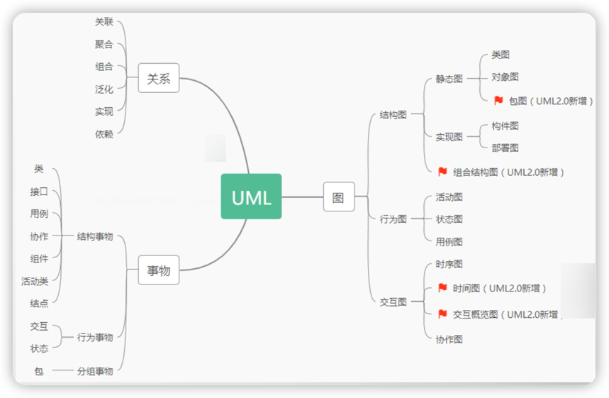
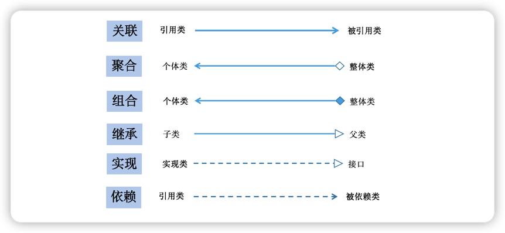
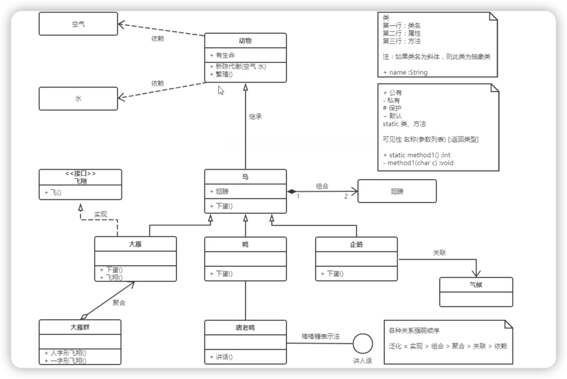
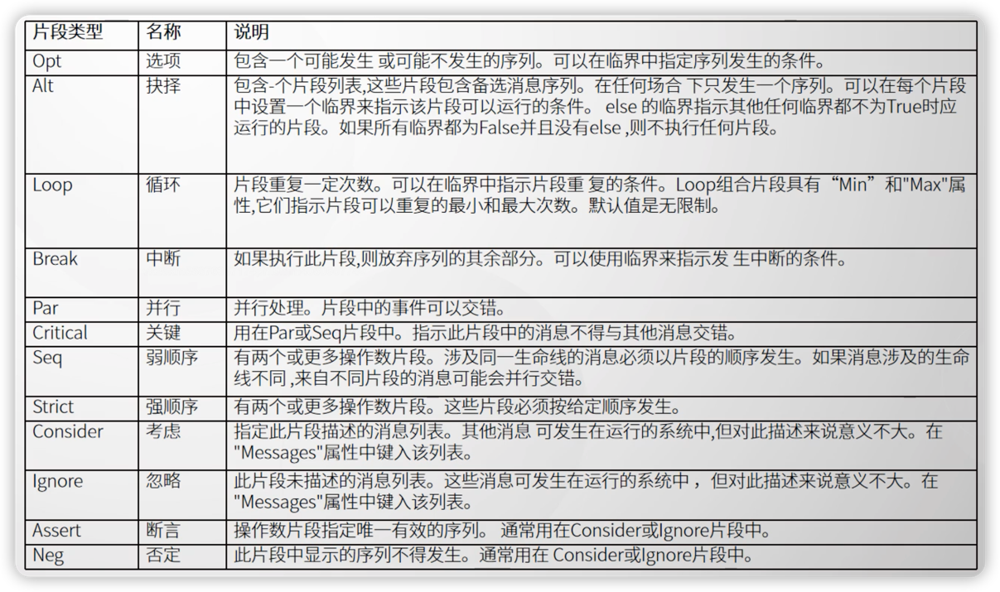
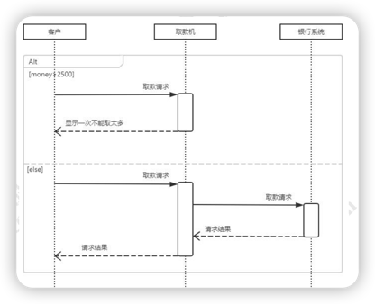
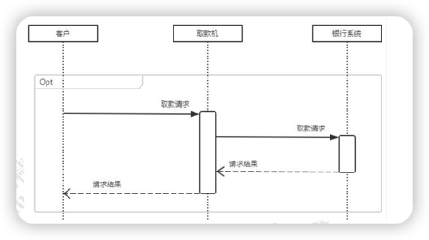
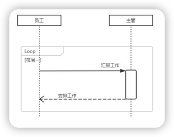
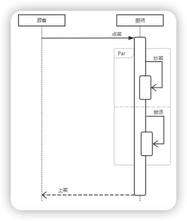
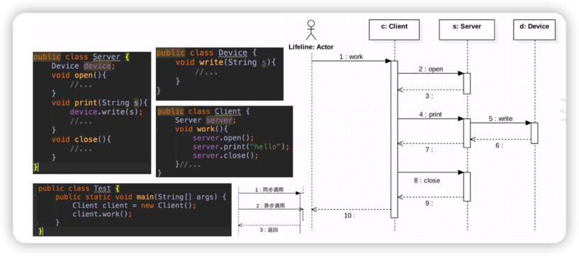

## 1. 什么是UML
    统一建模语言（Unified Modeling Language）是一种面向对象系统的产品说明、可视化和编制文档的一种标准语言，是非专利的第三代建模和规约语言。
    UML使用面向对象设计的建模工具，但独立与具体程序设计语言

## 2. UML应用场景
    UML 是在开发阶段，说明、可视化、构建和书写一个面向对象软件密集系统的制品 的开放方法。最佳的应用是工程实践，对大规模，复杂系统进行建模方面，
    特别是在软 件架构层次，已经被验证有效。统一建模语言（UML）是一种模型化语言。模型大多以 图表的方式表现出来。一份典型的建模图表通常包含几个块或框，
    连接线和作为模型附 加信息之用的文本。这些虽简单却非常重要，在 UML 规则中相互联系和扩展。

## 3. UML图形种类
UML2.0 一共有 13 种图形（UML1.5 定义了 9 种，2.0 增加了 4 种）。分别是：<u>用例图</u>、<u>类图</u>、<u>对象图</u>、<u>状态图</u>、<u>活动图</u>、<u>时序图</u>、<u>协作图</u>、<u>构件图</u>、<u>部署图</u> 9 种，包图、 时间图、组合结构图、交互概览图 4 种。
- **用例图**（Usecase Diagrams）：用来描述用户的需求，从用户的角度描述系统的功能， 并指出各功能的执行者，强调谁在使用系统，系统为执行者完成哪些功能。 
  
- **类图**（Class Diagrams）：用于定义系统中的类。 
  
- **对象图**（Object Diagrams）：是类图的一个实例，描述了系统在具体时间点上所包含 的对象以及各个对象之间的关系。 
  
- **构件图**（Component Diagrams）：一种特殊的 UML 图来描述系统的静态实现视图。 
  
- **部署图**（Deployment Diagrams）：定义系统中软硬件的物理体系结构。 
  
- **状态图**（State Chart Diagrams）：用来描述类的对象所有可能的状态以及时间发生时 状态的转移条件。 
  
- **协作图**（Collaboration Diagrams）：描述对象之间的合作关系，更侧重和用户对象说 明哪些对象有消息的传递。 
  
- **活动图**（Activity Diagrams）：用来描述满足用例要求索要进行的活动以及活动间的约 束关系。
  
- **时序图**（Sequence Diagrams）：描述对象之间的交互顺序，着重体现对象间消息传递 的时间顺序，强调对象之间消息的发送顺序，同时显示对象之间的交互过程。 
  
- **包图**（Package Diagrams）：对构成系统的模型元素进行分组整理的图。 
  
- **组合结构图**（Composite Structure Diagrams）：表示类或者构建内部结构的图。 
  
- **时间图**（Timing Diagrams）：用来显示随时间变化，一个或多个元素的值或状态的更 改，也显示时控事件之间的交互和管理它们的时间和期限约束。 
  
- **交互概览图**（Interaction Overview Diagrams）：用活动图来表示多个交互之间的控制 关系的图。

---

## 4. UML绘图规范
    建模的核心是模型，模型是现实的简化，模型是真实系统的左营，它提供了系统的设 计蓝图。给软件系统建模是，需要采用通用的符号语言，
    这种描述模型所使用的语言称 为建模语言。

### 4.1 事务描述

1. 类（Class）： 对一组具有相同属性、方法、关系和语义的对象的描述
2. 接口（Interface）：描述一个类或构件的一个服务的操作集，它仅仅是定义了一组操作规范，并没有给出具体的实现
3. 用例（Usecase）：是对一组动作序列的描述，系统执行这些动作将产生一个对特定的参与者（Actor）有价值且可观察的结果
4. 包（Package）: 是分组事物中最主要的，是UML中唯一的组织机制

### 4.2 事务关系描述
1. **关联（Association）**
    
    是一种拥有的关系，具有方向性，如果一个类单方向的访问另一个类，则称为单向关联（用一个箭头的实线表示）；如果两个类对象可以互相访问，则 称为双向关联（用两个箭头或不用箭头的实线表示）；一个对象能访问关联对象的数目 叫做“多重性”
   
   带普通箭头的实线表示，箭头指向被拥有者，或者不用箭头的实线表示
2. **聚合（Aggregate）**：是整体与部分的关系 

    当某个实体聚合称另一个实体时，该实体还可以时另一个实体的部分
    
    用带空心菱形的实线表示，菱形指向整体，箭头指向个体
   
3. **组合（Combination）**：整体与部分的关系，组合比聚合更加严格
   
    当某个实体组合成另一个实体时，二者具有相同的生命周期，例如手臂和人之间；
   
    带实心菱形的实线表示，菱形指向整体，箭头指向个体
   
4. **泛化（Generalization）/ 继承**：表示一个更泛化的元素和一个更具体的元素之间的关系

    用带三角箭头的实线表示， 箭头指向父类

5. **实现（Realization）**：类与接口, 类实现接口

    用带三角箭头的虚线表示，箭头指向接口

6. **依赖关系（Dependency）**：如果一个类的改动会影响到另一个类，则两者之间存在依赖关系，一般而言，依赖时单向的。
   
    用带普通箭头的虚线表示，箭头指向被依赖者

---
## 5 类图 Class Diagrams
- +表示public
- -表示private
- \#表示protected
- ~表示default

- 字段和方法返回值的数据类型非必须
- 抽象类或抽象方法用斜体表示
- 静态类或静态方法加下划线
- 如果是接口在类名上方加<<Interface>>

**类关系记忆技巧**
- 箭头：从子类指向父类
    - 定义子类是需要通过extends关键字指定父类
    - 子类一定是指导父类定义的，但父类并不知道子类的定义
    - 只有指导对方信息时才能指向对方
    - 所有箭头的方向是从子类指向父类或者被依赖被使用的类

- 继承/实现：用线条连接两个类
    - 空心三角箭头表示继承或实现
    - 线表示继承，是is-a的关系，表示扩展；（**司机是一个人**）
    - 虚线表示实现
    
- 关联/依赖：用线条连接两个类
    - 虚线表示依赖关系；表示一种使用关系，一个类需要借助另一个类来实现功能，一般是一个类将另一个类作为参数或者返回值使用。
      在多重性关系中，可以直接在关联直线上增加一个数字，表示与之对应的另一个类的 对象的个数。 
      
      1..1：仅一个 
      
      0..*：零个或多个 
      
      1..*：一个或多个 
      
      0..1：没有或只有一个 
      
      m..n：最少 m、最多 n 个 (m<=n)
    - 实线表示关联关系；表示一个类对象和另外一个类对象有关联，通常是一个类中有另一个类对象作为属性
    
- 组合/聚合：用菱形表示
    - 聚合：空心菱形，整体和局部的关系，两者有独立的生命周期，是has-a的关系（**车队包含司机**）
    - 组合：实心菱形，整体和局部的关系，两者具有相同的生命周期，是contains-a的关系（**人有两只手**）
    
---

## 6. 时序图（Sequence Diagrams）
    
时序图描述对象之间消息的发送顺序，强调时间顺序。时序图是一个二维图，横轴表示对象，纵轴表示时间，消息在各对象之间横向传递，依照时间顺序总想排列。用箭头表示消息、竖线表示对象生命线。

### 6.1 作用
1、展示对象之间交互的顺序。将交互行为建模为消息传递，通过描述消息是如何在 对象间发送和接收的来动态展示对象之间的交互； 

2、相对于其他 UML 图，时序图更强调交互的时间顺序； 

3、可以直观的描述并发进程。
### 6.2 组成元素
1. 角色 Actor
   
   系统角色，可以是人、机器、其他系统、子系统
2. 对象 Object

   - 对象的三种命名方式
     
        第一种方式包括对象名和类名，例如：直播课时:课时，在时序图中，用“对象：类” 表示；第二种方式只显示类名，即表示它是一个匿名对象，例如： :课程；在时序图中，用 “：类”表示； 第三种方式只显示对象名不显示类名，例如：讲师；在时序图中，用“对象”表示。 
   - 命名方式的选择 
     
        三种命名方式均可，哪种最容易让阅读该时序图的人理解，就选择哪种。 
   - 对象的排列顺序 
     
        对象的左右顺序并不重要，但是为了作图清晰整洁，通常应遵循以下两个原则：把交 互频繁的对象尽可能的靠拢；把初始化整个交互活动的对象放置在最左端。
3. 生命线 Lifeline

   在时序图中表示为从对象图标向下延伸的一条虚线，表示对象存在的时间。
4. 控制焦点 Focus of Control

   又称为激活期，表示时间段的符号，在这个时间段内对象将执行相应的操作。可以理 解为 Java 语言中一对大括号{ }中的内容；用小矩形表示。
5. 消息 Message

   消息一般分为同步消息（Synchronous Message），异步消息（Asynchronous Message）和返回消息（Return Message）。 
   - 消息的发送者把控制传递给消息的接收者，然后停止活动，等待消息的接收者放 弃或者返回控制。用来表示同步的意义； 
   - 消息发送者通过消息把信号传递给消息的接收者，然后继续自己的活动，不等待接 受者返回消息或者控制。异步消息的接收者和发送者是并发工作的。 
   - 返回消息表示从过程调用返回。
6. 自关联消息

   表示方法的自身调用或者一个对象内的一个方法调用另外一个方法。
7. 组合片段

   组合片段用来解决交互执行的条件和方式，它允许在序列图中直接表示逻辑组件，用 于通过指定条件或子进程的应用区域，为任何生命线的任何部分定义特殊条件和子进程。 组合片段共有 13 种，名称及含义如下
    

### 6.3 常用组合片段举例
用来指明在两个或更多的消息序列之间的互斥的选择，相当于经典的 if..else..

1. 抉择（Alt）
   
   抉择在任何场合下只发生一个序列。 可以在每个片段中设置一个临界来指示该片段 可以运行的条件。else 的临界指示其他任何临界都不为 True 时应运行的片段。如果所 有临界都为 False 并且没有 else，则不执行任何片段
    
   
2. 选项（Opt）

   包含一个可能发生或不发生的序列
   
   
3. 循环（Loop）

   片段重复一定次数，可以在临界中指示片段重复的条件
   
   
4. 并行（Par）
   
   

### 6.4 时序图画法及实践

时序图的绘制步骤可简单总结如下：
1. 划清边界，识别交互的语境；
2. 将所要绘制的交互场景中的角色以及对象梳理出来；
3. 从触发整个交互的某个消息开始，在生命线之间从上到下依次画出所有消息，并注明 每个消息的特性（如参数等）。

   

    

