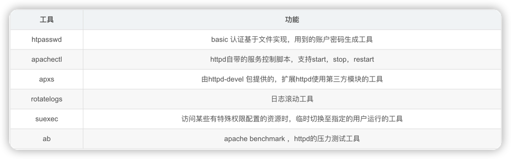
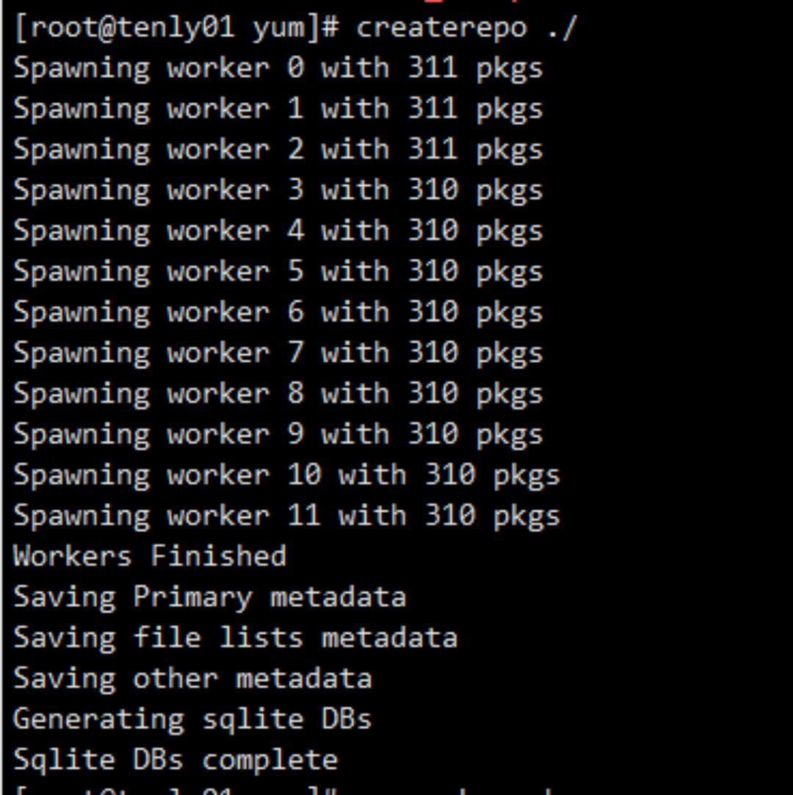
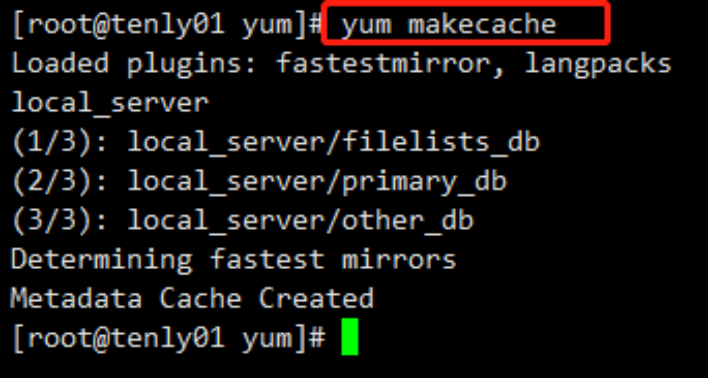
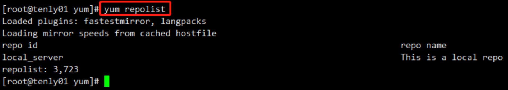

## 1. 前言
Apache Http Server又可以简称为httpd或者Apache，它是Internet使用最广泛的web服务器之一

Httpd是Apache超文本传输协议（HTTP）服务器的主程序。被设计为一个独立运行的后台进程，它会建立一个处理请求的子进程或线程的池。
通常，httpd不应该被直接调用，而应该在类Unix系统中由apachectl调用，在Windows中做为服务运行。
 
**Httpd主要特点：**

    （1）开放源代码
    （2）跨平台使用，支持绝大多数硬件平台，支持所有的unix系统和linux系统，支持大多数windows平台
    （3）支持多种web编程语言，perl，php，python，java等
    （4）模块化设计，根据所需功能去安装不同的模块
    （5）运行非常稳定，支持大负载访问的web站点
    （6）安全性高，及时修复已发现的漏洞
### 1.1 Httpd版本
    
主要介绍httpd的两大版本：
- httpd-2.2
- httpd-2.4

官网链接：https://httpd.apache.org/
### 1.2 Httpd特性
- httpd-2.2 特性：
    - 事先创建进程
    - 按需维持适当的进程
    - 模块化设计，核心比较小，各种功能通过模块添加(包括PHP)，支持运行时配置，支持单独编译模块
    - 支持多种方式的虚拟主机配置，如基于ip的虚拟主机，基于端口的虚拟主机，基于域名的虚拟主机等
    - 支持https协议(通过mod_ ssI模块实现)
    - 支持用户认证
    - 支持基于IP或域名的ACL访问控制机制
    - 支持每目录的访问控制(用户访问默认主页时不需要提供用户名和密码，但是用户访问某特定目录时需要提供用户名和支持URL重写
    - 支持MPM (Multi Path Modules,多处理模块)。用于定义httpd的工作模型(单进程、 单进程多线程、多进程、多进程单线程、多进程多线程）
- httpd-2.4 特性：
    - MPM支持运行DSO机制(Dynamic Share Object,模块的动态装/卸载机制)，以模块形式按需加载
    - 支持event MPM, event MPM模块生产环境可用
    - 支持异步读写
    - 支持每个模块及每个目录分别使用各自的日志级别
    - 每个请求相关的专业配置，使用来配置
    - 增强版的表达式分析器
    - 支持毫秒级的keepalive timeout
    - 基于FQDN的虚拟主机不再需要Name Virtual Host指令
    - 支持用户自定义变量
    - 支持新的指令(Allow Override List)
    - 降低对内存的消耗
    
### 1.3 httpd自带的工具

## 2. 源码安装
1. 下载安装包
    ```text
    链接: https://pan.baidu.com/s/1ip-3yUhY1XYdkD8KejgQkQ 
    提取码: bcub
   
    #第二种：
    http://archive.apache.org/dist/apr/apr-1.7.0.tar.gz
    http://archive.apache.org/dist/apr/apr-util-1.6.1.tar.gz
    https://nchc.dl.sourceforge.net/project/pcre/pcre/8.45/pcre-8.45.zip
   ```
2. 上传安装包到服务器目录
3. 配置依赖环境
   1. 配置apr依赖
        ```shell
        #解压
        tar -xf apr-1.7.0.tar.gz
       
        #进入到目录
        cd apr-1.7.0
       
       #配置(设置安装在/usr/local/apr)
       ./configure --prefix=./configure --prefix=/usr/local/apr
    
        #编译并安装
        make && make install
       ```

   2. 配置apr-util依赖
        ```shell
        #解压
       tar -xf apr-util-1.6.1.tar.gz
    
        #进入到目录
        cd apr-util-1.6.1/
    
        #配置(设置安装在/usr/local/apr-util)
        ./configure --prefix=/usr/local/apr-util --with-apr=/usr/local/apr
    
        #编译并安装
        make && make install
       ```

   3. 配置pcre依赖
        ```shell
        #解压
        tar -xf pcre-8.44.tar.bz2
        
        #进入到目录
        cd pcre-8.44/
        
        #配置(设置安装在/usr/local/pcre)
        ./configure --prefix=/usr/local/pcre
        
        #编译并安装
        make && make install
        ```

    4. 配置安装httpd
        ```shell
        #解压
        tar -xf httpd-2.4.53.tar.gz
        
        #进入到目录
        cd httpd-2.4.53/
        
        #配置(设置安装在/usr/local/httpd)
        ./configure --prefix=/usr/local/httpd --with-pcre=/usr/local/pcre --with-apr=/usr/local/apr --with-apr-util=/usr/local/apr-util
        
        #编译并安装：
        make && make install
        ```
    5. 配置环境变量
        ```shell
        echo 'PATH=/usr/local/httpd/bin:$PATH' > /etc/profile.d/httpd.sh && . /etc/profile.d/httpd.sh
        ```
4. 添加Httpd服务
   1. 复制到init.d 并重命名为httpd
        ```shell
        cp /apps/httpd24/bin/apachectl  /etc/rc.d/init.d/httpd
        ```
      
   2. 建立软连接，通过service命令启动/关闭
        ```shell
        #链接文件的S61是启动时的序号。当init.d目录下有httpd脚本后，我们就可以通过service命令来启动关闭apache了
        ln -s /etc/rc.d/init.d/httpd  /etc/rc.d/rc3.d/S61httpd
       ```
   3. 编辑httpd脚本，
      - 在第2行(#!/bin/sh下面)添加如下注释信息（包括#）：
        ```shell
        # chkconfig: 2345 85 15
        # description: Apache
        ```
        第一行的3个参数意义分别为：在哪些运行级别启动httpd（3，5）；启动序号（S61）；关闭序号（K61）。注意：第二行的描述必须要写！
      - 通过搜索ServerName（先Esc，在输入:/ServerName） 打开ServerName这一行注释
           ```shell
           #
           # ServerName gives the name and port that the server uses to identify itself.
           # This can often be determined automatically, but we recommend you specify
           # it explicitly to prevent problems during startup.
           #
           # If your host doesn't have a registered DNS name, enter its IP address here.
           #
           ServerName localhost:80
           ```
    
    4. 所有开机模式下自启动
      ```shell
      #所有开机模式下自启动，另外chkconfig httpd on 表示345模式下自启动
      chkconfig --add httpd
    ```
    
5. 启动服务
   ```shell
    #到bin目录开启服务
    cd /usr/local/httpd/bin
    
    #开启服务：
    ./apachectl start
    #或者 
    service httpd start
    #或者 
    systemctl start httpd.service
   
    #查看运行状态
    systemctl status httpd.service
    
    #查询80端口：
    netstat -anlp | grep 80
    
    #打开浏览器输入虚拟机的IP地址如果页面显示 It works! , 则表示安装成功
    ```
## 3. rpm安装
1. 下载rpm文件
   ```text
    http://repo.almalinux.org/almalinux/9/AppStream/x86_64/os/Packages/
    ```
2. 依次安装依赖包
    ```shell
    cd /var/www/html/yum/
    
    # 依次安装以下依赖包
    rpm -ivh apr-1.4.8-3.el7.x86_64.rpm
    rpm -ivh apr-util-1.5.2-6.el7.x86_64.rpm 
    rpm -ivh mailcap-2.1.41-2.el7.noarch.rpm 
    rpm -ivh httpd-tools-2.4.6-40.el7.centos.x86_64.rpm 
    rpm -ivh httpd-2.4.6-40.el7.centos.x86_64.rpm 
    rpm -ivh postgresql-libs-9.2.13-1.el7_1.x86_64.rpm      #（经测试，不需要）
    ```

3. 启动服务
    ```shell
    systemctl status httpd
    systemctl start httpd
    
    systemctl enable httpd
    systemctl is-enabled httpd
    ```
   
4. 配置
    ```shell
    cd /etc/yum.repos.d/
    mkdir bak
    mv *.repo bak/
    vim local.repo
    ```
   输入以下内容后保存
    ```properties
    [local_server]
    name=This is a local repo
    baseurl=http://192.168.1.161:80/yum/
    enabled=1
    gpgcheck=0
    #gpgkey=0
    ```
   
5. 创建yum仓库
    ```shell
    cd /var/www/html/yum/
    createrepo ./        
    # 使用createrepo命令创建yum仓库
    # 注意:配置文件中路径指向到哪一层级，createrepo就在该路径的子目录下执行即可。
    # 例: 路径在local.repo配置文件中指向/a/b/c，那么就	cd /a/b/c   createrepo ./
    ```
   


6. 清除缓存
    ```shell
    yum clean all
    ```
   
7. 建立新缓存
    ```shell
    yum makecache
    ```
   


8. 查看已建立好的缓存
    ```shell
    yum repolist
    ```
   


9. 测试
    ```shell
    yum install -y sendmail        # 若可以安装，即已安装成功
    ```


## 4. yum安装
1. 检查是否已经安装httpd
   ```shell
    rpm -qa httpd
   ```
2. 安装
    ```shell
    yum -y install httpd
   
   #如果提示： 没有可用软件包 httpd。
   #国内各大源好像把httpd移除， 导致包根本找不到，可以试下下面的命令
   # yum --disableexcludes=all install -y httpd
    ```
   
3. 配置ServerName
    ```shell
    vim /etc/httpd/conf/httpd.conf
    ```
   则：ServerName localhost:80 或者 ServerName 127.0.0.1:80

4. 启动
    ```shell
    service httpd start  #启动httpd
    service httpd restart #重启httpd
    chkconfig httpd on   #设置开机自动启动：
    ```

5. 测试
    ```shell
    touch /var/www/html/index.html
   #输入以下内容
    ```
    ```html
    <html>
        <body>
            Apache Http Server 
        </body>
    </html>
    ```
   访问http://ip:port/hello.html，返回结果"hello" 说明没问题


6. 安装目录说明
    ```text
    1.Apache默认将网站的根目录指向/var/www/html 目录
    2.默认的主配置文件是/etc/httpd/conf/httpd.conf
    3. 配置存储在的/etc/httpd/conf.d/目录
    ```

## 5. 常见问题
1. AH00534
    ```shell
    vim /apps/httpd24/conf/httpd.cof
    #加上： LoadModule mpm_prefork_module modules/mod_mpm_prefork.so
    #重启
    ```