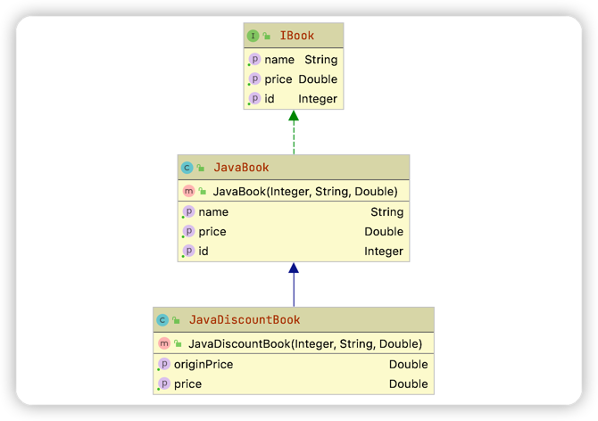
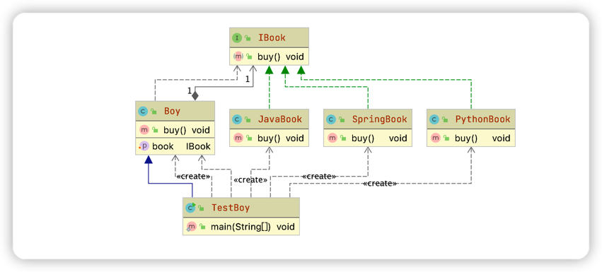

## 1. 开闭原则(Open-Closed Principle)

    开闭原则是指一个软件实体如类、模块和函数应对扩展开放，对修改关闭；所谓开闭，也正是对扩展和修改两个行为的一个原则，强调的是用抽象构建框架，用实现扩展细节，
    可以提高软件系统可复用性以及可维护性。开闭原则，是面向对象设计中最基础的设计原则，它直到我们如何建立稳定灵活的系统，例如：版本更新，尽可能不修改原来的代码，但是可以新增功能。

**实现开闭原则的核心思想就是面向抽象**

```java
/**
 * 书本接口
 */
public interface IBook {
    Integer getId();

    String getName();

    Double getPrice();
}

/**
 * 书本包括java学习书、大数据、前端等
 */
public class JavaBook implements IBook {
    private Integer id;
    private String name;
    private Double price;

    public JavaBook(Integer id, String name, Double price) {
        this.id = id;
        this.name = name;
        this.price = price;
    }

    public Integer getId() {
        return this.id;
    }

    public String getName() {
        return this.name;
    }

    public Double getPrice() {
        return this.price;
    }
}
```

现在要给Java课程做活动，价格优惠，如果修改JavaBook中的getPrice()方法，则会影响到其他地方的调用结果

```java
/**
 * 新增加一个处理优惠逻辑的类，在这个地方处理
 */
public class JavaDiscountBook extends JavaBook {
    public JavaDiscountBook(Integer id, String name, Double price) {
        super(id, name, price);
    }

    public Double getOriginPrice() {
        return super.getPrice();
    }

    public Double getPrice() {
        return super.getPrice() * 0.8;
    }
}
```
类结构图如下：


## 2. 依赖倒置(Dependence Inversion Principle)
    依赖倒置原则（DIP）是指设计代码结构时，高层模块不应该依赖底层模块，二者都应该依赖其抽象。抽象不应该依赖细节；细节应该依赖抽象。
    通过依赖倒置，可以减少类与类之间的耦合性，提供系统的稳定性，提高代码的可读性和可维护性，并能够降低修改程序所造成的风险。

**细节依赖抽象，抽象不能依赖细节**
```java
public class Boy {
    public void buyJavaBook(){
        System.out.println("购买java书本");
    }
    public void buyPythonBook(){
        System.out.println("购买python书本");
    }
}
class Test{
    public static void main(String[] args) {
        Boy boy = new Boy();
        boy.buyJavaBook();
        boy.buyPythonBook();
    }
}
```
如果Boy 还想买Spring的书本，我们的代码要从底层到高层（调用层）修改代码，需要在Boy类中增加buySpringBook()方法，在调用层也要追加调用代码；
如此依赖，系统发布后，实际上是非常不稳定的，在修改代码的同时也会带来意想不到的风险；

接下来优化代码：
```java
/**
 * 书本抽象类
 */
public interface IBook{
    void buy();
}
```
然后写实现类
```java
public class JavaBook implements IBook{
    @Override 
    public void buy() { System.out.println("购买Java书本"); }
}
public class PythonBook implements IBook{
    @Override
    public void buy() { System.out.println("购买python"); }
}
```
再修改调用类
```java
public class Boy{
    public void buy(IBook book){
        book.buy();
    }
}
//测试方法
class TestBoy{
    public static void main(String[] args) {
        Boy boy = new Boy();
        boy.buy(new JavaBook());
        boy.buy(new PythonBook());
        //这个时候无论再买什么书本，只需要新建一个类，通过传参的方式告诉 Boy，而不需要修改底层代码
    }
}
```
这实际上是大家熟悉的方式叫依赖注入。注入的方式还有构造器方式和setter方式；
1. 构造器注入
    ```java
    /**
     * 使用构造器注入
     */
    public class Boy { 
        private IBook book; 
        public Tom(IBook book){ this.book = book; }
        public void buy(){ book.buy(); } 
    }
    class TestBoy{
        public static void main(String[] args) {
            //构造器方式注入，在调用时每次都要创建实例。如果Boy是全局但李，则我们只能选择setter方式
            Boy boy = new Boy(new JavaCourse());
        }
    }
    ```
   
2. Setter注入
    ```java
    /**
     * Setter注入
     */
    public class Boy { 
        private IBook book; 
        public void setBook(IBook book){
            this.book = book;
        }    
        public void buy(){ book.buy(); } 
    }
    class TestBoy{
        public static void main(String[] args) { 
            Boy boy = new Boy();
            boy.setBook(new JavaBook());
            boy.buy();
   
            boy.setBook(new PythonBook());
            boy.buy();
        }
    }
    ```
   
类图如下：


**以抽象为基准比以细节为基准搭建起来的架构要稳定得多，要面向接口编程，先顶层再细节来设计代码结构**

## 3. 单一职责原则(Simple Responsibility Pinciple)
      单一职责（SRP）是指不要存在多于一个导致类变更的原因，假设我们有个一个class负责两个职责，一旦发生需求变更，修改其中一个职责的逻辑代码，有可能会导致另一个职责的功能发生故障，这样、、
      这样依赖，这个class 存在两个导致类变更的原因。我们需要给两个职责分别用两个class来实现，进行解耦。后期需求变更互不影响，这样的设计，可以降低类的复杂度，提高类的可读性，提高系统的可维护行，降低变更引起
      的风险，总体来说，就是一个class/interface/method只负责一项职责

```java
public class Book{
    public void buy(String bookName){
        if("新华字典".equals(bookName)){
            System.out.println("只能购买");
        }else{
           System.out.println("可以租赁");
        }
    }
}

class TestBook{
   public static void main(String[] args) {
      Book book = new Book();
      book.buy("新华字典");
      book.buy("中国历史");
   }
}
```
从上面的代码来看，Book类承担类两种处理逻辑，假如我们需要对书本降价销售，新华字典和其他的书本降价方式不一致，那么就必须要修改代码，而修改代码势必会相互影响容易造成不可控的风险。
public 
