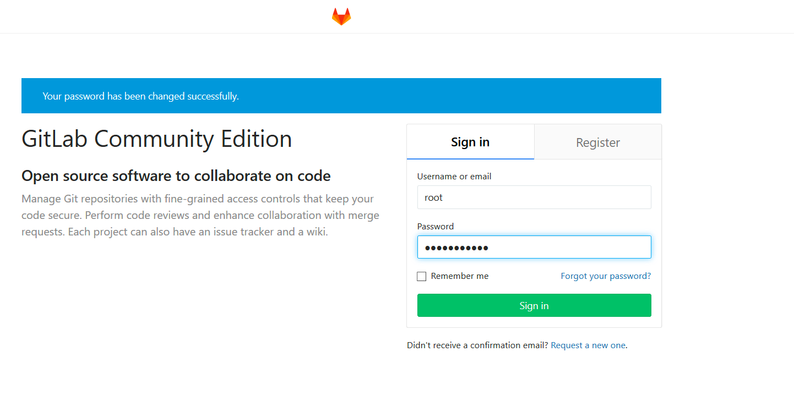
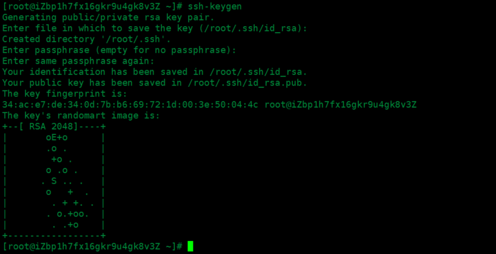
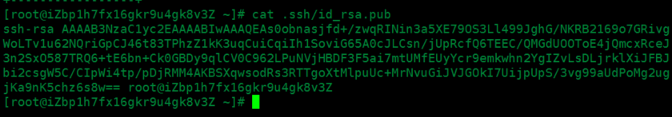
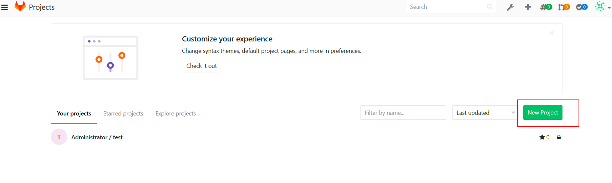
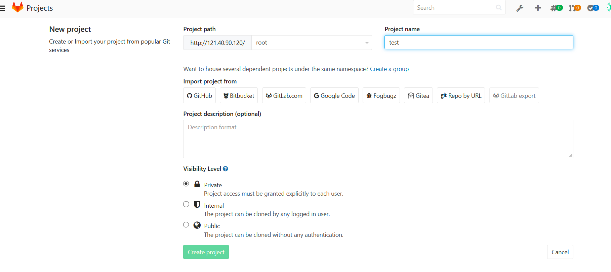
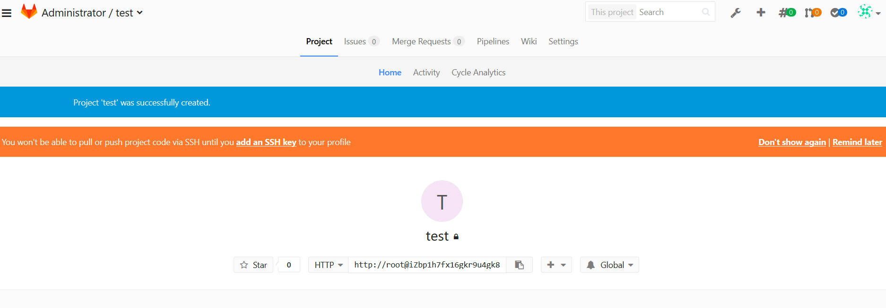
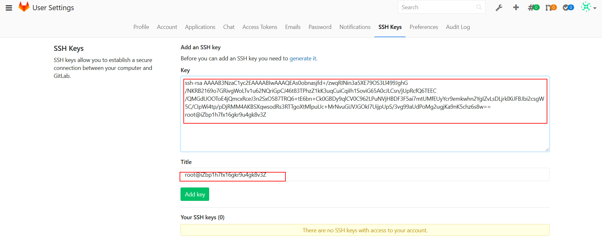
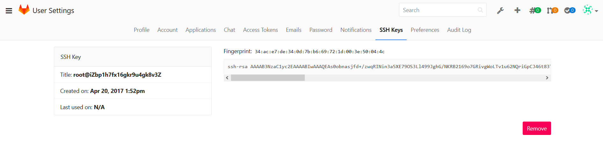

### 1. 前言
 以前在自己服务器使用的是Gitblit（http://gitblit.github.io/gitblit）,  这个只需要在服务器上启动一个tomcat,然后将下载的Gitblit的war包放置在tomcat容器里面运行即可访问。

但是由于gitblit没有CI/CD的功能，于是自己就在网上找了一些博客搭建gitblit，在这里记录一下搭建的过程。

### 2. 安装步骤
1. 配置yum源
    ```shell
    vim /etc/yum.repos.d/gitlab-ce.repo
    ```
   
2. 增加一下配置
    ```properties
    [gitlab-ce]
    name=Gitlab CE Repository
    baseurl=https://mirrors.tuna.tsinghua.edu.cn/gitlab-ce/yum/el$releasever/
    gpgcheck=0
    enabled=1
    ```
    

3. 更新本地yum缓存
    ```shell
    yum makecache
    ```
   
4. 安装GitLab社区版
    ```shell
    yum install gitlab-ce                    #自动安装最新版本
   
    sudo yum install gitlab-ce-x.x.x         #安装指定版本
    ```
   
5. 更改默认端口配置(默认为80端口)    
    ```shell
    sudo vim /etc/gitlab/gitlab.rb
    ```
   修改如下配置：
    ```text
    external_url 'http://ip:8888'              #填写自己的主机ip
    puma['port'] = 8888                       #如果gitlab是13版本之前请求修改  union['port']=8888
    nginx['listen_port'] = 8888
    ```
    
6. 配置gitlab-http.conf 
    ```shell
    sudo vim /var/opt/gitlab/nginx/conf/gitlab-http.conf
    ```
    修改如下：
    ```text
    server {
        listen *:8888;                   #和上面保持一致
        server_name ip                   #填写自己的ip
    }
    ```
   
7. 放开端口
    ```shell
    #开放8888端口
    sudo firewall-cmd --add-port=8888/tcp --permanent
    
    #重新加载防火墙
    sudo firewall-cmd --reload
    ```
   
8. 修改配置后重新加载配置文件
    ```shell
    sudo gitlab-ctl reconfigure
    ```
   
9. 重新gitlab
    ```shell
    sudo gitlab-ctl restart
    ```
   

10. 修改管理员登录密码
    - 进入gitlab-rails控制台
        ```shell
        sudo gitlab-rails console
        ```
    - 查找root账号(默认只有一个root用户)
        ```shell
        u=User.where(id:1).first
        ```
    - 修改密码
      ```shell
      u.password='xiaoyuge123'
      ```
    - 再次确认密码
      ```shell
      u.password_confirmation='xiaoyuge123'
      ```
    - 保存
        ```shell
        u.save!
        ```
      
    
11. 浏览器访问：http://ip:8888
    
    至此，Gitlab搭建完毕！


### 3. GitLab常用命令
```shell
sudo gitlab-ctl start    # 启动所有 gitlab 组件；
sudo gitlab-ctl stop        # 停止所有 gitlab 组件；
sudo gitlab-ctl restart        # 重启所有 gitlab 组件；
sudo gitlab-ctl status        # 查看服务状态；
sudo gitlab-ctl reconfigure        # 启动服务；
sudo vim /etc/gitlab/gitlab.rb        # 修改默认的配置文件；
gitlab-rake gitlab:check SANITIZE=true --trace    # 检查gitlab；
sudo gitlab-ctl tail        # 查看日志；
gitlab-ctl show-config           #查看gitlab配置信息
```

### 4. 邮件配置
1. 修改配置
    ```shell
    sudo vim /etc/gitlab/gitlab.rb
    ```
    新增以下内容
    ```properties
    gitlab_rails['smtp_enable'] = true
    gitlab_rails['smtp_address'] = "mail.midea.com"
    gitlab_rails['smtp_port'] = 994
    gitlab_rails['smtp_user_name'] = "发信邮箱"
    gitlab_rails['smtp_password'] = "发信邮箱密码"
    gitlab_rails['smtp_domain'] = "xxx.com"
    gitlab_rails['smtp_authentication'] = "login"
    gitlab_rails['smtp_enable_starttls_auto'] = true
    gitlab_rails['smtp_tls'] = true
    user['git_user_email'] = "发信邮箱"
    gitlab_rails['gitlab_email_from'] = '发信邮箱'
    ```
   
2. 测试邮件配置是否生效
    ```shell
    #重新加载配置文件
    sudo gitlab-ctl reconfigure
   
    #查看console
    sudo gitlab-rails console
    ```
    ```shell
    --------------------------------------------------------------------------------
    Ruby: ruby 2.7.2p137 (2020-10-01 revision 5445e04352) [x86_64-linux]
    GitLab: 13.7.1 (c97c8073a0e) FOSS
    GitLab Shell: 13.14.0
    PostgreSQL: 12.4
    --------------------------------------------------------------------------------
    Loading production environment (Rails 6.0.3.3)
    irb(main):001:0> Notify.test_email('xxxx@midea.com','test','test').deliver_now
    Notify#test_email: processed outbound mail in 1.4ms
    Delivered mail 5ff2cb5082e2b_e45eb53d484754@devops.mail (673.8ms)
    Date: Mon, 04 Jan 2021 08:01:20 +0000
    From: GitLab <xxx@midea.com>
    Reply-To: GitLab <noreply@ip>
    To: xxxx@midea.com
    Message-ID: <5ff2cb5082e2b_e45eb53d484754@devops.mail>
    Subject: test
    Mime-Version: 1.0
    Content-Type: text/html;
    charset=UTF-8
    Content-Transfer-Encoding: 7bit
    Auto-Submitted: auto-generated
    X-Auto-Response-Suppress: All
    <!DOCTYPE html PUBLIC "-//W3C//DTD HTML 4.0 Transitional//EN" "http://www.w3.org/TR/REC-html40/loose.dtd">
    <html><body><p>test</p></body></html>
    => #<Mail::Message:199260, Multipart: false, Headers: <Date: Mon, 04 Jan 2021 08:01:20 +0000>, <From: GitLab <xxx@midea.com>>, <Reply-To: GitLab <noreply@ip>>, <To: xxxx@midea.com>, <Message-ID: <5ff2cb5082e2b_e45eb53d484754@devops.mail>>, <Subject: test>, <Mime-Version: 1.0>, <Content-Type: text/html; charset=UTF-8>, <Content-Transfer-Encoding: 7bit>, <Auto-Submitted: auto-generated>, <X-Auto-Response-Suppress: All>>
    出现以上信息说明配置成功。
    ```


### 5. 性能调优
```shell
sudo vim /etc/gitlab/gitlab.rb
```
新增以下内容并保存退出：
```properties
unicorn['worker_processes'] = 2                         #官方建议值为CPU核数+1（服务器只部署gitLab的情况下），可提高服务器响应速度，此参数最小值为2，设为1服务器可能卡死
unicorn['work_timeout'] = 60                            #设置超时时间
unicorn['worker_memory_limit_min'] = "200 * 1 << 20"    #减少最小内存
unicorn['worker_memory_limit_max'] = "300 * 1 << 20"    #减少最大内存
postgresql['shared_buffers'] = "128MB"                  #减少数据库缓存
postgresql['max_worker_processes'] = 6                  #减少数据库并发数
sidekiq['concurrency'] = 15                             #减少sidekiq并发数
```
```shell
#每次修改了配置，都需要重新加载
sudo gitlab-ctl reconfigure

#重启
sudo gitlab-ctl restart
```


### 6. GitLab使用

#### 6.1 创建Project
1. 安装Git工具
    ```shell
    yum install git
    ```
   
2. 生成密钥文件：使用ssh-keygen声哼密钥文件
    ```shell
    ssh/id_rsa.pub
    ```
   
   

3. 在Gitlab上创建一个project
   
   
   
   
4. 添加ssh key导入步骤2中生成的密钥文件内容
   
   
   ssh key添加完成：
   


#### 6.2 配置git
1. 配置Git仓库人员
   ```shell
    git config --global user.name "xiaoyuge"
    ```
   - local（默认，高级优先）：只影响本地仓库
   - global(中优先级)：只影响所有当前用户的git仓库
   - system（低优先级）：影响到全系统的git仓库
    
2. 配置Git仓库人员email
   ```shell
    git config --global user.email "xiaoyuge0318@qq.com"
    ```
3. 克隆项目
    ```shell
    git clone git@fase11h12dsa24fdv3Q:root/test.git
    ```
   
#### 6.3 git常用命令
```shell
#查看某个命令文档
git help <command>
git <command> -h
git <command> --help


#初始化仓库
git init 

#添加文件内容到暂存区（同时文件被跟踪）
git add

#添加所有文件
git add .
	
git rm --cached    				        #仅从暂存区删除
git rm 							#从暂存区与工作目录同时删除
git rm $(git ls-files --deleted)		        #删除所有被跟踪，但是在工作目录被删除的文件


git -commit -m 'first commit' 			        #从暂存区提交 -m：注释
git commit -a -m 'full commit'			        #从工作区提交


git log    						#查看提交历史记录

git log --online
git log --color --graph

git diff 						#工作区与暂存区的差异
git diff  --cached [<reference>]                        #暂存区与某次提交的差异，默认为HEAD
git diff  [<reference>]  				#工作区与某次提交的差异，默认为HEAD

git checkout -- <file>  			        #将文件内容从暂存区复制到工作目录

#撤销暂存区内容
git reset HEAD <file>  				        #将文件内容从上次提交复制到缓存区
git checkout HEAD -- <file> 			        #将内容从上次提交复制到工作目录


#对状态的跟踪:git中有两个状态：内容状态和文件状态，
#内容状态标示内容文件的改变，有三个区域：工作目录，暂存区和提交区
#文件状态有两个状态：已跟踪和未跟踪
git status
```


分支操作：
```shell
git branch <branchName> 				#创建一个分支
git branch -d <branchName> 			        #删除一个分支
git branch -v 			                        #显示所有分支信息

git checkout <branchName> 			       #通过移动HEAD检出版本，可用于切换分支
git checkout -b <branchName> 			       #创件一个分支并切换
git checkout <reference> 			       #将其移动到一个引用
git checkout - 			                       #恢复到上一个分支

git reset   			                       #将当前分支回退到历史某个版本
git reset --mixed <commit> 			       #(默认)
git reset --soft<commit> 
git reset --hard <commit>
```

---

### 7. 常见问题
1. gitlab本身采用gitlab.example.com:80端口，如安装前服务器有启用80，安装完访问会报错。需更改gitlab的默认端口。
   修改vim /etc/gitlab/gitlab.rb：external_url 'http://localhost:8888

    如果就想用80端口，那没问题。如果更改了端口，后边可以自行调整nginx配置文件进行nginx反向代理设置。

2. 日志位置：/var/log/gitlab 可以进去查看访问日志以及报错日志等，供访问查看以及异常排查。

3. gitlab内存消耗过大，频繁出现502：  http://www.360doc.com/content/22/0130/08/65839659_1015422932.shtml

   
    gitlab-ctl tail #查看所有日志
   
    gitlab-ctl tail nginx/gitlab_access.log #查看nginx访问日


参考博客：https://blog.csdn.net/yzd524850313/article/details/113118193
参考博客：https://zhuanlan.zhihu.com/p/338882906
        
