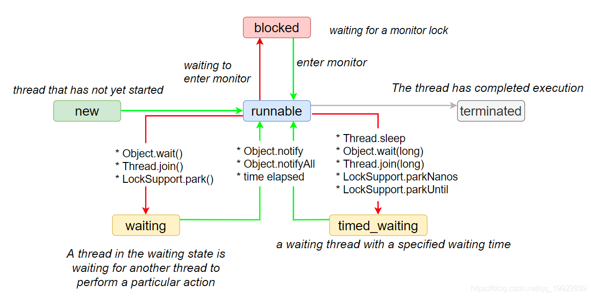
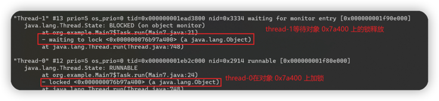
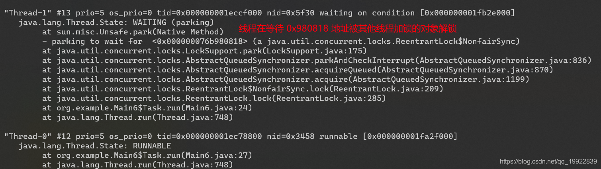
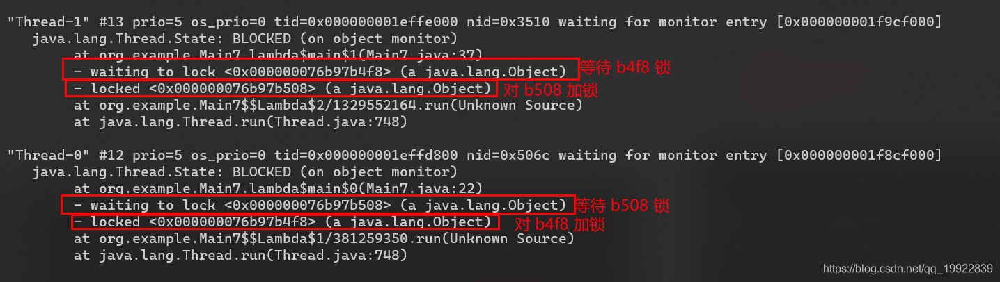
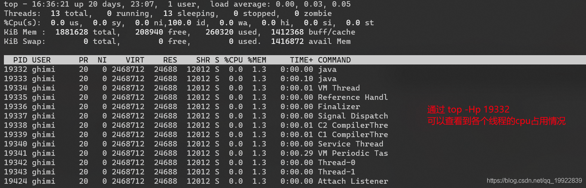
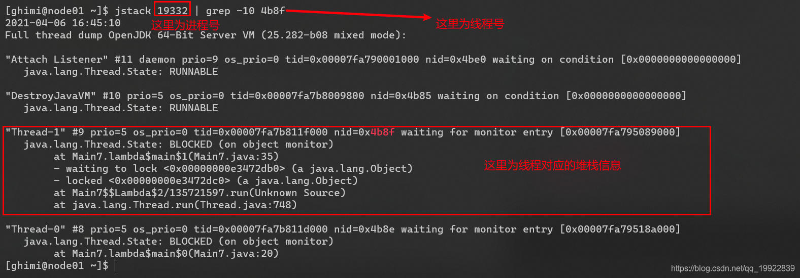
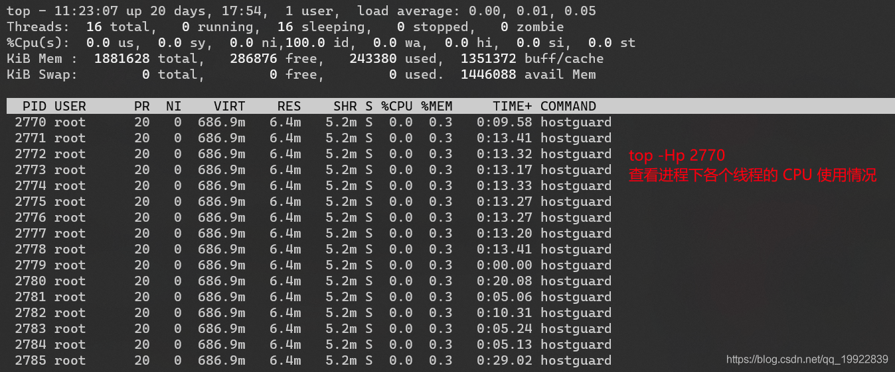

###  1. 定义
**jstack** 是Java虚拟机自带的一种堆栈跟踪工具。

**jstack** 用于生成java虚拟机当前时刻的线程快照。线程快照是当前java虚拟机内每一条线程正在执行的方法堆栈的集合，生成快照的主要目的是定位线程出现长时间停顿的原因，
如**线程间死锁**、**死循环**、**请求外部资源导致的长时间的等待**。

### 2. 用法
首先使用**jps** 命令查看需要打印线程栈的进程号

其中进程号2602 DoProject是我测试的程序，使用jstack查看下：
```shell
jstack 2602  #打印2602进程的堆栈信息
```
```java
xiaoyuge@xiaoyuge ~ % jstack 2602
 2022-05-06 21:26:59
 Full thread dump Java HotSpot(TM) 64-Bit Server VM (25.281-b09 mixed mode):

 "Attach Listener" #15 daemon prio=9 os_prio=31 tid=0x00007f872b9a1000 nid=0x4c07 waiting on condition [0x0000000000000000]
   java.lang.Thread.State: RUNNABLE

 "mysql-cj-abandoned-connection-cleanup" #13 daemon prio=5 os_prio=31 tid=0x00007f872b99e800 nid=0xa803 in Object.wait() [0x000070000bba0000]
   java.lang.Thread.State: TIMED_WAITING (on object monitor)
	at java.lang.Object.wait(Native Method)
	- waiting on <0x00000005c000c5d8> (a java.lang.ref.ReferenceQueue$Lock)
	at java.lang.ref.ReferenceQueue.remove(ReferenceQueue.java:144)
	- locked <0x00000005c000c5d8> (a java.lang.ref.ReferenceQueue$Lock)
	at com.mysql.cj.jdbc.AbandonedConnectionCleanupThread.run(AbandonedConnectionCleanupThread.java:85)
	at java.util.concurrent.ThreadPoolExecutor.runWorker(ThreadPoolExecutor.java:1149)
	at java.util.concurrent.ThreadPoolExecutor$Worker.run(ThreadPoolExecutor.java:624)
	at java.lang.Thread.run(Thread.java:748)
 "main" #1 prio=5 os_prio=31 tid=0x00007f8729808800 nid=0x1003 runnable [0x000070000a3d5000]
        java.lang.Thread.State: RUNNABLE
        at java.io.UnixFileSystem.list(Native Method)
        at java.io.File.list(File.java:1122)
        at java.io.File.listFiles(File.java:1207)
        at com.tenly.maintenance.analysis.jk.TruckFileReadThread.getAllFiles(TruckFileReadThread.java:36)
        at com.tenly.maintenance.analysis.jk.TruckFileReadThread.getAllFiles(TruckFileReadThread.java:40)
        at com.tenly.maintenance.analysis.jk.TruckFileReadThread.run(TruckFileReadThread.java:113)
        at com.tenly.maintenance.analysis.jk.TruckFileListener.runListen(TruckFileListener.java:20)
        at com.hive.cin.DoProject.runMain(DoProject.java:31)
        at com.hive.cin.DoProject.main(DoProject.java:11)
```
可以看到控制台打印出了线程的信息以及线程对应的堆栈信息。下面我们对打印结果进行逐行分析：
#### 1. java.lang.Thread.State: RUNNABLE 线程状态
    首先分析的是线程状态，在Java中线程分别对应不同的状态，从创建线程的 NEW 到销毁时的 TERMINATED状态。
    
```java
//这是java.lang.Thread.State源码
public enum State {
    /**
     * Thread state for a thread which has not yet started.
     * 尚未启动的线程的线程状态。
     */
    NEW,
    /**
     * Thread state for a runnable thread.  A thread in the runnable
     * state is executing in the Java virtual machine but it may
     * be waiting for other resources from the operating system
     * such as processor.
     * 可运行线程的线程状态。处于可运行状态的线程正在Java虚拟机中执行，但它可能正在等待来自操作系统的其他资源，例如处理器。
     */
    RUNNABLE,
    /**
     * Thread state for a thread blocked waiting for a monitor lock. A thread in the blocked state is waiting for a monitor lock to enter a synchronized block/method or reenter a synchronized block/method after calling Object.wait() .
     * 等待监视器锁定的被阻止线程的线程状态。处于阻塞状态的线程正在等待监视器锁进入同步块/方法，或在调用对象后重新进入同步块/方法。
     */
    BLOCKED,

    /**
     * Thread state for a waiting thread. A thread is in the waiting state due to calling one of the following methods:
     * 1.Object.wait() with no timeout 
     * 2.Thread.join() with no timeout 
     * 3.LockSupport.park()
     *
     * A thread in the waiting state is waiting for another thread to perform a particular action.
     * For example, a thread that has called Object.wait() on an object is waiting for another thread to call
     * Object.notify or Object.notifyAll() on that object. A thread that has called Thread.join()
     * is waiting for a specified thread to terminate.
     */
    WAITING,

    /**
     * Thread state for a waiting thread with a specified waiting time. A thread is in the timed waiting state due to calling one of
     * the following methods with a specified positive waiting time:
     * 1.Thread.sleep()
     * 2.Object.wait() with timeout
     * 3.Thread.join() with timeout
     * 4.LockSupport.parkNanos()
     * 5.LockSupport.parkUntil()
     */
    TIMED_WAITING,
    /**
     * Thread state for a terminated thread. The thread has completed execution.
     */
    TERMINATED;
}
```
使用测试代码查看线程状态转化
```java
private static boolean exit = false;
// 在 new 一个线程对象后，该线程的状态为 NEW 状态
Thread thread1 = new Thread(()->{
	while(!exit){
		// 在执行线程中代码时，线程的状态为 RUNNABLE 状态
		System.out.println("current time is "+new Date())
		// 在执行睡眠代码时，线程会进入 TIMED_WAITTING 状态，并让出 CPU ，等待时间唤醒
		TimeUnit.SECONDS.sleep(1);
	}
});
// 在 start 之后，该线程的状态会进入 RUNNABLE 状态，并且等待系统调度后运行
thread1.start();
```

通过上述线程状态转移图可以帮助我们分析当前线程所处的状态以及他们运行逻辑。

我们通过 jstack查看线程栈信息时通常看到的最多的是RUNNABLE,BLOCKED,WAITING和TIMED_WAITING这几种状态，NEW和TERMINATED状态很难捕捉到。

#### 2. "main" #1 分析
以线程名称开头，所有线程都会在第一行打印一些当前线程的运行信息。
```java
 "main" #1 prio=5 os_prio=31 tid=0x00007f8729808800 nid=0x1003 runnable [0x000070000a3d5000]
        java.lang.Thread.State: RUNNABLE
        at java.io.UnixFileSystem.list(Native Method)
        at java.io.File.list(File.java:1122)
        at java.io.File.listFiles(File.java:1207)
        at com.tenly.maintenance.analysis.jk.TruckFileReadThread.getAllFiles(TruckFileReadThread.java:36)
        at com.tenly.maintenance.analysis.jk.TruckFileReadThread.getAllFiles(TruckFileReadThread.java:40)
        at com.tenly.maintenance.analysis.jk.TruckFileReadThread.run(TruckFileReadThread.java:113)
        at com.tenly.maintenance.analysis.jk.TruckFileListener.runListen(TruckFileListener.java:20)
        at com.hive.cin.DoProject.runMain(DoProject.java:31)
        at com.hive.cin.DoProject.main(DoProject.java:11)
```
- main：线程名称
- \#1：当前线程ID，从 main线程开始，JVM 根据线程创建的顺序为线程编号
- prio：是 priority 优先级的缩写，表明了当前线程的优先级，取值范围【1～10】，默认为 5，在虚拟机进行线程调度的时候会参考该优先级为线程分配计算资源，数值越小优先级越高，一般不设置直接使用默认的优先级。
- os_prio：线程对应系统的优先级
- nid： 本地线程编号， NativeID的缩写，对应JVM虚拟机中线程映射在操作系统中的线程编号，可以通过 top 命令查看进程对应的线程情况进行相关映射

##### nid的作用以及使用方式
nid表示线程对应的系统本地的线程编号
1. 当一个线程占有一个锁的时候，线程堆栈会打印一个－locked<0x22bffb60>
    
   ```java
    // 示例代码
    public class Main6 {
        private static ReentrantLock lock = new ReentrantLock();
    
        public static void main(String[] args) {
            final Thread task1 = new Thread(new Task());
            final Thread task2 = new Thread(new Task());
            task1.start();
            task2.start();
        }
        private static class Task implements Runnable {
            @Override
            public void run() {
                lock.lock();
                int i = 0;
                while (true) {
                    i++;
                }
            }
        }
    }
   ```

2. 当一个线程正在等在其他线程释放该锁，线程堆栈会打印一个－waiting to lock<0x22bffb60>
    
 
  
3. 当一个线程占有一个锁，但又执行在该锁的wait上，线程堆栈中首先打印blocked,然后打印－waiting on <0x22c03c60>
    
   ```java
    // 示例代码
    public class Main7 {
        private static Object lock1 = new Object();
        private static Object lock2 = new Object();
    
        public static void main(String[] args) {
            final Thread task1 = new Thread(() -> {
                synchronized (lock1) {
                    try {
                        TimeUnit.SECONDS.sleep(1);
                    } catch (InterruptedException e) {
                        e.printStackTrace();
                    }
                    synchronized (lock2) {
                        int i = 0;
                        while (true) {
                            i++;
                        }
                    }
                }
            });
            final Thread task2 = new Thread(() -> {
                synchronized (lock2) {
                    try {
                        TimeUnit.SECONDS.sleep(1);
                    } catch (InterruptedException e) {
                        e.printStackTrace();
                    }
                    synchronized (lock1) {
                        int i = 0;
                        while (true) {
                            i++;
                        }
                    }
                }
            });
            task1.start();
            task2.start();
        }
    }
   ```


### 3. jstack，top -Hp获取目标线程的CPU使用情况
通过 jstack 可以打印出当前进程的线程栈信息，但是我们无法获取到这些线栈的 CPU 占用情况，此时，我们可以使用另外一个bash命令 top 去排查高 CPU 占用的线程。
首先使用 jps 命令获取目标 java 进程号
```shell
jps
```
然后使用 top -Hp <pid>查看该进程下对应线程的CPU 使用情况：



这里如果我们想查看 PID为19343且线程名称为Thread-1 的堆栈信息的话，使用命令将 19343转化为**16进制**


接下来使用 jstack <pid> 查看线程堆栈信息：
```shell
jstack 19332 | grep -10 4b8f
```


由此我们可以看到目标线程的线程堆栈信息了。

使用 top -Hp <pid>查看目标进程下各个线程的 CPU 使用情况


也可以通过 使用 pstree 查看进程树、ps -Lf <pid>查看进程详细信息 等等。
