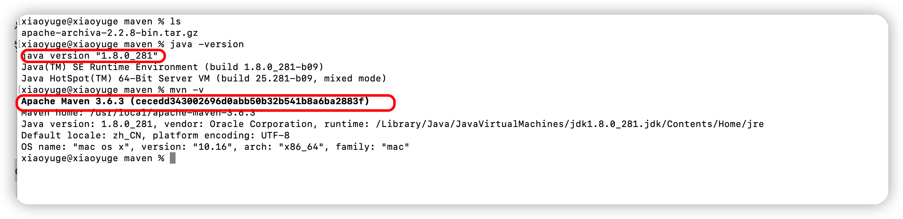
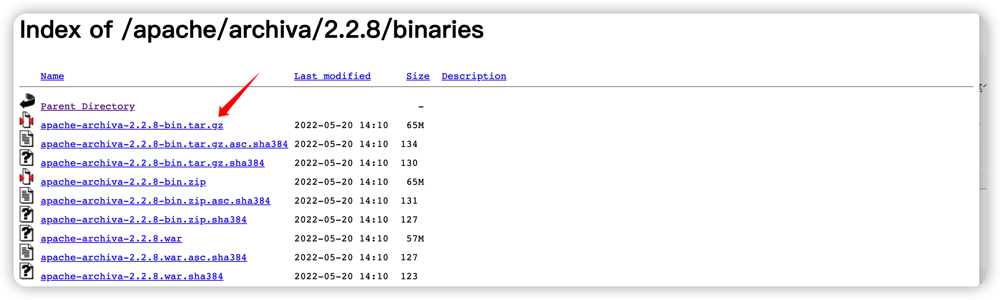
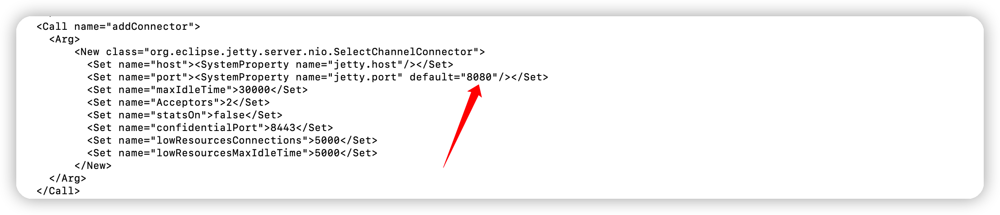
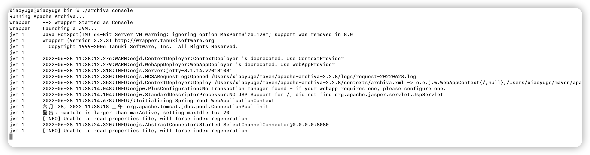
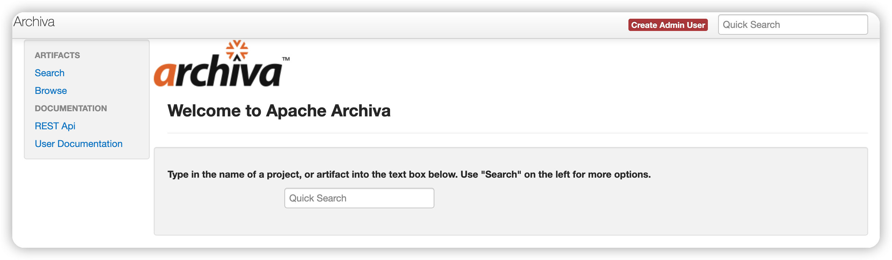
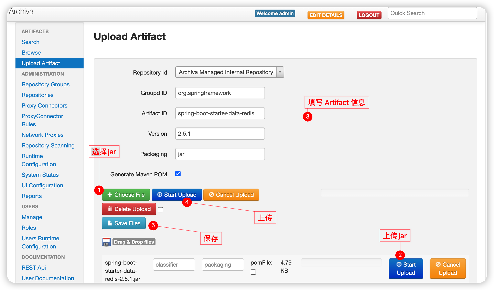
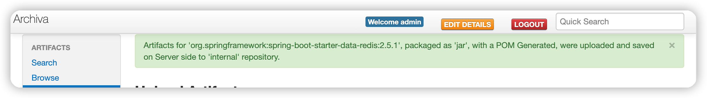
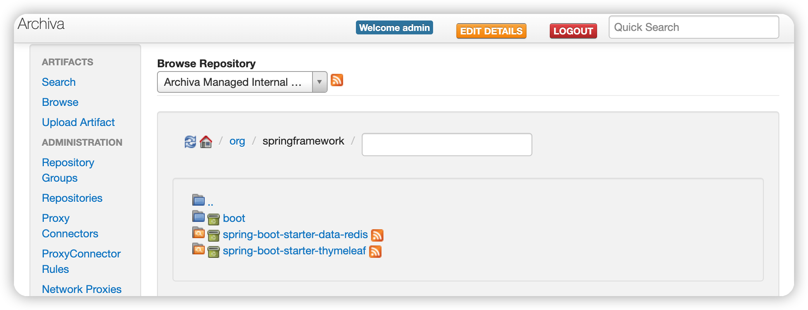
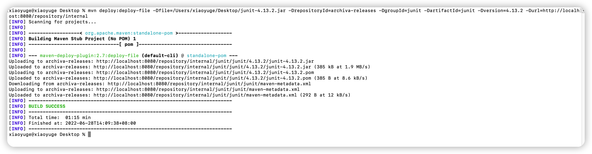
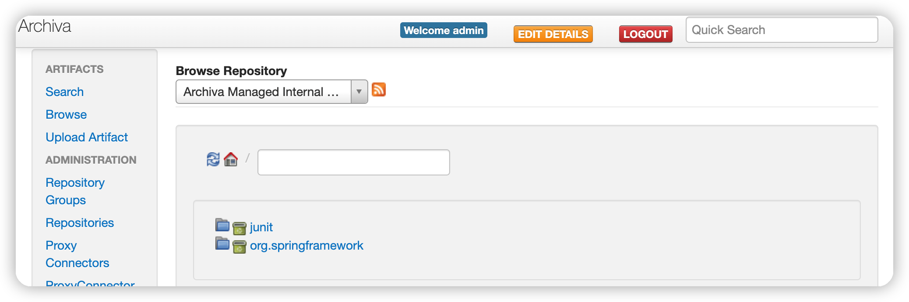

### 1. 搭建

1.   环境准备
    
     - JDK 1.8
       
     - Apache Archiva 2.2.8 
       
     - Apache-maven 3.6.3 （ https://maven.apache.org/download.cgi ）

     

2.   Apache Archiva安装文件下载

     ```
     archiva官网地址：https://archiva.apache.org/index.cgi#a
     下载地址：https://archiva.apache.org/download.cgi  （这个太慢了，几K/s，坑）
     
     镜像仓库：https://mirrors.tuna.tsinghua.edu.cn/apache/archiva
     
     建议从镜像仓库拉取！！！
     ```

     

3.   将下载的tar.gz包上传到服务器相应位置

4.   解压tar.gz包

     ```shell
     tar -zxvf ./apache-archiva-2.2.8-bin.tar.gz 
     chmod 775 ./apache-archiva-2.2.8
     ```

5.   修改端口（8080默认），如不需要，请跳过

     

6.   启动

     ```shell
     cd /User/xiaoyuge/maven/apache-archiva-2.2.8/bin
     ./archiva start 			#执行启动命令，建议第一次启动使用：./archiva console 可以打印启动信息
     ./archiva stop				#停止命令
     ```

     
	     
     各版本操作系统下详细安装及服务注册参照：http://archiva.apache.org/docs/2.2.8/adminguide/standalone.html

7.   启动成功，访问`maven`服务器地址: http://ip:8080

     

8.   点击右上角的`Create Admin User`创建管理员账号

9.   将archiva 在Centos中安装成服务(root执行)

     ```shell
     ln -sf /Users/xiaoyuge/maven/apache-archiva-2.2.8/bin/archiva /etc/init.d/archiva
     ```

     这样就可以通过`service`启动

     ```shell
     service archiva start
     service archiva stop
     ```


## 2. 上传私有jar包

1.   访问：http://localhost:8080/#upload,   上传私有jar包到仓库

     - `Repository Id` 选择 `Archiva Managed Internal Repository `则是把依赖作为正式版. 查看地址：http://host:port/repository/internal
     - `Repository Id` 选择` Archiva Managed Snapshot `则是把依赖作为快照版.	查看地址：http://host:port/repository/snapshots

     按照以下步骤依次操作：

     

     保存后，提示以下信息表示上传成功！

     

     在左侧菜单栏`Browse`中查看上传的jar ，如下所示：

     

2.   也可以通过命令的方式上传（[需要配置maven 的setting.xml](#setting)）

     在`/Users/xiaoyuge/Desktop`有一个junit-4.13.2.jar，使用`mvn deploy`命令上传如下

     ```shell
     mvn deploy:deploy-file -Dfile=/Users/xiaoyuge/Desktop/junit-4.13.2.jar -DrepositoryId=archiva-releases -DgroupId=junit -DartifactId=junit -Dversion=4.13.2 -Durl=http://localhost:8080/repository/internal
     ```
     命令解释：
     - -Dfile ：要上传到私服的jar包， jar包全路径
     - -DrepositoryId： 仓库ID，要与maven 的setting.xml配置文件中的server一致，否则401；
     - -DgroupId： groupId主包名 
     - -DartifactId： 项目名
     - -Dversion：版本号
     - -Durl：远程仓库地址

     上传结果如下如所示：

     

     同时在私服仓库中可以查看到刚上传的`jar`

     

## 3. 项目使用

### 3.1 非Springboot项目

<span id='setting'>配置maven中的setting.xml文件，配置如下：</span>

```xml
<settings xmlns="http://maven.apache.org/SETTINGS/1.0.0" xmlns:xsi="http://www.w3.org/2001/XMLSchema-instance"    xsi:schemaLocation="http://maven.apache.org/SETTINGS/1.0.0 http://maven.apache.org/xsd/settings-1.0.0.xsd">
  <localRepository>\Common\my_repository</localRepository>
	<servers>
		<server>
		  <id>archiva-releases</id><!--要和mvn命令中的  -DrepositoryId=releases 一致-->
		  <username>admin</username>
		  <password>HEALTH456</password>
		</server>
		<server>
		  <id>archiva-snapshots</id><!--要和mvn命令中的  -DrepositoryId=releases 一致-->
		  <username>admin</username>
		  <password>HEALTH456</password>
		</server>
	</servers>
	<mirrors>
		<!--阿里云镜像地址-->	
		<mirror> 
			 <id>alimaven</id> 
			 <name>aliyun maven</name> 
			 <url>http://maven.aliyun.com/nexus/content/groups/public/</url> 
			 <mirrorOf>central</mirrorOf> 
		</mirror> 

		<!-- 私服地址 start -->
		<mirror> <!-- 正式版 -->
		  <id>archiva-releases</id> 
		  <mirrorOf>internal</mirrorOf> 
		  <url>http://ip:8000/repository/internal</url> 
		</mirror>
		<mirror> <!-- 快照版 -->
		  <id>archiva-snapshots</id>
		  <mirrorOf>snapshots</mirrorOf> 
		  <url>http://ip:8000/repository/snapshots</url> 
		</mirror>
	</mirrors>
  <profiles>
      <profile>
          <activation>
            <activeByDefault>true</activeByDefault>
          </activation>
          <repositories>
             <!-- 正式版 -->
              <repository>
                <id>internal</id>
                <name>Archiva Managed Internal Repository</name>
                <url>http://ip:8000/repository/internal</url>
                <releases>
                  <enabled>true</enabled>
                </releases>
                <snapshots>
                  <enabled>false</enabled>
                </snapshots>
              </repository>
            
							<!-- 快照版 -->
              <repository>
                <id>snapshots</id>
                <name>Archiva Managed Snapshots Repository</name>
                <url>http://ip:8000/repository/snapshots</url>
                <releases>
                  <enabled>false</enabled>
                </releases>
                <snapshots>
                  <enabled>true</enabled>
                </snapshots>
              </repository>
          </repositories>
        </profile>
  </profiles>
  <!-- 私服地址END -->
</settings>	

```

### 3.2 SpringBoot工程pom.xml

```xml
<mirrors>
		<!--阿里云镜像地址-->	
		<mirror> 
			 <id>alimaven</id> 
			 <name>aliyun maven</name> 
			 <url>http://maven.aliyun.com/nexus/content/groups/public/</url> 
			 <mirrorOf>central</mirrorOf> 
		</mirror> 

		<!-- 私服地址 start -->
		<mirror> <!-- 正式版 -->
		  <id>archiva-releases</id> 
		  <mirrorOf>internal</mirrorOf> 
		  <url>http://ip:8000/repository/internal</url> 
		</mirror>
		<mirror> <!-- 快照版 -->
		  <id>archiva-snapshots</id>
		  <mirrorOf>snapshots</mirrorOf> 
		  <url>http://ip:8000/repository/snapshots</url> 
		</mirror>
	</mirrors>
  <profiles>
    <profile>
      <activation>
        <activeByDefault>true</activeByDefault>
      </activation>
      <repositories>
        <!-- 正式版 -->
        <repository>
          <id>internal</id>
          <name>Archiva Managed Internal Repository</name>
          <url>http://ip:8000/repository/internal</url>
          <releases>
            <enabled>true</enabled>
          </releases>
          <snapshots>
            <enabled>false</enabled>
          </snapshots>
        </repository>

        <!-- 快照版 -->
        <repository>
          <id>snapshots</id>
          <name>Archiva Managed Snapshots Repository</name>
          <url>http://ip:8000/repository/snapshots</url>
          <releases>
            <enabled>false</enabled>
          </releases>
          <snapshots>
            <enabled>true</enabled>
          </snapshots>
        </repository>
      </repositories>
</profile>
```


