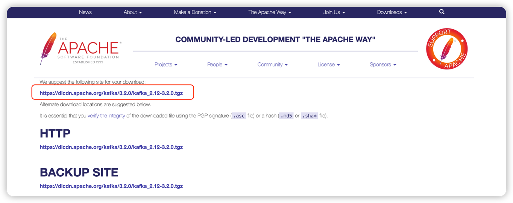
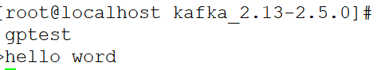
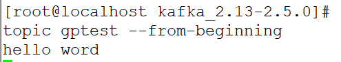

### 1. JDK依赖
请参考这篇博客：[Linux安装JDK以及配置](https://xiaoyuge.work/jdk-install/)
### 2. 下载解压Kafka
下载地址：https://kafka.apache.org/downloads，  点击相应的版本，下载Binary 二进制版本而不是源码
我这里下载的是3.2.0版本（https://www.apache.org/dyn/closer.cgi?path=/kafka/3.2.0/kafka_2.12-3.2.0.tgz）

```shell
cd /usr/local/tools
wget https://dlcdn.apache.org/kafka/3.2.0/kafka_2.12-3.2.0.tgz
tar -xzvf kafka_2.12-3.2.0.tgz
cd kafka_2.12-3.2.0
```

### 3. 启动zookeeper(默认端口2181)
kafka需要依赖ZK，安装包中已经自带了一个ZK，也可以改成指定已运行的ZK。
如果改成指定的ZK需要修改修改 kafka 安装目录下的 config/server.properties 文件中的 zookeeper.connect 。这里使用自带的ZK。

后台启动zk
```shell
nohup ./bin/zookeeper-server-start.sh config/zookeeper.properties >> zookeeper.nohup &
```
检查zookeeper是否启动成功：
```shell
ps -ef|grep zookeeper
```

### 4. 启动kafka（默认端口9092）
1. 修改相关配置
    ```shell
    vim config/server.properties
    ```
    ```properties
    broker.id=1                 #Broker ID启动以后就不能改了
    listeners=PLAINTEXT://192.168.44.160:9092       #取消注释，改成本机IP：

    num.partitions=1                #num.partitions后面增加2行。
    auto.create.topics.enable=true          #发送到不存在topic自动创建
    delete.topic.enable=true                #允许永久删除topic
    ```
   
2. 后台启动kafka
    ```shell
    nohup ./bin/kafka-server-start.sh ./config/server.properties &
   
   
   #或者
   ./bin/kafka-server-start.sh -daemon ./config/server.properties
    ```

### 5. 创建Topic
创建一个名为`gptest`的`topic`，只有一个副本，一个分区：
```shell
sh bin/kafka-topics.sh --create --bootstrap-server localhost:2181 --replication-factor 1 --partitions 1 --topic gptest
```
查看已经创建的 topic：
```shell
sh bin/kafka-topics.sh -list -bootstrap-server localhost:2181
```
从Kafka 2.2版本开始，Kafka社区推荐用–bootstrap-server参数替换–zookeeper参数用于指定Kafka Broker。集群的多个IP端口用逗号,隔开

### 5. 启动Producer
打开一个窗口，在kafka解压目录下：
```shell
sh bin/kafka-console-producer.sh --broker-list localhost:9092 --topic gptest
```


### 6. 启动Consumer
在一个新的远程窗口中：
```shell
sh bin/kafka-console-consumer.sh --bootstrap-server localhost:9092 --topic gptest --from-beginning
```

### 7. Producer窗口发送消息
输入hello world 回车


消费者收到了消息：



### 8. 删除kafka全部数据
1、停止每台机器上的kafka；

2、删除kafka存储目录（server.properties文件log.dirs配置，默认为“/tmp/kafka-logs”）全部topic的数据目录；

3、删除zookeeper上与kafka相关的znode节点；除了/zookeeper

4、重启kafka。


