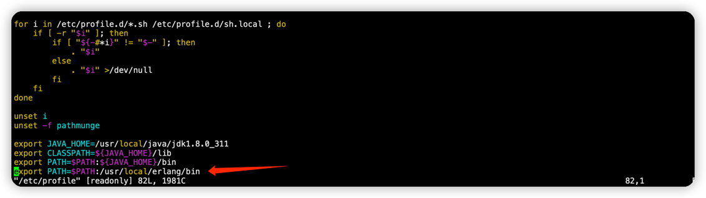
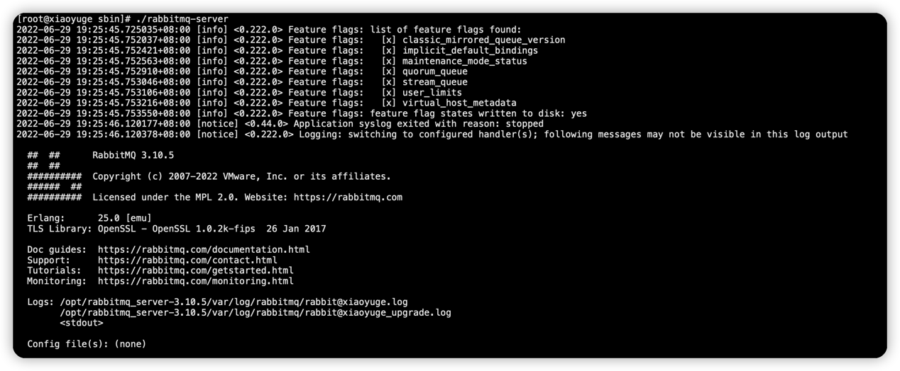
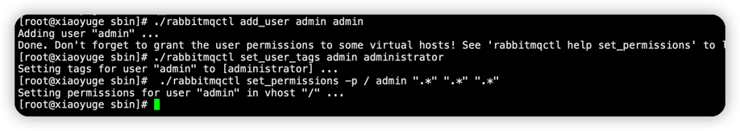
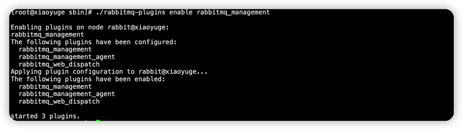
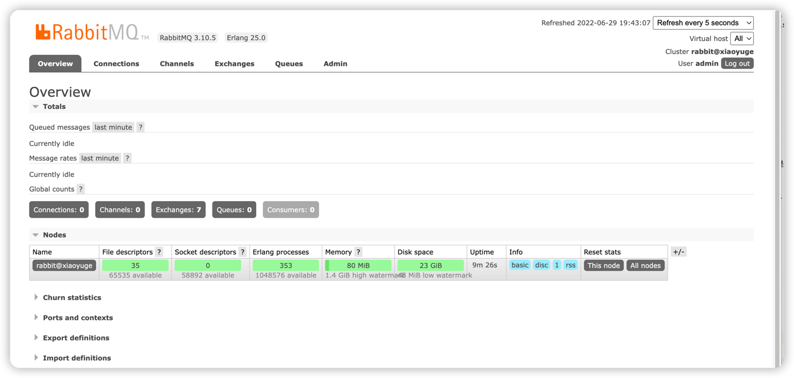
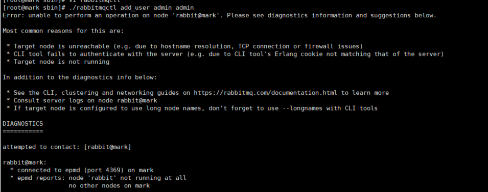

## 1. 软件安装方式
同一个软件有很多种不同的安装方式，Linux操作系统中安装软件有几种常见方式：
1. 源码编译安装：一般需要解压然后用make 、make install等命令，这种方式步骤比较复杂，编译时间长，而且结果不可控
2. RPM（RedHat Package Manager）是一个软件管理包，安装卸载变得简单了，但是无法解决软件包之间的依赖关系问题
3. YUM（Yellow dog Updater, Modified）是一个RPM的前端程序，可以自动解决软件的依赖关系。但是要注意版本的问题，默认从仓库中获取安装的不一定是最新版本
4. 不需要安装只要配置环境变量的（解压就可以使用）

CentOS是RedHat的分支，所以rpm和yum都可以使用

## 2. 版本关系
在RabbitMQ中需要注意两点：
1、RabbitMQ依赖于Erlang，需要先安装Erlang
2、Erlang和RabbitMQ版本有对应关系: http://www.rabbitmq.com/which-erlang.html


## 3. 安装Erlang 25
1. 安装依赖
    ```shell
    yum -y install gcc glibc-devel make ncurses-devel openssl-devel xmlto perl wget
    ```
2. 下载Erlang 25
   
    下载地址：https://www.erlang.org/downloads/25， 如果下载太慢了，可以把地址贴到迅雷里面，下载到本机，再上传到服务器
   ```shell
    wget http://erlang.org/download/otp_src_25.0.tar.gz
    tar -xvf otp_src_25.0.tar.gz
    cd otp_src_25.0
    ./configure --prefix=/usr/local/erlang
   ```
   configure的过程如果有err，要解决依赖的问题。
   如果有APPLICATIONS INFORMATION，DOCUMENTATION INFORMATION，没有影响。
   

3. 安装
    ```shell
    make && make install
    ```
    如果提示缺少socat
    ```shell
    yum install -y socat
    ```
   
4. 配置Erlang环境变量
    ```shell
    vim /etc/profile
    ```
    加一行
    ```shell
    #erlang的安装目录
    export PATH=$PATH:/usr/local/erlang/bin
    ```
    
   
    编译生效
    ```shell
    source /etc/profile
    ```
   
5. 验证Erlang是否安装成功
    ```shell
    erl
    ```
    输入erl，会出现版本信息，即安装成功
    


## 4. 安装RabbitMQ 3.10.5
   gitHub：https://github.com/rabbitmq/rabbitmq-server/releases
1. 下载
   ```shell
   wget https://github.com/rabbitmq/rabbitmq-server/releases/download/v3.10.5/rabbitmq-server-generic-unix-3.10.5.tar.xz
   xz -d rabbitmq-server-generic-unix-3.10.5.tar.xz
   tar -xvf rabbitmq-server-generic-unix-3.10.5.tar
   ```
   
2. 配置环境变量
   ```shell
   vim /etc/profile
   ```
   添加一行：
   ```shell
   export PATH=$PATH:/opt/rabbitmq_server-3.10.5/sbin
   ```
   编译生效
   ```shell
   source /etc/profile
   ```
   
3. 启动RabbitMQ
   ```shell
   # 后台启动rabbitmq服务
   cd /opt/rabbitmq_server-3.10.5/sbin
   ./rabbitmq-server -detached
    
   #或者
   ./rabbitmq-server start
   #或者
   service rabbitmq-server start
   ```
   启动的常见问题是端口被占用，kill rabbitmq 重启即可
   ```shell
   ps -ef | grep rabbit
   kill -9 进程号
   ./rabbitmq-server start
   ```
   如果启动报以下错误，且ps查看并没有相关进程
   ```
   could not bind to distribution port 25672, it is in use by another node:
   ```
   可以先停止，在重启
   ```shell
   ./rabbitmqctl stop
   ./rabbitmq-server start
   ```
   出现以下界面，表示启动成功
   
   
4. 添加用户
   
   因为guest用户只能在本机访问，添加一个admin用户，密码也是admin
   ```shell
   ./rabbitmqctl add_user admin admin
   ./rabbitmqctl set_user_tags admin administrator
   ./rabbitmqctl set_permissions -p / admin ".*" ".*" ".*"
   ```
   
   
5. 启动管理插件
   ```shell
   ./rabbitmq-plugins enable rabbitmq_management
   ```
   

6. 访问 http://ip:15672， 出现如下界面表示成功！
   
   输入管理员账号密码
   


## 5. 常见问题
1. 服务无法启动（5672端口未启动）
   RabbitMQ的服务是默认开机自启动的
   - 用不同方式启动RabbitMQ服务，命令行或者Windows本地服务管理
   比如windows： 在cmd中进入sbin目录（不要用powershell）,先停再起
     ```
     ./rabbitmq-server.bat stop
      ./rabbitmq-server.bat start
     ```
     
   - 可能是版本问题，注意Erlang和RabbitMQ版本要对应。 高版本的RabbitMQ无法安装在低版本的Erlang环境之上。 卸载重装，或者降低RabbitMQ版本
    
   - Erlang环境变量没有配置，erl命令没有结果。配置环境变量。

   - 可能是启动的用户没有管理员权限问题，以管理员启动

   - windows下重启失败可能是cmd没有管理员运行。

   - 端口启动了，服务没有启动
   

2. 管理界面不能访问 15672端口未启动
   
   - 先确定端口是否启动正常
      ```shell
      #Linux命令
      netstat -an|grep 15672
      
      
      #windows cmd命令
      netstat -an|findstr 15672
      ```
     
   - guest用户默认只能在本机访问，如果是本机访问虚拟机的服务，需要添加其他用户（比如admin），分配vhost权限才能远程访问
      ```shell
     ./rabbitmqctl add_user admin admin
      ./rabbitmqctl set_user_tags admin administrator
      ./rabbitmqctl set_permissions -p / admin ".*" ".*" ".*" 
     ```
     
3. 加入集群失败
   - 主节点是否启动成功，网络连接是否正常，ping hostname能不能ping通？
   - 25672端口，防火墙是否允许
   - erlang.cookie是否一致
   

4. 添加用户失败
   
   根据提示，可能有几个原因：
   1）hostname配置有问题
   2）erlang.cookie有问题
   3）服务没启动成功


