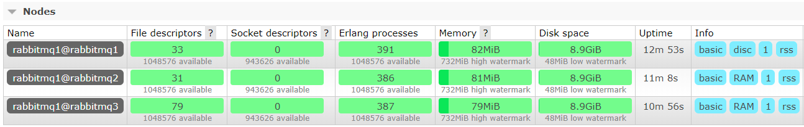

### 1. 安装 Docker
1. 更新yum源（如果你的网速慢这一步就别做了）
    ```shell
    sudo yum update
    ```
2. 添加仓库
    ```shell
    sudo yum-config-manager --add-repo https://mirrors.aliyun.com/docker-ce/linux/centos/docker-ce.repo
    ```
3. 查看最新版本
    ```shell
    #如果之前安装了docker，需要卸载旧版本
    yum list docker-ce --showduplicates | sort -r
    ```
4. 安装Docker CE版本
    ```shell
    yum install docker-ce -y 
   ```

### 2. 安装 RabbitMQ
1个磁盘节点+2个内存节点
1. 拉取RabbitMQ镜像（带managment）
    ```shel
    docker pull rabbitmq:3.7.17-management
    ```
2. 创建docker网络（让容器可以和主机通信）
    ```shell
    docker network create rabbitmqnet
    ```
3. 创建三个容器，端口分别是 5673 5674 5675 ，管理端口是 15673 15674 15675
    ```shell
    #英文引号
    docker run -d \
     --name=rabbitmq1 \
     -p 5673:5672 \
     -p 15673:15672 \
     -e RABBITMQ_NODENAME=rabbitmq1 \
     -e RABBITMQ_ERLANG_COOKIE='GUPAOEDUFORBETTERYOU' \
     -h rabbitmq1 \
     --net=rabbitmqnet \
     rabbitmq:management
    ```
    ```shell
    docker run -d \
     --name=rabbitmq2 \
     -p 5674:5672 \
     -p 15674:15672 \
     -e RABBITMQ_NODENAME=rabbitmq1 \
     -e RABBITMQ_ERLANG_COOKIE='GUPAOEDUFORBETTERYOU' \
     -h rabbitmq2 \
     --net=rabbitmqnet \
     rabbitmq:management
    ```
    ```shell
    docker run -d \
     --name=rabbitmq3 \
     -p 5675:5672 \
     -p 15675:15672 \
     -e RABBITMQ_NODENAME=rabbitmq1 \
     -e RABBITMQ_ERLANG_COOKIE='GUPAOEDUFORBETTERYOU' \
     -h rabbitmq3 \
     --net=rabbitmqnet \
     rabbitmq:management
    ```
4. 后两个节点作为内存节点加入集群
    ```shell
    docker exec -it rabbitmq2 /bin/bash       #进入容器内部
    rabbitmqctl stop_app              #停止rabbitmq 服务 
    rabbitmqctl reset           #重置rabbitmq 
    rabbitmqctl join_cluster --ram rabbitmq1@rabbitmq1          #加入集群
    rabbitmqctl start_app         #启动服务
    ```
    ```shell
    docker exec -it rabbitmq3 /bin/bash
    rabbitmqctl stop_app
    rabbitmqctl reset
    rabbitmqctl join_cluster --ram rabbitmq1@rabbitmq1
    rabbitmqctl start_app
    ```
5. 访问： http://ip:15673/; guest/guest登录
    


### 3. 常见问题
1. [error] Bad characters in cookie
    ```
   到创建容器的时候，docker run -d --name=rabbitmq1 -p 5673:5672 -p 15673:15672 -e RABBITMQ_NODENAME=rabbitmq1 -e RABBITMQ_ERLANG_COOKIE=‘GoodGoodStudyDayDayUp’ -h rabbitmq1 --net=rabbitmqnet rabbitmq:management
   由于Cookie的引号是中文引号，所以docker ps -a 时看到Status为Exited
   ```
   解决方法：移除容器，把cookie的引号改为英文引号再执行就可以了