## 1. 动态数据源解决方案
随着业务数据量逐渐增大，带来存储的瓶颈以及查询瓶颈，我们可以将数据存放到多个数据服务中，以达到减轻数据库压力，缩短数据库操作时间；
目前关于动态数据源的解决方案大致包含以下5种，今天主要是学习一下Sharding-jdbc；
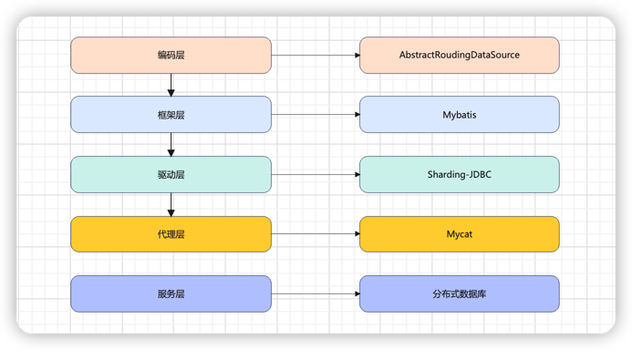

关于Mycat请查看 [mycat学习](https://xiaoyuge.work/mycat/) 这篇博客。
## 2. ShardingSphere简介

1.  2018年5月，`sharding-jdbc`更名为`ShardingSphere`
2.  2018年11月，`Sharding-sphere`正式进入Apache基金会孵化器
3.  2020年4月，从Apache孵化器毕业，成为Apache顶级项目`Apache ShardingSphere`

`ShardingSphere`目前的定位已远超过人们熟知的`分库分表`的功能了，其拥有自己的⼀套开源的分布式数据库中间件解决⽅案组成的⽣态圈（**ShardingSphere-JDBC**、**ShardingSphere-Proxy**，**ShardingSphere-sidecar**（计划中））
他们均提供标准化的数据分片、分布式事务和数据库治理功能，可适用于如Java同构、异构语言、容器、云原生等各种多样化的应用场景

官网地址：https://shardingsphere.apache.org/document/current/cn/overview/
### 2.1 Apache ShardingSphere
1. 官方定义：`Apache ShardingSphere` 是一套开源的分布式数据库增强计算引擎，其通过可插拔架构构建基于数据库之上的生态系统，实现包括数据分片、弹性伸缩、加密脱敏等功能为代表的增强能力
2. 定位Apache ShardingSphere 产品定位为`Database Plus`，旨在构建异构数据库上层的标准和生态。 它关注如何充分合理地利用数据库的计算和存储能力，而并非实现一个全新的数据库
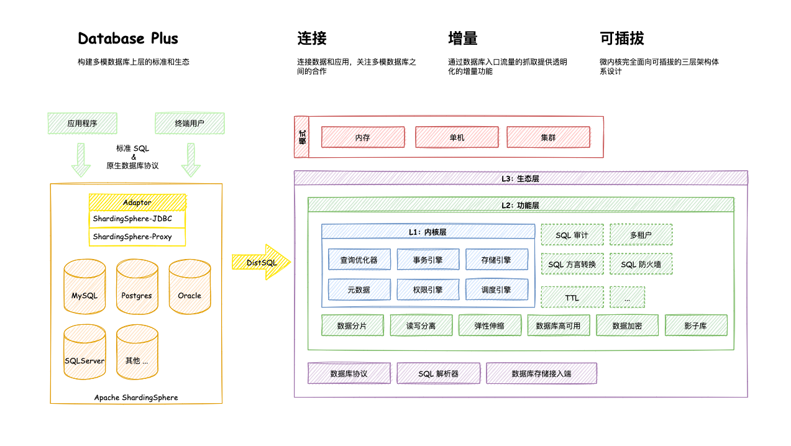
   

### 2.2 ShardingSphere-JDBC
定位于轻量级Java框架，在Java的jdbc层提供的额外服务， `ShardingSphere-jdbc`的主要功能在客户端尽心数据分片和读写分离，通过sharding-jdbc,应用可以使用jdbc访问已经读写分离的多个数据源，而不用关心数据库数量和数据的分布；

_可以理解为增强版JDBC驱动，完全兼容JDBC和各种ORM框架_
1. 使用于任何给予Java的ORM框架，如：`JPA`、`hibernate`、`mybatis`、`Spring JDBC Template`或直接使用JDBC
2. 基于任何第三方的数据库连接池，如：`DBCP`、`C3P0`、`BoneCP`、`Druid`、`HikariCP`等
3. 支持任意实现JDBC规范的数据库，如`Mysql`、`Oracle`、`SQLServer`、`PostgreSQL`
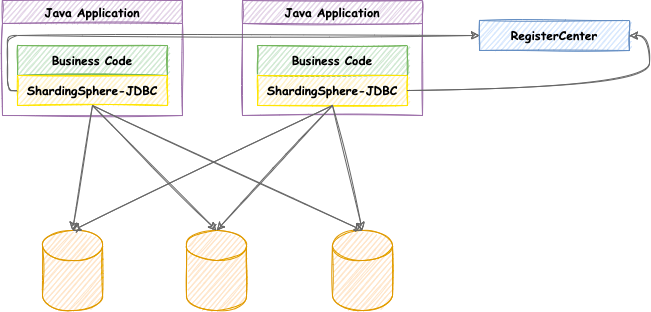

源码：https://github.com/apache/shardingsphere/tree/master/shardingsphere-jdbc

### 2.3 ShardingSphere-Proxy
定位为透明化的数据库代理端，提供封装了数据库二进制协议的服务端版本，用于完成对异构语言的支持。 目前提供 MySQL 和 PostgreSQL（兼容 openGauss 等基于 PostgreSQL 的数据库）版本，它可以使用任何兼容 MySQL/PostgreSQL 协议的访问客户端（如：MySQL Command Client, MySQL Workbench, Navicat 等）操作数据，对 DBA 更加友好

1. 向应用程序完全透明，可直接当做 MySQL/PostgreSQL 使用；
2. 适用于任何兼容 MySQL/PostgreSQL 协议的的客户端。

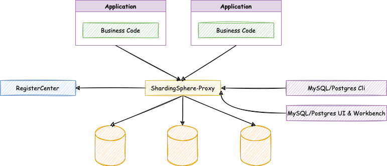

源码：https://github.com/apache/shardingsphere/tree/master/shardingsphere-proxy

### 2.4 ShardingSphere-sidecar（TODO）
定位为 Kubernetes 的云原生数据库代理，以 Sidecar 的形式代理所有对数据库的访问。 通过无中心、零侵入的方案提供与数据库交互的啮合层，即 Database Mesh，又可称数据库网格。
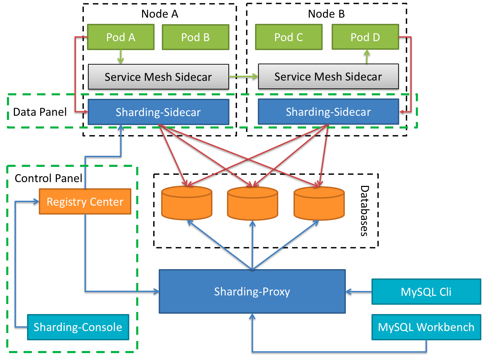

## 3. 分片的核心概念
1. 主要概念
    由原来的一个数据库(表)拆分为真实存在的三个数据库(表)
    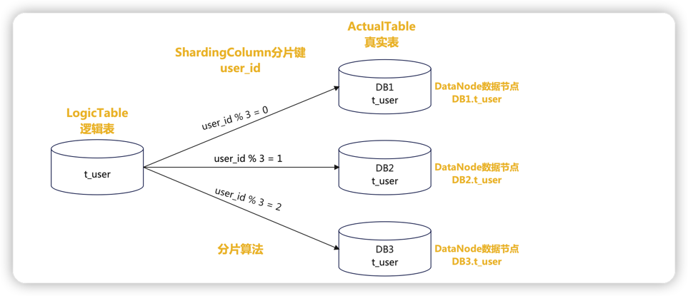
    逻辑表会在 SQL 解析和路由时被替换成真实的表名，分片键就是拆分的逻辑；sharding-jdbc可以选择多个分片键；
    
  
2. 动态表
   
    表名会变化，比如订单表，按照月份进行分表
    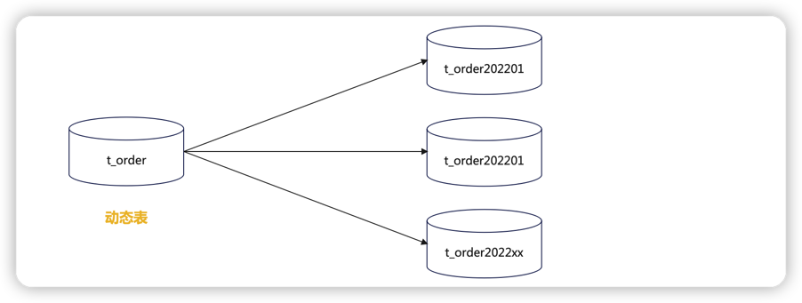
   

3. 绑定表

    与Mycat的ER表对应，存在关联关系的两张表，他们的分片规则必须相同
    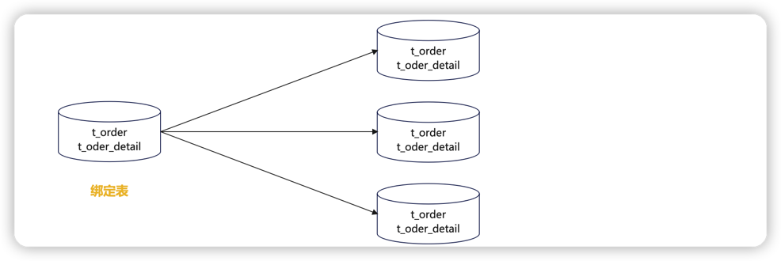
   

4. 广播表
    
    与Mycat的全局表对应，所有节点的数据内容一致
   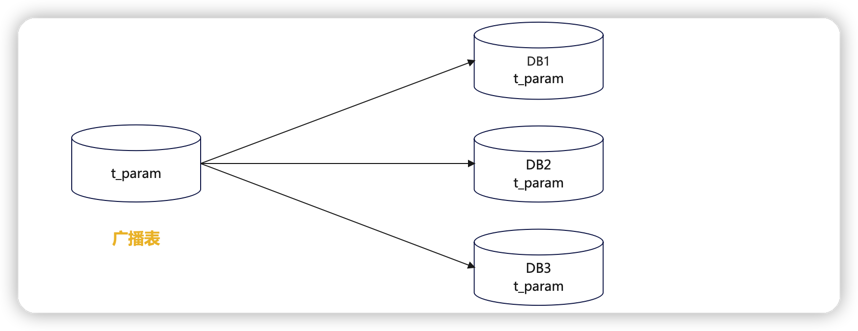


## 4. Sharding-JDBC Demo演示
`Apache ShardingSphere-JDBC` 可以通过 **Java**，**YAML**，**Spring 命名空间** 和 **Spring Boot Starter** 这 4 种方式进行配置，开发者可根据场景选择适合的配置方式。

目前仅支持`Java`语言且java JRE 8或更高版本

下面使用SSM框架来集成`shardingsphere-jdbc`，操作数据库，由于资源有限，在一个数据库`instance`里面创建两个数据库db0、db1来模拟分库分表；
1. 创建数据库`db0`,`db1`，以及创建下面的数据表
   ```sql
   -- 用户表
    CREATE TABLE `user_info` (
        `user_id` bigint(128) NOT NULL,
        `user_name` varchar(45) DEFAULT NULL,
        `account` varchar(45) NOT NULL,
        `password` varchar(45) DEFAULT NULL,
        PRIMARY KEY (`user_id`)
    ) ENGINE=InnoDB DEFAULT CHARSET=utf8mb4;
    
    -- 订单表
    CREATE TABLE `t_order` (
        `order_id` int(11) NOT NULL,
        `user_id` int(11) NOT NULL,
        PRIMARY KEY (`order_id`)
    ) ENGINE=InnoDB DEFAULT CHARSET=utf8mb4;
    
   -- 订单明细表
    CREATE TABLE `t_order_item` (
        `item_id` int(11) NOT NULL,
        `order_id` int(11) NOT NULL,
        `user_id` int(11) NOT NULL,
        PRIMARY KEY (`item_id`)
    ) ENGINE=InnoDB DEFAULT CHARSET=utf8mb4;
    
    -- 参数配置表
    CREATE TABLE `t_config` (
        `config_id` int(16) NOT NULL AUTO_INCREMENT,
        `para_name` varchar(255) DEFAULT NULL,
        `para_value` varchar(255) DEFAULT NULL,
        `para_desc` varchar(255) DEFAULT NULL,
        PRIMARY KEY (`config_id`)
    ) ENGINE=InnoDB DEFAULT CHARSET=utf8mb4;
    
    truncate table user_info;
    truncate table t_order;
    truncate table t_order_item;
    truncate table t_config;
    ```
2. <span id="index1">创建项目并引入依赖</span>
    ```xml
    <!-- https://mvnrepository.com/artifact/org.apache.shardingsphere/shardingsphere-jdbc-core -->
    <dependency>
        <groupId>org.apache.shardingsphere</groupId>
        <artifactId>shardingsphere-jdbc-core</artifactId>
        <version>5.1.2</version>
    </dependency>
   <dependency>
        <groupId>org.apache.shardingsphere</groupId>
        <artifactId>sharding-jdbc-spring-boot-starter</artifactId>
        <version>4.1.1</version>
    </dependency>
   ```
   
3. 使用`mybatisPlus`逆向工程生成`entity`、`mapper`、`service`等相关代码，这里就不贴业务代码了。
4. 编辑`application.yml`
    ```yaml
    mybatis:
      mapper-locations: classpath:mapper/*.xml
      config-location: classpath:mybatis-config.xml
    spring:
      shardingsphere:
        props:
          sql:
            show: true    #打印sql语句
        datasource:     #数据源配置
          names: db0,db1
          db0:    #数据源1
            type: com.alibaba.druid.pool.DruidDataSource
            driver-class-name: com.mysql.cj.jdbc.Driver
            url: jdbc:mysql://localhost:3306/db1?serverTimezone=UTC&useSSL=false&useUnicode=true&characterEncoding=UTF-8
            username: root
            password: xiaoyuge
          db1:   #数据源2
            type: com.alibaba.druid.pool.DruidDataSource
            driver-class-name: com.mysql.cj.jdbc.Driver
            url: jdbc:mysql://localhost:3306/db1?serverTimezone=UTC&useSSL=false&useUnicode=true&characterEncoding=UTF-8
            username: root
            password: xiaoyuge
        sharding:     #分片
          default-database-strategy:    #数据库分片策略
            inline:
              sharding-column: user_id    #分片键
              algorithm-expression: db${user_id % 2}    #分片算法
          tables:     #表分片策略
            user_info:
              actual-data-nodes: db$->{0..1}.user_info      #真实存储数据的节点，可以使用行内表达式,$->{} 是标准语法
              databaseStrategy:
                inline:
                  shardingColumn: user_id
                  algorithm-expression: db${user_id % 2}  #分片算法
              key-generator:
                column: user_id
                type: SNOWFLAKE     #主键策略：SNOWFLAKE 、 UUID，如果设置了主键策略，那么插入的时候就不用指定主键的值
            t_order:
              databaseStrategy:
                inline:
                  shardingColumn: order_id
                  algorithm-expression: db${order_id % 2} #分片算法
              actual-data-nodes: db$->{0..1}.t_order
            t_order_item:
              databaseStrategy:
                inline:
                  shardingColumn: order_id
                  algorithm-expression: db${order_id % 2}   #分片算法
              actual-data-nodes: db$->{0..1}.t_order_item
          binding-tables[0]: t_order,t_order_item    #绑定表配置
          broadcast-tables: t_config      #广播表配置
    ```
   
5. 测试简单分库user_info
    ```java
    import com.ygb.entity.UserInfo;
    import com.ygb.service.UserService;
    import org.junit.Test;
    import org.junit.runner.RunWith;
    import org.mybatis.spring.annotation.MapperScan;
    import org.springframework.boot.test.context.SpringBootTest;
    import org.springframework.test.context.junit4.SpringRunner;
    
    import javax.annotation.Resource;
    import java.util.ArrayList;
    import java.util.List;
    
    @RunWith(SpringRunner.class)
    @SpringBootTest
    @MapperScan(basePackages = "com.ygb.mapper")
    public class UserShardingTest {
        @Resource
        UserService userService;
    
        @Test
        public void insert() {
            //随机生成100条数据,插入到数据库中
            for (int i = 1; i <= 100; i++) {
                UserInfo userInfo = new UserInfo();
                userInfo.setAccount("account" + i);
                userInfo.setPassword("password" + i);
                userInfo.setUserName("name" + i);
                userInfo.setUserId(i);
                userService.insert(userInfo);
            }
        }
    
        @Test
        public void select() {
            UserInfo userInfo1 = userService.getUserInfoByUserId(1L);
            System.out.println("------userInfo1:" + userInfo1);
    
            UserInfo userInfo2 = userService.getUserInfoByUserId(2L);
            System.out.println("------userInfo2:" + userInfo2);
        }
    }
    ```
   
    1. 执行 `insert`方法后，结果如下图所示:
        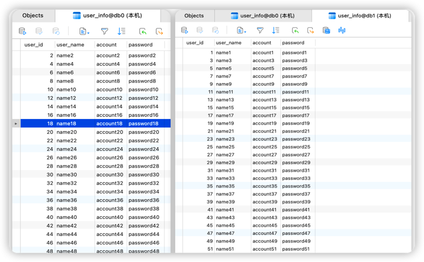
    
        根据上面`yaml`配置`user_info`表按照分片键(`sharding-column`)`user_id`取模分片到不同数据库;`user_id` % 2 为偶数落下`db0`, 奇数落在`db1`

    2. 执行 `select` 方法，查询user_id为1 的数据，可以看到逻辑sql语句以及真实的sql语句路由到哪个节点上。
       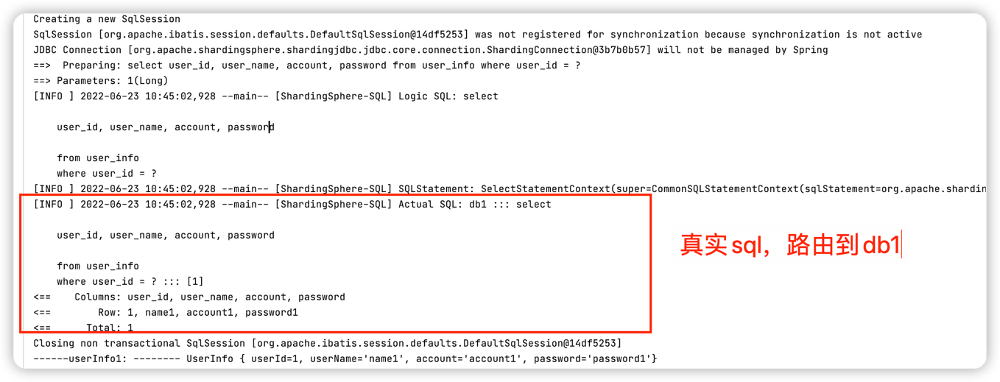
       同理，查询user_id 为 2 的数据，根据表的分库规则，user_id % 2 == 0数据落在db0节点上；
       

6. 测试绑定表t_order,t_order_item
    ```java
    @Test
    public void insert(){
        for (int i = 1; i <= 100; i++) {
            //订单表
            Order order = new Order();
            order.setOrderId(i);
            order.setUserId(i);
            orderService.insert(order);
            //订单明细表
            OrderItem orderItem = new OrderItem();
            orderItem.setItemId(i);
            orderItem.setOrderId(i);
            orderItem.setUserId(i);
            orderItemService.insert(orderItem);
        }
    }
    ```
   执行`insert`方法后，数据库表结果如下图所示：
    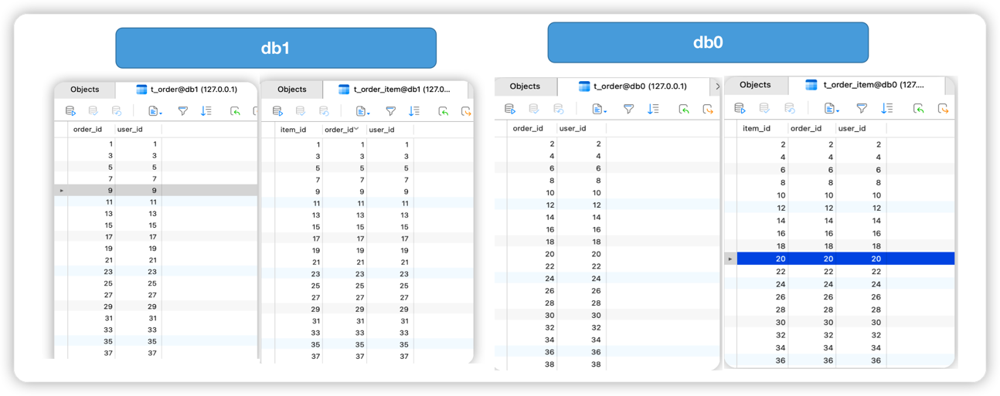
    `t_order`表和`t_order_item` 使用相同的分片规则`db${order_id % 2}`,相同的`order_id`分布在同一个节点上；


7. 测试广播表t_config
    ```java
    @Test
    public void insert(){
        for (int i = 1; i <= 10; i++) {
            Config config = new Config();
            config.setConfigId(i);
            config.setParaName("name"+i);
            config.setParaValue("value"+i);
            config.setParaDesc("desc"+i);
            configService.insert(config);
        }
    }
    ```
   执行`insert`方法后，查看执行日志，可以看到它向`db0`、`db1`两个节点分别发送了插入语句；
    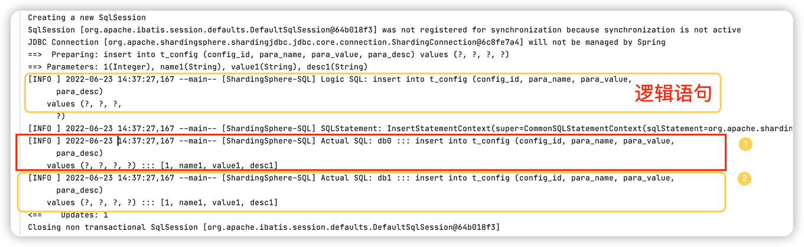
    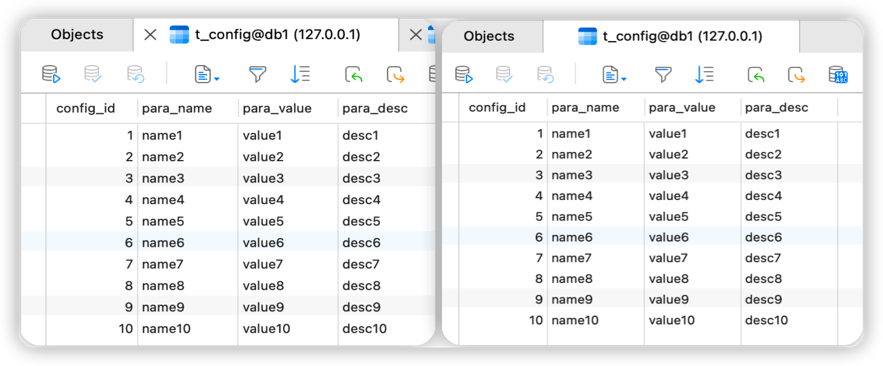


## 5. ShardingSphere分库分表原理剖析
基于上面的测试代码来分析ShardingSphere分库分表原理；


### 5.1 ShardingSphere-JDBC工作流程
```
SQL 解析(解析引擎) => 执行器优化 => SQL 路由(路由引擎) => SQL 改写(改写引擎) => SQL 执行(执行引擎) => 结果归并(归并引擎)
```
1. SQL解析
        
    `SQL` 解析主要是词法和语法的解析。目前常见的 `SQL` 解析器主要有`fdb`，`jsqlparser` 和 `Druid`。`Sharding-JDBC1.4.x`之前的版本使用`Druid`作为`SQL`解析器。从 1.5.x 版本 开始，`Sharding-JDBC`采用完全自研的`SQL`解析引擎


2. SQL 路由
    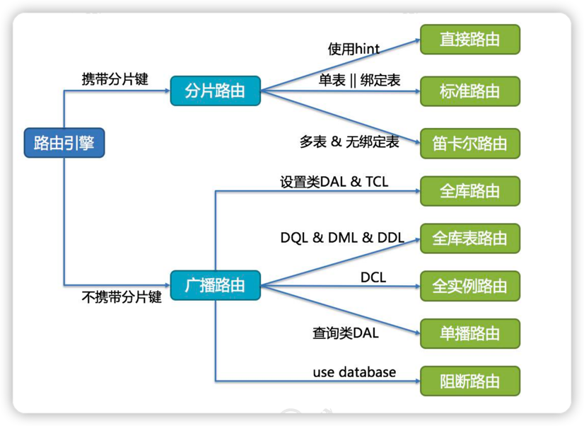
    SQL 路由是根据分片规则配置以及解析上下文中的分片条件，将 SQL 定位至真正的 数据源。它又分为直接路由、标准路由和笛卡尔积路由
    - 直接路由: 使用 Hint 方式。
    
    - 标准路由：Binding 表是指使用同样的分片键和分片规则的一组表，也就是说任何情况下， Binding 表的分片结果应与主表一致。例如：order 表和 order_item 表，都根据 order_id 分片，结果应是 order_1 与 order_item_1 成对出现。这样的关联查询和单表查询复杂度 和性能相当。如果分片条件不是等于，而是 BETWEEN 或 IN，则路由结果不一定落入单 库（表），因此一条逻辑 SQL 最终可能拆分为多条 SQL 语句。
    
    - 笛卡尔积路由：笛卡尔积查询最为复杂，因为无法根据 Binding 关系定位分片规则的一致性，所以 非 Binding 表的关联查询需要拆解为笛卡尔积组合执行。查询性能较低，而且数据库连 接数较高，需谨慎使用。


3. SQL改写

    将逻辑表名称改成真实表名称，优化分页查询等

4. SQL执行

    因为可能链接到多个真实数据源， Sharding -JDBC 将采用多线程并发执行 SQL

5. SQL归并

    如数据的组装、分页、排序等等。


下面我跟着源码学习一下完整的执行过程。

### 5.2 配置加载过程
首先由于我们引入sharding-jdbc-spring-boot-starter依赖，在依赖包中可以看到shardingSphere支持springboot,那么它肯定会有一个类似于SpringBoot自动装配类 `SpringBootConfiguration`这样的配置类；

查看一下源码：
```java
/**
 * Spring boot starter configuration.
 */
@Configuration
@ComponentScan("org.apache.shardingsphere.spring.boot.converter")
@EnableConfigurationProperties({
        SpringBootShardingRuleConfigurationProperties.class,
        SpringBootMasterSlaveRuleConfigurationProperties.class, SpringBootEncryptRuleConfigurationProperties.class,
        SpringBootPropertiesConfigurationProperties.class, SpringBootShadowRuleConfigurationProperties.class})
@ConditionalOnProperty(prefix = "spring.shardingsphere", name = "enabled", havingValue = "true", matchIfMissing = true)
@AutoConfigureBefore(DataSourceAutoConfiguration.class) 
//@AutoConfigureBefore自动装配在DataSourceAutoConfiguration装配类之前完成，也就是说Shardingsphere创建得数据源就是全局得数据源，项目只要涉及到对数据库得任何操作都会经过ShardingDataSource得这一层处理
@RequiredArgsConstructor
public class SpringBootConfiguration implements EnvironmentAware {
    
    //将之前配置得规则映射到此配置文件中，为创建数据源得过程提供配置信息
    private final SpringBootShardingRuleConfigurationProperties shardingRule;
    
    private final SpringBootMasterSlaveRuleConfigurationProperties masterSlaveRule;
    
    private final SpringBootEncryptRuleConfigurationProperties encryptRule;
    
    private final SpringBootShadowRuleConfigurationProperties shadowRule;
    
    private final SpringBootPropertiesConfigurationProperties props;

    //对象存放得是配置得所有数据源映射信息，为后面获取数据库连接以及数据分片提供基础能力
    private final Map<String, DataSource> dataSourceMap = new LinkedHashMap<>();
    
    private final String jndiName = "jndi-name";
    
    /**
     * 上面的测试代码基于分片的 策略配置，所以只有 ShardingRuleCondition 才满足装配条件。
     * ShardingDataSourceFactory工厂类来创建 ShardingDataSource数据源，
     * Get sharding data source bean.
     * 条件注入不同的数据源
     * @return data source bean
     * @throws SQLException SQL exception
     */
    @Bean
    @Conditional(ShardingRuleCondition.class)
    public DataSource shardingDataSource() throws SQLException {
        //配置转换过程，
        return ShardingDataSourceFactory.createDataSource(dataSourceMap, new ShardingRuleConfigurationYamlSwapper().swap(shardingRule), props.getProps());
    }
    
    /**
     * Get master-slave data source bean.
     * 条件注入不同的数据源
     * @return data source bean
     * @throws SQLException SQL exception
     */
    @Bean
    @Conditional(MasterSlaveRuleCondition.class)
    public DataSource masterSlaveDataSource() throws SQLException {
        return MasterSlaveDataSourceFactory.createDataSource(dataSourceMap, new MasterSlaveRuleConfigurationYamlSwapper().swap(masterSlaveRule), props.getProps());
    }
    /**
     * Get encrypt data source bean.
     *条件注入不同的数据源
     * @return data source bean
     * @throws SQLException SQL exception
     */
    @Bean
    @Conditional(EncryptRuleCondition.class)
    public DataSource encryptDataSource() throws SQLException {
        return EncryptDataSourceFactory.createDataSource(dataSourceMap.values().iterator().next(), new EncryptRuleConfigurationYamlSwapper().swap(encryptRule), props.getProps());
    }
    /**
     * Get shadow data source bean.
     * 条件注入不同的数据源
     * @return data source bean
     * @throws SQLException SQL exception
     */
    @Bean
    @Conditional(ShadowRuleCondition.class)
    public DataSource shadowDataSource() throws SQLException {
        return ShadowDataSourceFactory.createDataSource(dataSourceMap, new ShadowRuleConfigurationYamlSwapper().swap(shadowRule), props.getProps());
    }
    /**
     * Create sharding transaction type scanner
     *
     * @return sharding transaction type scanner
     */
    @Bean
    public ShardingTransactionTypeScanner shardingTransactionTypeScanner() {
        return new ShardingTransactionTypeScanner();
    }
    
    @Override
    public final void setEnvironment(final Environment environment) {
        String prefix = "spring.shardingsphere.datasource.";
        for (String each : getDataSourceNames(environment, prefix)) {
            try {
                //遍历环境变量，将数据源保存到 dataSourceMap
                dataSourceMap.put(each, getDataSource(environment, prefix, each));
            } catch (final ReflectiveOperationException ex) {
                throw new ShardingSphereException("Can't find datasource type!", ex);
            } catch (final NamingException namingEx) {
                throw new ShardingSphereException("Can't find JNDI datasource!", namingEx);
            }
        }
    }
    //----------------------------省略------------------------------
}
```
1. `ShardingDataSourceFactory`工厂类创建ShardingDataSource数据源
    ```java
    public class ShardingDataSource extends AbstractDataSourceAdapter {
        private final ShardingRuntimeContext runtimeContext;
    
        static {
            //初始化路由装饰器（路由引擎，SPI方式）
            NewInstanceServiceLoader.register(RouteDecorator.class);
            //创建SQL改写上下文装饰器（改写引擎，SPI方式）
            NewInstanceServiceLoader.register(SQLRewriteContextDecorator.class);
            // 创建结果处理引擎（归并引擎，用于对查询结果合并处理，同上）
            NewInstanceServiceLoader.register(ResultProcessEngine.class);
        }
        
        public ShardingDataSource(Map<String, DataSource> dataSourceMap, ShardingRule shardingRule, Properties props) throws SQLException {
            super(dataSourceMap);
            this.checkDataSourceType(dataSourceMap);
            //创建运行时上下文（全局分片运行时上下文，用于保存分片所需得相关配置）
            this.runtimeContext = new ShardingRuntimeContext(dataSourceMap, shardingRule, props, this.getDatabaseType());
        }
        //----------------------------省略------------------------------
    }
    ```

2. ShardingRule配置规则解析类
   配置转换过程。会将分表规则、分库规则、分表算法、分库算法等都解析到对应得 ShardingRuleConfiguration 通用分片配置类中
    ```java
     public ShardingRuleConfiguration swap(YamlShardingRuleConfiguration yamlConfiguration) {
        ShardingRuleConfiguration result = new ShardingRuleConfiguration();
        Iterator var3 = yamlConfiguration.getTables().entrySet().iterator();
    
        while(var3.hasNext()) {
            //将我们配置得分库、分表策略、分库算法、分表算法解析到TableRuleConfiguration中，每一张表都会对应一个配置类
            Entry<String, YamlTableRuleConfiguration> entry = (Entry)var3.next();
            YamlTableRuleConfiguration tableRuleConfig = (YamlTableRuleConfiguration)entry.getValue();
            tableRuleConfig.setLogicTable((String)entry.getKey());
            result.getTableRuleConfigs().add(this.tableRuleConfigurationYamlSwapper.swap(tableRuleConfig));
        }
    
        result.setDefaultDataSourceName(yamlConfiguration.getDefaultDataSourceName());
        //绑定表
        result.getBindingTableGroups().addAll(yamlConfiguration.getBindingTables());
        //广播表
        result.getBroadcastTables().addAll(yamlConfiguration.getBroadcastTables());
        if (null != yamlConfiguration.getDefaultDatabaseStrategy()) {
            result.setDefaultDatabaseShardingStrategyConfig(this.shardingStrategyConfigurationYamlSwapper.swap(yamlConfiguration.getDefaultDatabaseStrategy()));
        }
    
        if (null != yamlConfiguration.getDefaultTableStrategy()) {
            result.setDefaultTableShardingStrategyConfig(this.shardingStrategyConfigurationYamlSwapper.swap(yamlConfiguration.getDefaultTableStrategy()));
        }
    
        if (null != yamlConfiguration.getDefaultKeyGenerator()) {
            result.setDefaultKeyGeneratorConfig(this.keyGeneratorConfigurationYamlSwapper.swap(yamlConfiguration.getDefaultKeyGenerator()));
        }
    
        Collection<MasterSlaveRuleConfiguration> masterSlaveRuleConfigs = new LinkedList();
        Iterator var9 = yamlConfiguration.getMasterSlaveRules().entrySet().iterator();
    
        while(var9.hasNext()) {
            Entry<String, YamlMasterSlaveRuleConfiguration> entry = (Entry)var9.next();
            YamlMasterSlaveRuleConfiguration each = (YamlMasterSlaveRuleConfiguration)entry.getValue();
            each.setName((String)entry.getKey());
            masterSlaveRuleConfigs.add(this.masterSlaveRuleConfigurationYamlSwapper.swap((YamlMasterSlaveRuleConfiguration)entry.getValue()));
        }
    
        result.setMasterSlaveRuleConfigs(masterSlaveRuleConfigs);
        if (null != yamlConfiguration.getEncryptRule()) {
            result.setEncryptRuleConfig(this.encryptRuleConfigurationYamlSwapper.swap(yamlConfiguration.getEncryptRule()));
        }
    
        return result;
     }
    ```
    ```java
    SpringBootConfiguration -> ShardingDataSourceFactory -> ShardingRule -> ShardingDataSource -> ShardingRuntimeContext
    ```

### 5.3 分片运行时上下文创建过程
创建数据源的时候会在构造器中将运行时上下文`ShardingRuntimeContext`一同创建出来，ShardingRuntimeContext得构造器如下图
```java
public final class ShardingRuntimeContext extends MultipleDataSourcesRuntimeContext<ShardingRule> {
    private final CachedDatabaseMetaData cachedDatabaseMetaData;
    private final ShardingTransactionManagerEngine shardingTransactionManagerEngine;

    public ShardingRuntimeContext(Map<String, DataSource> dataSourceMap, ShardingRule shardingRule, Properties props, DatabaseType databaseType) throws SQLException {
        super(dataSourceMap, shardingRule, props, databaseType);
        this.cachedDatabaseMetaData = this.createCachedDatabaseMetaData(dataSourceMap);
        this.shardingTransactionManagerEngine = new ShardingTransactionManagerEngine();
        this.shardingTransactionManagerEngine.init(databaseType, dataSourceMap);
    }
    //----------------- 省略------------
}
```
类关系图如下：
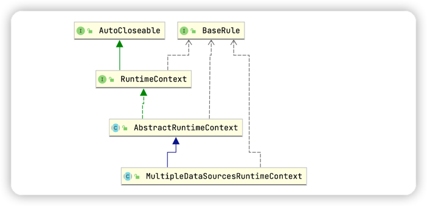
发现运行时上下文进行了抽象，分片运行时上下文继承了`MultipleDataSourcesRuntimeContext` 多数据源运行时上下文，而多数据源运行时上下文又继承了 `AbstractRuntimeContext` 抽象上下文。而创建 `ShardingRuntimeContext` 分片运行时上下文得时候会同时将分片规则保存在抽象类中
```java
public abstract class AbstractRuntimeContext<T extends BaseRule> implements RuntimeContext<T> {
    private final T rule;
    private final ConfigurationProperties properties;
    private final DatabaseType databaseType;
    private final ExecutorEngine executorEngine;
    private final SQLParserEngine sqlParserEngine;

    protected AbstractRuntimeContext(T rule, Properties props, DatabaseType databaseType) {
        this.rule = rule;   //1. 缓存整个分片规则，为后续的分片操作提供依据
        this.properties = new ConfigurationProperties(null == props ? new Properties() : props);
        this.databaseType = databaseType;   //2. 缓存数据库类型，用于后续执行的时候加载对应的数据库元数据
        //3.创建执行引擎，根据当前执行连接是否持有事物来决定是否异步执行，根据配置的executor.size 参数决定创建多少个线程的线程池，默认不配置得话，使用 cachepool，配置了就使用固定线程数得线程池
        this.executorEngine = new ExecutorEngine((Integer)this.properties.getValue(ConfigurationPropertyKey.EXECUTOR_SIZE));
        
        //解析引擎，用于解析SQL为抽象语法树，解析过程分为词法解析和语法解析。从3.0之后解析会全面替换为 ANTLR
        this.sqlParserEngine = SQLParserEngineFactory.getSQLParserEngine(DatabaseTypes.getTrunkDatabaseTypeName(databaseType));
        ConfigurationLogger.log(rule.getRuleConfiguration());
        ConfigurationLogger.log(props);
    }
    //----------------- 省略------------
}
```
```
ShardingRuntimeContext-> MultipleDataSourcesRuntimeContext -> AbstractRuntimeContext-> ExecutorEngine-> SQLParserEngine
```
### 5.4 分片处理过程
由于测试代码使用的是`Mybatis`层，这里只是对`Mybatis`处理流程进行分析。

当一个查询`sql`执行时，首先经过Mybatis层
1. 调用`org.apache.ibatis.executor.BaseExecutor # queryFromDatabase`方法
    ```java
    private <E> List<E> queryFromDatabase(MappedStatement ms, Object parameter, RowBounds rowBounds, ResultHandler resultHandler, CacheKey key, BoundSql boundSql) throws SQLException {
        this.localCache.putObject(key, ExecutionPlaceholder.EXECUTION_PLACEHOLDER);
        List list;
        try {
            list = this.doQuery(ms, parameter, rowBounds, resultHandler, boundSql);
        } finally {
            this.localCache.removeObject(key);
        }
        this.localCache.putObject(key, list);
        if (ms.getStatementType() == StatementType.CALLABLE) {
            this.localOutputParameterCache.putObject(key, parameter);
        }

        return list;
    }
    ```
2. 通过模板抽象方法`org.apache.ibatis.executor.BaseExecutor#doQuery`查找具体实现（如果没有特殊配置，此处是SimpleExecutor）,并且将查询结果放入一级缓存中。
     ```java
     public <E> List<E> doQuery(MappedStatement ms, Object parameter, RowBounds rowBounds, ResultHandler resultHandler, BoundSql boundSql) throws SQLException {
        Statement stmt = null;

        List var9;
        try {
            Configuration configuration = ms.getConfiguration();
            StatementHandler handler = configuration.newStatementHandler(this.wrapper, ms, parameter, rowBounds, resultHandler, boundSql);
            stmt = this.prepareStatement(handler, ms.getStatementLog());
            var9 = handler.query(stmt, resultHandler);
        } finally {
            this.closeStatement(stmt);
        }
        return var9;
    }
    ```
3. 在`org.apache.ibatis.executor.SimpleExecutor#doQuery`方法中会创建一个`Statement`，而此实例就是`ShardingPreparedStatement`
    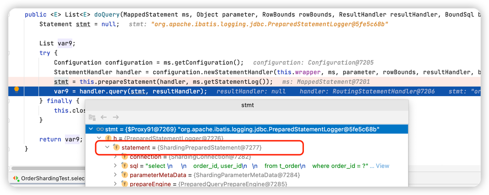
   
4. 经过Mybatis预编译SQL处理器，然后在`org.apache.ibatis.executor.statement.PreparedStatementHandler#query`方法中执行了`PreparedStatement`的`execute`方法
    ```java
    public <E> List<E> query(Statement statement, ResultHandler resultHandler) throws SQLException {
        PreparedStatement ps = (PreparedStatement)statement;
        ps.execute();
        return this.resultSetHandler.handleResultSets(ps);
    }
    ```
   
5. <span id='initPreparedStatementExecutor'>在前面知道此处</span>的`PreparedStatement`是`ShardingPreparedStatement`，所以这里调用的是`ShardingPreparedStatement`的`execute`方法
    ```java
    public boolean execute() throws SQLException {
        boolean var1;
        try {
            //1. 首先清理本地 PreparedStatementExecutor 中缓存的sql相关信息（创建执行单元的时候会将sql相关信息缓存到本地）
            this.clearPrevious();
            //2. ② 然后执行prepare方法，此方法中有两个很关键的操作：
            this.prepare();
            this.initPreparedStatementExecutor();
            var1 = this.preparedStatementExecutor.execute();
        } finally {
            this.clearBatch();
        }

        return var1;
    }
    ```
   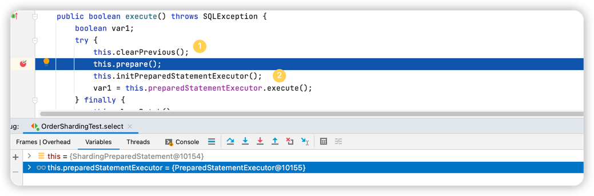
    1. `this.prepare()`执行路由策略和SQL改写策略（这两步是分片的核心，另外也都是可供使用者扩展的）
       ```java
        public ExecutionContext prepare(String sql, List<Object> parameters) {
            List<Object> clonedParameters = this.cloneParameters(parameters);
            RouteContext routeContext = this.executeRoute(sql, clonedParameters);
            ExecutionContext result = new ExecutionContext(routeContext.getSqlStatementContext());
            result.getExecutionUnits().addAll(this.executeRewrite(sql, clonedParameters, routeContext));
            if ((Boolean)this.properties.getValue(ConfigurationPropertyKey.SQL_SHOW)) {
                SQLLogger.logSQL(sql, (Boolean)this.properties.getValue(ConfigurationPropertyKey.SQL_SIMPLE), result.getSqlStatementContext(), result.getExecutionUnits());
            }
    
            return result;
        }
        ```
       
    2. `org.apache.shardingsphere.underlying.pluggble.prepare.BasePrepareEngine#executeRoute`方法，注册路由装饰器。
        ```java
        private RouteContext executeRoute(String sql, List<Object> clonedParameters) {
            this.registerRouteDecorator();
            return this.route(this.router, sql, clonedParameters);
        }
        ```
        - 获取已经注册的`RouteDecorator`类实例，过滤掉泛型是BaseRule类型的（ShardingRule是其子类，所以重新的时候覆写 getType方法时，一定要是BaseRule类型的）
        - 实例化路由装饰器
        - 调用模板方法 route，最终会调用到`DataNodeRouter`的 `executeRoute` 方法
            ```java
            private RouteContext executeRoute(String sql, List<Object> parameters, boolean useCache) {
                //1. 解析引擎： 通过 SQLParserEngine 解析SQL（并且此处默认是会将解析后的语句缓存起来，也就证实了前面会什么会先清理缓存），然后通过调用parse0方法解析SQL并缓存
                RouteContext result = this.createRouteContext(sql, parameters, useCache);

                Entry entry;
                //2. 循环执行注册了的路由装饰器
                for(Iterator var5 = this.decorators.entrySet().iterator();
                     var5.hasNext(); result = ((RouteDecorator)entry.getValue()).decorate(result, this.metaData, (BaseRule)entry.getKey(), this.properties)) {
                    entry = (Entry)var5.next();
                }
                return result;
           }
            ```
   
6. 然后开始分片路由装饰器`org.apache.shardingsphere.sharding.route.engine.ShardingRouteDecorator#decorate`
    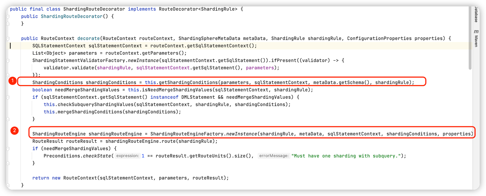
   ① 获取分片条件：根据不同的语句创建不同的 条件解析引擎来构造分片条件（获取的分片条件用于在执行路由判断时决定使用哪种分片策略）
   ② 通过工厂创建出 ShardingRouteEngine 实例，一般情况下 会创建出来 ShardingStandardRoutingEngine（没有配置什么骚操作的情况下），然后调用 标准路由执行引擎的 路由方法
    ```java
    public RouteResult route(ShardingRule shardingRule) {
        if (this.isDMLForModify(this.sqlStatementContext) && 1 != ((TableAvailable)this.sqlStatementContext).getAllTables().size()) {
            throw new ShardingSphereException("Cannot support Multiple-Table for '%s'.", new Object[]{this.sqlStatementContext.getSqlStatement()});
        } else {                
            //根据路由节点生成路由结果 RouteResult
            return this.generateRouteResult(this.getDataNodes(shardingRule, shardingRule.getTableRule(this.logicTableName)));
        }
    }
   
   /**
     * 获取数据节点：此处获取的就是真实的SQL路由情况（比如：ds0.table_0），
     * 首先判断是否使用直接路由(强制路由)，若使用则走强制路由的分片算法去计算分片；然后再判断是否根据分片条件去路由，
     * 若有的话，则根据配置的分片算法（内联）根据分片值计算出来具体分到哪个库哪张表；若都没有的话，则直接走混合路由的处理逻辑
     *
     */
    private Collection<DataNode> getDataNodes(ShardingRule shardingRule, TableRule tableRule) {
        if (this.isRoutingByHint(shardingRule, tableRule)) {
            return this.routeByHint(shardingRule, tableRule);
        } else {
            return this.isRoutingByShardingConditions(shardingRule, tableRule) ? this.routeByShardingConditions(shardingRule, tableRule) : this.routeByMixedConditions(shardingRule, tableRule);
        }
    }
    ```
   找到了路由节点
   
7. [前面一直在讲prepare方法](#initPreparedStatementExecutor) 回到`ShardingPreparedStatement#execute`方法中，调用`initPreparedStatementExecutor()` 初始化` PreparedStatementExecutor`实例 并将解析出来的执行上下文中的相关SQL语句组设置到缓存中,然后调用执行器的执行方法
    ```java
   //此处会获取到需要执行的SQL集合，主要是通过maxConnectionsSizePerQuery每次执行时最大连接数来判断sql执行单元应该分成几组，maxConnectionsSizePerQuery的值默认是1。则表示，
   // 如果真实的sql有10条，那么每组拆分10条，总共拆分成1组，
   // 此时会判断 maxConnectionsSizePerQuery 是否大于10，小于的话则会选择当前批次执行的是连接限制模式（只允许占用一个库的一个连接），相反则是内存限制模式，不会限制创建的连接数
    private void initPreparedStatementExecutor() throws SQLException {
        this.preparedStatementExecutor.init(this.executionContext);
        this.setParametersForStatements();
        this.replayMethodForStatements();
    }
    ```
   
8. [ShardingPreparedStatement#executeQuery方法中](#initPreparedStatementExecutor)最后调用执行器的执行方法`this.preparedStatementExecutor.execute()`
    ```java
    public boolean execute() throws SQLException {
        //1. 获取sql执行回调类（真正操作数据库）
        boolean isExceptionThrown = ExecutorExceptionHandler.isExceptionThrown();
        //2. 调用 executeCallback方法，此方法继承自父类AbstractStatementExecutor
        SQLExecuteCallback<Boolean> executeCallback = SQLExecuteCallbackFactory.getPreparedSQLExecuteCallback(this.getDatabaseType(), isExceptionThrown);
        List<Boolean> result = this.executeCallback(executeCallback);
        return null != result && !result.isEmpty() && null != result.get(0) ? (Boolean)result.get(0) : false;
    }
    ```
   
9. 进入父类`org.apache.shardingsphere.shardingjdbc.executor.AbstractStatementExecutor#executeCallback`，SQL执行模板`SQLExecuteTemplate`类通过委派其成员`ExecutorEngine`执行引擎来执行真正的操作
    ```java
    protected final <T> List<T> executeCallback(SQLExecuteCallback<T> executeCallback) throws SQLException {
        List<T> result = this.sqlExecuteTemplate.execute(this.inputGroups, executeCallback);
        this.refreshMetaDataIfNeeded(this.connection.getRuntimeContext(), this.sqlStatementContext);
        return result;
    }
    ```
   执行引擎对拆分的SQL执行单元执行处理，如图：
   
   ① 并发执行（是否是并发执行通过 是否持有事务来判断的，例如 本地事务但是你修改为非自动提交事务，那么此时就是持有事务状态，则此时就是同步执行语句）
   
   ② 迭代出SQL执行组的第一个，其余的SQL异步执行
   
   ③ 同步执行第一个SQL执行组（方便与后面的执行组进行合并起来）
   
   ④ 通过其内置的线程池来异步执行SQL
   
   此时一条查询语句到这里就执行完了，接下来我们接着分析对查询结果进行处理的操作

10. 回到Mybatis中，最后对查询的结果集进行处理( resultSetHandler.<E> handleResultSets(ps)，此处是org.apache.ibatis.executor.resultset.DefaultResultSetHandler结果集处理器 ),如下：
    ```java
    public List<Object> handleResultSets(Statement stmt) throws SQLException {
        ErrorContext.instance().activity("handling results").object(this.mappedStatement.getId());
        List<Object> multipleResults = new ArrayList();
        int resultSetCount = 0;
        //1. 首先调用getFirstResultSet去获取第一个结果集，此处的 Statement 实例是 ShardingPreparedStatement
        ResultSetWrapper rsw = this.getFirstResultSet(stmt);
        List<ResultMap> resultMaps = this.mappedStatement.getResultMaps();
        int resultMapCount = resultMaps.size();
        this.validateResultMapsCount(rsw, resultMapCount);

        while(rsw != null && resultMapCount > resultSetCount) {
            ResultMap resultMap = (ResultMap)resultMaps.get(resultSetCount);
            this.handleResultSet(rsw, resultMap, multipleResults, (ResultMapping)null);
            rsw = this.getNextResultSet(stmt);
            this.cleanUpAfterHandlingResultSet();
            ++resultSetCount;
        }

        String[] resultSets = this.mappedStatement.getResultSets();
        if (resultSets != null) {
            while(rsw != null && resultSetCount < resultSets.length) {
                ResultMapping parentMapping = (ResultMapping)this.nextResultMaps.get(resultSets[resultSetCount]);
                if (parentMapping != null) {
                    String nestedResultMapId = parentMapping.getNestedResultMapId();
                    ResultMap resultMap = this.configuration.getResultMap(nestedResultMapId);
                    this.handleResultSet(rsw, resultMap, (List)null, parentMapping);
                }

                rsw = this.getNextResultSet(stmt);
                this.cleanUpAfterHandlingResultSet();
                ++resultSetCount;
            }
        }

        return this.collapseSingleResultList(multipleResults);
    }
    //这里的Statement ShardingPreparedStatement
    private ResultSetWrapper getFirstResultSet(Statement stmt) throws SQLException {
        ResultSet rs = stmt.getResultSet();

        while(rs == null) {
            if (stmt.getMoreResults()) {
                rs = stmt.getResultSet();
            } else if (stmt.getUpdateCount() == -1) {
                break;
            }
        }

        return rs != null ? new ResultSetWrapper(rs, this.configuration) : null;
    }
    ```
    调用了`getResultSet()`方法；
    
10. 进入到`org.apache.shardingsphere.shardingjdbc.jdbc.core.statement.ShardingPreparedStatement# getResultSet`
    将查询返回的结果集进行合并处理，Shardingsphere 的归并引擎功能上划分：遍历归并、排序归并（SQL中存在ORDER BY语句）、分组归并（SQL中有GroupBy子句）、聚合归并（含有聚合函数）、分页归并（含有Limit关键字）
    ```java
    public ResultSet getResultSet() throws SQLException {
        if (null != this.currentResultSet) {
            return this.currentResultSet;
        } else {
            if (this.executionContext.getSqlStatementContext() instanceof SelectStatementContext || this.executionContext.getSqlStatementContext().getSqlStatement() instanceof DALStatement) {
                List<ResultSet> resultSets = this.getResultSets();          // ① 
                MergedResult mergedResult = this.mergeQuery(this.getQueryResults(resultSets));      // ② 
                this.currentResultSet = new ShardingResultSet(resultSets, mergedResult, this, this.executionContext);
            }
    
            return this.currentResultSet;
        }
    }
    ```
    ① 获取所有Statement对应的结果集，此处是拿到真正数据源所对应的Statement实例，比如：我现在的数据源是 HikariDateSource，那么拿到的就是 HikariProxyPreparedStatement

    ② 执行合并逻辑：首先将结果集封装成流式查询结果对象StreamQueryResult，接着创建合并引擎`org.apache.shardingsphere.underlying.pluggble.merge.MergeEngine#merge`，然后调用合并引擎的合并方法
    ```java
    public MergedResult merge(List<QueryResult> queryResults, SQLStatementContext sqlStatementContext) throws SQLException {
        this.registerMergeDecorator();  // ③ 
        return this.merger.process(queryResults, sqlStatementContext);  // ④ 
    }
    ```
    ③ 实例化合并引擎处理器ResultProcessEngine
    
    ④ 调用MergeEntry的 process 方法，委派来进行合并逻辑。
    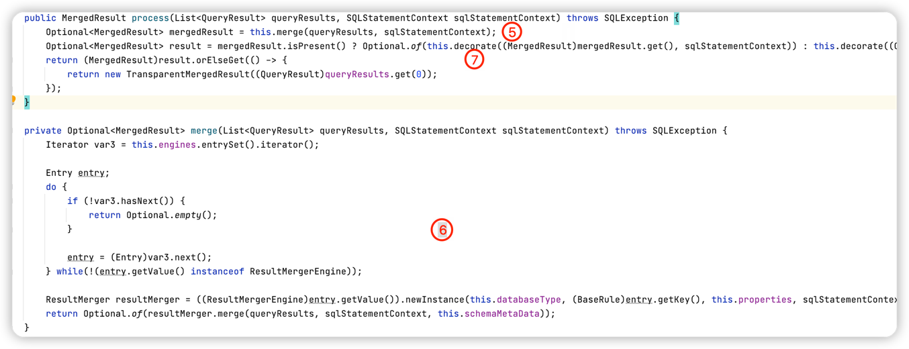
    ⑤ ⑥ 中，判断若是`ResultMergerEngine `类型的合并引擎，则调用其merge方法执行真正的合并逻辑
    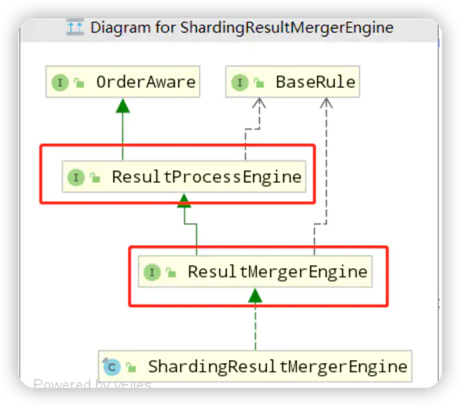
    显然满足类型判断，则此处会调用ShardingResultMergerEngine#newInstance 方法来实例化真正用于合并数据流的引擎
    ```java
    public ResultMerger newInstance(DatabaseType databaseType, ShardingRule shardingRule, ConfigurationProperties properties, SQLStatementContext sqlStatementContext) {
        if (sqlStatementContext instanceof SelectStatementContext) {
            return new ShardingDQLResultMerger(databaseType);
        } else {
            return (ResultMerger)(sqlStatementContext.getSqlStatement() instanceof DALStatement ? new ShardingDALResultMerger(shardingRule) : new TransparentResultMerger());
        }
    }
    ```
    显然此处是查询语句，那么最终用于合并的引擎就是 ShardingDQLResultMerger，然后执行其merge方法
    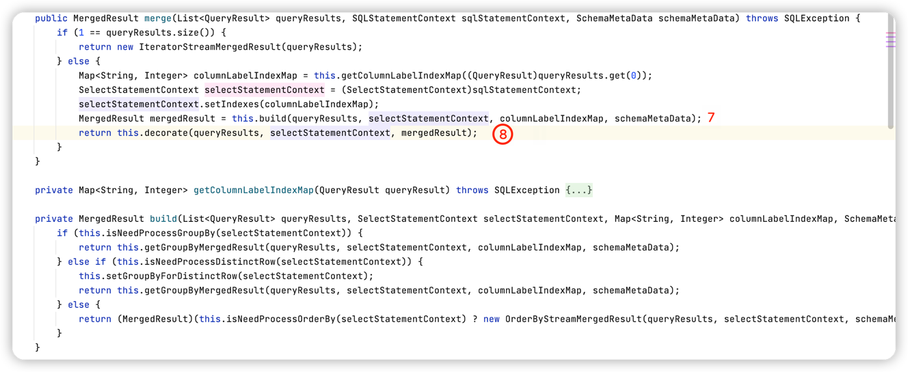
    ⑦ 中判断sql中包含哪些关键字，然后创建对应的合并结果，如果条件都不满足，那么默认会使用 遍历流式归并方式合并数据。假设 我们此处SQL中带有 order by关键字，那么创建得合并结果对象就是OrderByStreamMergedResult
    ⑧ 对创建出来的排序合并结果进行装饰操作（就是判断有没有别的关键字，例如：Limit，如果有就会创建LimitDecoratorMergedResult 装饰器对象，在之前的排序合并基础上又多一个 Limit功能），再回到 ShardingPreparedStatement中，会创建一个 ShardingResultSet对象设置到当前的成员变量currentResultSet中，并返回。 此时如果是批量的场景，返回的结果集中实际上已经包含了所有的结果集（前面存放在OrderByStreamMergedResult的 orderByValuesQueue 队列中）
    
    排序归并流程：
    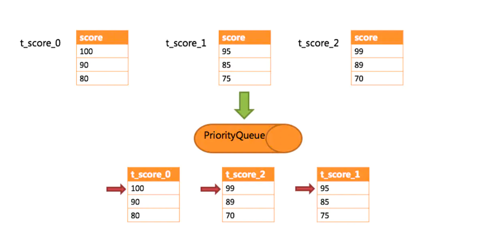
    调用合并结果的 next方法时会执行如图
    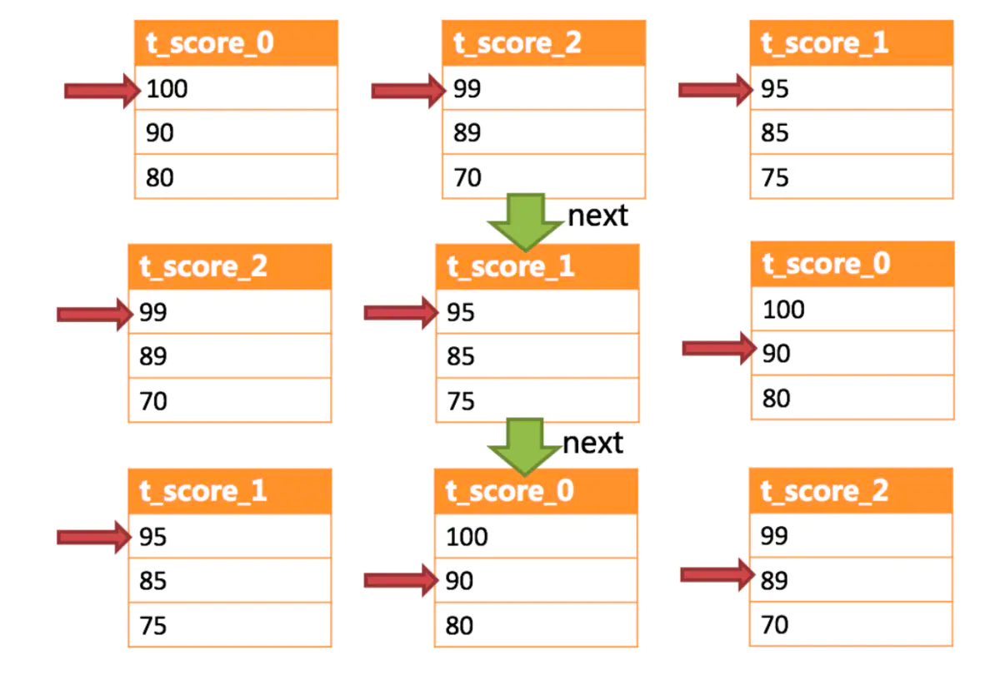
    最后流程又回到Mybatis 结果集处理上了，将结果返回给请求调用方

    


## 6. 分片策略
**策略包括了算法，算法是策略的一个属性。**

Sharding-JDBC 中的分片策略有两个维度：分库（数据源分片）策略和分表策略；（mycat只支持要么分库或者要么分表）

跟 Mycat 不一样，Sharding-JDBC 没有提供内置的分片算法，而是通过实现接口`ShardingStrategy`， 让开发者自行实现，这样可以根据业务实际情况灵活地实现分片。
### 6.1 行表达式分片策略 InlineShardingStrategy
- 算法：行内表达式 $->{}
- 文档路径：https://shardingsphere.apache.org/document/current/cn/features/sharding/concept/inline-expression/

只支持单分片键，提供对`=`和`IN` 操作的支持。行内表达式的配置比较简单。 

例如：
- ${begin..end}   表示范围区间，如：db$->{0..1}表示db0, db1
  
- ${[unit1, unit2, unit_x]}   表示枚举值，如 ：${['db0', 'db1']}
  
- t_user_$->{u_id % 8} 表示 t_user 表根据 u_id 模 8，而分成 8 张表，表名称为 t_user_0 到 t_user_7。 
  
行表达式中如果出现连续多个${ expression }或$->{ expression }表达式，整个表达式最终的结果将会根据每个子表达式的结果进行笛卡尔组合。 例如，以下行表达式： ${['db1', 'db2']}_table${1..3} 最终会解析为： db1_table1, db1_table2, db1_table3, db2_table1, db2_table2, db2_table3
### 6.2 标准分片策略 StandardShardingStrategy
标准分片策略只支持但分片键，提供了两个分片算法，分别对应了`IN`、`BETWEEN` 和 `=`；如果要是用标准分片策略，必须要实现`PreciseShardingAlgorithm`,用来处理`=`和`IN`的分片
`RangeShardingAlgorithm`是可选的，如果没有实现，SQL语句会发送到所有节点上执行。
- 算法：范围分片`RangeShardingAlgorithm` 和 精确分片`PreciseShardingAlgorithm`两种算法
```java
/**
 * 自定义分库策略
 * 数据库分库的策略，根据分片键，返回数据库名称
 */
public class DBShardAlgo implements PreciseShardingAlgorithm<Long> {
    @Override
    public String doSharding(Collection<String> collection, PreciseShardingValue<Long> preciseShardingValue) {
        String db_name="ds";
        Long num= preciseShardingValue.getValue()%2;
        db_name=db_name + num;
        System.out.println("----------------db_name:" + db_name);

        for (String each : collection) {
            System.out.println("ds:" + each);
            if (each.equals(db_name)) {
                return each;
            }
        }
        throw new IllegalArgumentException();
    }
}
```
```java
/**
 * 自定义分表策略
 * 等值查询使用的分片算法，包括in
 */
public class TblPreShardAlgo implements PreciseShardingAlgorithm<Long> {
    @Override
    public String doSharding(Collection<String> availableTargetNames, PreciseShardingValue<Long> shardingColumn) {
        // 不分表
        System.out.println("-*-*-*-*-*-*-*-*-*-*-*-*-*-*-*-availableTargetNames:" + availableTargetNames);
        for (String tbname : availableTargetNames) {
            //如果这里要分表可以根据  shardingColumn.getValue() % 2
            //也可以根据月份分表，user_info_202201这种，只需要在这里拼接表名即可
            System.out.println(shardingColumn.getValue() % 2+"-------"+ tbname);
            return tbname;
        }
        throw new IllegalArgumentException();
    }
}
```
那么在配置文件中只需要指定分配规则
```properties
##为了缩减篇幅，这里改成properties的格式
spring.shardingsphere.sharding.tables.t_order.databaseStrategy.standard.shardingColumn=order_id
spring.shardingsphere.sharding.tables.t_order.databaseStrategy.standard.precise-algorithm-class-name=com.ygb.config.TblPreShardAlgo
```
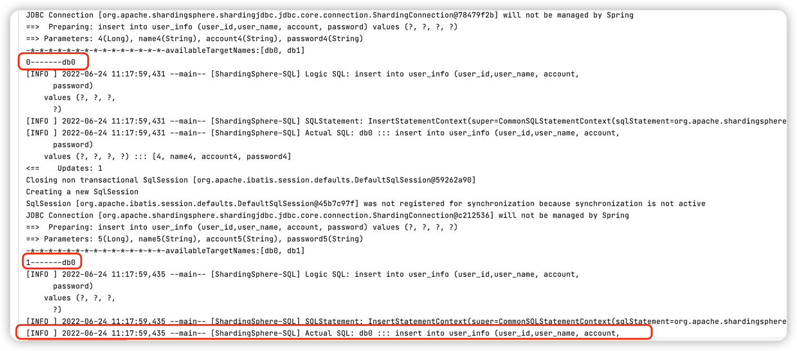

范围分片：
```java
/**
 * 范围查询所使用的分片算法
 */
public class TblRangeShardAlgo implements RangeShardingAlgorithm<Long> {
    @Override
    public Collection<String> doSharding(Collection<String> availableTargetNames, RangeShardingValue<Long> rangeShardingValue) {
        System.out.println("范围-*-*-*-*-*-*-*-*-*-*-*---------------"+availableTargetNames);
        System.out.println("范围-*-*-*-*-*-*-*-*-*-*-*---------------"+rangeShardingValue);
        Collection<String> collect = new LinkedHashSet<>();
        Range<Long> valueRange = rangeShardingValue.getValueRange();
        for (Long i = valueRange.lowerEndpoint(); i <= valueRange.upperEndpoint(); i++) {
            for (String each : availableTargetNames) {
                if (each.endsWith(i % availableTargetNames.size() + "")) {
                    collect.add(each);
                }
            }
        }
        return collect;
    }

}
```
查看数据库`db0`、`db1`，可以看到只有`db0`有数据；
### 6.3 复合分片策略 ComplexShardingStrategy
复合分片策略支持多分片键
- 算法：ComplexKeysShardingAlgorithm
- 场景：根据日期和ID两个字段分片，每个月3张表，先根据日期，然后在根据ID取模分片


### 6.4 Hint分片策略 HintShardingStrategy
通过 Hint 而非 SQL 解析的方式分片的策略
- 算法：HintShardingAlgorithm
### 6.5 不分片策略 NoneShardingStrategy
只在一个节点存储
- 算法：无

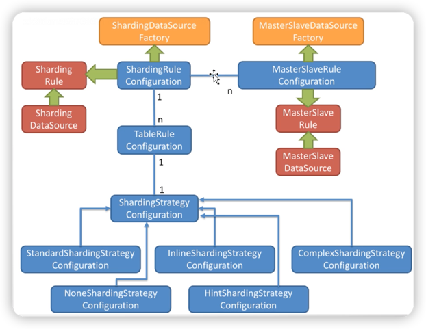


## 与Mycat对比
|    |         ShardingSphere-JDBC        |     Mycat  |
| :----- | :----------------: | :----------: |
| 工作层面  |  JDBC协议  |  Mysql协议/JDBC协议 |
| 运行方式  |  Jar包，客户端  |  独立服务，服务端 |
| 开发方式  |  代码/配置改动  |  连接地址修改（数据源） |
| 运维方式  |  无  |  管理独立服务，运维成本高 |
| 性能  |  多线程并发操作，性能高  |  独立服务+网络开销，存在性能损失风险 |
| 功能范围  |  协议层面  | 包括分布式事务、数据迁移等 |
| 适用操作  |  OLTP  | OLTP+OLAP |
| 支持数据库  |  基于JDBC协议的数据库  | MySQL 和其他支持 JDBC 协议的数据库 |
| 支持语言  |  Java   | 支持 JDBC 协议的语言 |

从易用性和功能完善的角度来说，`Mycat` 似乎比 `Sharding-JDBC` 要好，因为有现成 的分片规则，也提供了4种`ID`生成方式，通过注解可以支持高级功能，比如跨库关联查询。

建议：小型项目可以用 `Sharding-JDBC`。大型项目，可以用 `Mycat`。


