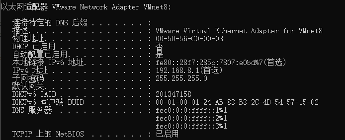
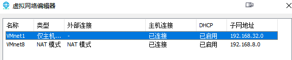
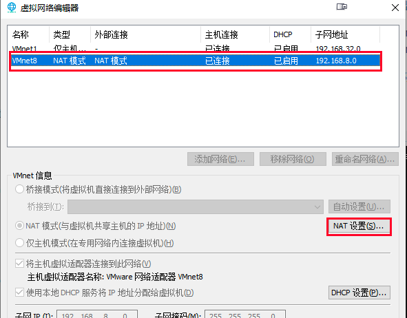
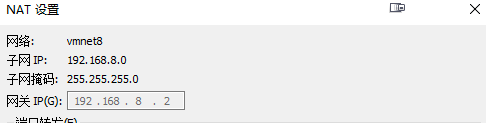
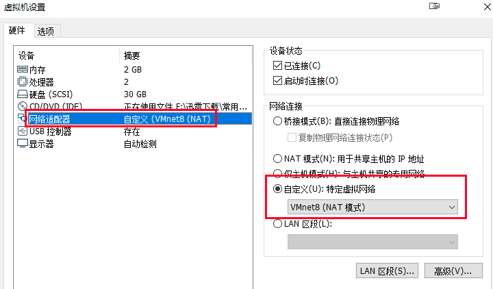
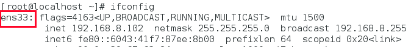
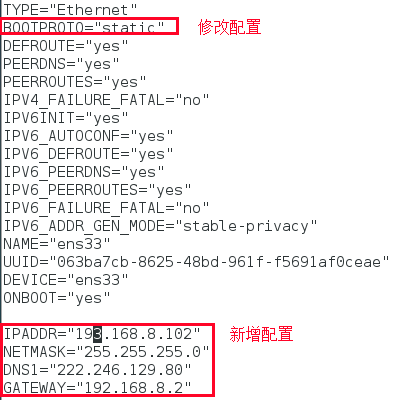
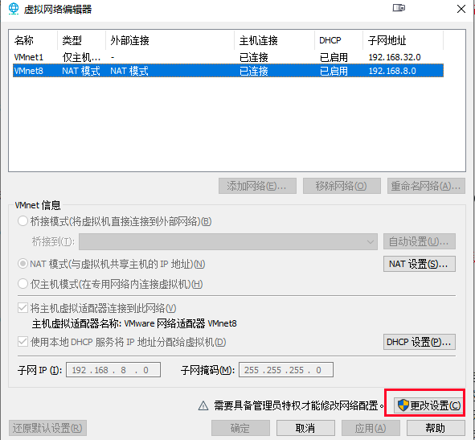
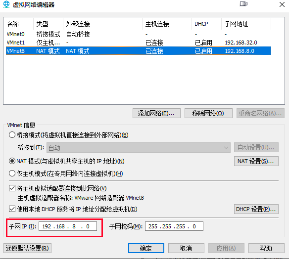
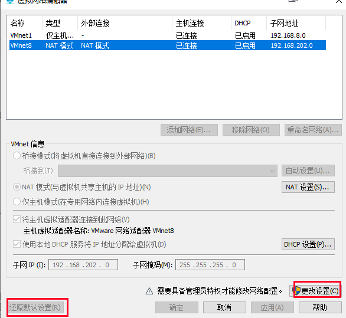

## 1. VMware+Centos7 静态IP设置

### 1.1 VMware设置
省略windows安装VMWare的过程。
1. 查看虚拟网卡信息
   
   虚拟机安装好以后，当前的系统会多出来两个虚拟网卡，一般情况下这两个网卡的命名是
    ```
    VMware Virtual Ethernet Adapter for VMnet1
    VMware Virtual Ethernet Adapter for VMnet8
   ```
   我们可以把虚拟机中的系统的静态IP绑定到VMnet8上，所以下一步我们看一下VMnet8的ip地址


2. 查看虚拟网卡IP
   
   在当前操作系统中，输入`ipconfig -all`显示网卡的IP信息如下
   
   记住当前VMnet8网卡的网段，如图所示，网段为:`192.168.8`
   

3. 虚拟机设置
   
   打开VMware，进入`编辑 -> 虚拟机网络编辑器`
   
   选中VMnet8这个网卡，点击`NAT`设置
   

   在NAT设置中，可以看到子网IP、网关IP等信息。这里我们需要把网关IP记录下来： `192.168.8.2`
   
   

4. 设置虚拟机的网络连接方式   

   选中创建好的虚拟机，右键`设置`进入虚拟机设置面板。
   将网络社配置设置为`自定义`，选中`VMnet8`这个网卡保存
   


### 1.2 Centos7中的静态ip设置
前置工作完成之后，就开始进入虚拟机的设置环节了
1. 找到网卡信息配置
   ```shell
   ifconfig
   ```
   
   找到网卡名称`ens33`，输入命令
   ```shell
   vi /etc/sysconfig/network-scripts/ifcfg-ens33
   ```
   
2. 修改配置
   
   这个配置需要修改两个地方 
   - 设置BOOTPROTO=“static”
   - 添加IPADDR/NETMASK/DNS1/GATEWAY这几个配置
     

   配置说明
   - IPADDR 就是当前虚拟机要设置的固定ip地址，网段要一致，我这边的案例是在8网段(这个网段是`VMnet8`对应的子网网段，不是真实机上的网段）。
   - NETMASK 子网掩码 用`VMnet8`对应的子网掩码值就行
   - DNS1 在真实机器上通过`ipconfig`，获得真实机器的网卡对应的DNS地址，填在这个位置
   - GATEWAY 网关地址，用前面第二个步骤中找到的网关地址： 192.168.8.2
   
3. 重启网络服务
   ```shell
   service network restart
   ```

### 1.3 可能会遇到的问题
1. `VMnet8`的网段和真实机器上的网段不一样
   
   真实机器的网段是8， 而`VMnet8`的网段是136. 由于网段不一致，就会存在网络不通的问题。所以第一步，应该是把VMnet8这个网卡的网段重新设置，
   
   进入VMware， 找到 `编辑 ->虚拟网络编辑器`
   
   
   点击`更改设置`
   
   
   修改子网IP，原本的网段是136， 改成8网段。 保存以后，改网卡会自动重启
   

2. 真实机器无法Ping通虚拟机
   - 原因1： 虚拟机的网段设置不正确，这个网段不是真实机器的网段，而是`VMnet8` NAT模式对应的网段，本案例中的网段是8.
   
   - 原因2：虚拟机迁移过，原本设置的网段在新的网络中无效，可以在VMware这个工具的如下菜单处
   ```
   编辑 -> 虚拟网络编辑器
   还原默认设置，这个还原操作会重建虚拟网卡， 重建之后，VMware NAT模式的子网地址的网段会发生变化。后续的配置采用这个网段就行
   ```   
   


## 2. Mac用VMWare创建虚拟机并设置静态IP
   参考博客：https://blog.51cto.com/u_15298624/3033418


    
