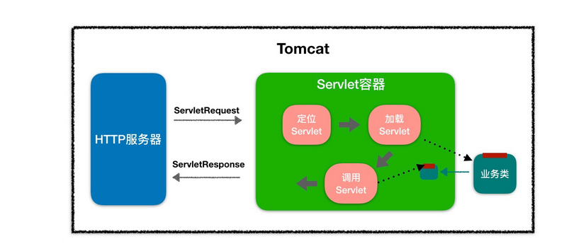

## 1. Tomcat简介
Apache是web服务器，Tomcat是应用服务器，apache tomcat只是一个servlet容器，是Apache的扩展；Apache和Tomcat都可以做为独立的web服务器来运行，但是Apache不能解释java程序（jsp,servlet）。

两者都是一种容器，只不过发布的东西不同：Apache是html容器，功能像IIS一样；Tomcat是jsp/servlet容器，用于发布jsp及java的，类似的有IBM的websphere、BEA的Weblogic，sun的JRun等等。

打个比方：Apache是一辆卡车，上面可以装一些东西如html等。但是不能装水，要装水必须要有容器（桶），Tomcat就是一个桶（装像Java这样的水），而这个桶也可以不放在卡车上。


官网地址： https://tomcat.apache.org/
### 1.1 网络架构图


### 1.2  web监听端口

DefaultServletSocketFactory.java

```java
@Override
public ServerSocket createSocket (int port, int backlog,
                                  InetAddress ifAddress) throws IOException {
    return new ServerSocket (port, backlog, ifAddress);
}
```

### 1.3 Servlet容器

-   找到`Tomcat`源码中对应一个web项目的类 ` Context.class`

-   找到`Tomcat`源码 --->`web.xml`文件对应的类

    ```xml
    <Context path="/app" doBase="E:\\app"/>
    <Context path="/app1" doBase="E:\\app1"/>
    ```

    既然这段配置能够代表一个web项目在磁盘的访问路径，Context标签就是代表一个web项目

    在tomcat官网中（https://tomcat.apache.org/tomcat-8.0-doc/architecture/overview.html）可以看到相应的文档说明

    ```txt
    A Context represents a web application. A Host may contain multiple contexts, each with a unique path. The Context interface may be implemented to create custom Contexts, but this is rarely the case because the StandardContext provides significant additional functionality.
    
    //大致意思：一个Context文表示web应用程序。一个主机可以包含多个Context，每个Context都有一个唯一的路径。上下文接口可以用来创建自定义Context，但这种情况很少发生，因为StandardContext提供了重要的附加功能。
    ```

    那么在`StandardContext`中是如何加载这些项目的？

    ```java
    public boolean loadOnStartup(Container children[]) {
            // Collect "load on startup" servlets that need to be initialized
            TreeMap<Integer, ArrayList<Wrapper>> map = new TreeMap<>();
            for (int i = 0; i < children.length; i++) {
                Wrapper wrapper = (Wrapper) children[i];
                int loadOnStartup = wrapper.getLoadOnStartup();
                if (loadOnStartup < 0)
                    continue;
                Integer key = Integer.valueOf(loadOnStartup);
                ArrayList<Wrapper> list = map.get(key);
                if (list == null) {
                    list = new ArrayList<>();
                    map.put(key, list);
                }
                list.add(wrapper);
            }
    
            // Load the collected "load on startup" servlets
            for (ArrayList<Wrapper> list : map.values()) {
                for (Wrapper wrapper : list) {
                    try {
                        wrapper.load();
                    } catch (ServletException e) {
                        getLogger().error(sm.getString("standardWrapper.loadException",
                                          getName()), StandardWrapper.getRootCause(e));
                        // NOTE: load errors (including a servlet that throws
                        // UnavailableException from tht init() method) are NOT
                        // fatal to application startup, excepted if failDeploymentIfServletLoadedOnStartupFails is specified
                        if(getComputedFailCtxIfServletStartFails()) {
                            return false;
                        }
                    }
                }
            }
            return true;
        }
    ```

    那这些Wrapper是否就是Servlet ?

    WebXml.java

    ```java
    private static final StringManager sm = StringManager.getManager(Constants.PACKAGE_NAME);
    ```

    Contants

    ```java
     public static final String WEB_XML_LOCATION = "/WEB-INF/web.xml";
    ```

    ContextConfig

    ```java
    private void configureContext(WebXml webxml) {
            // As far as possible, process in alphabetical order so it is easy to
            // check everything is present
            // Some validation depends on correct public ID
            context.setPublicId(webxml.getPublicId());
    
            // Everything else in order
            context.setEffectiveMajorVersion(webxml.getMajorVersion());
            context.setEffectiveMinorVersion(webxml.getMinorVersion());
    
            for (Entry<String, String> entry : webxml.getContextParams().entrySet()) {
                context.addParameter(entry.getKey(), entry.getValue());
            }
            context.setDenyUncoveredHttpMethods(
                    webxml.getDenyUncoveredHttpMethods());
            context.setDisplayName(webxml.getDisplayName());
            context.setDistributable(webxml.isDistributable());
            for (ContextLocalEjb ejbLocalRef : webxml.getEjbLocalRefs().values()) {
                context.getNamingResources().addLocalEjb(ejbLocalRef);
            }
            for (ContextEjb ejbRef : webxml.getEjbRefs().values()) {
                context.getNamingResources().addEjb(ejbRef);
            }
            for (ContextEnvironment environment : webxml.getEnvEntries().values()) {
                context.getNamingResources().addEnvironment(environment);
            }
            for (ErrorPage errorPage : webxml.getErrorPages().values()) {
                context.addErrorPage(errorPage);
            }
            for (FilterDef filter : webxml.getFilters().values()) {
                if (filter.getAsyncSupported() == null) {
                    filter.setAsyncSupported("false");
                }
                context.addFilterDef(filter);
            }
            for (FilterMap filterMap : webxml.getFilterMappings()) {
                context.addFilterMap(filterMap);
            }
            context.setJspConfigDescriptor(webxml.getJspConfigDescriptor());
            for (String listener : webxml.getListeners()) {
                context.addApplicationListener(listener);
            }
            for (Entry<String, String> entry :
                    webxml.getLocaleEncodingMappings().entrySet()) {
                context.addLocaleEncodingMappingParameter(entry.getKey(),
                        entry.getValue());
            }
            // Prevents IAE
            if (webxml.getLoginConfig() != null) {
                context.setLoginConfig(webxml.getLoginConfig());
            }
            for (MessageDestinationRef mdr :
                    webxml.getMessageDestinationRefs().values()) {
                context.getNamingResources().addMessageDestinationRef(mdr);
            }
    
            // messageDestinations were ignored in Tomcat 6, so ignore here
    
            context.setIgnoreAnnotations(webxml.isMetadataComplete());
            for (Entry<String, String> entry :
                    webxml.getMimeMappings().entrySet()) {
                context.addMimeMapping(entry.getKey(), entry.getValue());
            }
            // Name is just used for ordering
            for (ContextResourceEnvRef resource :
                    webxml.getResourceEnvRefs().values()) {
                context.getNamingResources().addResourceEnvRef(resource);
            }
            for (ContextResource resource : webxml.getResourceRefs().values()) {
                context.getNamingResources().addResource(resource);
            }
            boolean allAuthenticatedUsersIsAppRole =
                    webxml.getSecurityRoles().contains(
                            SecurityConstraint.ROLE_ALL_AUTHENTICATED_USERS);
            for (SecurityConstraint constraint : webxml.getSecurityConstraints()) {
                if (allAuthenticatedUsersIsAppRole) {
                    constraint.treatAllAuthenticatedUsersAsApplicationRole();
                }
                context.addConstraint(constraint);
            }
            for (String role : webxml.getSecurityRoles()) {
                context.addSecurityRole(role);
            }
            for (ContextService service : webxml.getServiceRefs().values()) {
                context.getNamingResources().addService(service);
            }
            for (ServletDef servlet : webxml.getServlets().values()) {
                Wrapper wrapper = context.createWrapper();
                // Description is ignored
                // Display name is ignored
                // Icons are ignored
    
                // jsp-file gets passed to the JSP Servlet as an init-param
    
                if (servlet.getLoadOnStartup() != null) {
                    wrapper.setLoadOnStartup(servlet.getLoadOnStartup().intValue());
                }
                if (servlet.getEnabled() != null) {
                    wrapper.setEnabled(servlet.getEnabled().booleanValue());
                }
                wrapper.setName(servlet.getServletName());
                Map<String,String> params = servlet.getParameterMap();
                for (Entry<String, String> entry : params.entrySet()) {
                    wrapper.addInitParameter(entry.getKey(), entry.getValue());
                }
                wrapper.setRunAs(servlet.getRunAs());
                Set<SecurityRoleRef> roleRefs = servlet.getSecurityRoleRefs();
                for (SecurityRoleRef roleRef : roleRefs) {
                    wrapper.addSecurityReference(
                            roleRef.getName(), roleRef.getLink());
                }
                wrapper.setServletClass(servlet.getServletClass());
                MultipartDef multipartdef = servlet.getMultipartDef();
                if (multipartdef != null) {
                    if (multipartdef.getMaxFileSize() != null &&
                            multipartdef.getMaxRequestSize()!= null &&
                            multipartdef.getFileSizeThreshold() != null) {
                        wrapper.setMultipartConfigElement(new MultipartConfigElement(
                                multipartdef.getLocation(),
                                Long.parseLong(multipartdef.getMaxFileSize()),
                                Long.parseLong(multipartdef.getMaxRequestSize()),
                                Integer.parseInt(
                                        multipartdef.getFileSizeThreshold())));
                    } else {
                        wrapper.setMultipartConfigElement(new MultipartConfigElement(
                                multipartdef.getLocation()));
                    }
                }
                if (servlet.getAsyncSupported() != null) {
                    wrapper.setAsyncSupported(
                            servlet.getAsyncSupported().booleanValue());
                }
                wrapper.setOverridable(servlet.isOverridable());
                context.addChild(wrapper);
            }
            for (Entry<String, String> entry :
                    webxml.getServletMappings().entrySet()) {
                context.addServletMapping(entry.getKey(), entry.getValue());
            }
            SessionConfig sessionConfig = webxml.getSessionConfig();
            if (sessionConfig != null) {
                if (sessionConfig.getSessionTimeout() != null) {
                    context.setSessionTimeout(
                            sessionConfig.getSessionTimeout().intValue());
                }
                SessionCookieConfig scc =
                    context.getServletContext().getSessionCookieConfig();
                scc.setName(sessionConfig.getCookieName());
                scc.setDomain(sessionConfig.getCookieDomain());
                scc.setPath(sessionConfig.getCookiePath());
                scc.setComment(sessionConfig.getCookieComment());
                if (sessionConfig.getCookieHttpOnly() != null) {
                    scc.setHttpOnly(sessionConfig.getCookieHttpOnly().booleanValue());
                }
                if (sessionConfig.getCookieSecure() != null) {
                    scc.setSecure(sessionConfig.getCookieSecure().booleanValue());
                }
                if (sessionConfig.getCookieMaxAge() != null) {
                    scc.setMaxAge(sessionConfig.getCookieMaxAge().intValue());
                }
                if (sessionConfig.getSessionTrackingModes().size() > 0) {
                    context.getServletContext().setSessionTrackingModes(
                            sessionConfig.getSessionTrackingModes());
                }
            }
    
            // Context doesn't use version directly
    
            for (String welcomeFile : webxml.getWelcomeFiles()) {
                /*
                 * The following will result in a welcome file of "" so don't add
                 * that to the context
                 * <welcome-file-list>
                 *   <welcome-file/>
                 * </welcome-file-list>
                 */
                if (welcomeFile != null && welcomeFile.length() > 0) {
                    context.addWelcomeFile(welcomeFile);
                }
            }
    
            // Do this last as it depends on servlets
            for (JspPropertyGroup jspPropertyGroup :
                    webxml.getJspPropertyGroups()) {
                String jspServletName = context.findServletMapping("*.jsp");
                if (jspServletName == null) {
                    jspServletName = "jsp";
                }
                if (context.findChild(jspServletName) != null) {
                    for (String urlPattern : jspPropertyGroup.getUrlPatterns()) {
                        context.addServletMapping(urlPattern, jspServletName, true);
                    }
                } else {
                    if(log.isDebugEnabled()) {
                        for (String urlPattern : jspPropertyGroup.getUrlPatterns()) {
                            log.debug("Skiping " + urlPattern + " , no servlet " +
                                    jspServletName);
                        }
                    }
                }
            }
    
            for (Entry<String, String> entry :
                    webxml.getPostConstructMethods().entrySet()) {
                context.addPostConstructMethod(entry.getKey(), entry.getValue());
            }
    
            for (Entry<String, String> entry :
                webxml.getPreDestroyMethods().entrySet()) {
                context.addPreDestroyMethod(entry.getKey(), entry.getValue());
            }
        }
    ```


## 2. Tomcat核心架构

每一层级对应的都是`xml`文件中的标签，以及源码中的实体类，其中有多层的图形表示可以存在多个


Tips: 亿图不充钱限制了组件个数，Context只画了一个！

### 2.2 Tomcat组件

`XML`配置文件结构如下：

```xml
<Server>                       <!--顶层类元素：一个配置文件中只能有一个<Server>元素，可包含多个Service。-->
    <Service>                  <!--顶层类元素：本身不是容器，可包含一个Engine，多个Connector。-->
        <Connector/>           <!--连接器类元素：代表通信接口。-->
           <Engine>   		   <!--容器类元素：为特定的Service组件处理所有客户请求，可包含多个Host。-->
              <Host>    	   <!--容器类元素：为特定的虚拟主机处理所有客户请求，可包含多个Context。-->
                 <Context>      <!--容器类元素：为特定的Web应用处理所有客户请求。-->
                 </Context>
               </Host>
              </Engine>
     </Service>
</Server>
```

#### 2.2.1 Server

 代表整个`Tomcat`实例，在JVM中式单例的，它还负责管理包含`Service`组件的声明周期，下图式对`Server`组件的一个简单描述：


-   可以在`Server.xml`文件对`server`组件进行配置
-   配置属性有：name, shutdown, port, command, class name等
-   shutdown port默认为8005
-   shutdown command 默认为SHUTDOWN; 处于安全，只能从同一台服务器发出SHUTDOWN命令
-   提供JNDI的实现，可以放任意对象（如DataSource, 环境变量等）；

#### 2.2.2 Service

 `Service`组件代表的式一组请求处理主键，一个`Server`实例可以包含多个`Service`实例，每个`Service`实例与一组`Connector`实例和单个Engine实例相关联( Service 是 Server 内部的中间组件，它将一个或多个 Connector 绑定到一个Engine 上。)


单`Service`实例一般够用了，如果需要针对不同的`IP`或者`port`使用不同的`Service`组件来处理，则可以使用多`Service`实例

#### 2.2.3 Connector

` Connector`组件把Engine从不同的通信协议中隔离出来，如`HTTP`, `HTTPS`, `AJP`等；

可以配置`Tomcat`的工作模式: `Standalone` &  `Conjunction`

-   Standalone模式：tomcat可以配置HTTP/HTTPS的connector，它既要处理静态内容，也要委托Engine处理动态内容

    

-   Conjunction模式：客户端是Apache或者是IIS之类的WEB Server； 当Web Server决定将请求转交给Tomcat处理时，它通过AJP协议与Tomcat交互；AJP是基于二进制流的比HTTP更高效一些；

关于`Connector`的几个重要点：

-   监听的IP和port
-   处理请求的最大线程数，如果所有的线程都忙，则会丢弃新的请求
-   所有的Connector接收到请求后，转化成统一的模式，再交给唯一的Engine处理；Engine负责处理请i去并产生响应；
-   Connector将Engine产生的响应按照合适的协议发送到客户端

**常见Connector**：

-   http/1.1
-   http/2
-   ajp(apache jserv protocol)  专用于tomcat前端是apache反向代理的情况下

`Tomcat`既作为web服务器（解析http协议，响应客户端，静态；非处理动态（委托）），也作为应用程序服务器：请求来自于浏览器。
`Tomcat`应该考虑工作情形并为相应情形下的请求分别定义好需要的连接器才能正确接收来自于客户端的请求。
此处暂先介绍HTTP/1.1连接器的属性设置。ajp后文再做介绍。
HTTP连接器表示支持HTTP/1.1协议的组件。设置了该连接器就表示catalina启用它的独立web服务功能，当然，肯定也提供它必须的servlets和jsp执行功能。在一个service中可以配置一个或多个连接器，每个连接器都可以将请求转发给它们相关联的engine以处理请求、创建响应。
每个流入的请求都需要一个独立的线程来接收。当并发请求数量超出maxThreads指定的值时，多出的请求将被堆叠在套接字（socket）中，直到超出acceptCount指定的值。超出accpetCount的请求将以"connection refused"错误进行拒绝。

```xml
<Connector port="8080" protocol="HTTP/1.1"
           connectionTimeout="20000"
           redirectPort="8443" />
<!--HTTP连接器的属性实在太多，详细配置方法见官方手册。通常定义HTTP连接器时必须定义的属性只有"port"。 -->
<!--
	address：指定连接器监听的地址，默认为所有地址，即0.0.0.0。
	maxThreads：支持的最大并发连接数，默认为200；如果引用了executor创建的共享线程池，则该属性被忽略。
	acceptCount：设置等待队列的最大长度；通常在tomcat所有处理线程均处于繁忙状态时，新发来的请求将被放置于等待队列中；
	maxConnections：允许建立的最大连接数。acceptCount和maxThreads是接受连接的最大线程数。存在一种情况，maxConnections小于acceptCount时，超出maxConnections的连接请求将被接收，但不会与之建立连接。
	port：监听的端口，默认为0，此时表示随机选一个端口，通常都应该显式指定监听端口。
	protocol：连接器使用的协议，用于处理对应的请求。默认为HTTP/1.1，此时它会自动在基于Java NIO或APR/native连接器之间进行切换。定义AJP协议时通常为AJP/1.3。
	redirectPort：如果某连接器支持的协议是HTTP，当接收客户端发来的HTTPS请求时，则转发至此属性定义的端口。
	connectionTimeout：等待客户端发送请求的超时时间，单位为毫秒，默认为60000，即1分钟；注意，这时候连接已经建立。
	keepAliveTimeout：长连接状态的超时时间。超出该值时，长连接将关闭。
		enableLookups：是否通过request.getRemoteHost()进行DNS查询以获取客户端的主机名；默认为true，应设置为false防止反解客户端主机；
compression：是否压缩数据。默认为off。设置为on时表示只压缩text文本，设置为force时表示压缩所有内容。应该在压缩和sendfile之间做个权衡。
	useSendfile：该属性为NIO（非阻塞IO）的属性，表示是否启用sendfile的功能。默认为true，启用该属性将会禁止compression属性。
当协议指定为HTTP/1.1时，默认会自动在NIO/APR协议处理方式上进行按需切换。如要显式指定协议，方式如下： -->
<connector port="8080" protocol="HTTP/1.1">
<connector port="8080" protocol="org.apache.coyote.http11.Http11NioProtocol">
<connector port="8080" protocol="org.apache.coyote.http11.Http11Nio2Protocol">
<connector port="8080" protocol="org.apache.coyote.http11.Http11AprProtocol">
<!--
    其中NIO是C/C++的非阻塞IO复用模型在JAVA中的IO实现，NIO2即AIO是异步NIO，即异步非阻塞IO：
    NioProtocol ：non blocking Java NIO connector
    Nio2Protocol：non blocking Java NIO2 connector
    AprProtocol ：the APR/native connector 
-->
```

多个属性的SSL连接服务器

```xml
<Connector port="8443"
    maxThreads="150" minSpareThreads="25" maxSpareThreads="75"
    enableLookups="false" acceptCount="100" debug="0" scheme="https" secure="true"
    clientAuth="false" sslProtocol="TLS" />
```


#### 2.2.4 Engine

​	其实就是Servlet Engine；一个service组件只能包含一个Engine组件；但是一个Engine可以包含多个Host组件；它接受代表请求和相应的对象，然后将工作委托给相应的host组件进行处理；如果没有找到对应的host组件，则委托给default host来处理；

​	Engine代表服务请求处理管道；由于Server可能有多个 Connector 连接器， Engine 负责接收并处理来自这些 Connector 的所有请求，并将响应返回给对应的 Connector，最终返回给客户端。

​	Engine是service组件中用来分析协议的引擎机器，它从一个或多个connector上接收请求，并将请求交给对应的虚拟主机进行处理，最后返回完整的响应数据给connector，通过connector将响应数据返回给客户端。
只有一个engine元素必须嵌套在每个service中，且engine必须在其所需要关联的connector之后，这样在engine前面的connector都可以被此engine关联，而在engine后面的connector则被忽略，因为一个service中只允许有一个engine。

```xml
<!--定义-->
<Engine name="Catalina" defaultHost="localhost"></Engine>
<Engine name="Standalone" defaultHost="localhost" jvmRoute="TomcatA"></Engine>
<!--
常用的engine属性有：
	className：实现engine的类，该类必须实现org.apache.catalina.Engine接口。不给定该属性时将采用默认的标准类org.apache.catalina.core.StandardEngine。
	defaultHost：指定处理请求的默认虚拟主机。在Engine中定义的多个虚拟主机的主机名称中至少有一个跟defaultHost定义的主机名称同名。
	name：Engine组件的名称，用于记录日志和错误信息，无关紧要的属性，可随意给定。
	jvmRoute(session+标识符，记录在服务端)：在启用session粘性时指定使用哪种负载均衡的标识符。所有的tomcat server实例中该标识符必须唯一，它会追加在session标识符的尾部，因此能让前端代理总是将特定的session转发至同一个tomcat实例上。(Session与cookie功能效果相同。Session与Cookie的区别在于Session是记录在服务端的,而Cookie是记录在客户端的。 )
注意: jvmRoute同样可以使用jvmRoute的系统属性来设置。如果此处设置了jvmRoute，则覆盖jvmRoute系统属性。关于jvmRoute的使用，在后面tomcat ajp负载均衡的文章中介绍。
engine是容器中的顶级子容器，其内可以嵌套一个或多个Host作为虚拟主机，且至少一个host要和engine中的默认虚拟主机名称对应。除了host，还可以嵌套releam和valve组件。
-->
```

#### 2.2.5 Host

​	Host容器用来定义虚拟主机。engine从connector接收到请求进行分析后，会将相关的属性参数传递给对应的(筛选方式是从请求首部的host字段和虚拟主机名称进行匹配)虚拟host进行处理。如果没有合适的虚拟主机，则传递给默认虚拟主机。因此每个容器中必须至少定义一个虚拟主机，且必须有一个虚拟主机和engine容器中定义的默认虚拟主机名称相同;

```xml
<Host name="localhost"  appBase="webapps" unpackWARs="true" autoDeploy="true">
    <Alias>www.a.com</Alias> <!--Alias为Host指定的主机名定义主机别名-->
</Host>
<!--
	常用属性说明：
    className：实现host容器的类，该类必须实现org.apache.catalina.Host接口。不给定该属性时将采用默认的标准类org.apache.catalina.core.StandardHost。
    name：虚拟主机的主机名，忽略大小写(初始化时会自动转换为小写)。可以使用前缀星号通配符，如"*.a.com"。使用了星号前缀的虚拟主机的匹配优先级低于精确名称的虚拟主机。
    appBase：此Host的webapps目录，即webapp部署在此虚拟主机上时的存放目录。包括非归档的web应用程序目录和归档后的WAR文件的目录。使用相对路径时基于$CATALINA_BASE。
    xmlBase：部署在此虚拟主机上的context xml目录。
    startStopThreads：启动context容器时的并行线程数。如果使用了自动部署功能，则再次部署或更新时使用相同的线程池。
    autoDeploy：在Tomcat处于运行状态时放置于appBase目录中的应用程序文件是否自动进行deploy或自动更新部署状态。这等于同时开启了deployOnStartup属性和reload/redeploy webapp的功能。触发自动更新时将默认重载该webapp。默认为true。
    unpackWars：在执行此webapps时是否先对归档格式的WAR文件解压再运行，设置为false时则直接执行WAR文件；默认为true。设置为false时会损耗性能。
    workDir：该虚拟主机的工作目录。每个webapp都有自己的临时IO目录，默认该工作目录为$CATALINA_BASE/work。
    大多数时候都只需设置虚拟主机名称name和appBase属性即可，其余采用默认，默认时会自动部署webapp
-->
```

两个重要点：

-   domain name: 每个host必须要有一个唯一的domain name; 浏览器发过来的请求里包含有该domain name; domain name在Engine里必须是唯一的
-   app base folder: 发布到该host里的应用的目录名；可以是相对CATALINE_BASE的相对路径，也可以是文件系统的绝对路径

当host获得一个针对特定host请求时，将会在该Host环境下把请求匹配到对应的Context上；然后把请求交给这个Context来处理

#### 2.2.6 Context

​	一个Context对应一个web application； 它由多个servlet组成；在创建context时，将根据conf/web.xml和webapps/${context path}/WEB-INFO/web.xml加载servlet并创建映射表


-   Document Base: 存放war或解压后的context的地方
-   Context Path：唯一标志一个context;当没有匹配任何一个context时，默认的context将会处理该请求；默认的context的context path为空
-   Automatic reload: 一旦监测到context有修改，则会自动重启context，只用于开发模式；

#### 2.2.7 Wrapper

​	Wrapper是context的子元素，代表了一个Servlet（或一个jsp被编译后的servlet）；它负责加载servlet、实例化servlet、以及触发生命周期方法的调用，如init()、service()、destory()；另外wrapper也负责调用与servlet相关的Filter。


#### 2.2.8  嵌套组件

1.  **Excutor**: 执行器，供 Connector 使用的线程池，可配置多个

    cnnector自建，executer共享
    执行器定义tomcat各组件之间共享的线程池。在以前，每个connector都会独自创建自己的线程池，但现在，可以定义一个线程池，各组件都可以共享该线程池，不过主要是为各connector之间提供共享。注意，executor创建的是共享线程池，如果某个connector不引用executor创建的线程池，那么该connector仍会根据自己指定的属性创建它们自己的线程池。
    连接器必须要实现org.apache.catalina.Executor接口（server的classname，必须实现的接口）。它是一个嵌套在service组件中的元素，为了挑选所使用的connector，该元素还必须定义在connector元素之前。

    ```xml
    <Executor name="tomcatThreadPool" namePrefix="catalina-exec-"
        maxThreads="150" minSpareThreads="4"/>
    <!-- 
    	className（默认）：用于实现此组件的java类的名称，这个类必须实现接口org.apache.catalina.Executor。不			给定该属性时将采用默认的标准类org.apache.catalina.core.StandardThreadExecutor；
    	name：该线程池的名称，其他组件需要使用该名称引用该线程池。 
    
     ---------------------------------------------------------------
    标准类的属性包括：
    threadPriority：线程优先级，默认值为5。
    daemon：线程是否以daemon的方式运行，默认值为true。
    namePrefix：执行器创建每个线程时的名称前缀，最终线程的名称为:namePrefix+threadNumber。
    maxThreads：线程池激活的最大线程数量。默认值为200。
    minSpareThreads：线程池中最少空闲的线程数量。默认值为25。
    maxIdleTime：在空闲线程关闭前的毫秒数。除非激活的线程数量小于或等于minSpareThreads的值，否则会有空闲线程的出现。默认值为60000ms，即空闲线程需要保留1分钟的空闲时间才被杀掉。
    maxQueueSize：可执行任务的最大队列数，达到队列上限时的连接请求将被拒绝。
    prestartminSpareThreads：在启动executor时是否立即创建minSpareThreads个线程数，默认为false，即在需要时才创建线程。
    -->
    ```

    **connector中指定所使用的线程**

    ```xml
    <Connector executor="tomcatThreadPool"
               port="8080" protocol="HTTP/1.1"
               connectionTimeout="20000"
               redirectPort="8443" />
    ```


2.  **Manager**： 会话管理器：用于实现http会话管理的功能。

3.  **Loader**： 类加载器

4.  **Valve**： 阀门，Tomcat组件层面的过滤器

5.  **Resource**：资源路径：配置 web 程序的资源信息，如数据库连接信息。

6.  **Realm**：领域：用于用户的认证和授权。

7.  **Listener**：监听器：监听已注册组件的生命周期。

8.  **Cluster**： 集群：专用于配置 Tomcat 集群的元素。

#### 2.2.8 container

​	container不是tomcat的组件，它是一个概念，统称；包含Engine、host、context、wrapper

```
Container(容器:包括以下所有组件)
----Engine（分发用户请求）
--------Host（主机）
----------------Context（应用）
--------------------Wrapper（Servlet）
```

#### 2.2.9 Server.xml

```xml
<?xml version="1.0" encoding="UTF-8"?>
 
<Server port="8005" shutdown="SHUTDOWN">
  <Listener className="org.apache.catalina.startup.VersionLoggerListener" />
  <Listener className="org.apache.catalina.core.AprLifecycleListener" SSLEngine="on" />
  <Listener className="org.apache.catalina.core.JreMemoryLeakPreventionListener" />
  <Listener className="org.apache.catalina.mbeans.GlobalResourcesLifecycleListener" />
  <Listener className="org.apache.catalina.core.ThreadLocalLeakPreventionListener" />
 
  <GlobalNamingResources>
    <Resource name="UserDatabase" auth="Container"
              type="org.apache.catalina.UserDatabase"
              description="User database that can be updated and saved"
              factory="org.apache.catalina.users.MemoryUserDatabaseFactory"
              pathname="conf/tomcat-users.xml" />
  </GlobalNamingResources>
 
  <Service name="Catalina">
 
    <Connector port="8080" protocol="HTTP/1.1"
               connectionTimeout="20000"
               redirectPort="8443" />
   
    <Connector port="8009" protocol="AJP/1.3" redirectPort="8443" />
 
    <Engine name="Catalina" defaultHost="localhost">
 
      <Realm className="org.apache.catalina.realm.LockOutRealm">
        
        <Realm className="org.apache.catalina.realm.UserDatabaseRealm"
               resourceName="UserDatabase"/>
      </Realm>
 
      <Host name="localhost"  appBase="webapps"
            unpackWARs="true" autoDeploy="true">
 
        <Valve className="org.apache.catalina.valves.AccessLogValve" directory="logs"
               prefix="localhost_access_log" suffix=".txt"
               pattern="%h %l %u %t &quot;%r&quot; %s %b" />
 
      </Host>
    </Engine>
  </Service>
</Server>
```


### 2.2 Tomcat请求处理过程

接收到用户HTTP请求： http://localhost:8080/app/login/auth1

-   请求被发送到本机端后8080，被在那里侦听的coyote HTTP/1.1 Connector获得
-   Connector把该请求交给它所在得service得Engine来处理，并等待engine得回应
-   Engine获得请求localhost/app/login/auth1，匹配它所拥有得所有虚拟主机host
-   Engine获得请求到名为localhost得host（即使匹配不到也把请求交给该host处理，因为该host被定义为该Engine得默认主机）
-   名字为localhost的host主机获的请求/app/login/auth1，匹配它所拥有的所有context
-   host匹配到路径为/app的context(如果匹配不到就把该请求交给路径名为“” 的context去处理)
-   path=“/app”的context获得请求/login/auth1，在它的mapping table中寻找对应的servlet
-   Context匹配到URL PATTERN为/auth1的servlet，对应于servlet类
-   构造HttpServletRequest对象和HttpServletResponse对象，作为参数调用Servlet的doGet或者doPost方法
-   Context把执行完了的HttpServletResponse对象发回给host
-   Host把HttpServletResponse对象返回给Engine
-   Engine把HttpServletResponse对象返回给Connnector
-   Connector把HttpServletResponse对象返回给客户brower

## 3. Servlet规范

Java想要进行Web服务功能提供

-   当Http服务器接收请求后，如何知道调用哪些java类来处理请求呢？

    有些类可能就是用来封装变量的，有些类才是用来处理请求的。为了识别出那些具有处理请求的类，定义了一个接口，这个接口就叫Servlet接口，如果想要让业务类具备处理请求的能力，都必须实现这个接口，实现了接口的业务类叫做Servlet。

-   对于特定的请求，Http服务器如何知道由哪个Servlet来处理？Servlet又是由谁来实例化呢

    于是又有了Servlet容器。Http服务器把请求交给Servlet容器去处理，Servlet容器会将请求转发到具体的Servlet,如果这个Servlet还没创建，就加载并实例化这个Servlet，然后调用这个Servlet的接口方法。

Http服务器不直接调用业务类，而是把请求交给容器来处理，容器通过Servlet接口调用业务类。因此Servlet接口和Servlet容器的出现，使Http服务器和业务类解耦。

Servlet规范：Servlet接口 + Servlet容器。

Tomcat按照Servlet规范的要求实现了Servlet容器，同时它也具有Http服务器的功能。（如果我们要实现新的业务功能，只需要实现一个Servlet，然后把它注册到Tomcat(Servlet容器)中，剩下的事情由Tomcat帮我们来处理）。


### 3.1 Servlet接口定义了五个方法

```java
public interface Servlet{
    void init(ServletConfig config) throws ServletException;
    
    ServletConfig getServletConfig();
    
    void service(ServletRequest req, ServletResponse res）throws ServletException, IOException;
    
    String getServletInfo();
    
    void destroy();
}
```

-   init(ServletConfig config)：

和生命周期有关的方法，Servlet容器在加载Servlet类的时候会调用init方法。可能会在init方法里初始化一些资源。比如Springmvc中的DispatcherServlet,在init方法中创建了自己的spring容器。

-   ServletConfig getServletConfig()：

    ServletConfig就是封装Servlet的初始化参数。可以在web.xml给Servlet配置参数，然后在程序中通过getServletConfig方法拿到这些参数。

-   service(ServletRequest req, ServletResponse res)

    业务类在这个方法里实现处理逻辑。ServletRequest用来封装请求信息，ServletResponse用来封装响应信息。本质上这两个类是对通信协议的封装。Http协议中的请求和响应就是对应了HttpServletRequest和HttpServletResponse这两个类。我们可以通过HttpServletRequest来获取所有请求相关的信息，包括请求路径，Cookie，Http头，请求参数等。

-    String getServletInfo()

-   destroy()： 和生命周期有关的方法，Servlet容器在卸载Servlet类的时候会调用destory方法。在destory方法里释放这些资源。

## 4. Servlet容器

### 4.1 Servlet容器工作流程

​	当客户请求某一个资源时，Http服务器会用一个ServletRequest对象把客户的请求信息封装起来，然后调用Servlet容器的service方法，Servlet容器拿到请求后，根据请求的URL和Servlet的映射关系，找到相应的Servlet，如果Servlet还没有被加载，就用反射机制创建这个Servlet，并调用Servlet的init方法来完成初始化，接着调用Servlet的service方法来处理请求，把ServletResponse对象返回给Http服务器，Http服务器会把响应发送给客户端。



### 4.2 Web应用

#### 4.2.1 Servlet注册

-   Servlet容器负责实例化和调用Servlet，那么Servlet是怎么注册到Servlet容器的呢？

    我们一般以Web应用程序的方式来部署Servlet的。根据Servlet规范，Web应用程序有一定的目录结构：

```txt
| -  MyWebApp
      | -  WEB-INF/web.xml        -- 配置文件，用来配置 Servlet 等
      | -  WEB-INF/lib/           -- 存放 Web 应用所需各种 JAR 包
      | -  WEB-INF/classes/       -- 存放你的应用类，比如 Servlet 类
      | -  META-INF/              -- 目录存放工程的一些信息
```

在这个目录下分别放置了Servlet的类文件，配置文件，静态资源文件，Servlet容器通过读取配置文件，就可以找到并加载Servlet。

#### 4.2.2 ServletContext

Servlet规范中定义了ServletContext这个接口来对应一个Web应用

Web应用部署好以后，Servlet容器在启动时会加载Web应用，并为每个Web应用创建唯一的ServletContext对象。你可以把ServletContext看成是一个全局对象，一个Web应用可能有多个Servlet，这些Servlet可以通过全局的ServletContext来共享数据，这些数据包括Web应用的初始化参数，Web应用目录下的文件资源等。因为ServletContext持有所有Servlet实例，还可以通过它来实现Servlet请求的转发。

#### 4.2.3 扩展机制：Filter和Listener

-   **Filter**：过滤器，这个接口允许对请求和响应做一些统一的定制化处理，比如可以根据请求的频率来限制访问，根据国家地区的不同来修改响应的内容。

    过滤器原理：Web应用部署完以后，Servlet容器需要实例化Filter并把Filter链接成一个FilterChain。当请求进来时，获取第一个Filter并调用doFilter方法，	doFilter方法负责调用　FilterChain的下一个Filter。

-   **Listener**：监听器，当Web应用在Servlet容器中运行时，Servlet容器内部会不断发生各种事件，比如Web应用的启动和停止，用户请求到达等。Servlet容器提供了一些默认的监听器来监听这些事件，当事件发生时，Servlet容器会负责调用监听器的方法。自定义监听器需要把监听器配置在web.xml中。比如：Spring就实现了自己的监听器，用来监听ServletContext的启动事件，目的是当Servlet容器启动时，创建并初始化全局的Spring容器。

## 5. 各种容器

1.  Tomcat在启动时给每个Web应用创建一个全局的上下文环境，这个上下文就是ServletContext，为后面的Spring容器提供宿主环境。

2.  Tomcat在启动过程中触发容器初始化事件，Spring的ContextLoaderListener会监听到这个事件，它的contextInitialized方法会被调用，然后Spring会初始化全局的Spring根容器，这个就是Spring的Ioc容器，Ioc容器初始化完毕后，Spring将其存储到ServletContext中，便于以后获取。

3.  Tomcat启动时还会扫描Servlet，一个Web应用中的Servlet可以有多个，以SpringMvc中的DispatcherServet为例，这个Servlet实际上是一个标准的前端控制器，用来转发，匹配，处理每个Servlet请求。

4.  Servlet一般会延迟加载，当第一个请求到达时，Tomcat发现DispatcherServet还没有被实例化，就调用DispatcherServet的init方法，DispatcherServet在初始化的时候会建立自己的容器，叫做SpringMvc容器，用来持有SpringMvc相关的Bean。同时，SpringMvc还会通过ServletContext拿到Spring根容器，并把Spring根容器设置为SpringMvc容器的父容器，Spring容器可以访问父容器中的Bean，但是父容器不能访问子容器中的Bean（Spring容器不能访问SpringMvc容器里的Bean --->Controller里可以访问Service对象，但是在Service里不可以访问Controller对象）。


web容器中有servlet容器，spring项目部署后存在spring容器和springmvc容器。其中spring控制service层和dao层的bean对象。springmvc容器控制controller层bean对象。servlet容器控制servlet对象。项目启动是，首先 servlet初始化，初始化过程中通过web.xml中spring的配置加载spring配置，初始化spring容器和springmvc容器。待容器加载完成。servlet初始化完成，则完成启动。
HTTP请求到达web容器后，会到达Servlet容器，容器通过分发器分发到具体的spring的Controller层。执行业务操作后返回结果。
