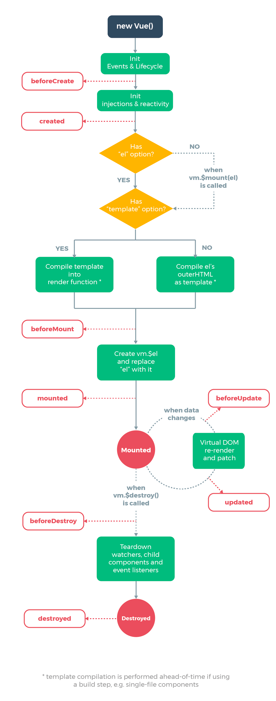
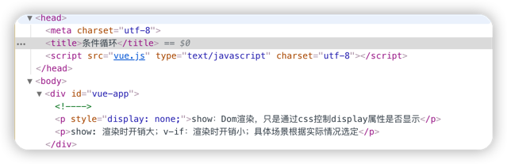
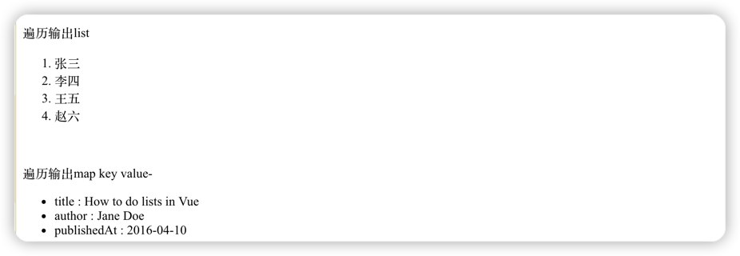

## 1. 什么是vue
vue 官网：https://cn.vuejs.org/
渐进式框架，

## 2.安装
1. 安装 `npm`
  `npm` 全称为 `Node Package Manager`，是一个基于`Node.js`的包管理器，也是整个`Node.js`社区最流行、支持的第三方模块最多的包管理器。
   
    ```
    npm -v
    ```

2. 由于网络原因 安装 `cnpm`
    ```
    #旧版，cnpm官方公告将在2022年6月30日停止老域名解析
    npm install -g cnpm --registry=https://registry.npm.taobao.org
   
    #新版
    npm install -g cnpm --registry=https://registry.npmmirror.com
    ```

3. 安装 `vue-cli`
    ```
    cnpm install -g @vue/cli
    ```

4. 安装 `webpack`

    `webpack` 是  `JavaScript` 打包器(module bundler)
    ```
    cnpm install -g webpack
    ```
   

## 3  Vue练习

### 3.1 Vue实例
```vue
<div id="app"> {{ message }} {{ name }}</div>
<script type="text/javascript">
    var data = {
        message: 'hello world',
        name: 'xiaoyuge'
    };
    //view model 数据模型 vm
    var vm = new Vue({
        el: '#app',
        //如果要某一个属性声明式响应，必须在new vue的时候声明
        data: data
    });
    //vm.$data.message =  data.message == vm.message;
    //实例创建之后，可以通过 vm.$data 访问原始数据对象。Vue 实例也代理了 data 对象上所有的 property，因此访问 vm.message 等价于访问 vm.$data.message
    vm.$watch('message', function(newVal, oldVal) {
        console.log(newVal, oldVal);
    })
    //修改值必须放到后面，
    vm.$data.message = "test...."
</script>
```
### 3.2 数据和方法
当一个 Vue 实例被创建时，它将 data 对象中的所有的 property 加入到 Vue 的响应式系统中。当这些 property 的值发生改变时，视图将会产生“响应”，即匹配更新为新的值
```javascript
// 我们的数据对象
var data = { a: 1 }

// 该对象被加入到一个 Vue 实例中
var vm = new Vue({
  data: data
})

// 获得这个实例上的 property
// 返回源数据中对应的字段
vm.a == data.a // => true

// 设置 property 也会影响到原始数据
vm.a = 2
data.a // => 2

// ……反之亦然
data.a = 3
vm.a // => 3
```
当这些数据改变时，视图会进行重渲染。值得注意的是只有当实例被创建时就已经存在于 data 中的 property 才是响应式的。也就是说如果你添加一个新的 property，比如
```vue
vm.b = 'hi'
```
那么对 b 的改动将不会触发任何视图的更新。如果你知道你会在晚些时候需要一个 property，但是一开始它为空或不存在，那么你仅需要设置一些初始值。比如：
```vue
data: {
  newTodoText: '',
  visitCount: 0,
  hideCompletedTodos: false,
  todos: [],
  error: null
}
```
这里唯一的例外是使用 Object.freeze()，这会阻止修改现有的 property，也意味着响应系统无法再追踪变化
```vue
<div id="app">
    <p>{{ foo }}</p>
    <!-- 这里的 `foo` 不会更新！ -->
    <button v-on:click="foo = 'baz'">Change it</button>
</div>
<script>
var obj = {
  foo: 'bar'
}

Object.freeze(obj)

new Vue({
  el: '#app',
  data: obj
})
</script>
```
除了数据 property，Vue 实例还暴露了一些有用的实例 property 与方法。它们都有前缀 $，以便与用户定义的 property 区分开来。例如：
```vue
var data = { a: 1 }
var vm = new Vue({
  el: '#example',
  data: data
})

vm.$data === data // => true
vm.$el === document.getElementById('example') // => true

// $watch 是一个实例方法
vm.$watch('a', function (newValue, oldValue) {
  // 这个回调将在 `vm.a` 改变后调用
})
```
### 2.3 生命周期钩子
Vue 实例从创建到销毁的过程，就是生命周期。也就是从开始创建、初始化数据、编译模板、挂载Dom→渲染、更新→渲染、卸载等一系列过程，我们称这是 Vue 的生命周期
```vue
<div id="app">
    {{msg}}
</div>
<script type="text/javascript">
    var vm = new Vue({
        el: "#app",
        data: {
            msg: "hi vue",
        },
        //在实例初始化之后，数据观测 (data observer) 和 event/watcher 事件配置之前被调用。
        beforeCreate: function() {
            console.log('beforeCreate');
        },
        //在实例创建完成后被立即调用。
        // 在这一步，实例已完成以下的配置：数据观测 (data observer)，属性和方法的运算，watch/event 事件回调。
        // 然而，挂载阶段还没开始，$el 属性目前不可见 
        created: function() {
            console.log('created');
        },
        //在挂载开始之前被调用：相关的渲染函数首次被调用
        beforeMount: function() {
            console.log('beforeMount');

        },
        //el 被新创建的 vm.$el 替换, 挂在成功	
        mounted: function() {
            console.log('mounted');

        },
        //数据更新时调用
        beforeUpdate: function() {
            console.log('beforeUpdate');

        },
        //组件 DOM 已经更新, 组件更新完毕 
        updated: function() {
            console.log('updated');

        },
          beforeDestroy() {
            console.log("=========" + "beforeDestroy：销毁之前" + "========");
            console.log(this.$el);
            console.log(this.$data);
          },
          destroyed() {
            console.log("==========" + "destroyed：销毁之后" + "===========");
            console.log(this.$el);
          },
          activated() {
            console.log("");
          },
          deactivated() {
            console.log("");
          }
    });
    //3秒后修改值，触发beforeUpdate, updated事件
    setTimeout(function() {
        vm.msg = "change ......";
    }, 3000);
</script>
```
控制台依次打印：    <br>
beforeCreate    <br>
created <br>
beforeMount <br>
mounted <br>
beforeUpdate    <br>
updated <br>

注意事项：
```text
不要在选项 property 或回调上使用箭头函数，比如 created: () => console.log(this.a) 或 vm.$watch('a', newValue => this.myMethod())。
因为箭头函数并没有 this，this 会作为变量一直向上级词法作用域查找，直至找到为止，经常导致 Uncaught TypeError: Cannot read property of undefined 
或 Uncaught TypeError: this.myMethod is not a function 之类的错误。
```

### 3.3 条件与循环
- v-if: 控制切换一个元素是否显示
    ```vue
    <div id="vue-app">
        <p v-if="seen">v-if: 如果为false，Dom将不渲染该元素</p>
        <p v-show="seen">show：Dom渲染，只是通过css控制display属性是否显示</p>
        <p>show: 渲染时开销大；v-if：渲染时开销小；具体场景根据实际情况选定</p>
    </div>
    <script>
        var vm = new Vue({
            el: '#vue-app',
            data: {
              seen: true
            }
        })
        vm.seen = false;
    </script>
    ```
    当改变`seen` 的值为false的时候，`v-if`绑定的元素Dom元素不渲染
    
  
- v-for: 绑定数组的数据来渲染一个项目列表
    ```vue
    <div id="vue-app">
        <!--遍历输出list-->
        <p>遍历输出list</p>
        <ol>
            <li v-for="item in list">
                 {{ item.name }}
            </li>
        </ol>
        <br>
        <p>遍历输出map key value-</p>
        <ul>
            <li v-for="value, key in object">
                {{key}} : {{ value }}
            </li>
        </ul>
    </div>
    <script>
        var vm = new Vue({
            el: '#vue-app',
            data:{
                list:[
                    {name: '张三'},
                    {name: '李四'},
                    {name: '王五'}
                ],
                object: {
					title: 'How to do lists in Vue',
					author: 'Jane Doe',
					publishedAt: '2016-04-10'
               }
            }
        })
        //往数组里面添加元素，页面上响应式渲染
        vm.list.push({name:'赵六'});
  
	  </script>
    ```
    
  

### 3.4 处理用户输入
- v-on: 事件监听器
    ```vue
    <div id="app">
        <div id="example-1">
            <!-- 单击事件：计算器加一 -->
            <button v-on:click="counter += 1"> 数值 : {{ counter }} </button><br />
  
            <!-- 双击事件 -->
            <button v-on:dblclick="greet('abc', $event)">Greet</button>
        </div>

        <div id="example-2">
            <p>{{ message }}</p>
            <!-- 单击 -->
            <button v-on:click="reverseMessage">反转消息</button>
        </div>
    </div>
    <script type="text/javascript">
        var vm = new Vue({
            el: "#app",
            data: {
                counter: 0,
                name: "vue",
                message: 'hello world'
            },
            methods: {
                greet: function(str, e) {
                    alert(str);
                },
                reverseMessage: function() {
                    //更新了应用的状态，但没有触碰 DOM。所有的 DOM 操作都由 Vue 来处理，这样我们只需要关注逻辑层面即可
                    //this 表示vue实例对象，可以获取相关的数据信息
                    this.message = this.message.split('').reverse().join('')
                }
            }
        });
    </script>
    ```
  
- v-model: 表单输入和应用状态之间的双向绑定
    ```vue
    <div id="app">
        <div id="example-1">
            <input v-model="message" placeholder="edit me">
            <p>Message is: {{ message }}</p>
            <textarea v-model="message2" placeholder="add multiple lines"></textarea>
            <p style="white-space: pre-line;">{{ message2 }}</p>
            <br />
            <div style="margin-top:20px;">
                <input type="checkbox" id="jack" value="Jack" v-model="checkedNames">
                <label for="jack">Jack</label>
                <input type="checkbox" id="john" value="John" v-model="checkedNames">
                <label for="john">John</label>
                <input type="checkbox" id="mike" value="Mike" v-model="checkedNames">
                <label for="mike">Mike</label>
                <br>
                <span>Checked names: {{ checkedNames }}</span>
            </div>
            <br>
            <div style="margin-top:20px;">
                <input type="radio" id="one" value="One" v-model="picked">
                <label for="one">One</label>
                <br>
                <input type="radio" id="two" value="Two" v-model="picked">
                <label for="two">Two</label>
                <br>
                <span>Picked: {{ picked }}</span>
            </div>
            <button type="button" @click="submit">提交</button>
        </div>
    </div>
    <script type="text/javascript">
        var vm = new Vue({
            el: "#app",
            data: {
                //这里可以设置初始值，也可以设置为'' 空值
                message: "test",
                message2: "hi",
                checkedNames: ['Jack', 'John'], //多选框，值是数组格式
                picked: "Two"
            },
            methods: {
                submit: function() {
                    //this代表的是vue实例对象，可以通过this获取表单数据，如下
                    var params = {
                        message: this.message,
                        message2: this.message2,
                        checkedNames: this.checkedNames,
                        picked: this.picked
                    }
                    console.log(params);
                }
            }
        });
    </script>
    ```