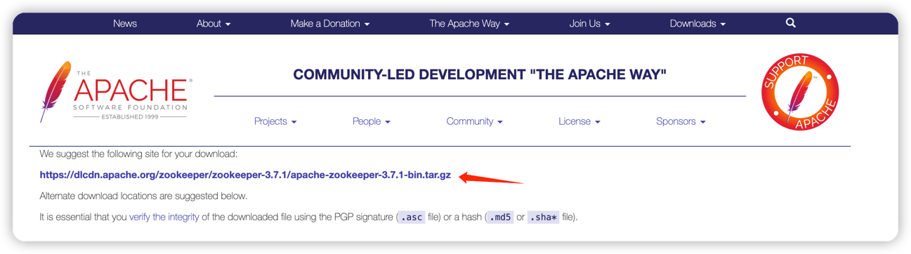
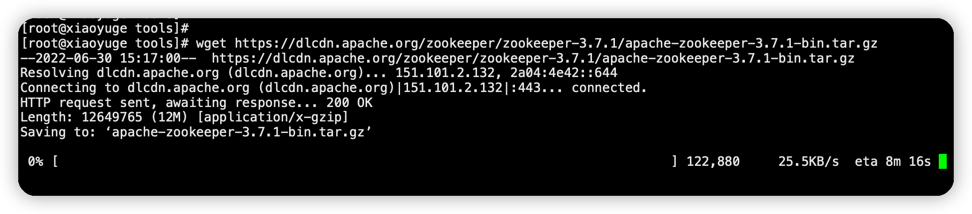

### 1. JDK依赖
请参考这篇博客：[Linux安装JDK以及配置](https://xiaoyuge.work/jdk-install/)

### 2. 下载Zookeeper
下载连接：https://zookeeper.apache.org/releases.html,  找到版本3.7.1下载二进制版本，不需要编译

以安装路径 /usr/local/tools 为例
```shell
cd /usr/local/tools
wget https://dlcdn.apache.org/zookeeper/zookeeper-3.7.1/apache-zookeeper-3.7.1-bin.tar.gz
```
如果上面的地址下载比较慢的话，可以试下在apache仓库里面找（https://archive.apache.org/dist/zookeeper/）


### 3. 解压
```shell
tar -xzvf apache-zookeeper-3.7.1-bin.tar.gz
```
### 4. 修改配置文件
```shell
cd apache-zookeeper-3.7.1-bin/conf
cp zoo_sample.cfg zoo.cfg

vim zoo.cfg
```

端口号默认2181。

配置文件zoo.cfg里面的dataDir要修改，如果不改，需要创建这个目录
```shell
mkdir -p /tmp/zookeeper
```

### 5. 启动ZK
zookeeper默认端口 2181
```shell
cd ../bin
./zkServer.sh start
```
输出日志：
```text
ZooKeeper JMX enabled by default
Using config: /usr/local/tools/apache-zookeeper-3.7.1-bin/bin/../conf/zoo.cfg
Starting zookeeper ... STARTED
```

其他命令：
```shell
ps -ef | grep zookeeper     #查看是否启动成功

./zkServer.sh status      #查看zk的运行状态

./zkCli.sh              #客户端链接zk

ls                      #查看节点

get /name               #get 获取节点数据和更新信息， name为具体的节点名称

create [-s] [-e] path data acl        #create 创建节点 e 临时节点 s 顺序节点

delete path [version]           #删除节点

```

