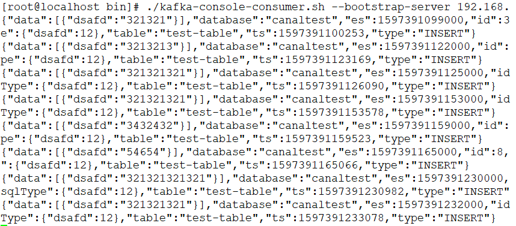

### 1. 前言
Canal的作用：把自己"伪装"成一个`Mysql`的`slave`，不停同步`master`的`binlog`数据，再把`binlog`数据以`TCP`或者`MQ`的方式（支持kafka、RabbitMQ、RocketMQ）发送给需要同步数据的项目

`canal`项目地址：https://github.com/alibaba/canal/releases , 2022-05-24发布的最新版1.1.6。

测试需要同步的目标数据库是192.168.44.121上部署的数据库

### 2. 在目标数据库上创建用户和数据库
注意 121 的数据库首先要开启`binlog`，`binlog-format`必须是`ROW`
```properties
log-bin=/var/lib/mysql/mysql-bin
binlog-format=ROW
```
用户和数据库创建
```mysql
-- 创建canal专用的用户，用于访问master获取binlog
CREATE USER canal IDENTIFIED BY '123456';

-- 给canal用户分配查询和复制的权限
GRANT SELECT, REPLICATION SLAVE, REPLICATION CLIENT ON *.* TO canal@'%';

-- 刷新权限
FLUSH PRIVILEGES;

ALTER USER 'canal'@'%' IDENTIFIED WITH mysql_native_password BY '123456';

-- 创建测试数据库
CREATE DATABASE `canaltest` CHARSET `utf8mb4` COLLATE `utf8mb4_unicode_ci`;
```

### 3. 安装ZK和kafka
在192.168.44.161机器上安装ZK和kafka, 这里我们安装伪集群版本，具体步骤请参考 [CentOS Kafka 3.2.0 单机集群安装（伪集群）](https://xiaoyuge.work/kafka-colony-install/)

### 4. 安装canal
1. 下载canal
    以安装目录:/usr/local/tools/canal 为例。
    ```shell
    cd /usr/local/tools/
    midir canal
    cd canal
    
    wget https://github.com/alibaba/canal/releases/download/canal-1.1.6/canal.deployer-1.1.6.tar.gz
    tar -zxvf canal.deployer-1.1.6.tar.gz
    ```
    如果下载慢的话，可以先下载到本地，然后上传到服务器


2. 修改配置：conf/canal.properties
    ```shell
    cd /usr/local/tools/canal/conf
    vim canal.propertis
    ```
   修改配置如下：
    ```properties
    canal.serverMode=kafka
    canal.mq.servers = 192.168.44.160:9092
    ```
   

3. 修改配置：example/instance.properties
    ```shell
    cd /usr/local/tools/canal/example
    vim instance.properties
    ```
    ```properties
    canal.instance.master.address=192.168.44.121:3306
    canal.instance.dbUsername=canal
    canal.instance.dbPassword=123456
    # 新增
    canal.instance.defaultDatabaseName=canaltest
    # 这个topic会自动创建
    canal.mq.topic=canal-topic
    ```
   
4. 启动canal
    ```shell
    cd /usr/local/tools/canal/bin
    sh startup.sh
    # 查看实例日志
    tail -100f /usr/local/tools/canal/logs/canal/canal.log
    ```


### 5. 建表测试
在canaltest数据随表建一张表，做增删改的操作。

在Kafka服务器上消费这个topic
```shell
./kafka-console-consumer.sh --bootstrap-server 192.168.44.160:9092 --topic canal-topic
```
kafka相关命令可以查看这篇博客 [kafka常用命令](https://xiaoyuge.work/kafka-command/)

成功消费到canal发送的消息：



