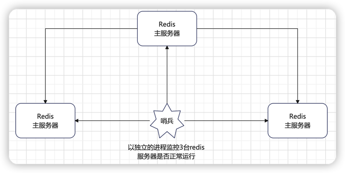
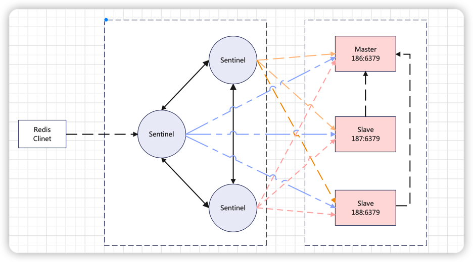
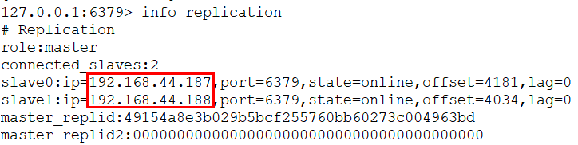
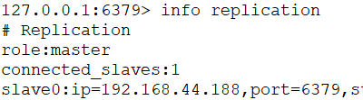

### 1. 概述
主从切换技术的方法是：当主服务器宕机后，需要手动把一台从服务器切换为主服务器，这就是人工干预，会造成一段时间内服务不可用的情况。更多的时候，我们优先考虑哨兵模式。

#### 1.1 哨兵模式
哨兵模式是一种特殊的模式，首先Redis提供了哨兵的命令，哨兵是一个独立的进程，作为进程，它独立运行。

其原理就是：**哨兵通过发送命令，等待Redis服务器响应，从而监控运行的多个Redis实例**。

这里的哨兵有两个作用
- 通过发送命令，让Redis服务器返回监控其运行状态，包括主服务器和从服务器。
- 当哨兵监测到master宕机，会自动将slave切换成master，然后通过发布订阅模式通知其他的从服务器，修改配置文件，让它们切换主机。

然而一个哨兵进程对Redis服务器进行监控，可能会出现问题，为此，我们可以使用多个哨兵进行监控。各个哨兵之间还会进行监控，这样就形成了多哨兵模式。

假设主服务器宕机，哨兵1先检测到这个结果，系统并不会马上进行failover过程，仅仅是哨兵1主观的认为主服务器不可用，这个现象称为主观下线。当后面的哨兵也检测到主服务器不可用，并且数量达到一定值时，那么哨兵之间就会进行一次投票，投票的结果由一个哨兵发起，进行failover操作。切换成功后，就会通过发布订阅模式，让各个哨兵把自己监控的从服务器实现切换主机，这个过程称为客观下线。这样对于客户端而言，一切都是透明的
### 2.准备工作
本文基于Redis单实例安装，单实例安装请参考[Linux环境下安装Redis](https://xiaoyuge.work/redis_install/)

开启哨兵模式，至少需要3个Sentinel实例（奇数个，否则无法选择Leader）

本例通过3个Sentinel实例监控3个Redis服务（1主 2从）
```
IP地址	          节点角色&端口
192.168.44.186	Master：6379 / Sentinel : 26379
192.168.44.187	Slave ：6379 / Sentinel : 26379
192.168.44.188	Slave ：6379 / Sentinel : 26379
```
**防火墙记得关闭！！!   防火墙记得关闭！！!  防火墙记得关闭！！!**

### 3.网络结构图


### 4. 配置
1. 在187和188的redis.conf配置中找到被注释的这一行
    ```properties
    # replicaof <masterip> <masterport>
    ```
    修改为
    ```properties
    #主节点
    replicaof 192.168.44.186 6379
    ```
   
2. 在186、187、188创建sentinel配置文件（单例安装后根目录下默认有sentinel.conf，可以先备份默认的配置）
    ```shell
    cd /usr/local/redis/redis-6.2.6
    mkdir logs
    mkdir rdbs
    mkdir sentinel-tmp
    cp sentinel.conf sentinel.conf.bak > sentinel.conf
    vim sentinel.conf
    ```
    sentinel.conf配置文件内容，三台机器相同
    ```shell
    daemonize yes
    port 26379
    protected-mode no
    dir "/usr/local/redis/redis-6.2.6/sentinel-tmp"
    sentinel monitor redis-master 192.168.44.186 6379 2
    sentinel down-after-milliseconds redis-master 30000
    sentinel failover-timeout redis-master 180000
    sentinel parallel-syncs redis-master 1
    ```
   配置解读：

    |  配置	 |       作用       |
   | :----- | :---------------- |
   | protected-mode	| 是否允许外部网络访问，yes不允许 |
   | dir | 	sentinel的工作目录 |
   | sentinel monitor | sentinel监控的redis主节点 |
   | down-after-milliseconds（毫秒）|  master宕机多久，才会被Sentinel主观认为下线 |
   | sentinel failover-timeout（毫秒 | 1 同一个sentinel对同一个master两次failover之间的间隔时间。<br>2. 当一个slave从一个错误的master那里同步数据开始计算时间。直到slave被纠正为向正确的master那里同步数据时。<br>3.当想要取消一个正在进行的failover所需要的时间。 4.当进行failover时，配置所有slaves指向新的master所需的最大时间。 |
   | parallel-syncs | 这个配置项指定了在发生failover主备切换时最多可以有多少个slave同时对新的master进行 同步，这个数字越小，完成failover所需的时间就越长，但是如果这个数字越大，就意味着越 多的slave因为replication而不可用。可以通过将这个值设为 1 来保证每次只有一个slave 处于不能处理命令请求的状态。 |

 
3. 在3台机器上分别启动Redis和Sentinel
    ```shell
    cd /usr/local/redis/redis-6.2.6/src
    ./redis-server ../redis.conf
    ./redis-sentinel ../sentinel.conf
    ```
   哨兵节点的另一种启动方式：
    ```shell
    ./redis-server ../sentinel.conf --sentinel
    ```
   
4. 在3台机器上查看集群状态
    ```shell
    /usr/local/redis/redis-6.2.6/src/redis-cli
    redis> info replication
    ```
    
    
    模拟master宕机，在186执行：
    ```shell
    redis> shutdown
    ```
    注意看sentinel.conf里面的redis-master被修改了，变成了当前master的IP端口。
    ```shell
    /usr/local/redis/redis-6.2.6/src/redis-cli
    redis> info replication
    ```
    这个时候会有一个slave节点被Sentinel设置为master。
    再次启动master，它不一定会被选举为master。
    
   

###  5.注意问题
1. 如果主节点设置了密码`requirepass`，则在从节点的redis.conf中需要配置`masterauth`

