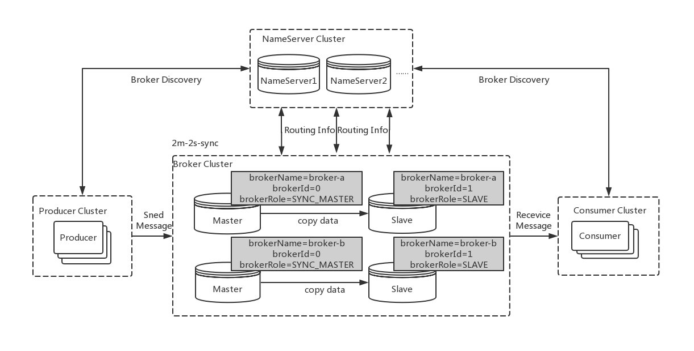

### 1. 节点规划
1. 第一台机器 **192.168.44.163**

    |  端口	 |       名称       |
    | :----- | :---------------- |
    | 9876	| NameServer1 |
    | 10910	| BrokerA-master |
    | 10921	| BrokerB-slave |


2. 第二台机器 **192.168.44.164**

   |  端口	 |       名称       |
   | :----- | :---------------- |
   | 9876	| NameServer2 |
   | 10911	| BrokerA-slave |
   | 10920	| BrokerB-slave |



### 2. 下载并解压
具体操作可以查看 [CentOS安装RocketMQ以及常用命令](https://xiaoyuge.work/rocketmq-install/)
```shell
cd /usr/local/tools
wget https://dlcdn.apache.org/rocketmq/4.9.4/rocketmq-all-4.9.4-bin-release.zip
#解压
unzip rocketmq-all-4.9.4-bin-release.zip 
#改名
mv rocketmq-all-4.9.4-bin-release rocketmq
```
在两台机器上都下载、解压好。
在`rocketmq/conf`目录下，有三种建议配置模式：
- 2m-2s-async(2主2从异步) —— 本文采用这种
- 2m-2s-sync (2主2从同步)
- 2m-noslave (2主)


现在需要修改两台机器上`2m-2s-async`这个目录中的文件。
配置文件修改之前先备份。

### 3. 配置第一台机器163
192.168.44.163的两个配置文件

1. broker-a.properties
    ```shell
    cd /usr/local/tools/rocketmq/conf/2m-2s-async
    vim  broker-a.properties
    ```
    修改的内容（名字自定义，保持一直，否则不能组成集群）
    ```properties
    brokerClusterName=ygb-cluster
    ```
    增加内容:
    ```properties
    #Broker 对外服务的监听端口
    listenPort=10910
    #是否允许 Broker 自动创建Topic，建议线下开启，线上关闭
    autoCreateTopicEnable=true
    #是否允许 Broker 自动创建订阅组，建议线下开启，线上关闭
    autoCreateSubscriptionGroup=true
    #nameServer地址，分号分割
    namesrvAddr=192.168.44.163:9876;192.168.44.164:9876
    #存储路径
    storePathRootDir=/usr/local/tools/rocketmq/store/broker-a
    #commitLog 存储路径
    storePathCommitLog=/usr/local/tools/rocketmq/store/broker-a/commitlog
    #消费队列存储路径存储路径
    storePathConsumeQueue=/usr/local/tools/rocketmq/store/broker-a/consumequeue
    #消息索引存储路径
    storePathIndex=/usr/local/tools/rocketmq/store/broker-a/index
    #checkpoint 文件存储路径
    storeCheckpoint=/usr/local/tools/rocketmq/store/checkpoint
    #abort 文件存储路径
    abortFile=/usr/local/tools/rocketmq/store/abort
    ```
   
2. broker-b-s.properties
    ```shell
    vim  broker-b-s.properties
    ```
    修改的内容（名字自定义，保持一直，否则不能组成集群）
    ```properties
    brokerClusterName=ygb-cluster
    ```
    增加内容:
    ```properties
    #Broker 对外服务的监听端口
    listenPort=10921
    #是否允许 Broker 自动创建Topic，建议线下开启，线上关闭
    autoCreateTopicEnable=true
    #是否允许 Broker 自动创建订阅组，建议线下开启，线上关闭
    autoCreateSubscriptionGroup=true
    #nameServer地址，分号分割
    namesrvAddr=192.168.44.163:9876;192.168.44.164:9876
    #存储路径
    storePathRootDir=/usr/local/tools/rocketmq/store/broker-b-s
    #commitLog 存储路径
    storePathCommitLog=/usr/local/tools/rocketmq/store/broker-b-s/commitlog
    #消费队列存储路径存储路径
    storePathConsumeQueue=/usr/local/tools/rocketmq/store/broker-b-s/consumequeue
    #消息索引存储路径
    storePathIndex=/usr/local/tools/rocketmq/store/broker-b-s/index
    #checkpoint 文件存储路径
    storeCheckpoint=/usr/local/tools/rocketmq/store/checkpoint
    #abort 文件存储路径
    abortFile=/usr/local/tools/rocketmq/store/abort
    ```
   
### 4. 配置第二台机器164
192.168.44.164的两个配置文件; 修改的内容基本一致，主要是注意一下端口号、路径名。

1. broker-b.properties
    ```shell
    cd /usr/local/tools/rocketmq/conf/2m-2s-async
    vim  broker-b.properties
    ```
    修改的内容（名字自定义，保持一直，否则不能组成集群）
    ```properties
    brokerClusterName=ygb-cluster
    ```
    增加内容:
    ```properties
    #Broker 对外服务的监听端口
    listenPort=10920
    #是否允许 Broker 自动创建Topic，建议线下开启，线上关闭
    autoCreateTopicEnable=true
    #是否允许 Broker 自动创建订阅组，建议线下开启，线上关闭
    autoCreateSubscriptionGroup=true
    #nameServer地址，分号分割
    namesrvAddr=192.168.44.163:9876;192.168.44.164:9876
    #存储路径
    storePathRootDir=/usr/local/tools/rocketmq/store/broker-b
    #commitLog 存储路径
    storePathCommitLog=/usr/local/tools/rocketmq/store/broker-b/commitlog
    #消费队列存储路径存储路径
    storePathConsumeQueue=/usr/local/tools/rocketmq/store/broker-b/consumequeue
    #消息索引存储路径
    storePathIndex=/usr/local/tools/rocketmq/store/broker-b/index
    #checkpoint 文件存储路径
    storeCheckpoint=/usr/local/tools/rocketmq/store/checkpoint
    #abort 文件存储路径
    abortFile=/usr/local/tools/rocketmq/store/abort
    ```

2. broker-a-s.properties
    ```shell
    cd /usr/local/tools/rocketmq/conf/2m-2s-async
    vim broker-a-s.properties
    ```
    修改的内容（名字自定义，保持一直，否则不能组成集群）
    ```properties
    brokerClusterName=ygb-cluster
    ```
    增加内容:
    ```properties
    #Broker 对外服务的监听端口
    listenPort=10911
    #是否允许 Broker 自动创建Topic，建议线下开启，线上关闭
    autoCreateTopicEnable=true
    #是否允许 Broker 自动创建订阅组，建议线下开启，线上关闭
    autoCreateSubscriptionGroup=true
    #nameServer地址，分号分割
    namesrvAddr=192.168.44.163:9876;192.168.44.164:9876
    #存储路径
    storePathRootDir=/usr/local/tools/rocketmq/store/broker-a-s
    #commitLog 存储路径
    storePathCommitLog=/usr/local/tools/rocketmq/store/broker-a-s/commitlog
    #消费队列存储路径存储路径
    storePathConsumeQueue=/usr/local/tools/rocketmq/store/broker-a-s/consumequeue
    #消息索引存储路径
    storePathIndex=/usr/local/tools/rocketmq/store/broker-a-s/index
    #checkpoint 文件存储路径
    storeCheckpoint=/usr/local/tools/rocketmq/store/checkpoint
    #abort 文件存储路径
    abortFile=/usr/local/tools/rocketmq/store/abort
    ```

### 5. 创建数据目录
1. 在第一台机器163 执行（只需要执行一次）
    ```shell
    mkdir -p /usr/local/tools/rocketmq/store/broker-a /usr/local/tools/rocketmq/store/broker-a/consumequeue /usr/local/tools/rocketmq/store/broker-a/commitlog /usr/local/tools/rocketmq/store/broker-a/index /usr/local/tools/rocketmq/logs /usr/local/tools/rocketmq/store/broker-b-s /usr/local/tools/rocketmq/store/broker-b-s/consumequeue /usr/local/tools/rocketmq/store/broker-b-s/commitlog /usr/local/tools/rocketmq/store/broker-b-s/index
    ```

2. 在第二台机器164 执行（只需要执行一次）
    ```shell
    mkdir -p /usr/local/tools/rocketmq/store/broker-a-s /usr/local/tools/rocketmq/store/broker-a-s/consumequeue /usr/local/tools/rocketmq/store/broker-a-s/commitlog /usr/local/tools/rocketmq/store/broker-a-s/index /usr/local/tools/rocketmq/logs /usr/local/tools/rocketmq/store/broker-b /usr/local/tools/rocketmq/store/broker-b/consumequeue /usr/local/tools/rocketmq/store/broker-b/commitlog /usr/local/tools/rocketmq/store/broker-b/index
    ```
   
### 6. 启动两个NameServer
1. 启动第一台163的NameServer
   ```shell
   nohup sh /usr/local/tools/rocketmq/bin/mqnamesrv >/usr/local/tools/rocketmq/logs/mqnamesrv.log 2>&1 &
   ```

2. 启动第二台164的NameServer
   ```shell
   nohup sh /usr/local/tools/rocketmq/bin/mqnamesrv >/usr/local/tools/rocketmq/logs/mqnamesrv.log 2>&1 &
   ```

### 7. 启动Broker
1. 启动 163 机器上的`broker-a-master`（在163上执行）
   ```shell
   nohup sh /usr/local/tools/rocketmq/bin/mqbroker -c /usr/local/tools/rocketmq/conf/2m-2s-async/broker-a.properties > /usr/local/tools/rocketmq/logs/broker-a.log 2>&1 &
   ```
   在虚拟机中可能由于内存不够导致无法启动，日志文件中出现如下错误：
   ```log
   nohup: ignoring input
   Java HotSpot(TM) 64-Bit Server VM warning: INFO: os::commit_memory(0x00000005c0000000, 8589934592, 0) failed; error='Cannot allocate memory' (errno=12)
   ```
   ```shell
   vim /usr/local/tools/rocketmq/bin/runbroker.sh
   ```
   把8g和4g改成512m和256m
   ```properties
   JAVA_OPT="${JAVA_OPT} -server -Xms512m -Xmx512m -Xmn256m"
   ```
   再次启动。

2. 启动 164 机器上的`broker-a-s`（在164上执行）
   ```properties
   nohup sh /usr/local/tools/rocketmq/bin/mqbroker -c /usr/local/tools/rocketmq/conf/2m-2s-async/broker-a-s.properties > /usr/local/tools/rocketmq/logs/broker-a-s.log 2>&1 &
   ```
3. 启动 164 的`broker-b-master`（在164上执行）
   ```shell
   nohup sh /usr/local/tools/rocketmq/bin/mqbroker -c /usr/local/tools/rocketmq/conf/2m-2s-async/broker-b.properties > /usr/local/tools/rocketmq/logs/broker-b.log 2>&1 &
   ```

4. 启动 163 机器上的`broker-b-s`（在163上执行）
   ```shell
   nohup sh /usr/local/tools/rocketmq/bin/mqbroker -c /usr/local/tools/rocketmq/conf/2m-2s-async/broker-b-s.properties > /usr/local/tools/rocketmq/logs/broker-b-s.log 2>&1 &
   ```
   
5. 查看两台机器的端口启动情况
   ```shell
   netstat -an|grep 端口号
   ```
   


