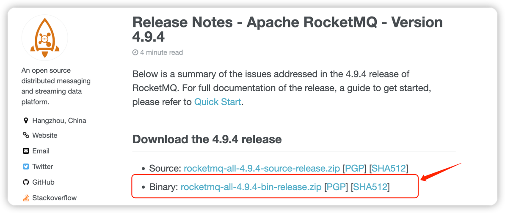
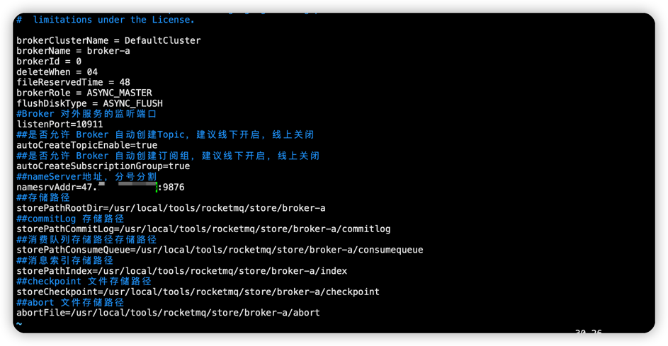
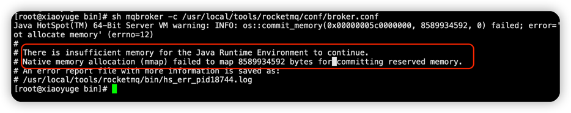
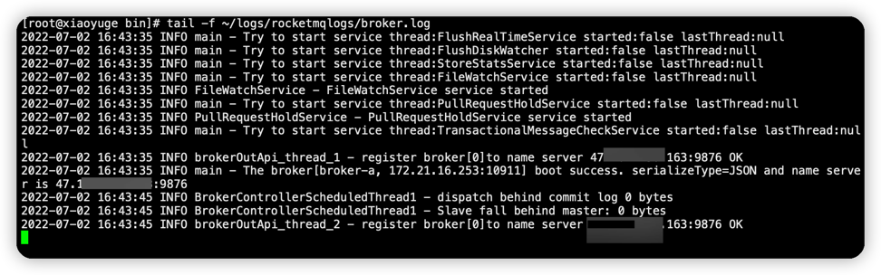
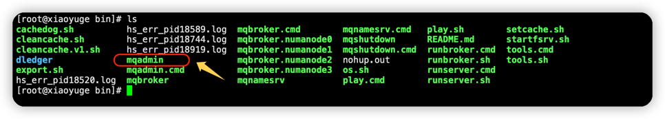

### 1.前言
1. nameserver默认端口：9876
2. rocketmq默认端口：10911
3. 服务器IP：172.21.16.253
4. 路径：/usr/local/tools

### 2. 下载
RocketMQ官网链接：http://rocketmq.apache.org/， 然后选择Lastest Release进入下载界面


右键复制链接地址，`wget`下载，或者下载后上传到Centos服务器上。
```shell
cd /usr/local/tools
wget https://dlcdn.apache.org/rocketmq/4.9.4/rocketmq-all-4.9.4-bin-release.zip
```

### 3. 解压
解压二进制包，修改文件夹名称
```shell
unzip rocketmq-all-4.9.4-bin-release.zip 
mv rocketmq-all-4.9.4-bin-release rocketmq
```
如果提示`-bash: unzip: command not found`
```shell
#安装zip 和 unzip
yum install zip
yum install unzip
```

创建数据存储目录
```shell
mkdir -p /usr/local/tools/rocketmq/store/broker-a /usr/local/tools/rocketmq/store/broker-a/consumequeue /usr/local/tools/rocketmq/store/broker-a/commitlog /usr/local/tools/rocketmq/store/broker-a/index /usr/local/tools/rocketmq/broker-a/logs 
```

### 4. 修改配置文件
```shell
cd /usr/local/tools/rocketmq/conf
vim broker.conf
```
增加内容
```properties
#Broker 对外服务的监听端口
listenPort=10911
#是否允许 Broker 自动创建Topic，建议线下开启，线上关闭
autoCreateTopicEnable=true
#是否允许 Broker 自动创建订阅组，建议线下开启，线上关闭
autoCreateSubscriptionGroup=true
#nameServer地址，分号分割
namesrvAddr=localhost:9876
#存储路径
storePathRootDir=/usr/local/tools/rocketmq/store/broker-a
#commitLog 存储路径
storePathCommitLog=/usr/local/tools/rocketmq/store/broker-a/commitlog
#消费队列存储路径存储路径
storePathConsumeQueue=/usr/local/tools/rocketmq/store/broker-a/consumequeue
#消息索引存储路径
storePathIndex=/usr/local/tools/rocketmq/store/broker-a/index
#checkpoint 文件存储路径
storeCheckpoint=/usr/local/tools/rocketmq/store/broker-a/checkpoint
#abort 文件存储路径
abortFile=/usr/local/tools/rocketmq/store/broker-a/abort
```



### 5. 启动
依次启动nameserver和broker ,这两个命令可以做成alias
```shell
cd /usr/local/tools/rocketmq/bin

nohup sh mqnamesrv &
nohup sh mqbroker -c /usr/local/tools/rocketmq/conf/broker.conf &
```
在虚拟机中有可能因为内存不够而启动失败

- 1）设置`bin`目录下的 runserver.sh
    ```shell
    JAVA_OPT="${JAVA_OPT} -server -Xms256m -Xmx256m -Xmn512m -XX:MetaspaceSize=128m -XX:MaxMetaspaceSize=320m"
    ```
  
- 2）设置`bin`目录下的 runbroker.sh
    ```shell
     JAVA_OPT="${JAVA_OPT} -server -Xms256m -Xmx256m -Xmn128m"
    ```
  
- 3）如果改了上面两个还不行，那在修改bin目录下面的tools.sh
    ```shell
    JAVA_OPT="${JAVA_OPT} -server -Xms256m -Xmx256m -Xmn256m -XX:PermSize=128m -XX:MaxPermSize=128m"
    ```


### 6. 查看日志
启动成功后查看mq动态日志
```shell
tail -f ~/logs/rocketmqlogs/namesrv.log
tail -f ~/logs/rocketmqlogs/broker.log
```

### 7.关闭服务
```shell
cd /usr/local/tools/rocketmq/bin

sh mqshutdown namesrv
sh mqshutdown broker
```

### 8. 常用命令
RocketMQ 提供有控制台及一系列控制台目录，用户管理员对主题、集群、broker等信息的管理。

进入rocketmq下的bin目录，可以看到该目录下有个mqadmin脚本

查看帮助
```shell
sh mqadmin help 命令名称
```
例如，查看updateTopic的使用
```shell
sh mqadmin help updateTopic
```

下面列举一些常用的命令。
#### 8.1 创建（修改）Topic
- 指令： updateTopic

- 类路径：com.alibaba.rocketmq.tools.command.topic.UpdateTopicSubCommand

- 参数

  |  参数	 |       是否必填       | 说明 |
  | :----- | :---------- |:--------|
  | -b | 如果 -c为空，则必填 | broker地址，表示topic建在该broker |
  | -c | 如果 -b为空，则必填 | cluster名称，表示topic建在该集群（集群可通过clusterList查询） |
  | -h | 否 | 打印帮助 |
  | -n | 是 | nameserve服务地址列表，格式ip:port;ip:port;... |
  | -p | 否 | 指定新topic的权限限制( W|R|WR ) |
  | -r | 否 | 可读队列数（默认为8） |
  | -w | 否 | 可写队列数（默认为8） |
  | -t | 是 | topic名称（名称只能使用字符 ^[a-zA-Z0-9_-]+$ ） |

- 举例
    ```shell
    # 在集群DefaultCluster上创建主题ZTEExample，nameserve地址为172.21.16.253:9876
    sh mqadmin updateTopic –n 172.21.16.253:9876 –c DefaultCluster –t ZTEExample
    ```
#### 8.2 删除Topic
- 指令： deleteTopic

- 类路径：com.alibaba.rocketmq.tools.command.topic.DeleteTopicSubCommand

- 参数

  |  参数	 |       是否必填       | 说明 |
  | :----- | :---------- |:--------|
  | -c | 是 | cluster名称，表示删除某集群下的某个topic （集群可通过clusterList查询） |
  | -h | 否 | 打印帮助 |
  | -n | 是 | nameserve服务地址列表，格式ip:port;ip:port;... |
  | -t | 是 | topic名称（名称只能使用字符 ^[a-zA-Z0-9_-]+$ ） |

- 举例
    ```shell
    # 在集群DefaultCluster上删除主题ZTEExample，nameserve地址为172.21.16.253:9876
    sh mqadmin deleteTopic –n 172.21.16.253:9876 –c DefaultCluster –t ZTEExample
    ```

#### 8.3 创建（修改）订阅组
- 指令： updateSubGroup

- 类路径：com.alibaba.rocketmq.tools.command.consumer.UpdateSubGroupSubCommand

- 参数

  |  参数	 |       是否必填       | 说明 |
  | :----- | :---------- |:--------|
  | -b | 如果 -c为空，则必填 | broker地址，表示topic建在该broker |
  | -c | 如果 -b为空，则必填 | cluster名称，表示topic建在该集群（集群可通过clusterList查询） |
  | -d | 否 | 是否容许广播方式消费 |
  | -g | 是 | 订阅组名 |
  | -i | 否 | 从哪个broker开始消费 |
  | -m | 否 | 是否容许从队列的最小位置开始消费，默认会设置为false |
  | -q | 否 | 消费失败的消息放到一个重试队列，每个订阅组配置几个重试队列 |
  | -r | 否 | 重试消费最大次数，超过则投递到死信队列，不再投递，并报警 |
  | -s | 否 | 消费功能是否开启 |
  | -h | 否 | 打印帮助 |
  | -n | 是 | nameserve服务地址列表，格式ip:port;ip:port;... |
  | -w | 否 | 发现消息堆积后，将Consumer的消费请求重定向到另外一台Slave机器 |

#### 8.4 删除订阅组配置
- 指令： deleteSubGroup

- 类路径：com.alibaba.rocketmq.tools.command.consumer.DeleteSubscriptionGroupCommand

- 参数

  |  参数	 |       是否必填       | 说明 |
  | :----- | :---------- |:--------|
  | -b | 如果 -c为空，则必填 | broker地址，表示订阅组建在该broker |
  | -c | 如果 -b为空，则必填 | cluster名称，表示topic建在该集群（集群可通过clusterList查询） |
  | -g | 是 | 订阅组名 |
  | -h | 否 | 打印帮助 |
  | -n | 是 | nameserve服务地址列表，格式ip:port;ip:port;... |

#### 8.5 更新broker配置文件
- 指令： updateBrokerConfig

- 类路径：com.alibaba.rocketmq.tools.command.broker.UpdateBrokerConfigSubCommand

- 参数

  |  参数	 |       是否必填       | 说明 |
  | :----- | :---------- |:--------|
  | -b | 如果 -c为空，则必填 | broker地址，表示订阅组建在该broker |
  | -c | 如果 -b为空，则必填 | cluster名称，表示topic建在该集群（集群可通过clusterList查询） |
  | -k | 否 | 是否容许广播方式消费 |
  | -v | 是 | value值 |
  | -h | 否 | 打印帮助 |
  | -n | 是 | nameserve服务地址列表，格式ip:port;ip:port;... |

#### 8.6 查看topic 列表信息
- 指令： topicList

- 类路径：com.alibaba.rocketmq.tools.command.broker.UpdateBrokerConfigSubCommand

- 参数

  |  参数	 |       是否必填       | 说明 |
  | :----- | :---------- |:--------|
  | -h | 否 | 打印帮助 |
  | -n | 是 | nameserve服务地址列表，格式ip:port;ip:port;... |

- 举例
    ```shell
    # nameserve地址为172.21.16.253:9876;
    sh mqadmin topicList -n 172.21.16.253:9876
   ```
   
#### 8.7 查看路由信息
- 指令： topicRoute

- 类路径： com.alibaba.rocketmq.tools.command.topic.TopicRouteSubCommand

- 参数

  |  参数	 |       是否必填       | 说明 |
  | :----- | :---------- |:--------|
  | -t | 是 | topic名称 |
  | -h | 否 | 打印帮助 |
  | -n | 是 | nameserve服务地址列表，格式ip:port;ip:port;... |

- 举例
    ```shell
    #  查看主题%DLQ%consumer1的路由，nameserve地址为172.21.16.253:9876
    sh mqadmin topicRoute -n 172.21.16.253:9876 -t %DLQ%consumer1
    ```

#### 8.8 查看topic统计信息
- 指令： topicStatus

- 类路径：com.alibaba.rocketmq.tools.command.topic.TopicStatsSubCommand

- 参数

  |  参数	 |       是否必填       | 说明 |
  | :----- | :---------- |:--------|
  | -t | 是 | topic名称 |
  | -h | 否 | 打印帮助 |
  | -n | 是 | nameserve服务地址列表，格式ip:port;ip:port;... |

- 举例
    ```shell
    # 查看主题%DLQ%consumer1的统计信息，nameserve地址为172.21.16.253:9876
    sh mqadmin topicStatus -n 172.21.16.253:9876 -t %DLQ%consumer1
    ```

#### 8.9 查看broker统计信息
- 指令： brokerStatus

- 类路径：com.alibaba.rocketmq.tools.command.broker.BrokerStatsSubCommand

- 参数

  |  参数	 |       是否必填       | 说明 |
  | :----- | :---------- |:--------|
  | -b | 是 | broker地址 |
  | -h | 否 | 打印帮助 |
  | -n | 是 | nameserve服务地址列表，格式ip:port;ip:port;... |

- 举例
    ```shell
    # 查看broker(crmdb)的统计信息，broker地址为172.21.16.253:10911,nameserve地址为172.21.16.253:9876
    sh mqadmin brokerStatus  –n 172.21.16.253:9876 -b 172.21.16.253:10911
    ```
   
#### 8.10 根据消息ID查询消息

- 指令： queryMsgById

- 类路径：com.alibaba.rocketmq.tools.command.message.QueryMsgByIdSubCommand

- 参数
  
    |  参数	 |       是否必填       | 说明 |
    | :----- | :---------- |:--------|
    | -i | 是 | msgId |
    | -h | 否 | 打印帮助 |
    | -n | 是 | nameserve服务地址列表，格式ip:port;ip:port;... |

- 举例
    ```shell
    #查询msgId= C0A89F8000002A9F000000000000449A的消息，nameserve地址为172.21.16.253:9876
    sh mqadmin queryMsgById -n 172.21.16.253:9876 -i C0A89F8000002A9F000000000000449A
    ```

#### 8.11 根据消息key查询消息

- 指令： queryMsgByKey

- 类路径：com.alibaba.rocketmq.tools.command.message.QueryMsgByKeySubCommand

- 参数

  |  参数	 |       是否必填       | 说明 |
  | :----- | :---------- |:--------|
  | -f | 否 | 被查询消息的截止时间 |
  | -k | 是 | msgKey |
  | -t | 是 | Topic名称 |
  | -h | 否 | 打印帮助 |
  | -n | 是 | nameserve服务地址列表，格式ip:port;ip:port;... |

- 举例
    ```shell
    # 查询Topic= TopicTest下key=i0的消息，nameserve地址为172.21.16.253:9876
    sh mqadmin queryMsgByKey -n 172.21.16.253:9876 -t TopicTest -k i0
    ```

#### 8.12 根据Offset查询消息
- 指令： queryMsgByOffset

- 类路径：com.alibaba.rocketmq.tools.command.message.QueryMsgByOffsetSubCommand

- 参数

  |  参数	 |       是否必填       | 说明 |
  | :----- | :---------- |:--------|
  | -b | 是 | Broker名称，表示订阅组建在该broker（这里需要注意填写的是broker的名称，不是broker的地址，broker名称可以在clusterList查到） |
  | -i | 是 | query队列id |
  | -o | 是 | offset值 |
  | -t | 是 | Topic名称 |
  | -h | 否 | 打印帮助 |
  | -n | 是 | nameserve服务地址列表，格式ip:port;ip:port;... |

- 举例
    ```shell
    #查询brokerName=broker-a，Topic= TopicTest的第1个队列下offset=0的消息，nameserve地址为172.21.16.253:9876
    sh mqadmin queryMsgByOffset -n 172.21.16.253:9876 -b broker-a -i 0 -t TopicTest -o 0
    ```

#### 8.13 查询Producer的网络连接
该命令只打印当前与cluster连接的producer网络连接信息
- 指令： producerConnection

- 类路径：com.alibaba.rocketmq.tools.command.connection.ProducerConnectionSubCommand

- 参数

  |  参数	 |       是否必填       | 说明 |
  | :----- | :---------- |:--------|
  | -g | 是 | 生产者所属组名 |
  | -t | 是 | topic名称 |
  | -h | 否 | 打印帮助 |
  | -n | 是 | nameserve服务地址列表，格式ip:port;ip:port;... |

- 举例
    ```shell
    # 查询当前属于group（生产者组）=simple-producer-test的生产者到topic=ZTEExample的网络连接，nameserve地址为172.21.16.253:9876
    sh mqadmin producerConnection -n 172.21.16.253:9876 -g simple-producer-test -t ZTEExample
    ```

#### 8.14 查询Consumer的网络连接
该命令只打印当前与cluster连接的Consumer网络连接信息
- 指令： consumerConnection

- 类路径：com.alibaba.rocketmq.tools.command.connection.ConsumerConnectionSubCommand

- 参数

  |  参数	 |       是否必填       | 说明 |
  | :----- | :---------- |:--------|
  | -g | 是 | 生产者所属组名 |
  | -h | 否 | 打印帮助 |
  | -n | 是 | nameserve服务地址列表，格式ip:port;ip:port;... |

- 举例
    ```shell
    #  查询当前属于group（消费者组）=simple-consumer-test的消费者的网络连接，nameserve地址为172.21.16.253:9876
    sh mqadmin consumerConnection -n 172.21.16.253:9876 -g simple-consumer-test
    ```

#### 8.15  查看订阅组消费状态
- 指令： consumerProgress

- 类路径：com.alibaba.rocketmq.tools.command.consumer.ConsumerProgressSubCommand

- 参数

  |  参数	 |       是否必填       | 说明 |
  | :----- | :---------- |:--------|
  | -g | 是 | 消费者所属组名 |
  | -h | 否 | 打印帮助 |
  | -n | 是 | nameserve服务地址列表，格式ip:port;ip:port;... |

- 举例
    ```shell
    #   查询当前属于group（消费者组）=simple-consumer-test的订阅状态，nameserve地址为172.21.16.253:9876
    sh mqadmin consumerProgress -n 172.21.16.253:9876 -g simple-consumer-test
    ```

#### 8.16  查看集群消息
- 指令： clusterList

- 类路径：com.alibaba.rocketmq.tools.command.cluster.ClusterListSubCommand

- 参数

  |  参数	 |       是否必填       | 说明 |
  | :----- | :---------- |:--------|
  | -m | 否 | 打印更多信息 (增加打印出如下信息 #InTotalYest,   #OutTotalYest, #InTotalToday ,#OutTotalToday) |
  | -h | 否 | 打印帮助 |
  | -n | 是 | nameserve服务地址列表，格式ip:port;ip:port;... |

- 举例
    ```shell
    #  查询当前集群状态，nameserve地址为172.21.16.253:9876
    sh mqadmin clusterList -n 172.21.16.253:9876   
    sh mqadmin clusterList -n 172.21.16.253:9876 –m
   ```

#### 8.17  添加（更新）KV配置信息
- 指令： updateKvConfig

- 类路径：com.alibaba.rocketmq.tools.command.namesrv.UpdateKvConfigCommand

- 参数

  |  参数	 |       是否必填       | 说明 |
  | :----- | :---------- |:--------|
  | -k | 是 | key值 |
  | -v | 是 | value值 |
  | -s | 是 | Namespace值 |
  | -h | 否 | 打印帮助 |
  | -n | 是 | nameserve服务地址列表，格式ip:port;ip:port;... |

#### 8.18  删除KV配置信息
- 指令： deleteKvConfig

- 类路径：com.alibaba.rocketmq.tools.command.namesrv.DeleteKvConfigCommand

- 参数

  |  参数	 |       是否必填       | 说明 |
  | :----- | :---------- |:--------|
  | -k | 是 | key值 |
  | -s | 是 | Namespace值 |
  | -h | 否 | 打印帮助 |
  | -n | 是 | nameserve服务地址列表，格式ip:port;ip:port;... |

#### 8.19  添加（更新）Project group配置信息
- 指令： updateProjectGroup

- 类路径：com.alibaba.rocketmq.tools.command.namesrv.UpdateProjectGroupCommand

- 参数

  |  参数	 |       是否必填       | 说明 |
  | :----- | :---------- |:--------|
  | -i | 是 | 服务器ip |
  | -p | 是 | project group名 |
  | -h | 否 | 打印帮助 |
  | -n | 是 | nameserve服务地址列表，格式ip:port;ip:port;... |


#### 8.20  删除Project group配置信息
- 指令： deleteProjectGroup

- 类路径：com.alibaba.rocketmq.tools.command.namesrv.DeleteProjectGroupCommand

- 参数

  |  参数	 |       是否必填       | 说明 |
  | :----- | :---------- |:--------|
  | -i | 是 | 服务器ip |
  | -p | 是 | project group名 |
  | -h | 否 | 打印帮助 |
  | -n | 是 | nameserve服务地址列表，格式ip:port;ip:port;... |

#### 8.21  取得Project group配置信息
- 指令： getProjectGroup

- 类路径：com.alibaba.rocketmq.tools.command.namesrv.GetProjectGroupCommand

- 参数

  |  参数	 |       是否必填       | 说明 |
  | :----- | :---------- |:--------|
  | -i | 是 | 服务器ip |
  | -p | 是 | project group名 |
  | -h | 否 | 打印帮助 |
  | -n | 是 | nameserve服务地址列表，格式ip:port;ip:port;... |


#### 8.22  获取Consumer消费进度
该命令只打印当前与cluster连接的consumer的消费进度
- 指令： getConsumerStatus

- 类路径：com.alibaba.rocketmq.tools.command.offset.GetConsumerStatusCommand

- 参数

  |  参数	 |       是否必填       | 说明 |
  | :----- | :---------- |:--------|
  | -g | 是 | 消费者所属组名 |
  | -t | 是 | 查询主题 |
  | -i | 否 | Consumer客户端ip |
  | -h | 否 | 打印帮助 |
  | -n | 是 | nameserve服务地址列表，格式ip:port;ip:port;... |

- 举例
    ```shell
    #查询属于group（消费者组）=simple-consumer-test的消费者在Topic=ZTEExample上的消费状态，nameserve地址为172.21.16.253:9876
    sh mqadmin getConsumerStatus -n 172.21.16.253:9876 -g simple-consumer-test -t ZTEExample
   ```