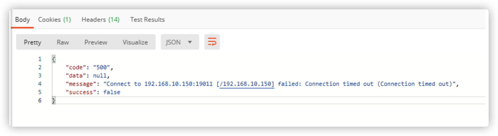
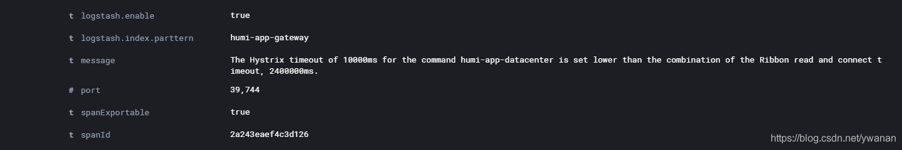

### 问题描述
逻辑是A服务调用B服务(AB在同一个局域网内)。 经过反复测试，有一个访问缓慢的现象，具体表现为：
程序启动第一次访问初始化1.2秒左右，还可以理解。
但后面访问还是要1.1秒左右（格式化到SSS毫秒打印日志监控的）。
但如果连续访问几次，后面几次又是几十毫秒。过一会再访问，或者换浏览器换post工具请求，又会1.2秒左右。

### 原因排查1
查看连接查实的接口

发现接口调用的是这个地址，其实是别人启动项目的时候吧自己的ip注册到了eureka注册中心，导致接口有时候走的是getway，有时候又是走的别人的接口

解决方法：eureka.client.register-with-eureka 为false  这样就不会注册到eureka注册中心了
### 原因排查2
1. 查看日志
    
查看是否是hystrix 配置的时间小于了ribbon的时间

