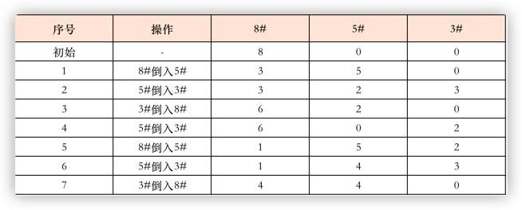

### 8升、5升、3升水桶各一个,如何分成两个4升


### 以面向对象的思想设计长方形和正方形
- 方式1：设计接口，然后长方形和正方形各自实现这个接口
```java
//形状类：结算面积和周长
public interface Shape {
	public double area();
	public double perimeter();
}
```
```java
//长方形：实现接口并实现方法
public class Rectangle implements Shape {
	private double width;
	private double height;
	public Rectangle(double width,double height){
		this.width=width;
		this.height=height;
	}	
	@Override
	public double area() {
		return this.width*this.height;
	}
	@Override
	public double perimeter() {
		return 2*(this.width+this.height);
	}
}
```
```java
//正方形：实现接口并实现方法
public class Square implements Shape {
	private double side;
	public Square(double side){
		this.side=side;
	}
	@Override
	public double area() {
		return side*side;
	}
 
	@Override
	public double perimeter() {
		return 4*side;
	}
}
```
- 方式2：使用extents
因为正方形 **is a** 长方形，所以可以使用继承来设计正方形，然后在构造函数中使用super函数；
  
```java
public class Square extends Rectangle{
	private double side;
	public Square(double side){
		super(side,side);
		this.side=side;
	}
	public static void main(String[] args) {
		Square s=new Square(2.5);
		System.out.println(s.perimeter());
		System.out.println(s.area());
	}
}
```

### java使用递归计算1+2+3+...+n之间的和
```java
public class SumNumber {

    public static void main(String[] args) {
        System.out.println(sumN(10));
    }

    //使用递归的方法计算1+2+3+4+....n的和; 切记注意n不能小于1
    public static int sumN(int n) {
        if (n == 1){
            return 1;
        }
        return n+ sumN(n-1);
    }
}
```

### java读取一篇英文文章，并输出其中出现单词次数最多的3个单词以及次数
文件文章中存在,.以及空格
- 读取文件内容
- 对文件进行内容匹配
- 使用map 保存单词、次数
- map排序
- 输出
```java
public class WordCount {

    public static void main(String[] args) {
        try {
            //1. 使用流读取文件
            BufferedReader reader = new BufferedReader(new FileReader("d:/n.txt"));
            StringBuffer sb = new StringBuffer();
            String line;
            while ((line = reader.readLine()) != null) {
                sb.append(line);
            }
            reader.close();
            //替换所有的英文逗号和句号
            String temp = sb.toString().replaceAll("/[\\w\\,\\.]+/", "");
            //2.使用正则表达式匹配
            Pattern pattern = Pattern.compile("/[a-zA-Z\\w\\,\\.]+/");
            Matcher matcher = pattern.matcher(temp);
            Map<String, Integer> map = new HashMap<>(16);
            String word;
            int count;
            while (matcher.find()) {
                word = matcher.group();
                if (map.containsKey(word)) {
                    count = map.get(word);
                    map.put(word, count + 1);
                } else {
                    map.put(word, 1);
                }
            }
            //将map的数据根据count排序；
            List<Map.Entry<String, Integer>> list = new ArrayList<>(map.entrySet());
            Collections.sort(list, Comparator.comparing(Map.Entry::getValue));
            int last = list.size() - 1;
            for (int i = last; i > last - 5; i--) {
                System.out.println("key=" + list.get(i).getKey() + " value=" + list.get(i).getValue());
            }
        } catch (IOException e) {
            e.printStackTrace();
        }
    }
}
```

### java 获取字符串第一次出现重复的字符
```java
public static int findDuplicate(String str){
    char[] chars = str.toCharArray();
    Set<Character> uniqueChars = new HashSet(chars.length,1);
    for (int i = 0; i < chars.length; i++) {
        if (!uniqueChars.add(chars[i])){
            return i;
        }
    }
    return -1;
}
```


